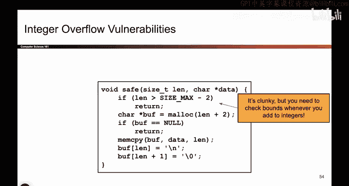

# 037：-MemSafety2, Video 12- Integer Overflow Vulnerabilities.zh_en - GPT中英字幕课程资源 - BV1VhEhzMEPL

Okay， let's do one more， so it's kind of the same spirit as before。

We're still going to play with integers and how they're represented in memory。 So in this case。

 once again， the attacker is inputting some character array。

 they give you a pointer to the start of the array and they tell you how many bytes are in the array。

 So same as usual and same as last time we're going to assume that these are honestly being reported because that's how you pass an arrays and see。

And here's what we're going to do。 We're going to allocate a new buffer on the heap。

 So we're going to call Malick。 We're going to take the user specified length。

 and we're going to add2。 Maybe I want to add a null by it or add something else at the end of the user's array。

 So I'll add2。W should be fine。 And then I will copy the data from the user's array into my new array。

 which fits L plus 2 B。 Okay， I guess down here， I'm going to put a new line at the end and a no byte at the end。

 So those are the two extra bytes that I allocated。 So once again。

 this seems totally fine because I'm allocating enough space。

 And I'm copying from the attacker's input to the buffer。

 And the attacker's input is a sized L and buffer fits L plus 2。 So this seems totally fine。

 What could be the issue。😊，But we have another integer related issue that we have to be careful about。

 What if the attacker passes in a really， really bigger rate？

Like size， F， F， F， F， F， F， F， F。 Once again， that's some sequence of ones and zeros。

 It's a valid length for this buffer。 So what's gonna happen， I'm gonna take this number。

 which is then， and I'm gonna add 2。So what happens if I take a number that's already all ones and I add two？

Well， then it's gonna overflow。 So maybe you remember from C6 and C。

 if I get to the largest possible representable number and I add one。

 it's going to wrap all the way back around to the smallest representable number。

 So if I take something like all Fs and I add one， I'm actually gonna wrap back around to0。

 And then if I add one again， I get one。 So L plus two， actually evaluates to one。

 And what that means is I allocate a single byte。 and then Memcopy tries to copy FFFF a huge number of bytes from data which is the attacker specified input to buffer。

 which only fits one byte。 So once again， I'm writing past the end of the heap。

 I have another problem。 This is slightly different from the signed unsigned vulnerability from before because everyone is reading size Ts。

 We're reading size t here。 Mem copy is reading size Ts。

 but the problem is we had an overflow right here。 we took a really big number and we added two and。

Wpped back around to the smallest representable unsigned number， which is zero。

 So these are called integer overflow vulnerabilities and we have to watch out for these as well。

 The user inputs a really big number and I add two。

 it could cause the number to wrap back around to something like zero。

 And once again now I'm writing a huge amount of data to a buffer of size1， which is an overflow。

So how do I fix it Well， it turns out the fix is kind of clunky。

 You have to do all this stuff with checking if L is close to the largest possible number and if it is。

 you might want to return。 So it is clunky， but turns out sometimes because of the way that C is design and the designers didn't think about security you have to write really clunky code like this just to get the code to be safe。

 So I don't even want to stare at this code its so gross。

 but this is how you'd fix it you add some fix involving the largest possible number。

 and just to quickly repeat a question that someone had earlier， you might say。

 okay maybe it's not realistic for arrays that are this enormous size to be passed in。

 but if you are not convinced with these examples you can maybe go and try playing with different types。

 there's a type called int8T that represents numbers between 0 and 256。

 that could be overflow just by passing in an array of size 255 which is more reasonable。

It's clunky， but we'll do that。

