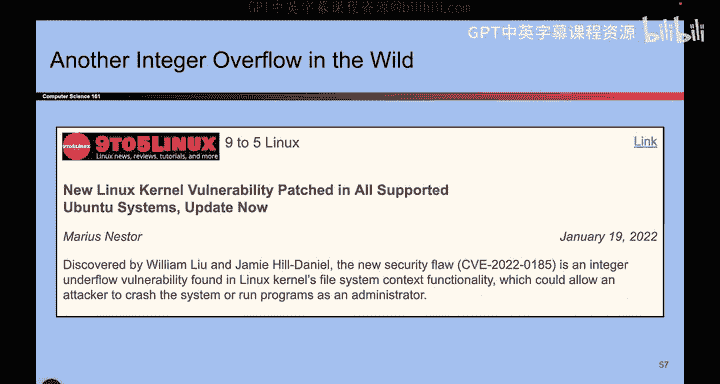
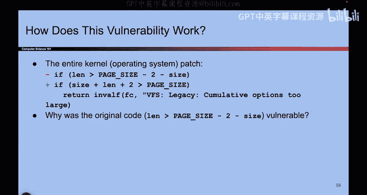
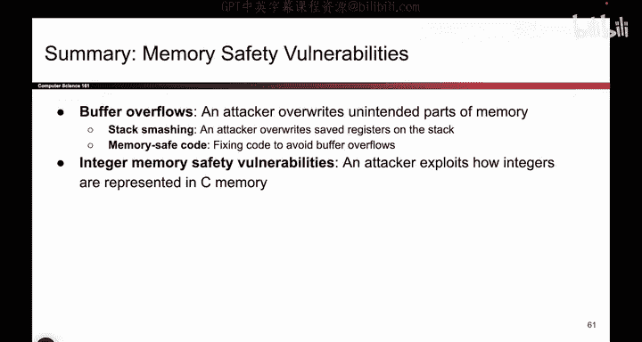

# 038：-MemSafety2, Video 13- Integer Overflows in the Wild, Summary.zh_en - GPT中英字幕课程资源 - BV1VhEhzMEPL

Okay， let me give you some examples of integer overflows that actually occurred in real life。

 So it is an article from 2004。 And basically， there was some voting machine。

 and the voting machine was。Producing very weird behavior。

 So somehow the computer had a glitch and the glitch caused the amendment to fail。

 even though it actually passed or something like that。

 But the key line from the mayor of this town is the software is not gear to count more than 32000 votes。

 So when it gets to 32000， the software starts counting backward。 That's what the mayor said。

 And when I look at this from computer scientist standpoint， I see the number 32000。

 And I think that's pretty close to a power of 2。 So maybe what the mayor was trying to say is the voting machine reached this maximum number 32768。

 that's the largest number you can represent with 16 Bs。 And then when you add one to that。

 you get negative 32000 something。 And then you continue counting and in the negative numbers you start counting up。

 maybe that's what the mayor meant by counting backwards。

 So the takeaway from the story is that you really have to be careful with the data types that you're using。

It be really tricky to mix up things like integers and size T types and int AT types。

 and if you use the wrong types， you might leave yourself susceptible to overflow attacks or signed unsigned vulnerabilities and of course。

 this article occurred in Florida。So's another example。

 You might say the example from earlier where I take the length and I add2。 that seems so contrived。

 Who would take length and add2 and cause an integer overflow。

 But it turns out here's an attack from 2022 And apparently the commit that they made to the code repository was this。

 The code used to look like this where I took the page size that I subtracted to。

 And they swapped it around for reasons that are beyond me。 And they instead said actually。

 instead of taking page size and subtracting2， I'm gonna take length and add2。

 What is the length plus two remind you of the exact same attack that we just saw。

 So this is an example of someone in real life， doing the exact same thing that we just showed you in the slides。

 So that's another example of silly things happening in real life because C is bad at type checking and checking balances。

Okay， so to quickly summarize all the things we saw so far， we saw buffer overflows。

 which is a catch all term for attackers overr parts of memory that they should not be overwriting。

 and in particular， we saw a really common type of buffer overflow called stackming。

 And that's the one where the attacker overwrites the RP on the stack because that's a value that's always on the stack。

 any function you call has an RP and that address tells you when I'm done with this function and I'm returning。

 please go through this address and start executing code。

 So stack smashing is the attack where you target that register and by overr that register with the address of shell code that you inject it into memory yourself。

 you can cause shell code to execute。 and we saw that to fix this。

 you have to go through the C manual and find the secure equivalents of various input output functions。

 And we also saw another class of buffer overflow attacks called integer vulnerabilities they related it to integer types and how the same sequence of bits。

F F F F， F F FF could either be treated as signed or unsigned the same sequence of bits。

 if you read it as signed， it could mean a really big number or rather if you read it as unsigned。

 it could be a really big number。 if you read it assigned。

 it could be a really small number or a negative number。

 And because of those vulnerabilities or the vulnerability where you take a large number and you add to and it becomes a really small number。

 you can actually bypass some of the checks that the attacker added or the user added into their code and allow the attacker to overwrite parts of memory that they weren't supposed to。

 And those are exploiting the fact that the same bits can be interpreted two different ways in Z code。

 That's a summary of what we talked about。

