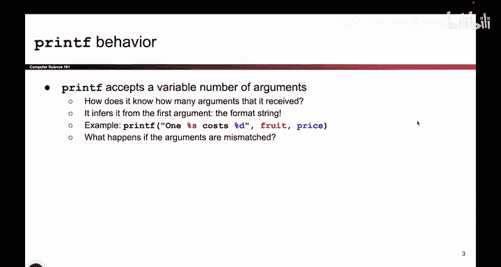

# 040：-MemSafety3, Video 1- Intended Behavior of printf.zh_en - GPT中英字幕课程资源 - BV1VhEhzMEPL

Okay， so in this sequence of videos， we are going to continue our exploration of memory safety vulnerabilities。

 We're going to look at more complicated ways in which attackers can take pieces of code that at first glance might seem secure。

 but actually have bugs that allowed the attacker to execute show code of their choosing。

 So the first type of attack that we're gonna look at is something called format string vulnerabilities。

 This one's kind of a doozy。 So I'll walk you through it。

 So this class of vulnerabilities is all about a function that you and I have used all the time called printf。

 you know and love it， I know and love it。 This is the function we use to print out values。

 And something you might have noticed。 if you try to use printf in C that differs from other languages like Python or Java is that printf takes in this kind of weird syntax where you have to add this percent sign。

 And if you don't the compiler is going to start yelling at you and saying that's not how you're supposed to use printf。

 So what are these percent signs actually mean。😊。

Well， turns out these are something that I like to call printf formatters or percent formatters。

 I don't know if that's the official name， but that's what we call them。 So these percent formatters。

 you can think of them as a placeholder for a variable that the user wants to substitute in later。

So in this example， the printf call says the first argument says。

 I want to print the string one something costs something。 And because of these percent symbols。

 I am telling the C program that there are two placeholders that I want to print out。

 but I don't know what their values are when I wrote this piece of code。 So I want to print one。

 something costs something and what those something are。 I don't know until I run the code。

So what are those some things。 Well， the user can specify what they are and what should go in those placeholders by providing additional arguments to printf。

 So， for example， because in this case， there are 2% formatters。 A percent S and a percent D。

 I will provide two extra arguments to printf。 And so I'll say the first percent S。

 please replace that with the value of fruit as you're running this program。 And this percent D。

 please replace it with the value of price as you're running this program。

 So when the C program hits this print F line。 What it's going to do is it's going to print O N E space。

 it see a percent symbol。 So what it'll do is it'll take the first argument。

 fruit and take its value and substitute it into percent S and print out whatever value。

Is in the variable fruit。Then it's gonna print out space C， O S T S space。

 Then it is a percent symbol。 and it thinks， oh， I have another percent formater。

 The user wants me to substitute something here。 So I look at the next unused argument。

 This argument was already used。 So the next unused argument is price。

 So I'll take the price argument and I'll substitute it into the percent D。

 So this will print out the current value of fruit and the current value of price to make a long story short。

But something interesting about printf is that it takes in a variable number of arguments because maybe the user had one placeholder and not two。

 Maybe the user had five placeholders。 maybe they had zero。 maybe they had 10。

 So printf can actually accept a variable number of arguments depending on how many things the user wants to add as a placeholder。

 And in particular， how does Prif actually know how many arguments it's expecting。 Well。

 it looks at the very first argument。 If I look at the first argument and I see a percent S and I see a percent D。

 that tells me， okay， I need two arguments。 So I'm gonna look on the stack。Take this argument。

 substituted here。 Take this argument， substituted here。

 If this input the first argument instead had say5% symbols， that would tell me， actually。

 I need to grab 5 arguments from the stack and substitute them into the 5% formatters that are in the printf。

 So this is what printf looks like when things work well。

 The user specifies in the very first argument。 The percent symbols with the placeholders and other things that they want to print。

 And then they specify one additional argument for every placeholder and everything is matched up nicely。

 The printf Cs，5% symbols and grabs  five arguments from the stack and all is well。

