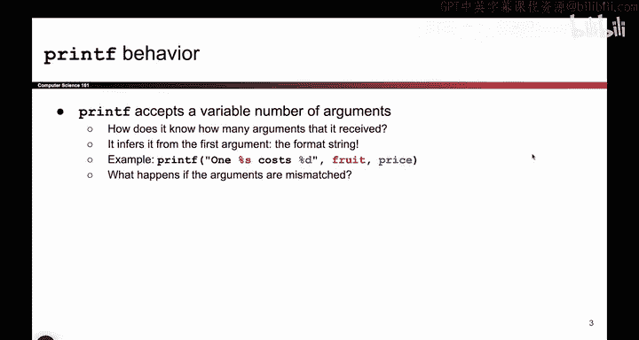
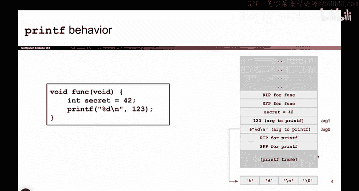
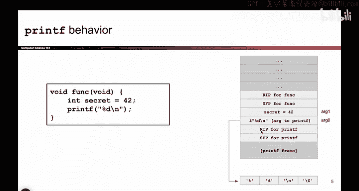

# 041：-MemSafety3, Video 2- Mismatched Arguments to printf.zh_en - GPT中英字幕课程资源 - BV1VhEhzMEPL

But what if we're an attacker， Think maliciously， What if the arguments don't match up。

 What if I provide 2% symbols， but only one argument。

Well then weird things start to happen and when weird things start to happen。

 that's where the attacker can start。

Doing weird things and making malicious things happen。

 So here's an example where printf works properly。 And then we'll think about what happens when it doesn't work properly。

 So this function， it doesn't do a lot has a secret value called 40 that we assigned to 42。

 And then it says printf percent D。 And remember， when we have a percent formater。

 we match it up with an argument。 So this says， please print out。 Well。

 I don't know what you want to print。 I want to print percent D。 And I'm going substitute that with。

The second argument， which here happens to be the number 1，2，3。

 What does this look like in the stack。 Well， I could draw a stack diagram。

 And the stack diagram says this is a function。 So it has an R IP and an SFP。

 All functions have those。 When I call a function。 I get these two saved values on the stack。

 Then I declared a local variable secret。 that shows up on the stack  too。 And then。

It'sTime to call printf。 And remember， what's the first thing you do when you call a function like printf。

 you push the arguments onto the stack。 So I push the number 1，2，3 onto the stack。 There it is。

 It's an argument to printf。 And then I push this string percent D new line onto the stack as well。

 And there it is。 That's the other argument to printf。

 And remember and C strings are a pointer to the first element of a character array。

 So that's why I have here an address and it points at percent D new line。

Not the most important detail here， but that's how you represent strings in C。

And then Prif starts to execute。 Printf has an RIP SFP， like every other function。

 and it has its own stack frame that we don't really care about。

 So this is what the stack looks like when Prif works as intended。

And what happens is， well， we don't really know what print up is doing。

 but you can think of what print is doing as it reads this first input  one by one。

 And it use a percent symbol。 So it says I got to go on the stack。

 find the next argument and substitute that argument into the percent D。 So what does printep do。

 It goes on the stack。 It looks for the next argument， which happens to be 1，2，3。

 and it prints out 1，2，3 in place of the percent D。 And then it prints the new line。

 So the resulting output here would just be 1，2，3 to make a long story short。

 But the important thing is that printep had to look on the stack。 and printf thought to itself。

 Okay， well。The first argument that was provided to me was this one。 That's just percent D new line。

 That's the very first argument Here。 I'm going to start calling it the zeroth argument or0。

 And that's the first string that you pass in with all the percent format mattersters。

 And then because there was a percent D， I will go to the next value on the stack。

 which happens to be 1，2，3 and print that out to substitute it with the percent D。

 So this is what it looks like when things work as intended。But what if the arguments don't match？

Well then we get something malicious。

So if the arguments don't match， then we might have something like this。 This is another printf call。

 But this time， instead of providing an argument to match with a percent D。

 I don't provide an argument。 This is an incorrect call to printf。

 So what's the C compiler going to do。 Of course， it's going to just compile it and hope that the worst doesn't happen because thank you。

 see for not doing any checks。 So what's going to happen。 Well， again。

 we get the same stack as before。 The only difference is when I push argument to printf。

 I no longer push 1，2，3， because that's not an argument。 I only push a single argument。 R 0。

 And that happens to be a pointer to the percent D new line string。

 So there's just a single argument to printf。 I push that argument。

 Pri F as its own R IP SFP and its whole stack frame。

So now what happens。 Well， once again， printntt starts reading its zeroth argument。

 That's the very first thing that I pass in with all the percent format matters included。

 and it reads this character by character， and it sees a percent D right away。 and it thinks aha。

 it's a percent D。 This means I should go on the stack。

 find the next argument and substitute that into the percent D。 So what will the program do。

 It will go on the stack。 Okay well here's argument 0。 That's the string that I'm currently reading。

 I go for above that， this must be argument1。 So I'll just take this value substituted into the percent D and print it out。

 So what will this code print。 It will print secret。

 It prints out the secret value that we didn't want people to know because it's secret。

So the punchline here is because the arguments were mismatched。

 but the C compiler didn't know that they were mismatched。

 what happened was when the printf function saw the percent D。

 it went on the stack to look for an argument。 There is no argument。 we didn't push one。

 So it instead finds some other value like a seeker value or some other sensitive value and prints that out instead。

 So this code prints out 42 when it's not supposed to。

 this is the key idea behind all the exploits that we're going to see next time。

 they all involve printfs and having a mismatch number of arguments。

 So kind of the key takeaways from this section， when you call printf， the very first argument。

 which I will now call ag 0 or the zeroth argument。

 this is always some hard coded string and remember strings are addresses to the first byte of a character rate。

But basically， this first argument or zeroth argument is always a hard coded string。

 and the hard coded string has percent symbols that will be substituted with placeholders。

 And if this first or zeroth argument mismatches with the number of arguments that you provide。

 Well then the print app is going to look on the stack anyway way for arguments potentially leaking things that you don't want to leak。

 So this is the key idea that we're going to continue exploring in the next video。

