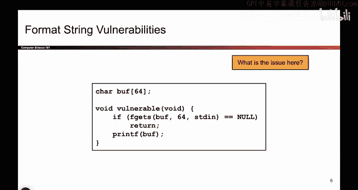

# 042：-MemSafety3, Video 3- Attacker-Controlled printf.zh_en - GPT中英字幕课程资源 - BV1VhEhzMEPL

O。In the last video， we saw how if you provide mismatch arguments to printf。

 Prif will do weird things。 And remember， when we say mismatched。

 Prif uses its zeroth argument to determine how many format specifiers there are。

 how many percent placeholders exist。 And for every percent placeholder that exists。

 Prif requires an additional argument that will match up with the percent formatter。

 And if you give printf a mismatch number of arguments， for example。

 the zeroth argument has 5% signs， but you only provide three arguments to match with a 5% signs。

 weird things happen specifically， printf goes on the stack and tries to look for arguments。

 even though those arguments were not provided。 And that causes unintended things from memory to be treated as arguments。

 And so。

In the previous video， we saw how you can use that to print out values that were not expected。

 And maybe a more general version of this attack is some code like this。As always。

 we define some character array， we call it a buffer， and we allow the user to input 64 bytes。

 So here we're using the F getas function， which guarantees that once the user writes 64 bytes。

We no longer read more user input。 They are limited to 64。 So at first。

 it seems like this should be totally fine。 The user can only write 64 bys to the character array of size 64。

 They cannot override past the end of buffer， but。

What's the problem here？Well， the problem is， if I look at this print F function。

It's taking in aboveuff， which we're allowing the user to write as its zeroth input。 And remember。

 the zeroth input is critical because the zeroth input， the very first thing you pass into printf。

 that zeroth input determines how many more arguments there should be。 And when there's a mismatch。

 bad things can happen。 So the problem here is， we are allowing the user to control the input to printf。

 that critical zeroth input。 And if the user can control this， the user。

 And here the user could be an attacker， they might actually input some percent format matters。

 And if they input some percent format matters， and printe will try to match them up with nonexistent arguments and bad things can happen。

 So the problem here is we're giving the attacker control over that critical zeroth input to printf。

