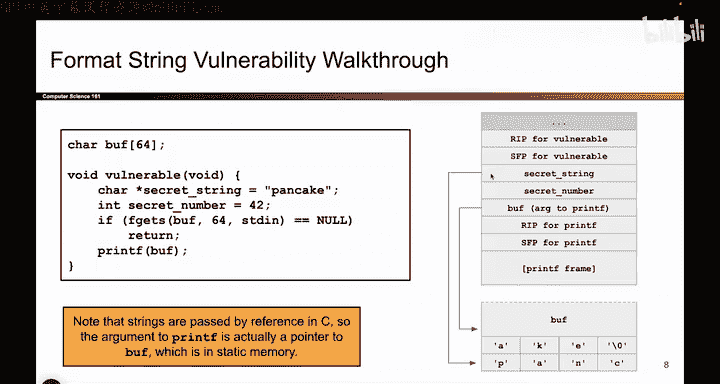
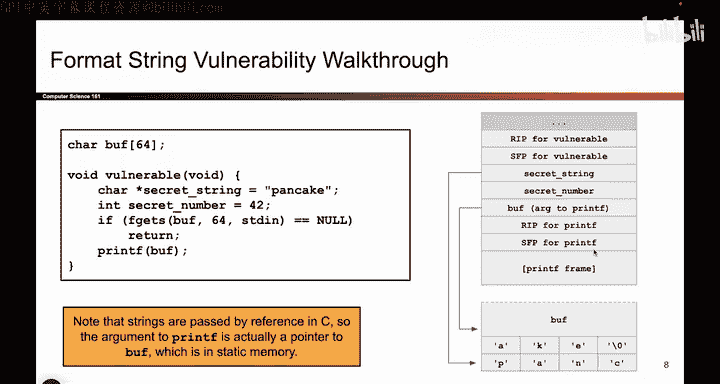

# 044：-MemSafety3, Video 5- Basic printf Vulnerability - Setup.zh_en - GPT中英字幕课程资源 - BV1VhEhzMEPL

Okay now that we know how printf works and we know that giving the attacker control over the zeroth argument of printf is bad。

 we cannot walk through an example where the attacker provides some malicious input and causes some secret values to be leaked。

 So as before we have some buffer and here the buffer is defined outside of the function。

 So that's why we have buff defined out here in the static part of memory， that's why it's down here。

 And then we have this function called vulnerable。 And remember anytime you call a function。

 when we open up that brandnew stack frame， we first add the RP of vulnerable and the SFP of vulnerable。

 those are the saved values in the EIP and the EVP register respectively So there they are sitting on the stack。

 Then we have a local variable secret string。 and it's a type char star That's the type for strings。

 And so remember， say it again a string is represented as a pointer to the start of a character array。

 So what that means is when you put this string on the stack。

The letters pancake， P A N C A K， E， They don't show up on the stack itself on the stack。

 We put secret string。 That's an address。 And if you go to that address。

 that's where you find P A NC A K E A K E。 And then finish it off with a no bitete to indicate that the string is over。

 So when I put the string on the stack。 That's what it looks like， It's an address。

 If you go to that address， you'll find the letters pancake。

 And then the next local variable that I push is secret number。

So there it is happens to have a value 42。 And then what happens is kind of like what we saw earlier。

 the user or the attacker now gets to write 64 bytes into buffer。

 they can put whatever they want into buffer。 and then we will call printf on buffer as the zero argument。

 So when Prif gets called what happens。 if you think back to the steps of a function call the very first thing we do is we push arguments on the stack。

 Prif takes in just one argument here that would be buff。 So we push Buff on the stack。

 And remember a and see our pass around as pointers。

 So what we do is we put an address on the stack and it's the address of buff。

 So right here we have the argument to printf we push it on the stack。

 Now it's time to call printf Prif opens up its stack frame has an RP has an SFP has whatever local variables it wants。

 we don't really care。 but this is what the stack looks like while printf is executing。

