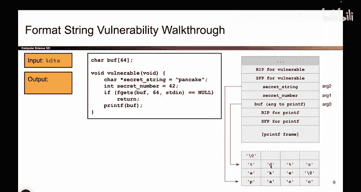

# 045：-MemSafety3, Video 6- Basic printf Vulnerability - Exploit.zh_en - GPT中英字幕课程资源 - BV1VhEhzMEPL

O。SoNow it's time to give printf some mismatched arguments。 Remember。

 the attacker controls what we put in buff。 So let's have the attacker write some percent format matters。

 This attacker wrote percent D percent S。 Those are some percent format matters。

 And so now when we call printf on buffer， which contains percent D percent S。

 We're gonna have mismatched argument and bad things are going to start happening。

 So let's think about what printf is thinking while it reads this input that was provided by the attacker。

 So the printf function goes character by character and anytime it sees a percent symbol。

 it goes on the stack takes the next argument and plugs in that argument into the percent formater。

 That's what printf does。 So we start reading and immediately， we see a percent percent D。 Okay。

 well， that means decimal。 It means integer。 So I should go on the stack。

 take the next argument and match it up with the percent D and print that value out because percent D is really a placeholder for whatever that argument is。

So here's percenti。 I go on the stack。 I take the next argument。 what is the next argument。

 Well the zeroth argument was buff。 And that's right here。 So if the zeroth argument was buff。

 then the next argument must be four bys above that。

 Remember that's how we push arguments on the stack。 push them one by one in reverse order。

 So if buff is the zeroth argument and it's here well then arg1， the next argument。

 it must be up here。 except we never actually pushed an argument。

 So who knows what this is here it happens to be secret number And so printf thinks this is an argument that printf passed in。

 but printf didn't really pass in any argument or rather vulnerable didn't really pass in any argument to printf。

 There's a mismatch。 So printf doesn't know about the mismatch goes on the stack says well this looks like a1。

 This is where it would be if it was there。 It's not actually there。

 but printf would go here to look for it if it was there。

 So all of that is to say we go on the stack we take the next unused argument。

 four bys above the zeroth argument。 and it just happens to be secret number。 So I will print。

Sect number as an integer to match up with the percent D。 So instead of printing out percent D。

 we print out 42， because that happens to be the argument that matches up with the percent D。

 So print expects there to be two more arguments， but there actually aren't。

 So we're gonna go look for those arguments anyway and potentially find some secret values to leak。

 So 42 gets printed。

Okay， what comes next， Well printf continues reading this input character by character。

 and it immediately sees another percent。 Okay， well I see percent S and S stands for string。

 So what that means is I got to go on the stack。 Take the next unused argument and plug that in percent S substitute it in for the percent S placeholder。

 So what have I use so far。 I've already used this a 1 with the percent D。

 So the next one that hasn't been used yet， must be 4 bys above that must be right here。

 which I've labeled a 2。 So this secret string value should be substituted into the percent S。

 and S means string and strings are pointers to the start of a character array。

 So I read this as an address。 I go to that address and I start printing characters until I see null。

 So I print P A and C A K E。 I see the null and I'm done。 So in total。

 the percent D percent S caused me to print out 42 pancake。

 Both of my secret values got leaked because the attack。😊。

providedvied a percent D， which matched up to secret number and a percent S。

 which matched up to secret string。There weren't supposed to be arguments for Printep didn't know that and treated them like arguments anyway。

