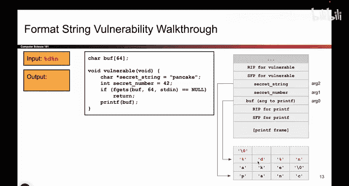
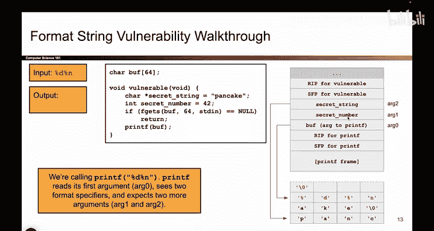
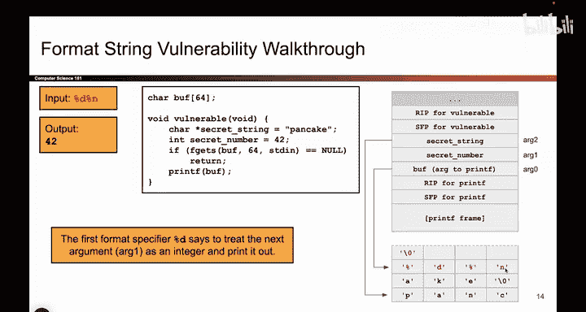
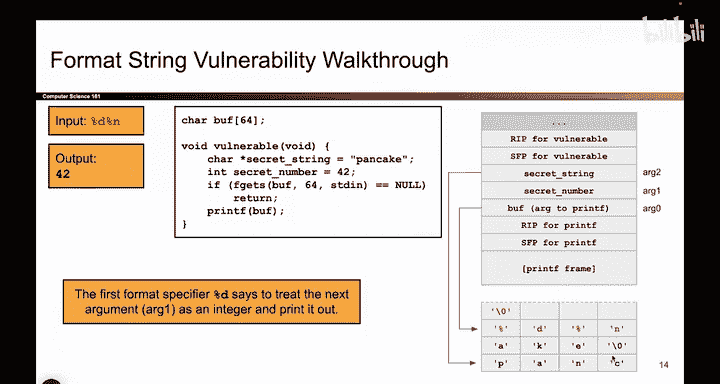
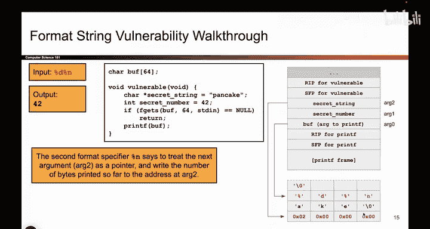

# 047：-MemSafety3, Video 8- Basic printf Vulnerability with %n.zh_en - GPT中英字幕课程资源 - BV1VhEhzMEPL

Okay， now let's do。 we'll walk through using the same code as before。

 but now I'm going to use percent n to cause some writing to happen in addition to reading。

 So just like before， we have some buff of size 64。 and we're letting the attacker write into it。

 And then we're calling printf with buff as that all important zeroth argument。

 The one where we look for percent format matters and match them up with arguments on the stack。

 But this time， instead of writing percent D percent S。

 we're going to write percent D percent n and see what happens。 So what does printf do， As always。

 printf goes to the zeroth argument。 and it starts reading the characters1 by one。 And immediately。

 it sees， oh， percent D。 that means I need to take the next argument on the stack trade it like a number and print out。

 Well， the next unused argument is a1，4 bytes above。 And that happens to be the value 42。

 So just like before， we're going to read 42 and printed out。

So there it is， we see percenti， we go to the stack， we grab this argument and we print out 42。

Wasn't supposed to be an argument， but Prince treated it like an argument anyway。

Okay what comes next now we see percent N and printf starts thinking， well， it' a percent n。

 So I have to write something into memory。 I'm not going to print anything。

 I'm going to write something。 So where do I write。 It's the first question。

 What part of memory Do I write my number to。 And remember。

 percent N matches up with an address on the stack that tells you where to write。

 So what will printf do， It will go on the stack， look for the next unused argument and we've already used this one secret number。

 So they go to the next one， which is secret string， And that's an address。

 So we're going to read that like an address。 We're going to go to that address。

 And this is the location， where we're going to do some writing。 So printf now knows。

 I'm going to go here and write some data， So P N C， it's going to be gone。

 We're going to overrite it with some data。

Now， what data do we write？ We figured out where to write down here。

 but what data do we write And remember percent N writes the number of bytes printed so far。

 So if I checked my output， how many characters have I printed， printed a four。 and I printed a two。

 That's two characters in total。 So I'm going to go down here in memory。

 and that's corresponding to this argument， follow that pointer， go down here。

 and I'm going to write the number two。 So it was gone P and C is gone and instead we have the number two written into memory。

 So that's what percent ended。 It took the number of bytes printed， namely two。

 and it wrote it into memory based on the pointer that we provided on the stack。 go on the stack。

 find the next argument traded like a pointer， go there， write the number two。

So this particular exploit will print out the number 42 and then write the number two into memory。So。

That's what this。Ex point dude。