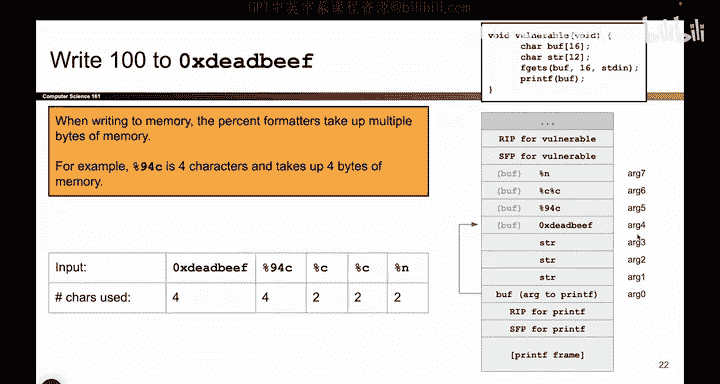
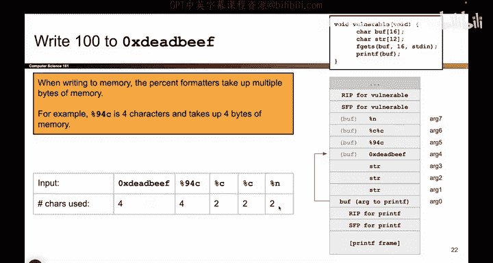

# 050：-MemSafety3, Video 11- Harder printf Vulnerability - Controlling Where We Write. - GPT中英字幕课程资源 - BV1VhEhzMEPL

O嗯。So I'm going to spoil it for this video， I'm going to show you that this is an exploit that hopefully will work。

 but let's break it down and see how I got this exploit and if you're wondering how you might come to this from scratch。

 honestly it's a lot of trial and error， it's tweaking numbers here and they're shuffling things around until you get a structure that works just fine。

This is the exploit。 It's got this set of characters that I'm going to write into Buff because remember。

 ultimately what the attacker can do is they can just write into Buff。

 That's the only thing they can do。 This F getS function lets them write 16 bytes into Buff。

 And these are the bytes that I've chosen to write。

 So the first thing that happens when I call F getS is these bytes get written into memory at buff。

 So forget print F and all the percent ends and all that fun stuff。

 This is just some sequence of ones and zeros。 and F getS just puts them into Buff。😊。

normal input processing。 So when I write this into memory， what values actually show up in memory。

 What does it look like？ Well， it looks something like this。

 So the first part of the input is the address deadad beef。 and that takes up4 bys E F B。

 E A D D E So I take those four bytes。 I write them into memory。 They take up one row of this memory。

 That's4 bys and they show up here at the very start of buffer。 So deadbe is shown up in memory。

 That's good because I know later I want print up to match up with dead beef and look on the stack and find dead beef。

 So it's good that I have it in memory somewhere。 That's good。

 And then the next thing that I write is percent 94 C。

 And I'll tell you more about what that does later。 But from their perspective of F getS。

 which is just taking user input and writing it onto the stack。

 This is just some sequence of characters。 It's the percent symbol。 The letter 9。

 the letter 4 and the letter C。 That's it。 So I take percent 94， I write it onto the stack。

 there it is。

Sitting on the stack at the next part of buffer。 So so far， no printf shenanigans yet。

 I'm just taking whatever the user provided and putting it on the stack。

And then the user said percent C， Okay， great。 So I'll write a percent。 and then I'll write a C。

 And then the user said percent C again。 Okay， so I'll put another percent， another C。

 And then the user said percent N。 So I'll write a percent。 I'll write an N。

 And that's the end of the user input。 So nothing printf related has happened yet。

 I have just taken this proposed input and written it onto the stack where buffer lives。

 That's what F gets is doing。 And along the way， I just reminded myself that these are how many characters each of these。

😊。

Character， string format or thing takes on the deck。

So， for example， percent C， that's two characters， the percent and the C from the perspective of F getS。

 So F getS thinks in terms of just how many characters is this input。

 doesn't think about percent format matters， doesn't think about substituting。 That's print test job。

 F getS just takes this thing， puts it on the stack。 there it is。

Okay here comes the next step。 So now we're actually going to go into printf and we're going to think like printf。

 What does printf do。 It's going to read this input character by character and anytime it sees a percent。

 It's going to go on the stack， take the next value on the stack that's not been used yet treat it like an argument and do something with it。

 So this is where we're going to try to line up the stack and juggle it in such a way so that when the percent n occurs。

 it just so happens to match with the dead that we happen to write earlier So let's think like printf。

 what does printf do Well printf says the zeroth argument is a pointer and it points at buff So what that means is when I call printf。

 I'm going to start reading all the characters in buff1 by one and anytime I see a percent formater。

 I'll do something special。 So let's start reading these things one by one EF。

Is that a percent symbol。 No， so I'll just print out Ef and keep going。 What about B E。

 Is that a percent。 No， so I'll print out B E and keep going。 What about A D， not a percent。

 I'll print it out and keep going D E， not a percent。 I'll print it out。 what's the next character。

 It's a percent。 So I have to do something special。 in particular。

 I need to go on the stack take the next value on the stack。

 match it up with this percent and do something special。 So I see this percent， I go on the stack。

 The next unused argument is ag1。 So this a 1 is now match up with this percent。

 So can almost think of it as every percent formater has to make a friend on the stack。

 That corresponds to that placeholder。 So each percent symbol is a placeholder and needs to make friends with someone on the stack。

 So this percent94 C， whatever the heck that's doing。 it's going to match up with arg 1 on the stack。

 Those two are now buddies。OkayWhat comes next， Prif keeps going and it reads a percent C。

 That's another percent symbol。 so we'll go on the stack。

 this percent C will make friends with the next unused argument， which is arc2。

 and then we see another percent C we go on the stack and this percent C makes friends with arg 3 And finally we see a percent n and percent n well again we go on the stack and printf connects or links this percent n with the next unused argument on the stack what is the next unused argument It's arg4 and what a coincidence。

 this attack was set up so that this percent n matches up with arg4 on the stack。

 It's the fourth percent format that I see and it just so happens that that's where I put dead beef So what a nice coincidence that I juggled everything to work out so that this percent n when Prif sees it it goes on the stack and it finds dead beef That's something that I had to juggle wasn't immediately obvious how I got that to work And when you tried this in the project。

You're going to have to adjust this， maybe you have to add one more percentency。

 maybe you have to delete one and so forth， but somehow you have to make it so that when the percent n occurs and I match up all the percents with arguments。

 so for example， this one match with R1， this one with R2， this one with R3， the percent n。

 whichever argument it matches with， that's where I put the address of where I want to write。

And here， the target address where I want to write is dead beef。

 So if that's an alignment that I had to make happen， It wasn't immediately obvious how I did it。

 It took some trial and error。 For example， maybe you had to add more percent or remove one， but。

This particular exploit， everything lines up。 The percent n matches up with the memory box on the stack that holds dead beef。

 That's good。 It means that percent n is going to write to the address dead beef。So I'm halfway done。

 I got this exp to right to debt beef， and the second part is writing the number 100。

 so that's coming up next。