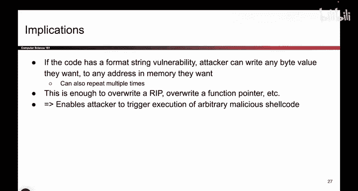
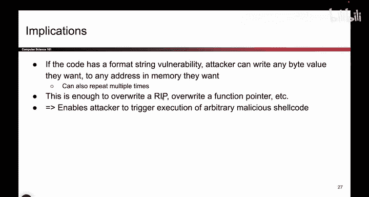
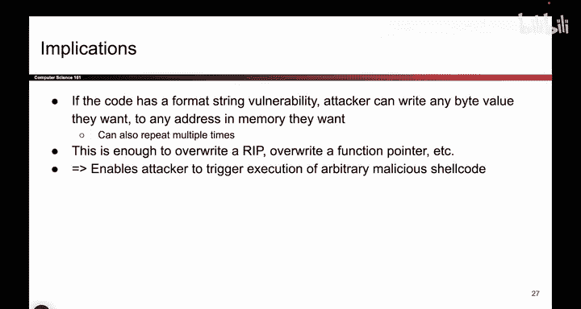

# 054：-MemSafety3, Video 15- printf Implications.zh_en - GPT中英字幕课程资源 - BV1VhEhzMEPL

ok， so。To quickly go over the implications of what we've just seen and to summarize format string vulnerabilities。

 remember that if the code has a format string vulnerability。

 we were able to pick any target number we chose 100 but you could have chosen 89 or 105 or something else you could have chosen any target value and you could have written it to any target address we chose Dentbe but we also showed you how to replace deadtbe with a different address so it's basically any value to any address and in fact if the code calls printf multiple times。

 or if you provide more percent formatters we provided four but you could have provided 8 or 12 or more you could actually write multiple values to multiple addresses and you can use this to craft some of the exploits that we've seen earlier so you could possibly use this printf format string vulnerability to write shell code into memory or you could write the address of shell code over the RP and so you could basically do anything you want it might take a little bit。

Were juggling on the stack to get all the percent formattters to line up。

 but with enough effort and some pain， you will be able to overwrite the RIP to point a shell code and that causes you to once again execute any arbitrary shell code you want so this printt format vulnerability is just as dangerous as all the other ones we've seen。

 even if it takes a little bit more work to actually get right。

