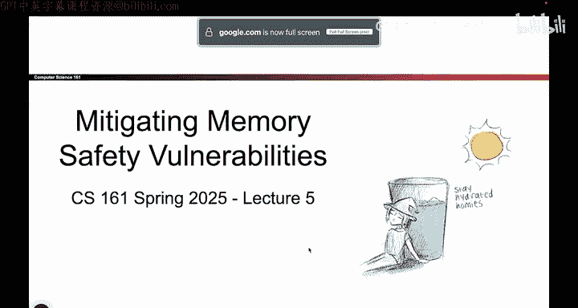
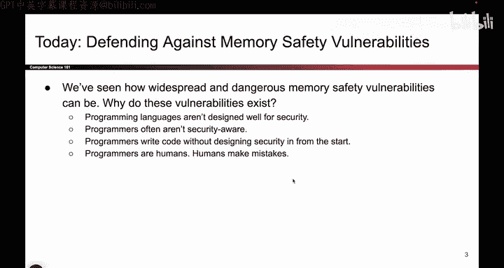
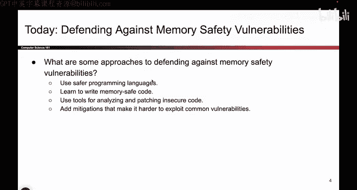

# 060：-MemSafety4, Video 1- Intro.zh_en - GPT中英字幕课程资源 - BV1VhEhzMEPL

Okay， in this set of videos， we are going to talk about defending or mitigating some of the memory safety vulnerabilities that we've seen so far。

 So in this section， we'll talk about different strategies for defending or mitigating the impact of the memory safety vulnerabilities that we've seen。

 So remember from last time， memory safety vulnerabilities are very dangerous。

 and attacker who can overwrite even a single bite could potentially take control of your entire program。

 So it's very important that we as programmers think carefully about ways to defend against it。

 So first we'll start with some philosophical thoughts on why these mitigations even exist。

 Why do these vulnerabilities exist in the first place in the year 2025。

 Why do we still have to stop these things。 And then the bulk of this set of videos will'll be talking about these four strategies for making these exploits less dangerous and mitigating them。

 So this is kind of the bulk of this set of videos。 But first， we will start。

Some philosophy。

Okay， so let's start with the philosophy。 So in this set of videos。

 we're talking all about defending against these vulnerabilities。 But if we take a step back。

 maybe a more fundamental question is， why do these vulnerabilities even exist in the first place？

 It's the year 2025 has nobody thought of a way to fix these。

 And so we've identified four somewhat philosophical reasons for why these vulnerabilities still exist？

 And if you remember that rank of the most common。Security vulnerabilities。

 this was like number one or number two every year。

 so we got to talk about why is this still always on the top of the list。

 and then we'll start thinking about ways to defend against these vulnerabilities。

So we've organized the ways to defend against them into these four general categories。

 and we'll take a look at each of those categories。

