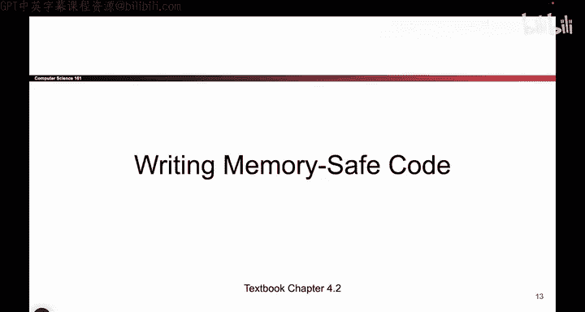
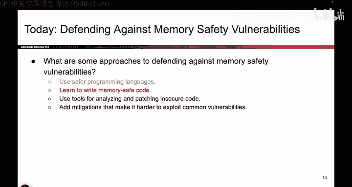

# 062：-MemSafety4, Video 3- Writing Memory-Safe Code.zh_en - GPT中英字幕课程资源 - BV1VhEhzMEPL

Okay， so continuing along with a bit of philosophy on why memory safety。

 vulnerabilities exist in the first place and what approaches we can take to solve them。

 remember from the last video that we mentioned that unfortunately， a lot of legacy code is in C。

 So we are not going to spend all the time to rewrite millions of lines of code into a different language when something is in C and you're hired for a company that works in C。

 you're probably going to end up writing more C code。

 and that's why memory unsafe languages are still around。

 So if we are stuck with having memory unsafe languages for better or worse。

 how do we program them to try and avoid some of these buffer overflow attacks that we've already seen can be very dangerous。

 So in this section， we'll think about approaches to try and be safer when we write code in an unsafe language。

So what do I mean by that Well we're now here， we're thinking about ways to write memory safe code and there's kind of an approach that people use called defensive programming。

 If you've ever heard people talk about defensive driving， it's kind of like that。

 but it's for programming。 And the idea here is when you're programming in a memory unsafe language。

 it's important to be really paranoid because we've already seen even the tiniest little bug could cause your entire program to be vulnerable。

 So when you're programming in a memory unsafe language like C or any of its derivatives。

 we have to be extra careful。 And in particular， when we have code。

 it's really important to add checks。 even if you think they're not necessary and you think actually it's okay。

 this input will always be。😊。

Within the buffer， it's still good to add a check just in case you made a mistake or just in case something bad's going to happen。

 So for example， if you have a pointer and you want to dereence it。

 that is you want to go to that memory address。 you should really check that it's not null。

 even if you are really sure that it's not null， adding that extra check could protect you in case someone makes a mistake or。

 for example， when you're receiving input from a user。

 it's really important to check that the amount of bytes you receive is what you expect。

 and it's not too many。 even if you're really confident that that's the case。

 adding that extra check could save you in case of a mistake。

 and defensive programming is a good approach to take， but to be honest， it is pretty tricky。

 So you have to be very disciplined and you have to be really careful about the way you program。

 We've all been there， it's going to be 11 PMm and you have a deadline coming up in an hour and are you really going to take all that time to check all the edge cases in your code maybe not。

 So this is a good practice。Have， unfortunately， not everyone does it all the time。

 But this is kind of the mindset you'd want to take when you're writing code in an unsafe language。

 And something we mentioned last time as well is if you are writing code in an unsafe language like C and you want to call C library functions。

 it's really important to check the documentation of those library functions and make sure that you're using。

Library functions that are safe。 So， for example， don't use getdes because we've already seen getdes lets you write past the end of an array。

 use F getS instead because that limits how much you can write。 Don't use stir copy。

 which allows the user to copy as much data as they want into the destination use stir end copy。

 which lets you specify a limit and cuts you off if you copy too far past the end of the array。

 So there's all these different library functions。 Some are safe。 Some are unsafe。

 and it's really important to check that you're using the right ones。 And again。

 this requires a lot of programmer discipline， It can be really close to a deadline and maybe you get sloppy and forget about this and suddenly all of your code is unsafe。

 So it really requires you to be disciplined and think really carefully about what library functions you're using。

 by the way， people always ask why is it the case that getdes even still exists if it's so unsafe。

 And again， the reason is legacy if we just removed getS from the C library a lot of code might stop。

Working and that could be a problem if we have some really old code and it suddenly stops working。

 So unfortunately， a lot of these unsafe functions have stuck around for legacy reasons。

 They exist in old code and getting rid of them would break a lot of existing code。 So unfortunately。

 we are stuck with them。 And we're going try and mitigate the effects of them in some of the later videos。

 But this is kind of the philosophy you'd want to take if you are stuck writing code in a language like C。

😊，And if you want to get even more precise about making sure that your code is secure。

 it is actually possible to write out proofs to really check that your code is correct。

 So we're getting kind of theoretical。 And this is actually a whole field of computer science where people do this。

 And what they do is they take a piece of code。 and they reason really carefully about it。

 they write out things called preconditions， postconditions and invariance and in effect。

 what they are trying to do is they're trying to write a proof that the code is secure。

 So it's like writing a math proof， but they're doing it for a piece of code。

 And they want to argue that， well， based on the fact that the input's going to be this。

 and this line of code is going to do this and so on and so forth。

 they want to write a proof that this code is going to be memory safe and it's not going to write out of bounds。

 But to be honest with you， this is also quite tedious。 It is good practice， people will do it。

 But let's be honest， if you're writing a piece of code and the deadline is coming up。

 Are you really going to sit down and start writing a proof for why your code works。😊，Probably not。

 You're probably going to submit it to the autograder and hope that it works。

 You're not going to sit down and write this proof。

 so we won't cover this in too much detail if you want。

 we can link a video that has more details about this。

 but just know that more sophisticated strategies for proving the correctness of code do exist。

 although in real life when you're programming from day to day， you probably won't do this。

