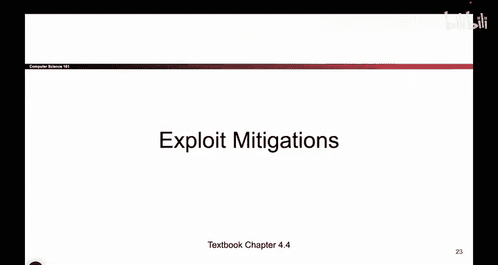
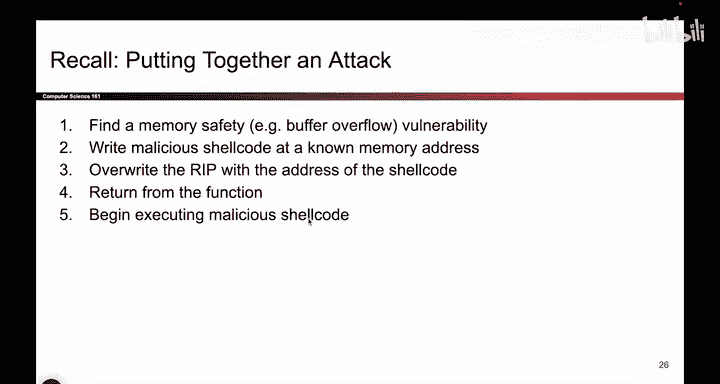

# 064：-MemSafety4, Video 5- Exploit Mitigations.zh_en - GPT中英字幕课程资源 - BV1VhEhzMEPL

Okay， so at this point， we have gone through some general philosophy of ways to protect your system and stop memory safety vulnerabilities。

 And for the rest of this section， we are now going to look at a category of defenses called exploit mitigations。

 So we saw these three approaches。 We are now going to spend a lot of time on this fourth approach where we're going to try and make it harder to exploit a lot of the common vulnerabilities。

So what do I mean by that。 So let's imagine a scenario like this。

 You've just been hired at a new company。 It's a great day。

 and they hand you a big existing codeb that you can work on。 Unfortunately。

 that codeb is written in C。 So you can't use the first defense where you use a memory safe language。

 You have this big pile of code in C。 You're probably not going to rewrite it。

 So you're stuck using this unsafe language。😊，And there are some tools that we saw can help you。

 You can try and program defensively。 but neither of those are perfect。

 So how can we try and stop some of the common attacks。

 even in a scenario where you're forced to use unsafe code。

 That's what we're gonna spend this entire section talking about。

 And these are what we call exploit mitigations。 And the idea here is we're going to change the way that the compiler and the runtime execute our code to try and at least make some of the common exploits harder。

 So we're not going to make the exploits impossible。 that's not going to happen。

 The only way to stop all of the exploits is to switch to a memoryafe language。

 and in this scenario you can't do that。 But we can at least try and make some of the common exploits harder。

 So we're trying to make the attackers life harder。 So some examples of ways we might do that。

 instead of allowing the attacker to exploit the program。

 we might change the way the program runs so that the attempt exploit ends up crashing the program。

 And in general， what you'll see in this section is。

is better than letting the attacker exploit the program。 And why is that if the program crashes。

 that's pretty bad。 But if the attacker exploits our program and is able to execute any code that they want。

 that's even worse。 So even though we might not be able to stop the attacks。

 sometimes we'll be able to detect the attack and panic and crash the program and say this program is compromised。

 We're going to stop running it。 And that's still better than allowing the attacker to do anything that they want。

 It's still bad。 we don't want to crash the program。

 but it's better than letting the attacker do anything that they want。

So our goal here is really just to make the attackers' life a little bit harder。

 It's not going to stop all the attacks， but hopefully we make the attacks more expensive for the attacker more time consuminging。

 and maybe that'll convince the attackers to go somewhere else or stop some of the easier attackers out there。

 And in general， a common theme that we'll see in this section is that a lot of these defenses are very cheap in that they don't make your program a lot slower or a lot more expensive So implementing them is really easy。

 but it's not free。 So there's going to be a little bit of tradeoff。

 but generally not too much tradeoff。 You have to add a little bit of a defense。

 and it stops a lot of common attacks。 So these are generally， really good to have。

So at a high level， this is what we'll be spending a lot of time on coming up。Okay。

 so what do I mean by changing the way the program runs to stockcomm exploits。 Well。

 if you remember back to the last set of videos， we talked about the steps for putting together an attack。

 we said the first thing you do is you scan the code and try and find the memory safety vulnerability。

 For example， someone called getS。 That's a problem。

 and then what you need to do is you need to put the shell code into memory yourself somewhere that you know。

 So you write shell code into memory because the user is not going to do that for you。

 then you overwrite the RP to point to the address of shell code and if you succeed at doing all those。

 when the function returns， the function goes to the RP it looks at the address goes to that address and starts executing malicious shell code So what we are going to try and do is come up with defenses that make each of these steps harder。

 So we can't really do anything about step1 if the vulnerability is there it's there and we can't really do anything about step 4 we're going to return from。

Function， you can't stop function returns from happening， but we can try and focus on steps 2。

3 and 5。 and in particular， we'll look at three mitigations。

 one for each of these steps and the goal is to focus on that step and find a way to make that step harder for the attacker。

 So we'll look at an approach that makes it harder to write the show code at a known memory address。

 We'll look at an approach that makes it harder to overwrite the RIP with the address and we'll look at an approach that makes it harder to execute the show code itself。

So with these mitigations， we're going to make some of the common exploits more difficult。

