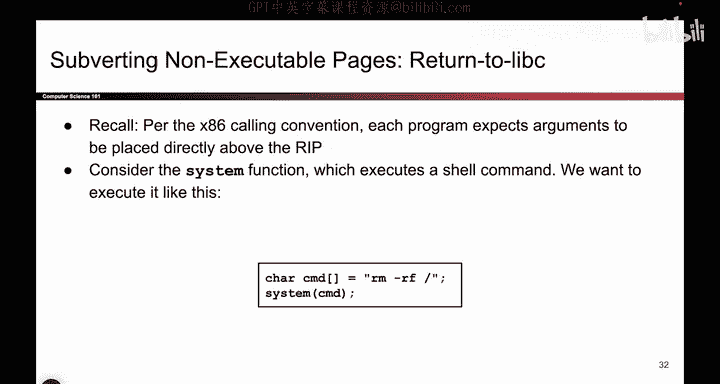
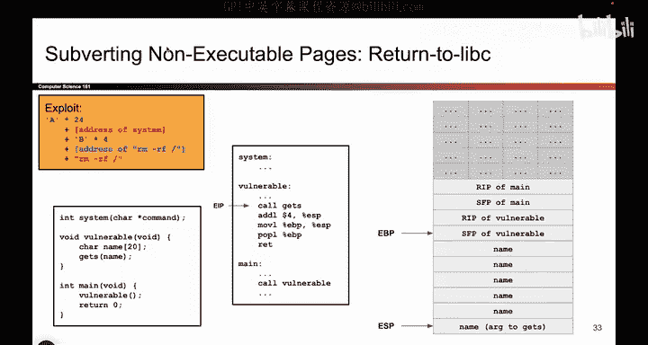

# 066：-MemSafety4, Video 7- Return-to-libc Overview.zh_en - GPT中英字幕课程资源 - BV1VhEhzMEPL

So we said that nonexecutable they just stop some memory safety attacks。

 And the idea is if the attacker writes their own shell code into memory。

 they are no longer able to execute that code because all data is writeriable or executable。

 but not both。 So if you write something into data， you cannot execute it。

But that's not going to stop all attacks In particular。

 What if the attacker uses code that's already there， If you already have codes sitting in memory。

 that code's going to be executable。 So， for example， if you look back here。

 all the code down here is already executable。 So maybe the attacker cannot execute code that they inject themselves。

 but they could still try and execute code that's already living in memory at a place that's marked executable。

So the way we're going to try and subvert nonexecutable pages is we are going to try and execute code that's already there。

 And this turns out to be more dangerous than it seems at first。

 because when you're running a program it's often the case that you don't just have the instructions of your own program。

 but you also have other libraries that you import。

 So that code section at the bottom of the memory layout。

 it might not just have the instructions that the programmer wrote。

 it might also have all of the C standard library functions or any library that the user implemented。

 So there's all sorts of instructions sitting down there in the code section And if the attacker is clever。

 they can try to get some of those instructions to execute and possibly cause some malicious things to happen。

 So that's what we're going to do to try and subvert non-executable pages we can no longer write our own shell code to exploit and run。

 but we can still run code that's already there。 So we'll start with an attack called return to Lise and then we'll make it。

Even better with something called return oriented programming。

 And we'll see each of these one at a time。 But they both have the same idea that is using code that's already there to construct She code。

Okay， so let's start with the first attack called Return to Lipsy。

The idea here is there are already some C standard library functions that can do pretty dangerous things。

 So if the user imports the C standard library， one of the functions that they get is something called system。

 And what system does is it takes any shell command and executes it。

 So if you create a string that says R M dash R， which means delete everything on your system。

 I don't recommend running this command。 But if the user defines a string like this。

 And they call system with that string as an argument， guess what happens。 We open a shell。

 we run that command and the entire system is deleted。

 So this is some code that already exists in memory。

 The attacker didn't have to write the instructions of system themselves。

That code's already sitting there in the C standard library。

 So all the attacker has to do is redirect the program not to their own custom shell code。

 but to the system function and then pass in some malicious argument like this to cause bad things to happen。

 So that's why we call it return to Liy。 Instead of returning to some shell code that the attacker wrote when the function returns。

 goes to the R IP goes to that address。 We are actually going to jump into some other function like system and cause bad things to happen。

 So here's an example of return to Liy in action。 We have the system command sitting in the C standard library。

And we have a vulnerable function that calls get us。 Now。

 let's assume that nonexcutable pages are on。 So your standard buffer overflow attack will not work。

 You can't just overwrite RP with show code and then write show code here。

 All of the stuff on the stack is nonexecutable。 if you write shell code here and try to execute it。

 the program will not let you do that， the operating system will stop you。

 But we have this nice system function sitting here。 So instead of jumping to shell code。

 what if we jumped to system。 And when don't we jump to system。

 why don't we pass in an argument that causes bad things to happen Because remember。

 where arguments passed in， how does a function receive its arguments on the stack。

 And what is get us let you do It lets you write on the stack。

 So not only can we overwrite RP to point to system。

 we can also feed in malicious arguments on the stack to cause system to do malicious things。

 So that's what we're going to do And this is what the exploit。

It looks like， so let's take this exploit。

Dump it into the stack and see what happens。 So first。

 we have a bunch of garbage bys and the garbage bys overflow name。

 They overflow the SFP a vulnerable， just like in a classic buffer overflow attack。

 But instead of overriding the R IP with address of shell code。

 we are now overriding it with address of system。 So now， when the program wants to return。

 it's going to go to this address， which just so happens to be the instructions of system。😊。

And remember how we said， when you go to system， how does system know where the arguments are。

 Where does it go to look for arguments， It goes on the stack。

 So in addition to writing this address， we can also write a malicious argument。 For example。

 R M dash R F。 And now what we've done is when this program returns。 It's going to go to a system。

 And it's going to read this as an argument and cause malicious things to happen。 So at a high level。

 this is the attack we're looking at the two pieces we needed。

 We're overriding the R IP to point at existing library code like system。

 And then putting some additional arguments on the stack to cause system to do something malicious。

 So at a very high level， this is what it looks like。 And coming up next。

 willll break it down in some more detail。😊。