# 067：-MemSafety4, Video 8- Return-to-libc Walkthrough.zh_en - GPT中英字幕课程资源 - BV1VhEhzMEPL

Okay， so at a high level， this is what the attack looks like。

 we have overwritten the address of or the RIP to point at the address of system。

 and we have provided a malicious argument on the stack。

If you stare this exploit a little bit more carefully。

 there are some small things that we had to do to make it work。 So let's walk through some of those。

 So one thing you'll notice is when I passed in the argument， I passed in the address of a string。

 And the reason why we did that is because remember in C。

 when you're passing strings around a string is a pointer to the start of a character array。

 That's what a string is， It's a pointer to the start of a character array。

 So we cannot just pass in the literal characters R M dash Rf。 We do have to write those into memory。

 But then we write the address of those characters， that's the argument。 So this address in blue。

 that's going to be the argument that system looks for。

 That's the first thing that's a little bit confusing about this exploit。

 The second thing that's confusing is why are these4 bs here。 to be honest with you。

 They are a little bit more confusing than they need to be。 I think this exploit。😊。

Has two key elements， which is this address in red and this address in blue。

 The4 Bs are not that interesting。 But since someone always asks。

 let's go through it and talk about why they're there。 Again， not the thing I care the most about。

 but it always gets asked。 So let's go through the function epigue and see what happens。

So first we're going to finish up calling getS， so we move ESP up by four that removes an argument from the stack。

 so we are now done calling getS in case you're wondering this was step 11 of calling getS again。

 not that important but something that we did。

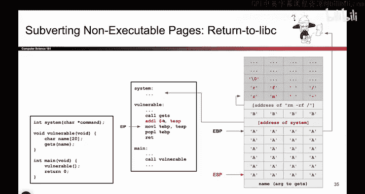

Now we're in the function epi and the function epilogue is always the same three instructions。

 You are probably sick of them at this point， but let's do them anyway。

 So the first thing we do is we drag ESP up。 that collapses the current stack frame。

 So we take EP we drag it up to where EBP is and the current stack frame is totally gone The next thing we do is we take the SFP。

 which is the next value on the stack and we copy those bits into EBP。 This was the old value of EBP。

 let's put it back。 So this instruction will pop the next value off the stack。

 put it in EBP and shift ESP up by4 since we just popped something off the stack。

 And remember because these four values are just A EBP now holds the value A Where does that point I have no idea I don't care So EBP is now floating off into nothingness and the final instruction is RE Here's where the interesting thing happens。

 RE behaves like pop EIP。 So what does it do It goes on。

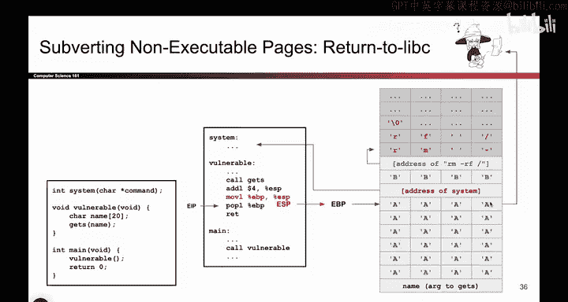

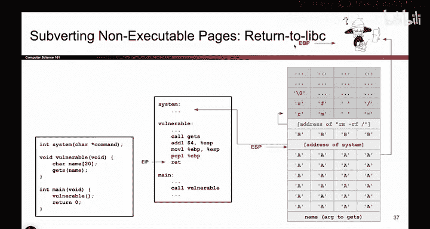

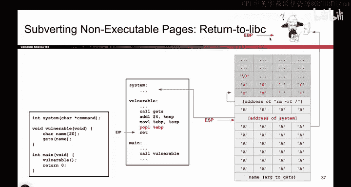

TheSt takes the next value， treats it like an address。

 goes to that address and starts executing code there。 So we'll take the next address。

 which just so happens to be address of system， will'll go to that address and start executing show code。

 So these bits get copied into EIP。 And now EIP is in the instructions of system。

 So we are now executing code in system。 This is not what the program was supposed to do。

 But since we overrot the R IP。 That's where it is now。 And as usual。

 when we pop something off the stack。 EP moves up by for。

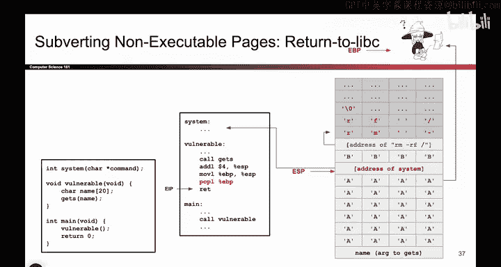

So now you're wondering what is the point of these four beats？

It is not that important， but I will answer it anyway since someone always asks。

If you think about where we are now， we have just begun calling system。 That's what system thinks。

 It thinks someone else must have called me because we are now at the very first instruction of system。

 So in fact， did that actually happen， did someone really call system， nope。

 we didn't ever write an instruction that says call system。

 So the stack is totally messed up at this point。 The system thought that someone else wrote call system and that's why system is being called。

 but in fact， nobody actually called system， we executed this attack。

 and we are now pointing at the start of the instructions for system。

 So system thinks that the stack should be laid out as if someone just started calling system。

 Did someone really just start calling system and go through all the proper steps of calling convention。

 nope， but that's what system thinks。 So if you think back to all the calling convention steps。

 What are the steps before someone call system， if it were a legitimate call。

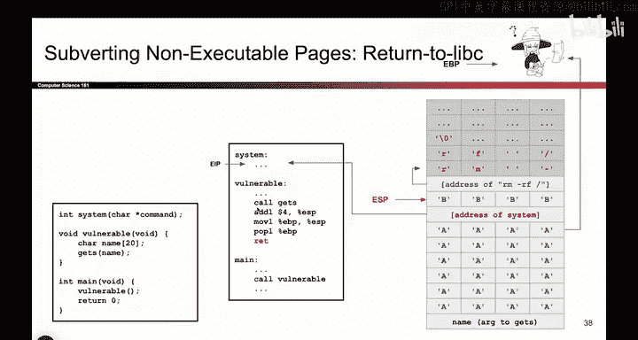

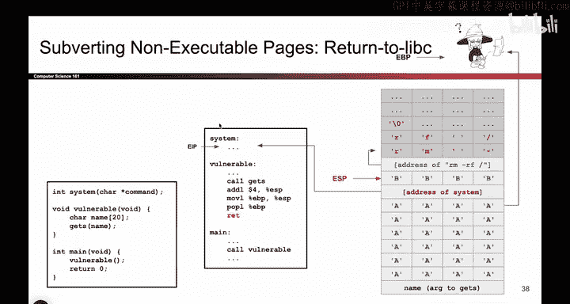

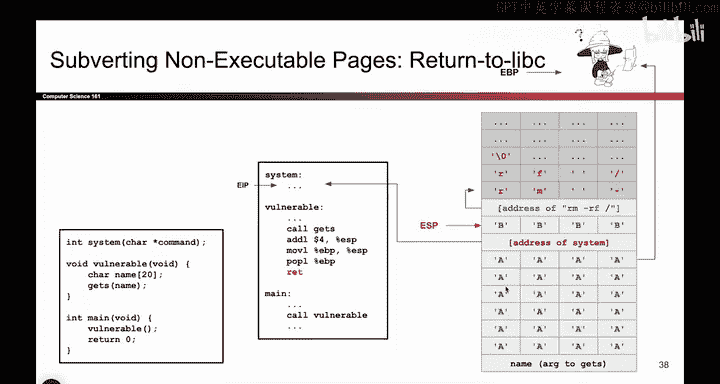

The system， which this one is not。 Well， when you call system。

 the first thing you do is you push arguments。 That's why the arguments on the stack。

 because arguments are pushed on the stack。 So we pushed this address。

 and that's the address of a string。 That's an argument on the stack。

 And when you write an instruction like call system。 What's the next step in executing a function。

 you push the RP。 and then you go to the instructions of system。

 If you think back to all the steps of a function call。 That's the second step of calling a function。

 You push the RP on the stack。 and then you moved to system and start executing instructions at system。

 So what system expects to happen。 is4 bytes were pushed on the stack corresponding to the RP。

 And then EIP moved over to start executing the instructions of system。 But in fact。

 that is not what we did。 We totally messed up the stack。 So system is expecting。

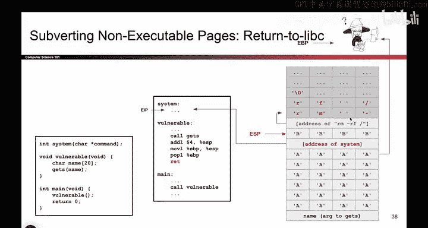

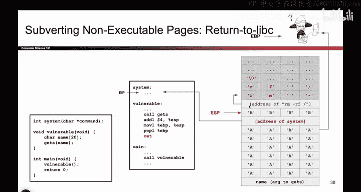

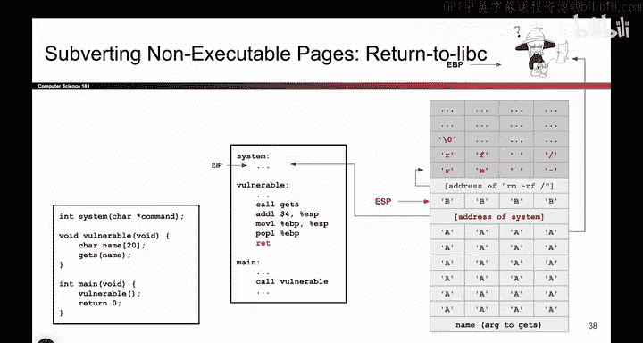

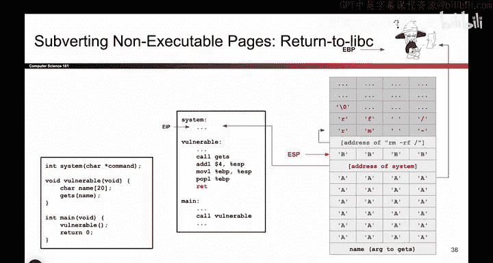

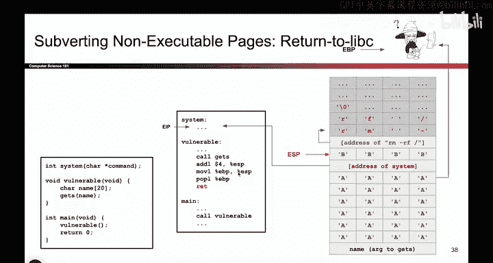

That the stack at this point has an RP followed by a bunch of arguments because that's what you push when you call a function。

 You push the arguments， you push the RP， you jump to the function。

 So system thinks that someone else has pushed the arguments， pushed the RP jumped to the function。

 In fact， that is not what happened because the attacker wrote all this stuff themselves。

 So as an attacker， we need to give system the illusion that someone pushed arguments and someone pushed an RP。

 So how do we push arguments， we wrote this argument on the stack。 and how do we push the RP。

 that's what these4 Bs are or basically tricking system into thinking that an RP has been pushed onto the stack。

 even though it has not been。 So now we're at the start of system and system thinks。

 oh it's my turn I've just started executing So the previous function that called me。

 they must have pushed an address， which is this thing or an argument， which is this address。

 Then they must have pushed an RP， which must be these four bogus addresses or these four bogus。

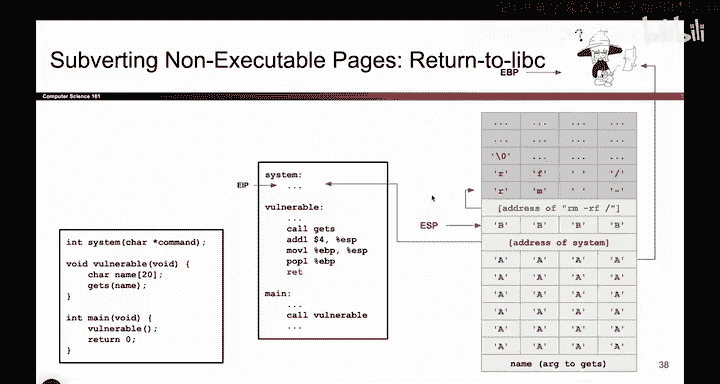

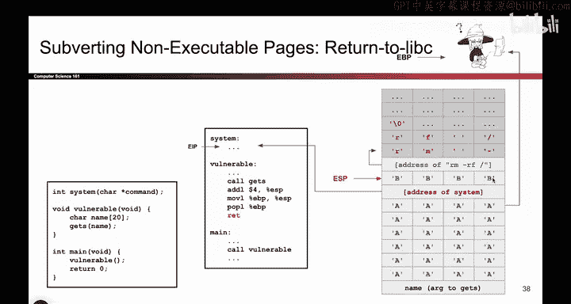

And now it's time to execute system and system has its own prologue。 So what it's going to do。

 it's going to move EBP down here。 It's going to drop ESP down， create its own stack frame。

 erasing all this stuff。 and using its own stack frame to do whatever it is that system does。

 But to make a very long story short。 And again， it is really not the most important part of this exploit。

 The reason why these 4 Bs are here is because we did not call system the right way。

 we did not follow a coloning convention。 We instead just force the program to jump to system。

 And because we did that， the stack is all messed up。 So to make the stack look nice。

 we need to trick system into thinking that an RP was pushed in addition to the arguments。

 So we push the arguments by writing this。 And we quote unquote push the RP by writing these4 Bs。

 So that's what those4 Bs are。 They're basically tricking the system function into thinking that an RP is on the stack。

 even though there really isn't one， and this will then allow system to create its own stack。

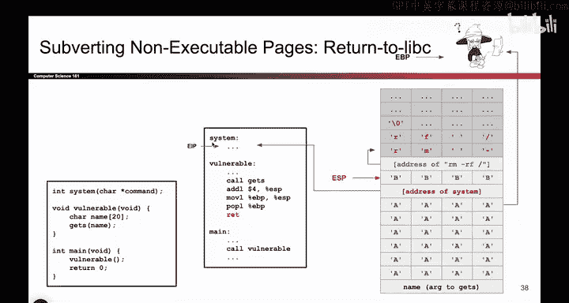

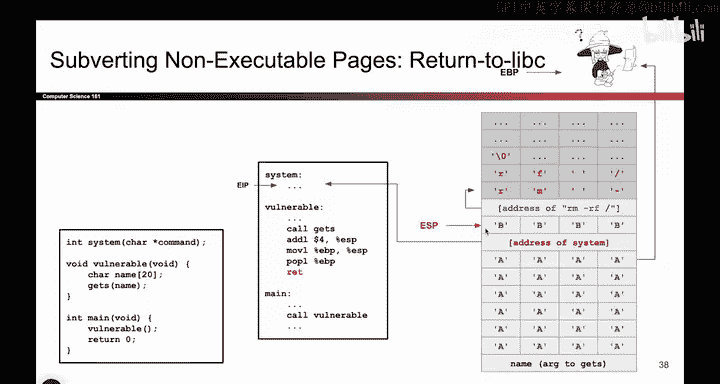

FraAnd look for the address of RMRF， the argument at the right place on the stack。

 So we're faking letting up the stack in the right way。 It is honestly a very small detail。

 but it is one that people always asking about， which is why I've tried to answer it。 But again。

 the most important part of this exploit， is really just the fact that I am jumping to existing code and passing in malicious arguments。

 And the4 Bs are kind of a footnote， if anything。

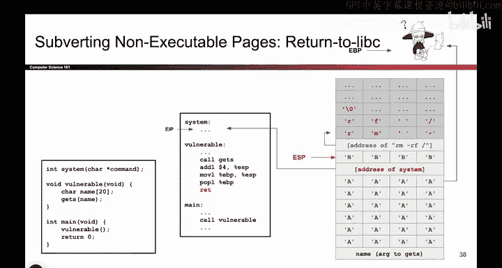

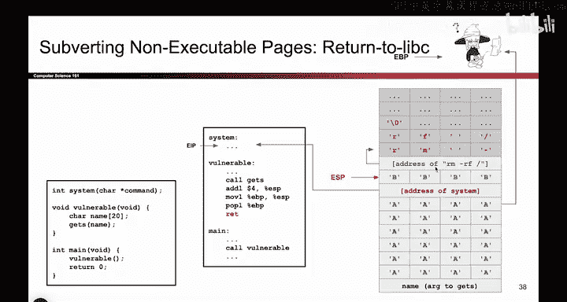