# 069：-MemSafety4, Video 10- Return-Oriented Programming Example.zh_en - GPT中英字幕课程资源 - BV1VhEhzMEPL

Alright， so here is an example of retoran oriented programming in action。

 So let's say we are intensely curious about executing shell code with these two instructions。

 So if it weren't for nonexecutable pages， we would have just written the move instruction followed by the X or instruction into memory and executed it and that would be our desired goal。

 But because of nonexecutable pages， we cannot write these instructions into memory and also execute them。

 Remember， data is writeriable or executable but not both at the same time。

 So we instead have to go into the existing code base， that is existing C library functions to。😊。

Execute these two instructions。 So we dig through all of our existing C library functions。

 and luckily， we find that somewhere in F， there is an exor instruction。 that's useful。

 And somewhere in the bar function that lives in the C library。 There is a move instruction。

 So what I really want is I want to execute these two instructions。

 I want to execute the move that's already in memory and the Xor that's already in memory。

 these two instructions are already in memory。 So they are already executable。

 So if we could just somehow get this program to jump here to execute the move。

 and then after it's done， jump here， then we've achieved our goal of executing this piece of shell code。

 So the way that we're going to do that is we're going to build the chain of addresses on the stack。

 And because each of these gadgets ands in the red instruction。 Remember。

 what does the red instruction do。 It says， go on the stack。 Take the next address。😊。

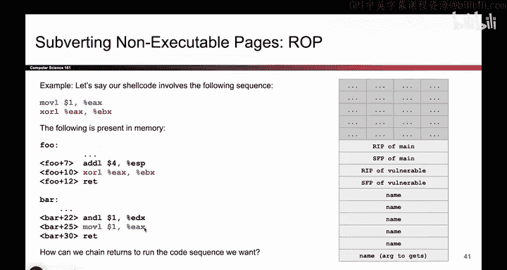

Go to that address and execute things。 So because every instruction ends in a red。

 when the red occurs， What will happen is you'll go on the stack， Take the next address。

 go to that address and execute things。 So ultimately， our exploit will look something like this。

 These are the two instructions we care about。 We want the move followed by the Xor。

 This is the stack frame。 It's our old favorite stack frame with the name character array and the get us called that lets you write past the N。

 But nonexecutable pages are enabled。 So you cannot write the move and the X or instructions。

 You have to use the ones that are already sitting in memory。😊。

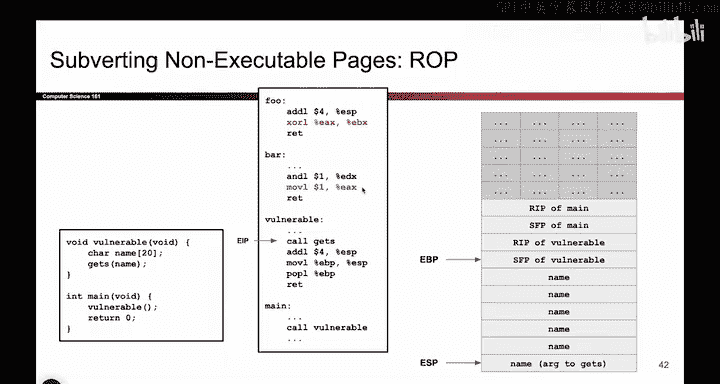

So this is the x we're going to try， we're going to overwrite name like we always do and overwrite SFP。

 but once we get to the RIP。

Instead of jumping to shell code that we wrote， because that's not going to execute。

 we're gonna jump to the first instruction that we want to execute。

 and that happens to be this move instruction right here。 So we overwrite all of name。

 all of the SFP。 And now the R IP points at the move instruction。

 That's the very first thing we want to execute。 And directly above that we write the address of the second instruction we want to execute。

 which is the X or instruction。 and why this works will become more clear once we walk through this。

 But basically， the ideas as you go further up from the RP。

 you'll write the address of the first thing you want to execute。

 then the address of the second thing you want to execute。

 then the address of the third thing you want to execute。

 And the fourth thing and so on and so forth。 So you can chain as many addresses as you want。

 And each address will or the program will go to each address， one after the other。

 and execute the gadgets。 So let's see that in action。

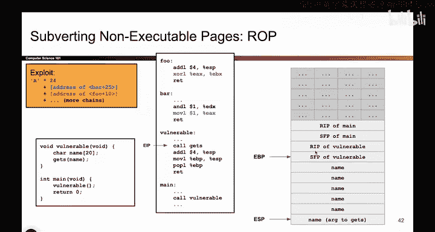

So here we are。 We're finishing up vulnerable。 So get us returns。 that stack frame is cleaned up。

 And now we're going to execute the。

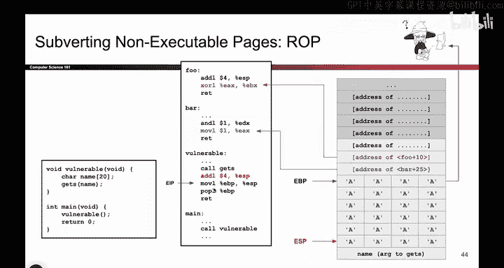

Epilogue of vulnerable。 So here we go。 We drag the EP up As always。

 we take the EBP and pop we pop the next value off the stack， put it in EVP as always。

 So EBP flies off into nowhere。 and that's totally fine。 And now we get to the first red instruction。

 This is standard we're just returning from vulnerable。

 And because someone over the RP to point at this instruction when the function returns。

 we are jumping here to execute this instruction。 So here we go， we return。

 And we pop that value off the stack。 So it's gone， EP goes up by four。

 and EIP now points at the move instruction。 So we're halfway done。

 we executed the first instruction of our twopart shell code that we want to execute。

 So the move instruction executes， that's great。 And then this gadget ends in a rat。

 And the fact that it ends in a R is very useful。 because remember from the last video。

 we said that what happens when you do a red instruction， when you push the big。😊。

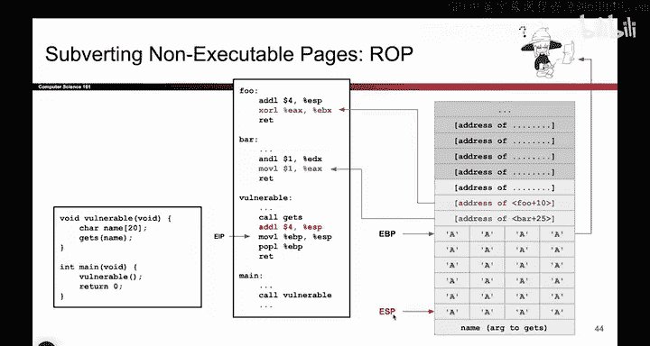

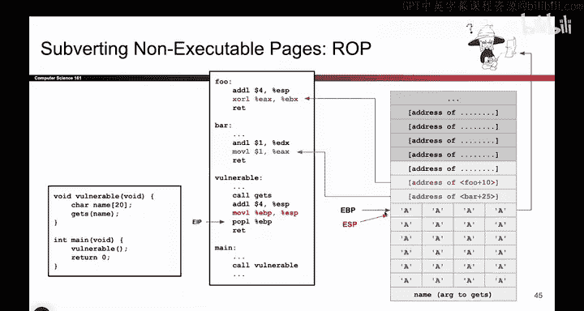

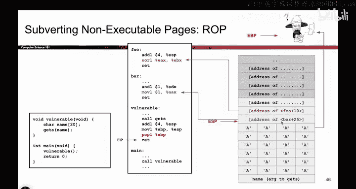

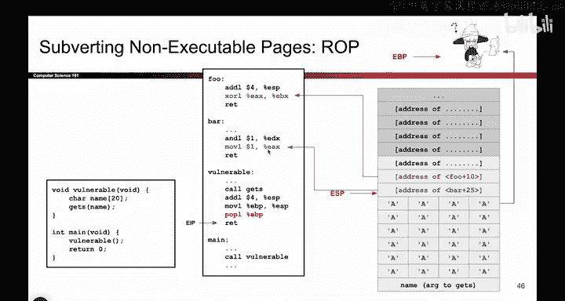

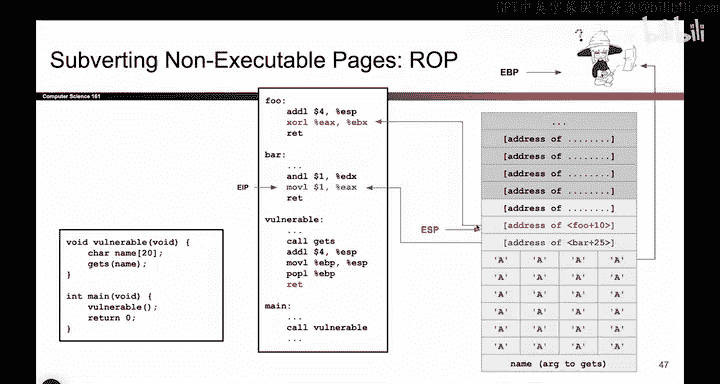

Red R button。 Well， what happens is you go on the stack， you take the next address。

 you go to that address and you execute the code there。 So when the program sees the rent。

 what does it do， It goes on the stack， takes the next address， just happens to be this one。

 goes to that address。

And starts executing shell code there。 So the re instruction executes， and we go to that address。

And we execute the second part of our shell code。 So we have successfully executed both instructions of our shell code。

 And if our shell code had more instructions。 Well， no problem。

 you just write more addresses on the stack。 So what would happen now is the red instruction would execute and what will that do it will go on the stack take the next address。

 So if we had a third instruction， we would write its address here。

 And then it would jump to that address， it'd run some code， it would end in a red。

 you'd come back here， pick the fourth address， go through that address， run some code。

 thered be a red instruction， get the fifth address， go run some code。

 there would be a red instruction that grabs the sixth address and so on and so forth。

 So as long as all of our gadgets end in a red instruction。

 All we have to do is write each address of the gadgets one after the other and what will happen is each gadget will run one after the other。

 And since each gadget is in a red instruction， it will pass control over to the next gadget。

 And if you do this enough times。

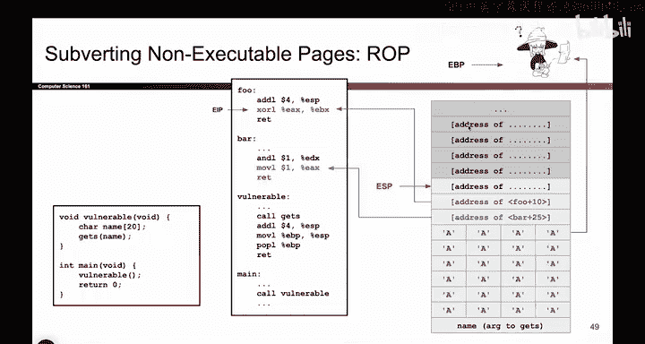

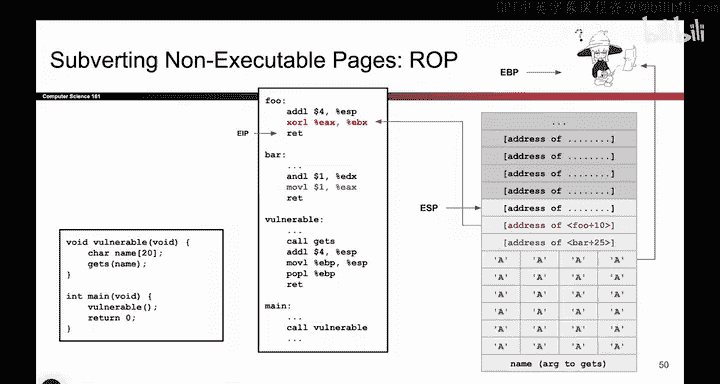

You can get any show code you want to execute as long as the instructions of your show code live somewhere in memory。

 So that's what the raw attack looks like。 It's pretty cool that you can even do this。

 but that's kind of the idea。 And something that people always ask at this point is， well。

 what if the gadget doesn't end in a red。 Or what if I want an instruction up here that doesn't end in a rent。

 you'd have to be a little bit more clever。 Were not going to talk about the ways to get around that problem。

 because it's a little bit too detailed for this class。

 but do know that if you want instructions that don't end in rent。 or if you want a gadget that has。

😊，It lives in the middle of a function。 It doesn't have the red at the end。

 It is still possible to run attacks like this。 It would just require a little bit more stack juggling that I don't think is terribly useful to talk about。

 It's a lot of detail for not a lot of extra benefit。

 So just know the most basic type of rap attack is one where all the gadgets end in rent。

 and you can do something nice like this。 And more complicated versions also exist。

 But the one we want you to know about is just this nice basic version where the gadgets do end in rent。

 And in fact， in practice， a lot of gadgets do end in red。 So you do get nice behavior like this。

