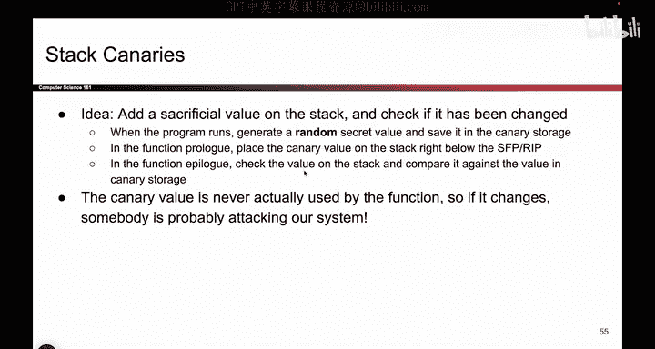
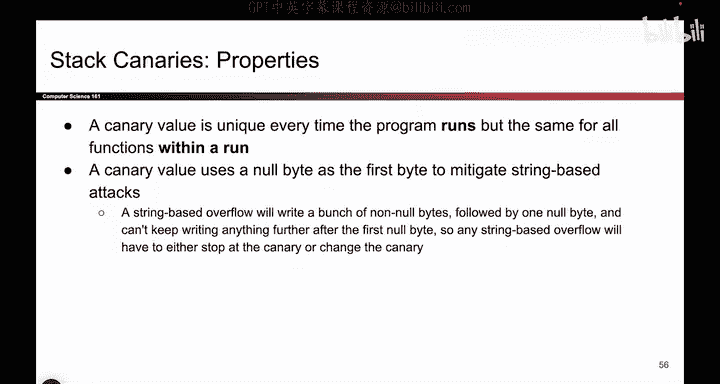
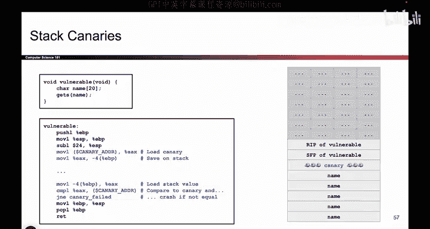
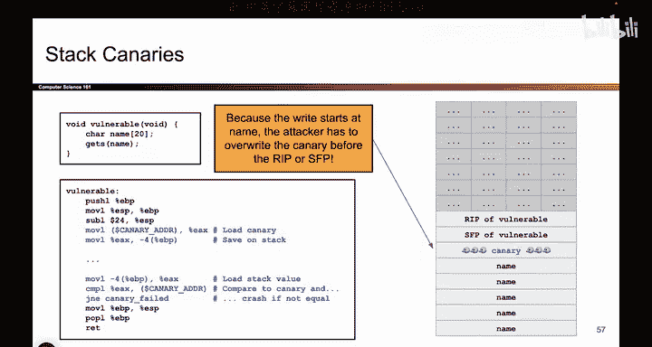
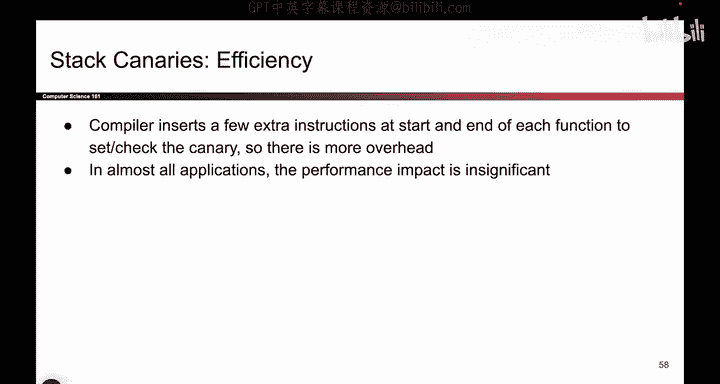

# 072：-MemSafety4, Video 13- Canary Properties.zh_en - GPT中英字幕课程资源 - BV1VhEhzMEPL

Okay， so we've told you the story of how stack canaries work。

 This is what they look like in real life。 When you build a new stack frame。

 that is when you call a new function and you build the stack frame with the RIP。

 the SFP and so forth。 you're going to add a sacrificial value on the stack。

 And this value is not used by the program。 It's not a local variable that you care about。

 it's not a saved pointer value。 it's a totally sacrificial value that no one should ever have to use。

 So when you call the function， generate a random value and you don't even care what the value is and put it on the stack。

And then after the function returns or when the function is returning in the function epilogue。

 you'll go back and check if that value has changed， if the value stays the same， things are okay。

But if the value changes， that's pretty suspicious。

 You just put a value on the stack that no one is ever supposed to use。 It's a sacrificial value。

 the program is not supposed to touch it during function execution。 But if during the epilo。

 you go observe the canary and notice that its value changed。

 that's like the canary falling over dead。 something bad has happened。

 a part of memory that was not supposed to change has changed。

 And that's a signal that someone is messing with your program。

 you should probably alert the user crash the program so that no further damage happens。

 So the canary is never used。 therefore， if someone changes it， your system is probably in trouble。

 And by the way， if you're wondering how to check if the value hasn't changed。

 the operating system will store a copy of the canary is somewhere in its own operating system kernel。

 if you're interested， take an operating systems class to learn more。

 But for the purposes of this class， all we care about is you put the canary value on the stack。

 and when the function returns， you check。Whether or not it's changed and if it has changed。

 something bad has happened。

So here are some properties of the stack canary value。 as we mentioned。

 it's usually just randomly generated。 You don't really care what the value is。

 although usually what happens in programs and what we'll assume for this class is that the canary value is the same for each stack frame。

 So if you call a nested sequence of p functions， every stack frame has the same canary value。

' usually just for convenience， but it's something we'll assume in this class for our exploits。

 different operating systems might do things differently， I don't know。

 but basically what it means is if you build a bunch of stack frames。

 every stack frame has the same canary value on the same run of the program。By contrast。

 if you run the program 10 times， you should expect to see 10 different canary values。

 and this one is really important because imagine if you use the same canary value every single time。

 Well， then that's not so hard to exploit。 the attacker just has to run the program once write down the value of the canary and then run it a second time and now they know the secret value。

 that's not really secure。 So what we really have to do to stop attackers is change the value of the canary every time the program runs。

 So if you run the program 10 times， you will get 10 different canary values and this stops the attacker from a lazy work around like writing down the value and using it again later。

 So in your project， if you try that， if you try to write down the canary value and then use it the next time you run the program。

 it's not going to work。 The canary value is going to change every single time。

Another useful property of stack canaries is that they usually have a nullbytes sitting in there。

 So one of the bytes is 00， and that's useful just to mitigate stringbased attacks。

 So this is kind of separate from our original intended purpose of stack canaries which is to check if someone has tampered with our program but oftentimes people will also throw in a null byte for a totally different reason and the reason here is that a lot of functions like stir copy or printf with a percent S they work with strings and do remember how C checks if strings end。

 they check for a nollbyte So what often happens if you have a memory unsafe string function like stir copy or printf with a percent S is they go on the stack and they start reading a string and the way you read a string is you read every single byte until you see a nullbyte that's when the string ends So if you don't have any null bytes on the stack then what might happen is if you go somewhere on the stack and say。

Print this out like a string or please write this as a string。

 Then the program will just start writing and reading and printing all the way up the stack with no stop because it never sees a nollbite。

 By contrast， if you stick a nobite in the canary， that helps a little bit because now there are some noll bites scattered across the stack。

 So when you go line by line from bottom up， you'll eventually encounter a nullb and that will stop the string exploit before it can do any more damage further up the stack。

 So this is kind of a secondary purpose of the canary， if it doesn't totally make sense。

 it's okay this is not the primary purpose of the canary but if you ever see nollbite sitting in the canary。

 it's usually because having no biteite stops stringbased buffer overflows or at least makes them a little bit less damaging。

Not the most important thing here， but something to note since you'll sometimes see the no bitee sitting there。

Okay， let's do a really tiny example of a stack canary working。

 You don't actually have to read this code。 but the thing I really care about on this slide is this picture because it shows you where the canary lives。

 So when you build a new stack frame， the way you build it is the same as usual。

 you push the arguments， not shown here。 you push the RP， you push the SFP。

 But before you start creating the stack frame and adding local variables and creating space for your new function。

 you're going to stick this extra value on the stack。 and that's the secret canary value。

 So you do your function prolo as usual。 But before you create the name buffer or anything else in your new stack frame。

 you add a new canary value on the stack。 there it is sitting there protecting you from a。

And then your function does whatever it needs to do。 But when the function returns in the epilogue。

 what we'll do is as we're cleaning up this stack frame and bringing the stack back up to where it used to be。

 We will check this value and see if it changed。 If this value changed。

 something bad has happened and we need to panic and crash the program and alert the user。

 But if this canary value stays the same as before。

 then all is good And we can keep executing the program， We have not detected and attack。

 So that's where the canary lives。 And by the way， you might be wondering。

 why don't we put the canary here， Why didn't we make it the first thing we pushed。

 We could have put the canary up here。 And why didn't we put it down here， where name is。

 So the reason why we put the canary here。

Is because now if an attacker tries one of their classic buffer overflow exploits where they overwrite all of name。

 overwrite SFP and then overwrite the RP。 what are they going to do。

 They're going to start down here， they're going write over name They have to keep writing past the SFP and they're gonna clobber out the canary it falls over。

 they're going write SFP and then overwrite the RP but in doing so， they've clobbered out the canary。

 So by putting it in between the local variables and the saved registers。

 we're protecting the saved registers。 Someone trying to write from the local variables to the saved registers。

 they have to cross the canary and if they cross the canary。

 it gets clobbered out and bad things happen。 So that's why we put it over here in between the local variables and the saved registers。

 if you put the canary somewhere else like above the RIP you would not stop the classic buffer overflow attack and it wouldn't be terribly useful。

 So putting it here in the middle is a deliberate。P it there helps us stop the classic buffer overflow attacks we have seen so far。

Okay， question that we are asking with all the memory safety defenses is how efficient are stack canaries。

 if you enable this extra defense， how much does it affect the performance of your program。

 it does affect the performance a little bit because you have to do extra work for every function that you call Every time you call a function you have to add the canary。

 and every time a function returns， you have to check the canary。

 So there is a little bit of extra work， but to be honest。

 it's really not noticeable in most applications。 I don't know about you。

 but when you're running a piece of code， if you add one extra line of code。

 it's probably not going to make your program that much slower。

 especially if the line of code is something like write a random value or check a random value。

 those are not really expensive instructions。 So yes， there is some performance impact。

 but in almost all applications I can think of you are not going to notice it。

 So this is another defense that is effectively free in terms of performance。

 but it's going to make the attacker's life so much。

ter， so we like it。