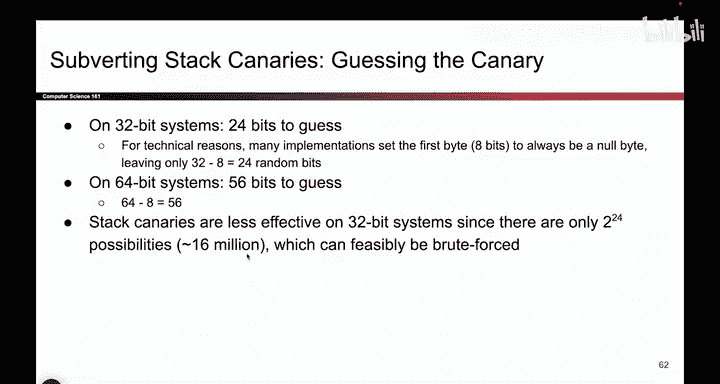

# 073：-MemSafety4, Video 14- Subverting Canaries.zh_en - GPT中英字幕课程资源 - BV1VhEhzMEPL

So just with all the other defenses we've seen stack canaries， they will help。

 They have stopped our classic buffer overflow attack。

 where you start at the bottom and right all the way up。 But as before。

 there are some ways to subvert it。 And in particular。

 there are three ways we can think of to get around the stack canary and defeat this defense。

 We can still execute shell code， even if stack canaries are turned on。 So we could leak the value。

 we could bypass the canary altogether， or we can try and guess the value of the canary。

 So let's go through each of these one by one。

So the first approach is leaking the canary。 If you have some memory safety vulnerability that lets you access parts of memory that you're not supposed to。

 you might be able to learn the value of the canary。 For example。

 remember those format string vulnerabilities that lets you print out values on the stack。

 if you're able to print out values on the stack， you might be able to print out the canary value and what the attacker can do is they can leak the canary value。

 And then when they're writing the exploit into memory， when they get to the canary。

 should they just write AAAA。No， because that's gonna to cloer out the canary Instead。

 once they get to the canary， they overwrite the canary with the original canary value。

 and that causes the canary to look like it has not been changed。 So if the canary is say1，23，4。

 then when you're writing and memory， you write a bunch of garbage。 but once you get to the canary。

 you write one，23，4 and then you keep writing and it gives the illusion that nobody has touched the canary because you overwrte the canary with the original unchanged value。

 and something to point out here， by the way， is you have to do all of this on a single run of the program because remember the canary changes values every time you rerun the program。

 So you can't run the program once， write it down and then run the program a second time the canary value has changed。

 you would have to do all of this on a single run of the program。 and in fact。

 that's what you'll do in the project， you will run the program once。And in that single run。

 you're going to write down the canary value and put it back in the same run of the program before it has ever changed。

 So that's the idea behind leaking the canary。And。Oh so we have。

Okay。So in the second strategy for subverting staaries， we'll think about bypassing it。

 So stack canaries are great in stopping the classic buffer overflow attack。

 And if you think about why they stop the classic buffer overflow attack。

 It's because classic buffer overflow attacks that use functions like getS or F getS the way that they write into memory。

 is they write increasing consecutive addresses in memory。

 So what that means is if you start at address 10， and the user supplies a bunch of input。

 you write to address 10 and then address 11 and then address 12 and then 13 and then 14。

 you write increasing consecutive addresses with no gaps。 So when someone uses getS。

 you can't tell getS actually， I wantna skip this point， you can't do that。

 getS takes in an input and writes it to increasing consecutive addresses with no gaps whatsoever。

 So what that means is if you are trying to exploit a function like getS then to overwrite。😊。

Memory and do the classic buffer overflow。 You have to overwrite all of name and the canary and SFP to get to the R IP。

 You can't skip as you're moving up the stack。 So stack canaries are great at stopping attacks text like this using get as or stir copy because those functions right from lower addresses to higher addresses with no gaps whatsoever。

But some attacks， they don't have to write from lower addresses to higher addresses with no gaps。

 So sometimes you have memory safety vulnerabilities that let the attacker write around the canary。

 And what that means is they still write to memory and they cause bad things to happen。

 but they don't directly clobber out the canary。 So， for example。

 do you remember our format string vulnerability where you wrote the number 100 to dead beef。

 When you wrote the number 100 to dead beef。 If you go back and look at that exploit。

 it didn't involve writing past the end of any buffer at all， you used printf's percent end formater。

To write to a specific place in memory。 And in doing so。

 you didn't have to write from lower addresses to higher addresses or clobber out the canary at all。

 So what the attacker did there is they wrote around the canary。 They wrote to places in memory。

 but they didn't have to clobber out the canary。 And there's other attacks out there like heap overflows where you write on the heap。

 And if you overwrite parts of the heap， you're never going to touch a stack canary because stack canaries are on the stack。

 they're not on the heap。 So if you could， even if stack canaries are enabled。

 go on the heap and overwrite some secret variables。

 maybe there's an authenticated variable on the heap that you can overwrite and stack canaries are hopeless at catching that because you never clobber it out a stack canary。

 So what this is showing is that different attacks do exist that don't write memory from lower addresses to higher addresses with no gaps。

Stack canaries do stop those kinds of attacks that are common。

 but some of these more clever attacks that write around the canary will defeat the Sta canary defense。

Okay， and the final defense is the silliest one。If the canary is a random value。

 you could just guess it。 And your first guess is probably not going to be right。

 but if you guess a lot of times， you might get it right。 So that's what we'll do。

 We'll run this program with the guest canary and then we'll run it again and then we'll run it again。

 And if we do it enough times。 we might get lucky and our guest value of the canary might match the real value。

 So when you're writing into memory， you write a bunch of A's。 But once you get to the canary。

 you write your guest value and hope that it's correct。 And then you keep writing past the canary。

 And if you guess right， it'll look like the canary wasn't changed。 So how feasible is this。

 how much time is it going to take to correctly guess the canary。

 it kind of depends on your threat model。 Remember how we always say。😊，What do we say， we say。

 know your threat model。 We have to think about what environment we're running this code in to get a sense of how hard it is to guess the canary。

 So we can start with a 32 B system。 These are systems where each address is 32 Bs long。

 If we have a canary that's 32 Bs。 And8 of the bits are a nobte for reasons that we talked about earlier。

 that would leave 24 random bits。 So if there are 24 random bits。

 And you guess the odds if you getting it right， are roughly one in 2 to the 24。

 They're not great odds。 But if you try a lot， you might get lucky。

On a 64 B system where addresses and canaries are 64 Bs long， you'd have 56 Bs to guess。

 There are 64 Bs in the canary，8 of them are a nobite left with 56 Bs to guess， so。

Depending on what kind of system you're on， canaries might be easier to guess。

 They might be harder to guess if you're on a 32 B system。

 there might only be 16 million possibilities， which means if you have the ability to try 16 million times。

 you might be able to brute forcece and guess the canary。 And by the way。

 for those of you trying this on Project 1， you will not have enough time by the due date to try 16 million times。

 So don't do that。 But in other cases， it might be possible。

So how feasible is this we can ask other questions about our threat model as well。 So， for example。

 if the program you're running is on your own computer， you can just keep guessing。

 no one's going to stop you from running this program 16 million times on your own computer because it's your computer。

 By contrast， if you're running this program on someone else's server。 for example。

 you're typing in the exploit and you're sending it over the Internet to a different computer and that computer is running your exploit。

 that computer might get tired of you guessing the canary and they might notice that you're sending 16 million different requests and they might say。

 okay hold on， you are clearly trying to do something bad， I'm going to stop you from trying again。

 So remote servers might kick you out if they notice you're doing something suspicious like guessing a canary value。

 There are also other defenses you can use to stop canary guessing， for example。

 there might be a timeout， have you ever encountered on your phone or your computer if you type the wrong password a couple of times it's going。

Make you wait before trying again that can make the attackers's life harder。 So for example。

 if there's no timeout and we assume we can try 10，000 times per second。

 a quick calculation tells us that it will take us roughly 30 minutes to crack this canary My contrast。

 even if you add a time out of just01 seconds every time the attacker fails。

 they have to wait 01 seconds， you have already decreased or increased the amount of time it takes to succeed and crack the canary from 30 minutes to three weeks So even a small timeout makes their life a lot harder and you can also do more complicated timeouts。

 for example， maybe you say every 10 times if you provide 10 incorrect guesses。

 we're going to give you a 10 minute time out Well then now it's going to take 30 years to finish guessing the canary which is probably not happening and even more complicated schemes like doubling the amount of time for each failure So every time you provide an input and something bad happens and the canary guesses。

rong the amount of time you have to wait doubles， you're not going to finish this。

 the universe will probably melt before you finish guessing the canary。

 so all of it depends on your threat model， any of these models could be possible depending on what code you're running and depending on where you're running the code and so the feasibility of guessing the canary。

 it really depends on where you're trying to guess the canary。😡，And as mentioned。In Project one。

 it's not going to work。