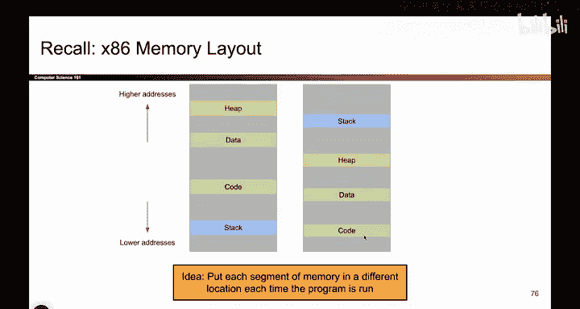
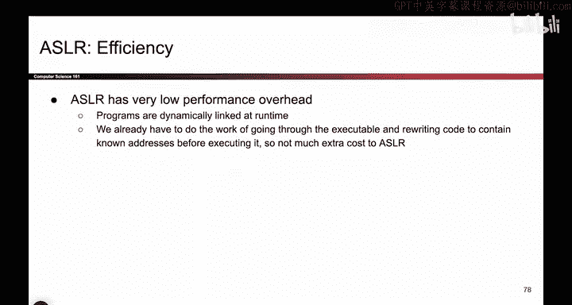

# 075：-MemSafety4, Video 16- ASLR Overview.zh_en - GPT中英字幕课程资源 - BV1VhEhzMEPL

Okay， the last mitigation we will talk about is something called address based layout randomization or ASLR。

So going back to our favorite picture or we talk about the steps of an attack。

 we have learned how to make it harder to execute shell code by adding nonexecutable pages。

 we have learned how to make it harder to overwrite the RIP by adding stackaries and point your authentication so that attackers that write from bottom addresses higher up will clob around those secret values and now in the final mitigation we'll see we're going to target step 2 where the attacker writes the shell code somewhere that they know so that they can use that same address to overwrite the RIP so this is the last defense that we're going to see it's called ASLR。

So to motivate ASLR， let's take a look at this picture， we've seen this a lot。

 this shows us the four sections of memory， but in real life when you are running programs。

 you are probably not using all of this space for the code and your stack is probably not using all of this space either。

 So in real life your programs don't really look like this they look like this you have a stack and a he and the data section in the code section but you don't really use most of memory。

 your programs are not running using4 gigabys of working memory most of the time on a 32 B system or what was it 18 billion gigabytes in a 64 B system So most of the address space is just totally blank。

 your program is not using any of this stuff。

So this gives us an idea if the program is not using any of this stuff。

 what is stopping us from taking stack heap data code and changing where they appear on the stack Sometimes when you run the program。

 they can live here the next time you run the program maybe you shift them up a little bit so all the addresses move up a little bit and to get even more creative。

 what's stopping you from shuffling them around why not put the heap up here and the stack down here and the code over here。

That's going to work， too。 The stack can still grow down if it needs more addresses。

 It's not going to need all of the space。 The he can still grow up。 That's a lot of problem。

 So what we're getting at here is if each of these segments of memory only uses a tiny amount of the address space。

 Well， then nothing is really stopping you from shuffling them around， each time the program is run。

 So when you run the program once， you get this layout。 the next time you run it。

 you get this layout， the program runs just fine。 But what you've done is you've changed the addresses。

 You've made it harder for the attacker to guess where things are on the stack。

 So if that's what AsLR does， it takes advantage of the fact that there's all this unused space and it shuffles around where the memory segments are placed Every time you run the program。

😊。

So that's called ASLR and this stops the attacker from doing their classic buffer overflow exploit because what do you do in the classic buffer overflow exploit the very first one we saw。

 you write shell code， and then you overwrite the RIP with the address of She code。

But if the address of shell code moves around every time you run the program。

 what address do you put in the RP， Who knows？ Now you've made the attacker's life harder。

 They don't know what address to put in the RP。 So now the attacker' life is harder。

 they can no longer do the classic buffer overflow exploit because addresses shift around every single time。

 And AsLR can shuffle all 4 segments of memory as we saw， So you can shuffle them anywhere you want。

 And now wherever you put shell code， you don't know what the addresses are。

 they're different every single time。 And something to mention， by the way。

 when we're talking about asLR， is that when it shuffles the segments of memory。

 it doesn't shuffle what's inside that segment。 So what that means is that relative addresses are still the same。

 So we could take the stack and drag the entire stack upwards so that instead of addresses 1000 to 2000。

 It now lives an addresses4000 to 5000 or 8000 to 9000。 That's something you can do。

 But within the stack， you can't shuffle things inside。TheSt that would break the program。

 So you can't go into the stack and just shuffle everything around。 Now。

 no one knows where anything is inside the stack。 Everything is still in the same relative location。

 So， for example， when you build the stack frame， it's still R IP first。

 followed by SFP followed by local variables。 that does not change The local variables are below the SFP。

 which is below the R IP， The relative ordering is the same。

 It's just they have shifted from being 1000 to 2000 to 8000 to 9000 or something like that。

 So while it shuffles the segment， it does not shuffle what's inside the segment。As always。

 we will ask how this does performance wise。 ALRs performance overhead is pretty low。

 So the reason why is because your operating system is actually already doing this without really telling you。

 So if you know anything about virtual memory from CS 61 C。

 you will know that your program is already rearranging the data into so-called pages in physical memory。

 So you don't have to know that for this class， just know that the operating system is already doing this for you。

 it's already putting code in different parts of your actual physical memory to cause the program to run。

 So basically turning this on doesn't make things any slower。

 you're not going to notice any sort of performance benefit。 So you might as well turn this thing on。

😊。

