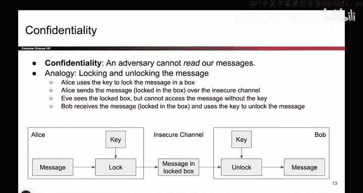
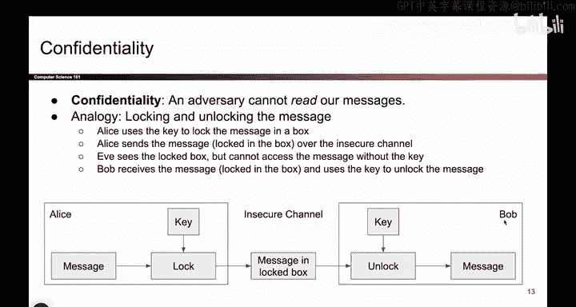
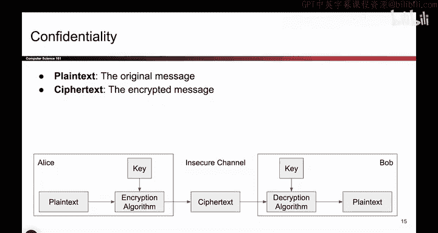

# 080：-Cryptography1, Video 3- Confidentiality, Integrity, Authenticity.zh_en - GPT中英字幕课程资源 - BV1VhEhzMEPL

Okay， earlier we saw confidentiality， integrity and authenticity。

 the three properties that we want from cryptographic systems。

 so now's a good time to go through and see how you actually might implement them。

 so we'll give you a physical analogy and then we'll talk about how it looks like in code。😊。

So remember the definition of confidentiality looks like this。

 adversaries cannot read our secret messages， and one way to achieve this in a physical analogy is to take the message and put it in a box and lock it。

 so that's what Alice is going to do。So remember in the symmetric key model Alice and Bob have a key that nobody else has。

 it's a secret key， the only two copies in the world belong to Alice and to Bob no one else has it so what Alice will do is she will take her message。

 put it in a box and then use a lock operation to take the key and a message。

Put it in the box， use the key to lock the box， and now the message is secured in a box。

Now Alice can send a message across the insecure channel and any attacker such as Eve is not going to be able to open the box。

 Eve doesn't have the key， she cannot open the box。

 and then once Bob gets the message inside the box。

 Bob can use an unlock operation to take his secret key， unlock the box to reveal the message inside。

 so using a physical analogy， this is what it might look like to implement confidentiality and all the secrecy comes again from the keys。

So what this looks like in actual code because you can't have boxes and code is you're going to do something called encrypting messages。

 So instead of a box， what Alice will do is she will take her message and her key。

 those are the two inputs and she'll run them through an encryption algorithm。

 That's a piece of code that takes two arguments， a message and a key and outputs a scrambled up version of the message So this is the same message but using the key weve scrambled it up made it hard for attackers to read。

 So now if Eve sees this scrambled up encrypted message。

 she has no idea what it says she cannot figure out what it says because she doesn't have the key。

And then once Bob receives the encrypted message， he will take the encrypted message and the key。

 those are the two arguments and provide them to a decryption algorithm。

 that's another piece of code and this piece of code will take the encrypted message and the key and spit out the original message so it's kind of like the box thing we were just doing but with actual code。

 the two pieces of code we have to design as cryptography protocol implementers is the encryption algorithm and the decryption algorithm so we fill in those two boxes to build a scheme like this。

What lot of boxes todayね。Okay。And just one more piece of terminology at the risk of overflowing your brains with words。

 the original message before encryption is sometimes called plain text and the message after it has been scrambled up and encrypted is sometimes called cipher textex。

 so if you ever see these words， that's what they need。

Okay， now let's do the second definition。 This one's a little less intuitive。

 but let's go through it anyway。 So now we want to provide integrity and somewhat related authenticity。

 And remember， the property is that the adversary cannot change what the message says without being detected。

 So what we are going to do here is create a seal on the message。

I don't know if people still send letters， but if you send letters。

 you know how you put a seal on it。 It's like a piece of tape that prevents people from opening the envelope and revealing what's inside。

 That's what we're going to do。 So Alice is going to take her message and her secret key and she's going to generate a seal that only Alice could have generated Nobody else could have generated the seal。

 It has Alice's special signature on it， has her own doodle on it， No one else can create this。

And now when Alice sends the message， it has not only the message， but also the seal on it。

 so it's the original message， maybe we place it in an envelope and we put a special piece of tape on it。

 Aliceice tape， nobody else can create Aliceice tape in this analogy。Then Bob receives the message。

 it's in the envelope it has the special Alice tape on it。

 and what Bob can do is he can open the seal to reveal the message。

And you can also check the seal to see if it has been changed or if it's the original Alice tape from before。

 and roughly speaking， the idea here at the risk of creating a very strange metaphor is that if Mallory tries to tamper with this message。

 what you'll have to do is open the message and break the seal and Alice's tape no longer looks。

In its original clean form， so when Bo receives the message you'll be like， oh， this seal is broken。

 someone must have tampered with this message。It is not the best analogy but it is something we came up with。

 roughly speaking， you put a seal on the message and someone trying to tamper with it would have to break the seal。

 and that would reveal to Bob the fact that the message has been changed。

Maybe if people sent letters， this would make more sense， I don't know。Okay。

 let's do it in actual code。So Alice has a message。

 she has a key and instead of generating her own seal with super sacred Alice tape。

 whatever that means， we're going to write an algorithm that creates a tag on this message so we take in a key。

 we take in a message as the two arguments and we should output a tag on that message this is some unique code that identifies that this message came from Alice and you need both the key。

And the message to come up with it。 And then we send this message with the tag。

 you need both the message and the tag over the insecure channel and the message in the tag reaches Bob。

 So Bob already has the message is right there， but additionally。

 Bob can use the tag and his own secret key possibly to check if the tag has been tampered with So this piece of code that we have to write takes in two arguments。

 the key and the tag and it outputs either true or false。

 Was this message tampered with or was it the original untampered message。

 So we have to write two algorithms one creates the tag and one checks the tag to see if it has been tampered with or if it's still valid we'll talk about this in lael。

 we talk about integrity， but as a bit of a preview。

 the algorithms that try to ensure integrity all take a shape like this。

Were going we cray tags and we check them。

