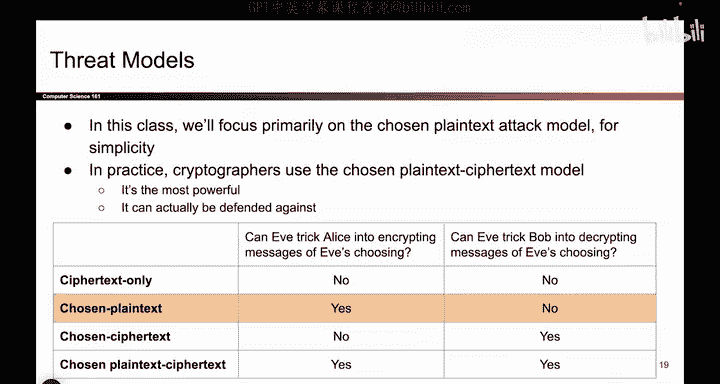
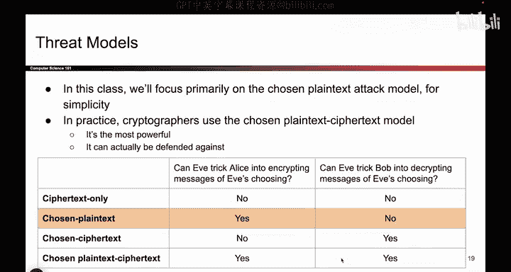
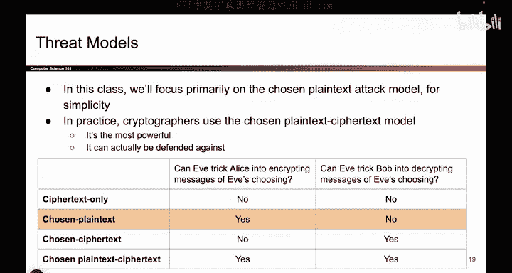
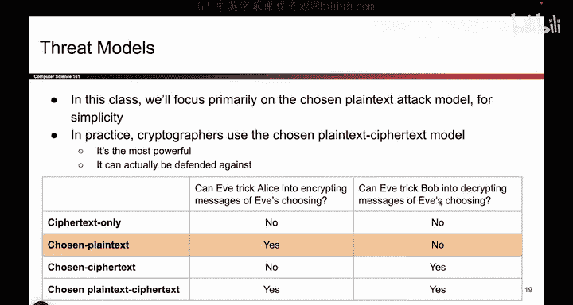

# 081：-Cryptography1, Video 4- Threat Models (Chosen-Plaintext Attack).zh_en - GPT中英字幕课程资源 - BV1VhEhzMEPL

Okay let's talk about threat models so far we've talked about our villains。

 Eve and Mallory and we've said Eve is able to eavesroprop on messages and Mallory is able to listen on messages and also change them。

 tamper with them。Those might not be the only things that even Mallory can do。

 maybe even Mallory have more powers that we don't know about and so if it's the case that even Mallory have more powers。

 we have to develop new threat models to account for the fact that even Mallory can do more things than just Eavesdrop and remember the reason why we're doing this is not because even Mallory are real people who can come and attack us。

They're all fictional， the reason why even Mallory are being used is because we are trying to model real world attackers in other words。

 even Mallory are fictional characters， but we're trying to use them to model attackers that really do exist in real life and because real life attackers can do more things besides eavesdropping and tampering with messages。

We might also sometimes want to give Eve and Mallory our fictional characters some more powers so that they more accurately represent these sophisticated attackers that you can encounter in real life。

So at least for this class， we're going to look at four different models that we can use to give even Mallory different abilities。

Depending on what you think is happening in real life。

 you can choose the model that's most appropriate for your system。

 So here we're going to look at threat models for confidentiality in particular。

 so we'll think about encrypting and decrypting we'll come back to integrity later。

 So let's think about Eve the eavesdper and possibly giving her extra powers So the two extra powers that we can convert to Eve depending on our threat model are these two One is can Eve trick Alice into encrypting messages that she chooses so can Eve walk up to Alice and say I really want you to encrypt potato with your key。

 And if Alice can get tricked into faithfully encrypting the word potato using Alice's sacred key then we say Eve has this ability she can trick Alice into encrypting any message she wants。

And on the other side， can Eve trick Bob into decrypting messages so can Eve walk up to Bob and say here's the sequence of ones and zeros can you use your key to decrypt this for me and if Eve is able to trick Bob into doing this then we say Eve has the second power So those are the two things that Eve might be able to do and we have all four combinations here each one has a term if Eve is able to do neither of these things she is only able to eavesrop we call that the ciphertt only model for reasons that will probably become more clear later。

If Eve is able to encrypt her own messages， that is trick Alice into using her key to encrypt messages。

 but she cannot trick Bob into decrypting messages， that's called chosen plain text。

 if you have the other combination where she cannot encrypt。

 but she can decrypt we call that chosen cipher textex， and if she can do both。

 she can trick Alice into encrypting messages of her choice。

 she can trick Bob into decrypting messages that's called chosen plain text， cipher textex。

 it is the most powerful of the four models。So for this class。

 we are just going to focus on one of them， we'll think about chosen plain text。

 which means that Eve is able to trick Alice into encrypting messages using Alice's sacred key。

 so Eve doesn't know the key， but she's going to trick Alice into using her key to help out Eve。

But she cannot trick Bob into decrypttic messages。 That's what we're going to use In practice。

 it is actually commonplace to use this last one， the most powerful one because it models the most powerful attackers。

 So if you can defend against that fourth one， the most powerful one。

 you must have a pretty good cryptographic protocol。

 So real life crypttographers often target the most powerful one to try and stop as many attackers as possible。

 But for this class we'll stick to this one。

And at the risk of overloading you too much。 One final foot notice， when you're decrypting messages。

 you cannot decrypt the。

Should I see that， and I'll say it real quick， If you trick Bob into decrypting messages。

 you can't trick Bob into decrypting the thing you encrypted that would defeat the whole point。

Very minor footnote。

