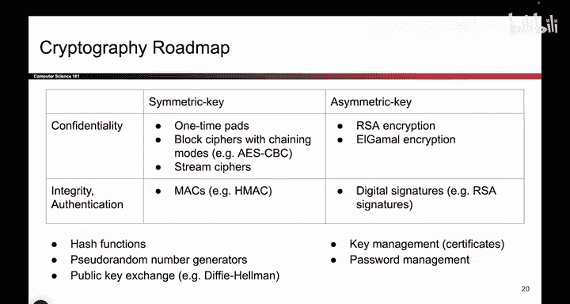
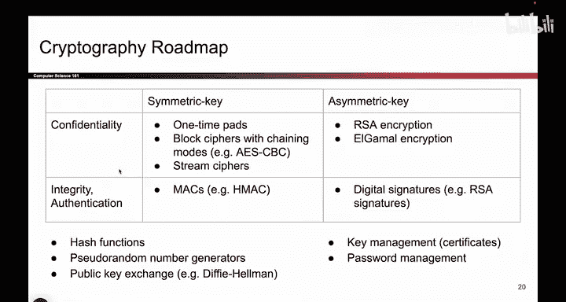
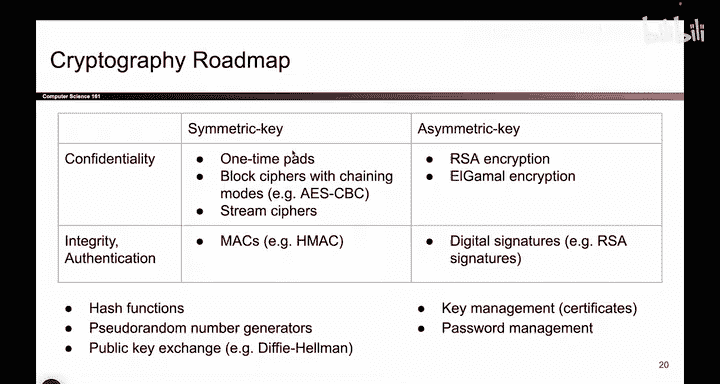
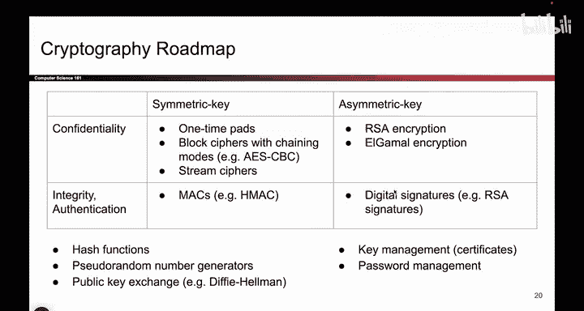
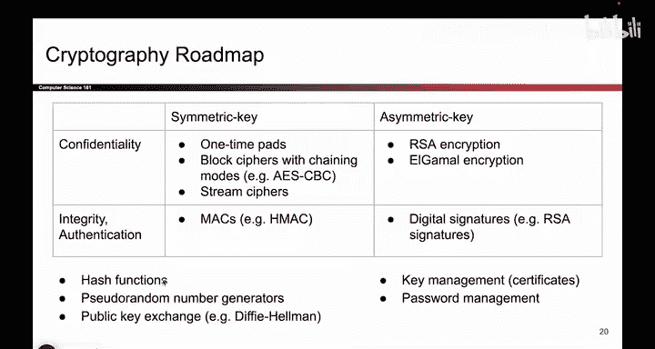

# 082：-Cryptography1, Video 5- Roadmap.zh_en - GPT中英字幕课程资源 - BV1VhEhzMEPL

Okay， it's your first view of the cryptography roadmap。

 You're going to get so sick of this after a while。

 This picture shows us the four different combinations of cryptographic schemes we can come up with So on one axis we asked the question is the scheme that we're currently designing a symmetric key scheme or an asymmetric key scheme I it the case that Alice and Bob share a secret key that no one else knows or is it the case that Alice and Bob and everyone else all have a private public key pair。

😊。

Depending on which one you choose， you fall into one of these two columns。

And then the second question you ask about your scheme is does it provide confidentiality or does it provide integrity and authentication。

 Most of our schemes will provide one or the other。

 but not both and if you want both you'd have to combine a bunch of these So depending on whether your scheme tries to offer confidentiality or integrity slash authentication you will fall into one of these two rows and we'll actually spend time at all four quadrants of this table we'll think about first symmetric key schemes that provide confidentiality and then we will move to symmetric schemes that provide integrity and then asymmetric key that provides confidentiality and then asymmetric key that provides integrity that was a mouthful and along the way we'll see some other additional helping tools that we will use to build these schemes So for example later you'll see that this scheme right here。

 the Hmac actually relies on something called a hash function which we'll talk about a lot and more on those later But for now just note that this is。

Roughly the roadmap of the things we will be seeing， lots of protocols and schemes。

We'll look at each one in detail。

