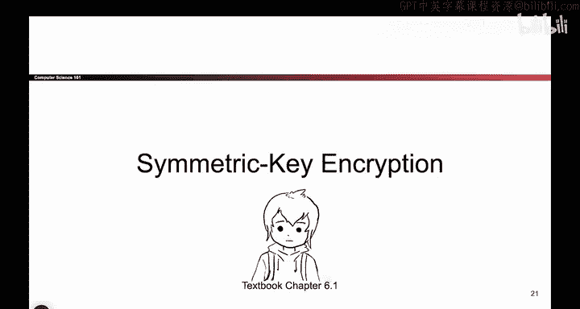

# 083：-Cryptography1, Video 6- Symmetric-Key Encryption.zh_en - GPT中英字幕课程资源 - BV1VhEhzMEPL

Okay， so the first type of encryption。And cryptography schemes that we will look at is something called symmetric key encryption。

So if you go back to the cryptography roadmap， we are in the top left quadrant of this picture。

We're going to be working in the symmetric key model and for now we will just focus on providing confidentiality and not integrity or authentication。

So these games are symmetric key encryption schemes if we break down both of these words。

 encryption means we care about confidentiality， not necessarily about integrity or authentication。

 symmetric key means that Alice and Bob share the same secret key， Alice knows it， Bob knows it。

 nobody else knows it。And for now， we will not think about how they get such a shared key。

 you can assume the cryptography gods have come down from above and blessed Alice and Bob with a shared key。

 and later we will see how they actually come up with such a key。Also。

 for this section of our cryptography unit， we will assume that all the messages are represented as bit strings。

 which is a long sequence of ones and zeros。 And this is a reasonable assumption to make because any sort of data that you want to send。

 whether it's text， image， video， It can always be encoded into a bunch of ones and zeros before you encrypted。

 So we don't care what the user is encoding， we will just treat it as some arbitrary sequence of ones and zeros。

 and our goal is just to get that sequence securely across the channel。

So as a reminder for what the definition of symmetric key encryption looks like and what we are trying to design in this section。

 we want to fill in these two boxes， we want to design an encryption algorithm and a decryption algorithm。

 the encryption algorithm takes in two arguments， K， the key， and M， the plain text。

 and it should output the cipher text， which is a scrambled up version of the plain text that the attacker cannot read。

And the other algorithm we have to design is the decryption algorithm。

 this one should take in the key and the cipher textex and this should output the plain text。

 the original unscrambled message， so our job is the designers of cryptographic schemes is to fill in these two boxes and that will give us a scheme that users can use sometimes people also define the key generation scheme which says how Alice and Bob come up with these two keys to begin with。

 but for today we will assume they've been blessed with the secret key that no one else knows so we will focus our attention on the encryption and decryption。

So these are the things we have to design， but what are the properties we want from the encryption and decryption algorithms。

 so I can think of three that we care about。 One is it should actually work。

And what I mean by that is if you take a message and encrypt it with some key。

AndThen Bob decryptps it with the same key， you should probably get the original message back。

 it would be very silly if Bob decrypt the cipher textex and got a different message back。

 So in math， this is the expression you would write， but it just says regardless of what key you use。

 if you encrypt a message and then you decrypt it with the same key。

 you ought to get the original plain text back。Something else we care about is efficiency。

 we're not really going to do any mathematical analysis of this。

 but we do want these algorithms to be reasonably fast so that users will actually use it so remember consider human factors if we build encryption and decryption algorithms that are horrifically slow users are just not going to use it so we need some level of efficiency。

 we won't define it too carefully， but we can't build things that are absurdly slow users just won't use it。

And finally we want some security and we already said the definition here is confidentiality。

 attackers in the insecure channel who do not know the secret key should not be able to figure out what the plain text is。

 so those are the three properties that will make a good encryption scheme。

