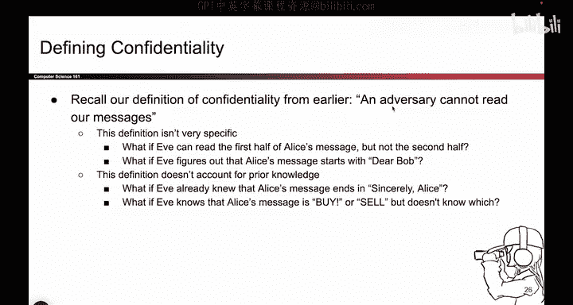
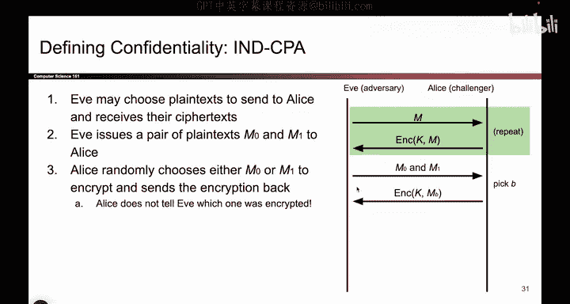

# 084：-Cryptography1, Video 7- IND-CPA Security Game.zh_en - GPT中英字幕课程资源 - BV1VhEhzMEPL

Okay， one minor problem with our definitions our definition of security is actually kind of vague。

 so remember our definition from confidentiality is an adversary cannot read our messages but this already opens us up to a lot of edge cases。

 for example， what if Eve can read only half of the message。

 does that count as reading your message or not reading your message？

WhatveWhat about a case where Eve can figure out the first two words of the message。

 does that count as reading the message， it's not so clear。What if Eve knew something beforehand。

 Maybe she already knew the last two words of the message。

 maybe she knew that the message came from some finite set of possible messages。

 She just doesn't know which of the messages was being sent。

 All of these are cases that our definition doesn't really cover。

 so we need a more formal mathematical definition to answer some of these questions。

So that's what we're going to design next， before we design any schemes。

 we're going to come up with a better， more mathematically sound definition of confidentiality。

 and it reads like this。The attacker should not be able to learn any additional information about the plain text beyond what they already knew。

 So this accounts for prior knowledge because we say if you already knew something， it doesn't count。

 And this says they cannot learn any additional information。 If they learn one word， it's no good。

 If they learn half of the message， it's not secure。

 They have to be unable to learn any additional information。

And that's the definition we're going to use。And to actually test if a scheme matches this definition and provides confidentiality。

We're going to model this definition as something called a security game， so here it ist words。

 I won't read it because I'll show it to you in pictures， so let's do that next。

So we're going to play a security game to demonstrate whether or not the scheme provides confidentiality。

 And also， in our definition， we should also throw in the threat model that we talked about before。

 because remember。It's not just the case that Eve is able to read messages across the Insecure channel。

 If you remember our various threat models。 we sent that in this class。

 we will assume that Eve is also able to trick Alice into encrypting arbitrary messages。

 So Eve is able to walk up to Alice and say， here's a message。

 Can you use your key to encrypt this for me。 Alice will use the key encrypt it and give it back to Eve。

 So our experiment and our definition should also account for this threat model because this is the type of attacker that we care about。

 So the total definition to sum it all up and we'll see it in game form in one slide is even if Eve is able to have this extra power。

 She's able to trick Alice into encrypting messages。

 She still can't learn any additional information beyond what she already knew。😊。

So to restate it one more time， Eve has this special power。

 She can trick Alice into encrypting messages。 But even if you confer this extra power to Eve。

 she is still not able to learn any additional information beyond the things that she already knew。

 And if you put that really long sentence together。

 You get a definition called end CPA stands for those words。

 And that's the definition we're going to use for confidentiality in this class。

 But that's a lot of words to parse。 So we're going to frame it in terms of a security game。

 And that's going to let us think about this in a more intuitive way。 hopefully。😊，So here's the game。

 It's a gameplay between two people。 Eve and Alice。 And one of them is going to win。 And the idea is。

 if Eve is winning most of the time， that's a signal that the scheme is insecure。

 because Eve is winning and able to learn something about the messages。 By contrast。

 if Alice is winning most of the time， That means that the scheme is secure because Eve is losing。

 She is not able to learn things about the message。

 So that's going to be the focus of our security game。

 we're going to frame it as a game between Eve and Alice， we're going to see who wins more often。

 And depending on who wins more often， that's going to tell us whether or not our scheme is secure。

 Eve winning means the scheme is not secure。 Alice winning means the game is secure。

So here's how the game works and then we'll go back and reflect on why we built the game this way。

 So the very first step of the game is giving Eve the ability to use her extra power。

 So remember Eve has the power to send any message she wants here we say to Alice and Alice will faithfully take the key encrypt the message and send the cipher text back to Eve and she can do this as many times as she wants that's her power that she gets to use So before the game really begins and the very first step we allow Eve to exercise her power a little bit and the intuition here is Eve might try to use this to learn something about the scheme maybe this leaks some information about the key that Alice is using or gives Eve a clue as to what she should be looking for So this is Eve using her power to try and dig around and see what the scheme is doing。

That's the very first step， it's Eve using her power to encrypt any message that she wants。

And here comes the actual challenge。 So eventually Eve gets tired of sending messages and encrypting them。

 she gets pretty confident， and she says， I think I know how to break your scheme Alice。

 So Eve is ready to take on the challenge。 the challenge of trying to break this scheme。

 So this is how we're going to frame it and we'll see later why this is a good framing。

 So Eve is going to choose her own two plain text M0 and M1。

 she can choose what these are and she sends them over to Alice。 So as an example。

 let's come up with some words。😊，Anyone have two words that they can。Provideed。Dog。Cat， great。

 So Eve chooses two plain text just like that。 She's a dog and cat could be any two words that she wants or any two bit strings。

 And she sends those two words over to Alice。 That's the first step of the challenge。 Now。

 what Alice does is she turns around。 She can't see Alice， she flips the coin。 And if it turns heads。

 she encrypts M0， which was dog。 And if it turns up tails， she encrypts M1， which was cat。 Now。

 Eve doesn't know which one Alice chose。 So Eve。😊，Doesn't know。

 but Alice chooses one of M0 and M1 at random using a coin flip and she encrypts that message and sends it back to Eve。

 So at this point， Eve has received something。 It's either the encryption of dog or the encryption of cat and Eve doesn't know which one was encrypted。

 And this is Eve's challenge is to figure out which one was encrypted before Eve has to commit to a guess。

 let's give Eve a second chance to exercise her powers。 So at this point。

 now that Eve has received the encryption of one of the two messages。

 if she wants to exercise of power just a little bit more。 we' give her a second chance。

 maybe she wants to send some more messages。 Alice will faithfully encrypt them and she'll see the resulting encryption So we'll give Eve a little bit more time to play with her power and trick Alice into encrypting things and eventually Eve gets tired of this guessing game again and she says I'm ready to answer the challenge。

And the challenge is， what was this message， Was it the encryption of dog or was it the encryption of cat Eve has to make a guess。

 So Eve's final step to fulfill this challenge is to say you encrypted dog or you encrypted cat。

 And if Eve guesses right， then she's the winner because she learned something about the scheme in the process of this game that allowed her to guess whether or not dog or cat was encrypted。

By contrast， if Eve is guessing wrong all the time。

 that's a sign that Alicelas is the winner here because this scheme is secure， and Eve。

 just by looking at this encryption and possibly using her power。

 has no way of telling whether this was the encryption of cat or dog。So to restate that。

 Eve is the winner if she can reliably guess whether this was the encryption of cat or dog。

 if she plays this game over and over。And Alice is the winner if Eve is not able to guess whether or not this is cat or dog So this is the definition of the game and you'll notice that this incorporates all the things we talked about in our definition of confidentiality So our definition said Eve has an extra power that's what these two blocks in green are This game gives Eve that power because our definition assumed that Eve has the power to trick Alice into encrypting things and right here we've encoded the fact that Eve should not be able to learn any additional information about the plain text besides what she already knows So here we are making it very explicit what Eve knows what does Eve know she knows is either dog or cat because she chose dog she chose cat So we're making it very explicit that Eve knows its dog or its cat that is her prior knowledge and the goal is can she learn any additional information to distinguish dog versus cat or as she completely unable to guess。

This game by framing it in this very specific way， achieves the definition we talked about。

 even if we give Eve an additional power of performing chosen plain text attacks。

 she is unable to learn any additional information to deduce dog versus cat beyond what she already knew。

 which was that it was either dog or cat， that's what all of these words say。

