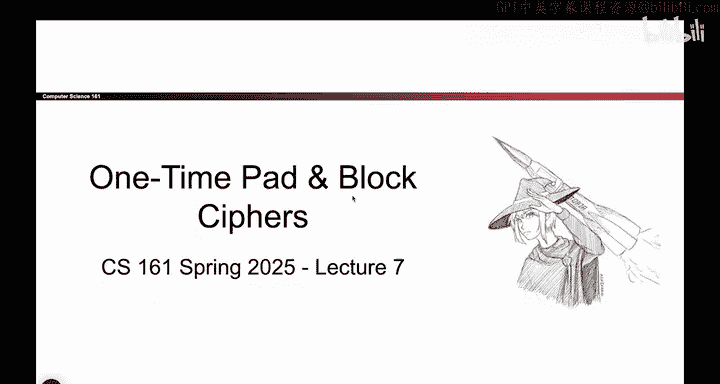
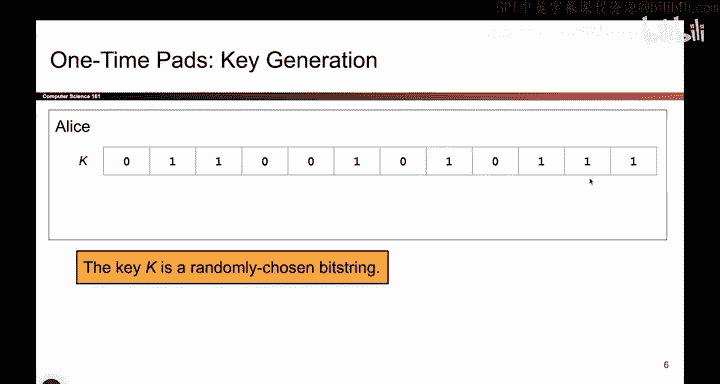
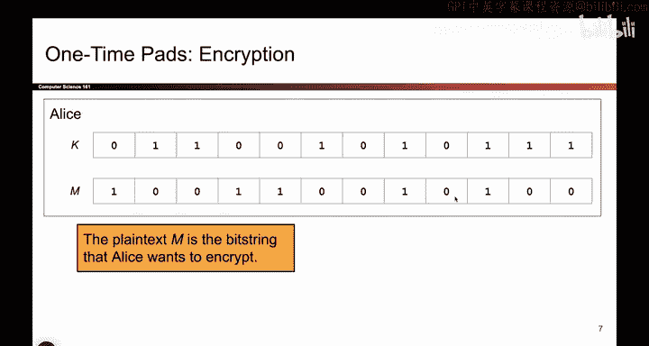
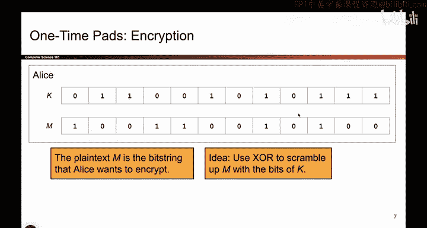
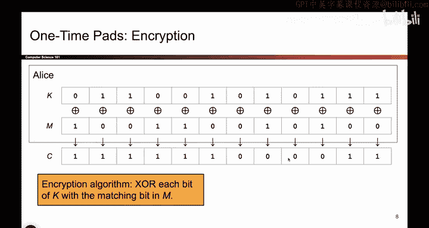
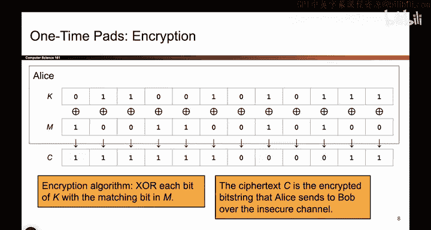
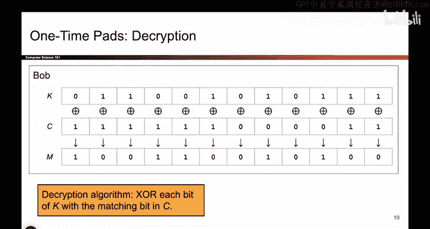
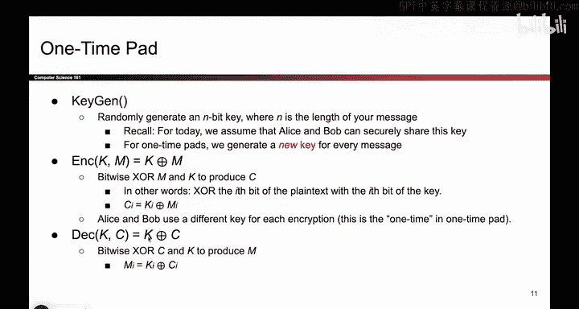

# 092：-Cryptography2, Video 1- One-Time Pad Definition.zh_en - GPT中英字幕课程资源 - BV1VhEhzMEPL

Okay， in this lecture we will continue our journey through cryptography。

 by talking about the one time pad followed by block ciphers。

 So there's two things we'll be talking about。 So let's start with one time pads。

 They're the first encryption decryption scheme that you will see。

 and before we do so just as a reminder， if you look at our roadmap we're still in this top left square。

 We're looking at schemes that specifically provide confidentiality and we're doing so in the symmetric key。

Paradm， which means that Alice and Bob have a shared key that no one else knows。

 So we will now see one of many possible schemes you can design that are symmetric key and offer confidentiality。

Before we can tell you about the one time pad， I have to remind you about a bitwise operation called Xor。

 It takes in two bit。 It outputs one bit， specifically it outputs 0。

 if the two inputs are the same and one， if the two inputs are different。

 Here are some useful properties。 I won't say them all out loud。

 but one particularly useful one is this last one here where if you have some value x x or y and you xor that again with x。

 well what happens is you can think of these two x's as canceling out if you take a bit and xort it with itself。

 it gets0 and if you take0 and xor with anything that bit stays unchanged So all of that is to say this handy property at the bottom where if you take some value that's two bits xor together and you xhor it by one of the bits that bit cancels out and you're just left with Y That's a handy property that will come into use later。

 so keep that in the back of your heads。

And by the way， you can also do algebra with XO so for example。

 we have this equation and there's an unknown y and I want to solve for it。

 so all you have to do is xor both sides by 1，1 x or 1 is0 that cancels out。

0 x or1 is1 and you're done and you get y is equal to1 this case was pretty simple but you can do this on more complicated equations as well so this is all just a review on how xor works in case you haven't seen it before。

😊。

Okay， now that we know what Xor is， let's see what the one time pad does。

 The first thing we need to do is generate keys。 Alice and Bob both need to be blessed with the secret key that no one else knows。

😊，So all we have to do is flip a bunch of coins， get to a bunch of random ones and zeros。

 and that's going to be our key。 So remember last time when we saw the Caesar cipher。

 the key was a number between1 and 26 or the substitution cipher。

 the key was some mapping of letters Well in this case the key happens to be a randomly chosen Biing。

 it's a bunch of ones and zeros where you flip coins and get ones and zeros。 Alls knows it。

 Bob knows it nobody else knows it。😊。

So how do you encrypt something， Remember the encryption function。Takes in two arguments。

 the key and the message were plain text。 and it outputs one thing， which is the cipher textex。

 And the algorithm。 All you have to do is use Xor to scramble up the bits of M。

 and the secrecy comes from the key K。 So it works kind of like you'd expect。

 You take an Xor of every bit of the message。 So here's our message， Here's our key。

 And if you want the corresponding cipher textex for every bit。

 you take that key bit and that message bit and you exor them。

 and you get the corresponding cipher textext bit， do this ones for every single input bit and every single key bit。

 and you get the corresponding cipher textex。 And the intuition here is that this cipher text is pretty scrambled up。

 Someone who doesn't know the key has no idea what the original message was。

 they just see these scrambled up bits。 So that's how you encrypt。😊。

And then the Cypher textex gets sent over the insecure channel all the way to Bob。

 along the way attackers can't read this scrambled up cipher text。

So how do you decrypt What does Bob take in the decryption function he takes in two arguments。

 the same key from before and the cipher textex， which is what Bob just received。

 and our decryption algorithm has to do some math between these two inputs in order to output the original message。

 So it takes in two inputs， outputs the original message。

 So it turns out all you have to do is do another bitwise Xort， Take the bits of the key。

 the bits of the ciphertex Xort each corresponding bit and the resulting output is the original plain text again。

 So this is how Bob decryptps the message。

And that's it for the one time pad definition。

So here it is in text， the key generation is to randomly generate a key。

 one thing that is different from later schemes that we will see is that you need a different key for every message so every time you want to encrypt something。

 Alice and Boby to come back to this algorithm and regenerate a new key that has not been used before this is only true for one- time pads for reasons that will become clear later here's the encryption algorithm you just take the two inputs and bitwise Xor them and how do you decrypt your bitwise X or the two inputs as well。

