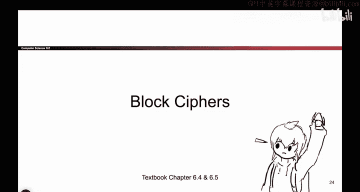
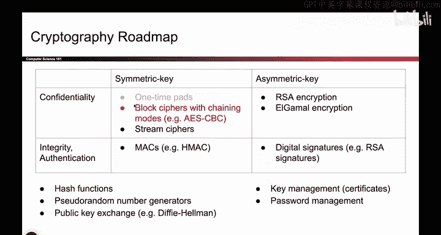

# 095：-Cryptography2, Video 4- Block Cipher Definition.zh_en - GPT中英字幕课程资源 - BV1VhEhzMEPL

Okay， so at this point， we have seen one time pads and how they work and why they are impractical。

 So we need to go searching for something that computers can actually implement that don't have the problems that one time pads do。

 As a reminder， were still in the top left square， So we're still doing symmetric key schemes that provide confidentiality。

 but we are throwing away one time pads and trying something a little bit different this time。

So we're going to try to design something called a block cipher。😡。

So let me give you the definition and then we'll talk about why it's useful。

 So the block ser looks like this。 It's kind of like all the other encryption schemes you've seen so far。

 It takes in two arguments， a key， there's K， and a message， there is Z。And it outputs some string。

 That's the cipher textex。 And the way that this function is implemented for now。

 think of it like drawing arrows on a grid。 So the way that I would define this function is I would write out all the possible messages and all the possible cipher text and then I would draw arrows showing which plain text maps to which ciphertex。

 So for example， if I want to encrypt 01， this arrow tells me that it encrypts to 0，0。

 And if I want to encrypt the bit string 10， this arrow tells me that the corresponding cipher textex is11。

😊，So the way that I think about this and the reason why I've put this K as a little subscript here is I think of block cphers as a family of functions。

 So it's in reality， you can think of it two different ways。

 you can think of it as a function that takes in two arguments。

 a key and a message and it outputs some cipher textex just like any other encryption scheme that we've seen。

 but another useful way to think about block ciphers is think of it like a family of functions。

 So one big family and there's lots of different pictures that all look like this where there's arrows mapping inputs to outputs And the way that you pick one exact function out of the big family is you fix K。

😊，That's why it's a subscript。 So as soon as you pick K。

 you have committed yourself to one of many possible functions in this family。

 So let's say you go here and you set this equal to one。 Aliceice and Bob are using the key1。

 So then what that means is in that big family of functions pick up the first one。

 and maybe the first one looks like this and map 0。

0 to 01 and11 to 10 and so on and so forth for every possible message this particular function tells you that corresponding output。

 That's why people call it a permutation for each input you get one of the outputs。

 So that's how I think of this it's a big family of functions。

 if I wrote out all of the possible e sub k of M， I would get this diagram repeat it once for every single key。

 But as soon as you pick one key， like you say K is equal to2。

 then what happens is all the other possible disappear and you're just left with one of these pictures because if k is fixed to two。

 then there's only one input， that's the message。This stuff right here。 And there's one output。

 that's the cipher text。 So as soon as you pick a K， all the other permutations are discarded。

 and you've committed yourself to using one。 And because you've already fixed K。

 this is a function with one input。 The message and one output。

 the cipher text and the arrows tell you which one is which。 That's what a block cpher is。

 It's a big family of functions all under the name E。😊，But once you pick a K， it narrows down to one。

 and the way I draw it is with a bunch of arrows。So now that we know what the block cipher is。

 we should ask ourselves whether or not it's correct。 So turns out some block c ciphers are correct。

 some or not it depends on how you implement E and how you draw these arrows。

 So let me give you one example of a block cipher that works and one that doesn't work。

 So this block cipher on the left would not be valid。

 So if this was e sub5 of M or something that particular E is not going to work。

 This is a block cipher that doesn't work and to see why let's say you encrypt 10。

 So then what you should do is you should follow the arrow you get11。

And now let's say Bob needs to decrypt the message。

 so Bob knows the key and so because he knows the key he knows which one of these diagrams we're using。

 we're using this one。 remember there's a big family of them。

 if Alice and Bob know that K is5 we must be using this particular one so Bob knows this picture and he receives the message 11 and he has to decrypt it。

But what does one went decrypttu according to this picture？

Does it decrypt to 10 Does it decrypt to 11， It's not so clear。 Both of those would be valid choices。

 So in this picture， this particular block cipher doesn't work because when Bob receives11。

 it is not clear if it decryptps to 10 or 11 Both would be valid plain texts So what we call this is a function that's not by ejective。

 There are two inputs that encode to the same output。

 the arrows point at the same output and it's impossible to go backwards to a unique input so this is a case where Bob is not able to uniquely decode so when we build block ciyphers。

 we have to be very careful to not draw any pictures that look like this。 It will not work。

By contrast， here is a bijective permutation that does work because every arrow points to exactly one output。

 so now if Bob receives 11， he can uniquely decrypt it back to 10 or if he receives 10。

 he can uniquely decrypt it back to 11 so the one on the right is what we want and a valid block cipher should be designed so that every possible mapping。

The one for k equals 1， the one for k equals 2， the one for k equals 1000。

 all of them should be pictures that look like this。

And one final thing I should mention is block ss are defined on a fixed input length。

 so here I said n equals 2， that's why each of these pictures has two bit inputs and two bit outputs and if n was say 30。

 you'd have to draw two to the 30 inputs， two to the 30 outputs and map them for every possible key。

So that's what a B effort is， it's a big family of functions。One for every key。 Once you pick a key。

 you narrow it down to one particular diagram。 and that diagram shows you all of the em bit inputs。

 all of the em bit outputs with arrows between them。 And hopefully， the arrows are bijective。😊。

And one final thing I should mention is that in reality， when you design these things。

 because someone has to write the code for E， you don't actually write out these arrows。

 you'd write a piece of code that generates these arrows for each key。But I think intuitively。

 thinking about the arrows can help you a little bit， but do know that in real life。

 no one is writing out two to the 30 columns in a big table。

 What they're actually doing is writing a piece of code that can be used to generate those tables on demand。

Okay here again is the block Cypher definition， but with a little bit more math。

 so once again we see the encryption function， it's a piece of code that someone writes it takes in an n bit plain text and a K bit key and it outputs an n bit cipher text where N and K are both fixed values that you decide ahead of time So just like our other encryption schemes it takes in plain text key outputs a cipher text the lengths are all fixed and the decryption function does what we expect it's a piece of code that someone writes takes in a cipher text and a key and an outputs the corresponding plain text and if you open up the E or you open up the D and you look inside it's really a piece of code but what I think about that code doing is you can think of this little box holding all of those tables with arrows showing how each n bit input maps to an n bit output。

 there's one table for every key and as soon as you fix a key and you say Aliceice and Bob are using key number 12 and they're using key number。

For， you've narrowed it down to that one particular mapping。

A little bit of math that you might see sometimes， this is just notation that says K bit input。

 M bit input and M bit output， not the most important thing here， but sometimes you see that。

So some properties of block ciphers that are hopefully correct， one is correctness。

 and as we talked about before， correctness means that the encryption function needs to be a permutation。

 each arrow has to point to exactly one output and this has to be true for all the arrows inside that box。

 efficiency， hopefully this thing performs relatively quickly so people want to use it and we'll talk about security coming up next。

 but this is the definition of block ciphers and how they work。

