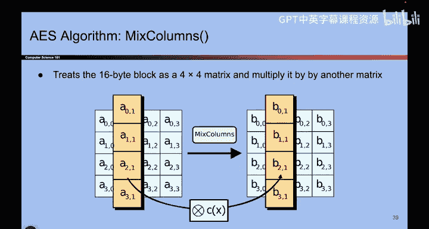
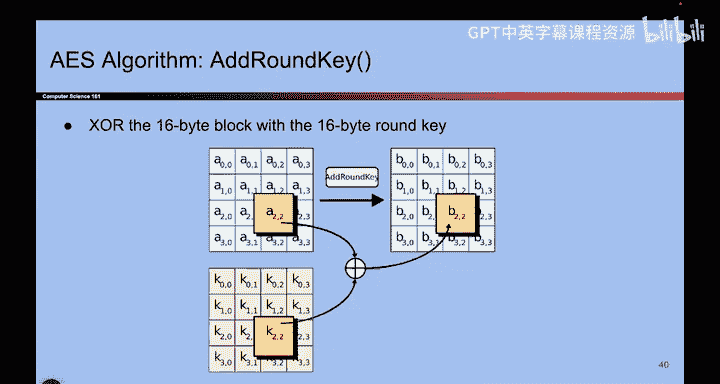

# 099：-Cryptography2, Video 8- Block Cipher Implementation and Issues.zh_en - GPT中英字幕课程资源 - BV1VhEhzMEPL

O。So to wrap up what we've talked about for block cipher first。

 this is what is actually used in real life。 It's something called Aes。

 and it uses the underlying Rel algorithm， it could have used two fish。

 if they liked David Wner's design more， but they used AE。 There are different key sizes you can use。

 So there's actually different pieces of code depending on the size of the key。

 there's Aes 128 Aes 192 and Aes 256。 and each one works roughly the same in that once you pick a key。

 it gives you a mapping， but the input key size is different nowadays， most people used 256。

 because it's the largest and hardest to brute force。 But even if you used 128。

 it would be absurdly hard to brute force。 The block size is usually 128 bits all of the time。

 So what that means is that N is 128。 Once you pick a specific key。

 you get a mapping of all 128 bit inputs to all。1，28 B outputs， and there are2 to the 1。

28 arrows dropped in that diagram。 Now， we don't really draw the diagram。

 We use code to come up with which arrows point where。 But that's the idea。

 It's a mapping of 2 to the 1，28 inputs，2，2 to the 1，28 outputs。

And you don't need to know what's going on inside AES。

 besides that it's doing a bunch of bit shuffling， but you do need to know what the inputs are and that these are usually the commonly accepted sizes。

 And this is actually what people use in real life too。

If you really want to know what's going on inside， we have some extra slides here that I'm not going to say out loud。

 But what you can already see is that it's doing a lot of bit shifting things that computers like to do。

 like subtracting， shifting。Mixing the columns around， moving data around， swapping bytes。

 So it's doing all this shuffling。 But the ultimate behavior is like we presented。

 It's a permutation where every input corresponds to exactly one output。

 But which output is unknown to the attacker。 It looks like a bunch of random arrows were dropped in。

 Here's more shifting， Here's more mixing。 So it does a lot of。

Mixing around to scramble up the input so that the attacker doesn't know what was presented。 Okay。

 here's more shifting。 It's a long algorithm。

So don't need to know what the algorithm is， just that it does a lot of shifting。

And it turns out has anyone actually proven that AES behaves like a random permutation。

 has anyone actually gone and proven that Eve could not tell which box was which The answer is actually no。

 nobody has actually proven that Eve is unable to tell the two boxes apart。

 there maybe is some attack where Eve is able to tell that one of these boxes came from AES because maybe they examined the code really carefully and they realize that the code generates this set of arrows more commonly than this set of arrows but as far as we know it's been 20 years and nobody has broken it。

 So it's as good as secure。 So even though there is no proof。Basically， everyone uses it。

 banks use it， the US government uses it， you use it。

 So this is the modern standard for what everyone uses as a block cipher algorithm。

So before we totally leave block Cyyphers altogether。

 let's talk about why we don't stop here and declare victory and say that we're done designing cryptographic scheme。

 The reason why we don't stop here is because of some problems that we've already seen One problem that is very big is that block Cyyphers are not in CP secure。

 they do behave like random which means that attackers don't know where the arrows are but because you use the same key to encrypt messages many times they are not in CP secure。

 They are deterministic for the attack that we just saw before where you ask me to encrypt the same thing twice and I get the same output So intuitively it's not secure because you as an attacker can detect when someone is sending a message twice if Alice sends a lot of messages and you notice two of the cpher text are the same you now have a clue that Alice sent whatever that thing was twice。

 you learned information that you were not supposed to know and the NCPA game reflects that model that you don't want that to happen。

By forcing Alice to lose in scenarios where the scheme is deterministic。

 So the game reflects the reality。 we don't want people learning if things are encrypted twice。

 So block cphers are not in CP secure。 We need to go finding something better that is ID CPPA secure。

 And the second problem that weve sort of hinted at。

 but we haven't really solved is that the input and output are fixed size。 So in fact。

 AE in real life can only encrypt 128 bit messages。 If your message is shorter。

 you cannot pass it into the algorithm， it doesn't understand your input。

 And if your input is too long， you can't pass it into the algorithm。

 it doesn't understand your input。 All of that bit shifting and mixing that you saw it just doesn't work。

 if the input is not 128 bit exactly。 So if you want to encrypt things that are longer or shorter。

 you can't use block cphers。 So there are two big problems。 One is security。

1 is usability and to solve them， we're actually going。

To use block Saers as a building block to build something even better that will be N CPA secure and will solve these problems。

 So that's coming up next。