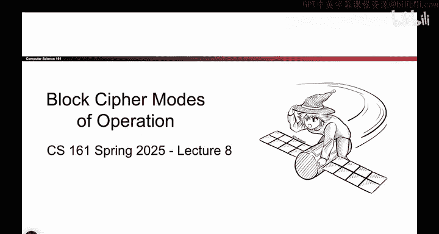

# 101：-Cryptography3, Video 1- Block Cipher Recap.zh_en - GPT中英字幕课程资源 - BV1VhEhzMEPL

Okay， today is all about block cipher modes of operation。

So quick recap of what we talked about last time。 we saw our very first encryption scheme。

 namely the onetime pad。 And remember in the symmetric encryption assumptions。

 we said Alice and Bob share a secret key that no one else knows。

 encryption was bitwise Xor the encryptption was also a bitwise Xor。 if we use a different key。

 every single time。 this game is secure， but using a different key every single time is impractical So that brought us to the next idea which was a block cipher。

 and a block cipher takes in a K bit key and an M bit plain text and outputs an M bit cipher text。

 And I think of it like K tells me which of the mappings of plain text to cipher textex that I want。

 So I have all these different mappings of plain text to cipher text  one per key。

And then once I choose one， that gives me a mapping of all the plain text to cipher text for that particular key and to encrypt。

 I just map the plain text to the cipher text and to decrypt。

 I map the cipher text back to the plane text for this to be correct。

 those arrows that you draw have to form a byjection。

 each plane text should correspond to exactly one cipher text。

 And we said that a block cipher is defined to be secure， if it looks like a random permutation。

 So if I give an attacker of permutation where all the arrows are drawn at random and I give them a permutation where the arrows were run through the block cipher code with the particular key that's unknown to the attacker the attacker doesn't know which one came from the block cipher and which one was drawn at random。

 that's how you know if a block cipher is secure。 That's the definition that we used。

 We said that it's relatively efficient。 It's lots of xors and bitshifting computers like to do those the modern standard is something called AE。

 That's the actual code that you run。But we couldn't stop here because of two major problems。

 One being that the block cipher is not I N D CPPA secure。

 It doesn't match that particular definition of confidentiality because it's deterministic and it's limited to encrypting messages that are exactly M bits long。

 So today， we're going to build something。Even better that hopefully solves those two issues。

