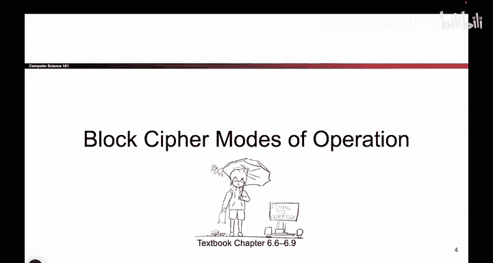
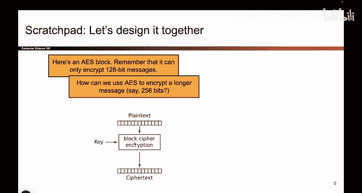
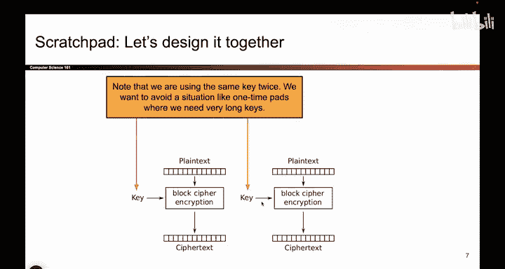
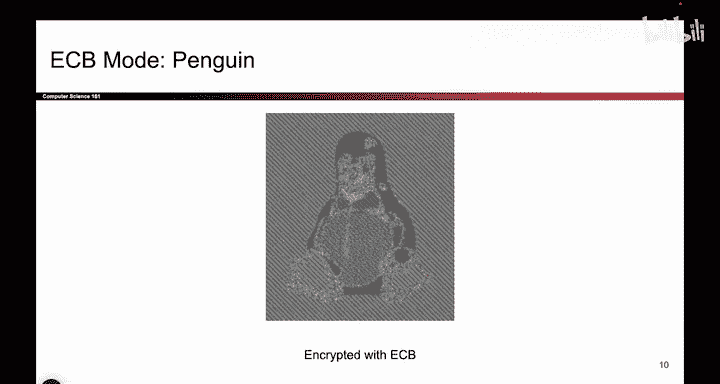

# 102：-Cryptography3, Video 2- ECB Mode.zh_en - GPT中英字幕课程资源 - BV1VhEhzMEPL

Okay， today is all about block cipher modes of operation。

 so we're going to actually design it together and we're going to use block cipher encryption as a building block to try and build something that's more general purpose and also hopefully achieves IND CPPAA security。

This picture shows the block cpher you've already seen， it takes it a key。

 it takes in a plain text and it output cipher text。 we've already seen this。

 but one big problem is that this is limited to encrypting 128 bit messages。

 if your message is any other length。The function is undefined。

 it doesn't know how to encrypt messages of different lengths。

So what if I had a message that was longer， sayy it was 256 bits instead to try and predict what I'm about to do to encrypt a longer message that is 256 Bs。

Instead of 128。Well I noticed that 256 is twice as many bits。 so if this let's be encrypt 128。

 I could just use AES twice， take the first half of my message。

 encrypt it with the block cipher and a key， and then take the second half of the message encryptryed with the same block cipher and the same key and I get the second half of my cipher text。

 That's the first half。 that's the second half and that should work okay。

That's one possible approach to encrypting longer messages is to use AES multiple times to encrypt each chunk of my message。

 And remember， we want to use the same key every single time。

 The reason here is because if I had to use different keys every single time。

 I'm back to the one timeca situation where I have to exchange new keys for every single message and that's not practical。

 Remember the point of block ciphers was to use one key to encrypt lots of messages。

 So I still want that to be true。 That's why we're using the same key for both halves of this message。

So。Believe it or not， We're actually done。 This is actually your first block cipher chaining mode。

 It takes the block cipher as a building block， and it extends it to encrypt messages of different lengths。

 This one is called ECB mode。 That's what they named it。

 and you've actually just designed it In equations。 it would look something like this。

 you would have to take all of the cipher text outputs and concatennate them together。

 This double bar is concatenation。 So now you know， and there's some more symbols。

 but I think the picture makes this more intuitive。 It is just using AES multiple times。😊。

Unfortunately， we can't stop here because we still haven't achieved IN DC CPPA security。

 So what is the one word that explains why this scheme isn't IND CPPAA secure。Deterministic， okay。

 great answer。 So I think this is not IND CPPA secure because it's deterministic。

 If I encrypt the same thing 10 times， I will get the same output 10 times。 And that's a problem。

 We've already seen that that fails the I ND CPPA game。 Since this scheme is deterministic。

 and attacker can win the IND CPPA game， which shows us that this scheme doesn't meet our definition of confidentiality。

 So it solved one of our problems。 allowing us to encrypt longer messages。

 But it didn't solve the IND CPPA problem。 So we have to go looking for other schemes。

 But this is one possible scheme you could use。😊。

So an example of why ECB is not IND CPPA secure is to remember the penguin。 So this is a penguin。

 It's a picture。 And what if I took every pixel of this picture， So I took the top left pixel。

 which is white， and then I take this pixel and then maybe this one which is black。

 and that one which is yellow。 I take every pixel separately， and I use ECB mode。

 this encryption to encrypt every single pixel separately。

 So I treat every pixel as a different message， and then I pass it into ECB mode。😊，Well。

 the result and remember the goal is to try and achieve confidentiality。

 So I don't want attackers to be able to see the penguin。

 I want to send something scrambled over the network。

 So if I take every pixel and I encrypt it using ECB mode where I feed each pixel as a chunk。

 you can imagine into ECB mode， Here comes the result。

Well， it's kind of secure。 doesnn't look like the original。 But if you're an attacker。

 can you kind of guess what was encrypted。 Yeah， you sure can。 I can still kind of see the penguin。

 So remember the penguin。 If you're wondering why ECB mode and deterministic schemes in general aren't secure。

 this picture tells you why all of the black pixels got encrypted to the same different color。

 And all the white pixels got encrypted to the same different color。

 So when schemes are deterministic， you leak information about which bits are identical。

 and we can still kind of see the penguins sitting there。

 So this scheme doesn't provide the security we're looking for。

