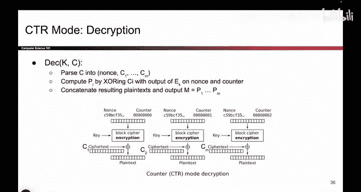
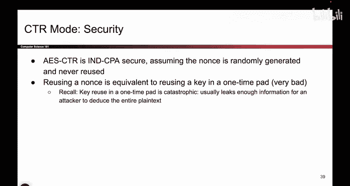
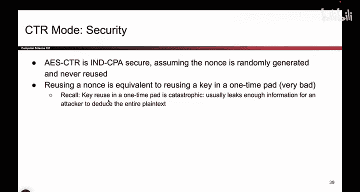

# 109：-Cryptography3, Video 9- CTR Properties.zh_en - GPT中英字幕课程资源 - BV1VhEhzMEPL

Okay， let's ask all the same questions of CT TR mode that we did with CC mode。

 So let's ask about efficiency。 Can you parallelize encryption。 Well you sure can。

 There's no dependence on this block and any of the previous blocks or future ones。

 We can already see it in the picture。 Each block is somewhat selfcontain。

 There are no arrows crossing between blocks。 and you can also reason it through by thinking about how you would encrypt any arbitrary block。

 So let's say you wanted to encrypt only the 30th block。 What would you do， You would take the nos。

 you would add 30， because it's the 30th block， you would take the key。

 you know that and you encrypt it， you take the 30th block of plain text， you exchort it。

 you get the 30th block of cipher text。 All of that was done without dependencies on other blocks。

 So everyone can encrypt separate blocks in parallel。 That's great。

 What about decryption can also be done in parallel for basically the same reasons。

 There's no dependence on previous or future blocks。 So if you wanted to decrypt block 30。😊。

The knots， you add 30 because it's the 30th block， you take the key。

 which you know you run it through block cipher encryption to get the pad and then you exhort the cipher text。

 which is one of your inputs with the pad。 you get plain text and you're all done。 So luckily。

 the answer here to both of these is yes， you can run CTR mode in parallel in both directions。😊。

What about padding？This one's kind of subtle。 So if you think about passing in a plane text。

 that's not long enough， or it's not an exact multiple of the block size。

 So we have a full block of plain text， another full block。

 And then here we only have one lonely by like before。 What do you do， Well。

 turns out this plane text never gets passed through the block cipher encryption。

 If I look at this picture。 I'm never taking the plane text and passing it through the block cipher。

 That's what would required 128 B。 Remember， we had to take the plain text in CBC mode Pass it through the block cipher。

 But the block cipher would look at the one by and say， no， I want 128 or nothing。

 So that's why this didn't work in CBC mode。 But in CT TR mode， we can play a clever little trick。

So we take the nos we take the last counter that we need， We still encrypt it。

 and we still get 128 bys，128 Bs of output。 that does not change。 This is always 128。

 that's the definition of block cipher。 But if I only have one byte that I need to Xor。

 I could just chop off the bytes that I don't need and just throw them away and I'll take my one by of plain text Xor with one by of the block cipher output and output a single by of cipher text。

 So I didn't have to do any padding， I could use a different trick for messages that were not an exact multiple of the block size in length。

 So all you have to do when the block cipher outputs 128 Bs。

 If you don't need them all in the last block， just chop off what you don't need， throw it away。

 it's not padding that I need So I'll take the remaining bits that I do need Xor them with the plain text and get the cipher text。

 And then Bob does the same thing on his end。 If you only has one by of cipher text to decrypt here。

He generates this pad， he throws away the 127 bits that are not needed。

 xors the one bit of cpher textex with the one bit of block cpher output that remains and you get the one bit of plain text in the last block。

So。Another one where you might want to practice it to see how it works。

 but turns out padding is not necessary here， you can just throw away parts of the message that are not needed。

 and I think the main reason why it's not needed is because the plain text never passes through the block cipher。

 it's when we pass things through the block cipher that we have that requirement of 128 bits and that's not true here。

Okay， just like with CBC mode。 Now let's think about the security。 again。

 there is a reduction proof that we will not talk about。

 but you can show that AES CT TR is I and D CPPA secure with that very important assumption that you generate a new nonce every single time。

 If you use the same nonce， you're back to deterministic。

 you are ruined again and it's not going to be I and D CPPA secure。

 So as before it's very important that you use a different nonce every single time。 And here， again。

 we can show that not only is it deterministic， but it's even worse in this case。

 if you use a nonnce twice。

WellWhat happens？ This is the same， This is the same。 All of this is the same。

 So your block cipher output is the same。 So what have you basically done。

 You've basically done one time pad with the same pad twice。 You just did two time pad。

 And we've already said two time pad is very， very bad。

 It lets you learn things like the Xor of the two messages。 if you learn one message。

 you automatically learn the other， things get really bad。 It's catastrophic。 So with CBC mode。

 if you mess up， the attacker can learn if the first few blocks are the same in CT TR mode。

 If you mess up， you've basically just done two time pad and the attacker can learn the Xor of the two messages。

 which is really bad。 So we don't want to reuse nonsenses。 and if you do， well。

 bad things will happen so。😊。

Don't do that Now， if you don't reuse nonsenses， you'll get another nice example where the penguin。

 we encrypt it with CTR， and it's all scrambled up， it's hiding in there somewhere。

 but we don't see any obvious patterns， This is good， it's better than ECB mode。

And if you do reuse nonsenses， then you'll get to become another example of what not to do。

 So please don't be like these people。 And in case you're wondering what we talked about one or two lectures ago when we said that some C S 161 students messed up cryptography and they did something they weren't supposed to。

 They built their own cryptography and they messed things up。 It actually had to do with IV reuse。

 So I won't read this all out loud。 but basically， they didn't use their cryptographic schemes properly。

 they tried to write their own scheme， which you're not supposed to do。

 And they ended up reusing IVs and they lost a bunch of security that they were supposed to have。

 So once again， the takeaway is to not try this stuff at home。

 There's just too many subtle things that can go wrong。 For example。

 accidental IV reuse that just destroys the security of your whole system。

 So don't be like those people。 I think they're all gone。 So we can like make fun of them。

 but don't be like those people。