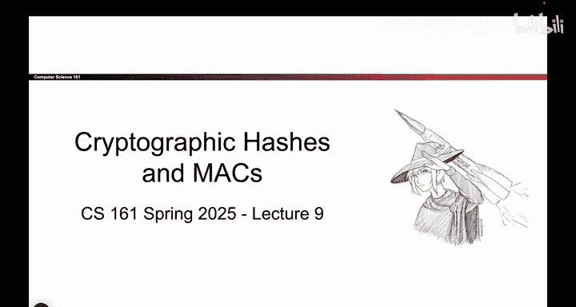
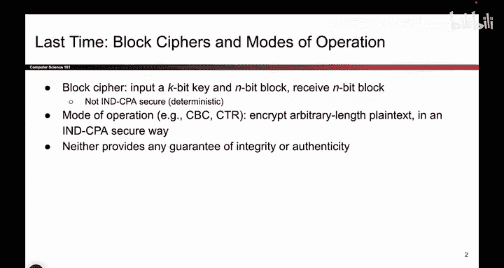
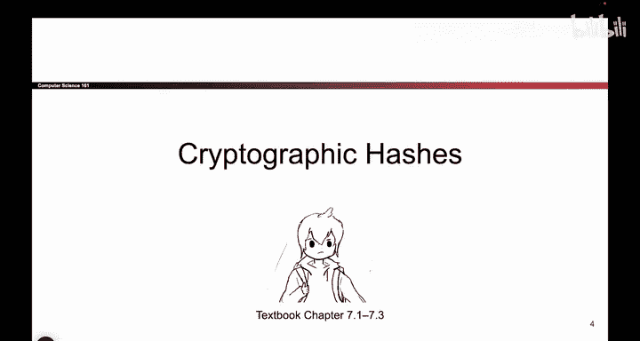
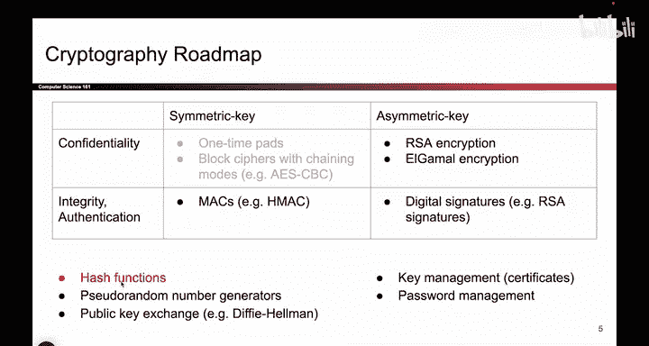

# 114：-Cryptography4, Video 1- Hash Definition.zh_en - GPT中英字幕课程资源 - BV1VhEhzMEPL

Okay， the set of videos is all about cryptographic hashes and Mac。

 so before we dive in just a reminder of what we talked about last time。

 we talked about block ciphers， those took in a Kbit key and once you fix the key you got a permutation mapping all the inputs to all the Mbit outputs this by itself is not INDCPA secure but if you chain together block ciphers using CBC mode or CTR mode。

 you did achieve INDCPA security and you're now allowed to encrypt arbitrary length plain text。

 not justB messages but the problem with stopping here is that neither of these schemes provide integrity or authenticity an attacker could tamper with the messages and when Bob decryptps the message to something else he has no idea that the message has been tampered with。

So that's what we're going to fix today， we're going to start with another building block kind of like how block ciphers were the building block to CBC mode and CTR mode。

 we'll start with a building block that is hashing and it's not going to provide integrity by itself。

 but then we'll use it to build something called message authentication codes that do provide integrity and authenticity and then once we're done at the very end we'll see how you can combine confidentiality schemes and integrity schemes together to get all the properties at the same time so that's sort of the plan for today。

Okay， the first part of today is all about cryptographic hashes cryptographic hashes by themselves。

 they don't provide integrity or authentication， but they are a necessary building block before we can talk about the schemes that do provide integrity and authentication that's why we've hidden them down here a little bit Also hash functions have lots of other useful purposes so it's。

Nice to see them along the way so eventually we're going to aim for this block of the roadmap we want symmetric key schemes that provide integrity。

 but before we can do so we have to take a quick detour and look at a building block known as cryptographic hash functions so let's do that。

First I'll give you the math definition and then we'll think about why this is a good definition so the hash function takes in just one input。

 it's not like the other schemes that we've talked about where you take in a key， there is no key。

 you just take in a message and the message can be as long or as short as you want This M could be one bit。

 it could be 100 bits， anything is fine。But the output of the hash function is always a fixed length end bit hash。

So if you choose a hash function， you choose an algorithm and the algorithm says I output 128 bit hashes。

 and n is 128， and no matter what you pass in， whether it's one bit or 128 bits or 1000 bits。

 the output is always the same length and sometimes mathematically we write it like this。

 the star means arbitrary length， the n means fixed length output。

So that's the formal definition of a hash function。

 and now here are some interesting properties of it。

So to make sure that the hash function is correct， it should be deterministic。

 and that means that if you hash the same value 10 times， you'll get the same output 10 times。

 so that's what deterministic means。Again， we're not going to be very strict about what efficiency means。

 but hopefully you design a scheme that's relatively efficient。

 it should destroy your computer to computer hash， and then we'll talk about three interesting security properties that makes this a cryptographic hash function so even if you see an hash functions in other contexts。

 maybe you haven't seen a cryptographic hash function and by defining these security properties。

 we're going to talk about what makes a hash function actually secure。

And we'll formally define these。 But for now， the way you can think about a hash function is that the behavior of the hash function should be unpredictable。

 So what that means is if I change a single bit of the message。

 the output should look unpredictably different。 There should be no way to predict ahead of time。

 What happens if I change one of the input bits and how that affects the output。

 whatll be more formal with it， but roughly speaking。

 you want a hash function that performs unpredictably。

 there should be no patterns between what the input looks like and what the output looks like。

So one way to think about a cryptographic hash function is like a fingerprint so your fingerprint is unique to you when you put your fingerprint on something。

 no one else has the same one as you And so that's one way to think about what a hash function does if you pass in some message like a document or a message the resulting hash output you can think of it like a fingerprint on that message only that message would produce that fingerprint and with very high probability no one else will produce the same fingerprint So one example of a way you can use hash functions and this is not necessarily for integrity it's just one possible usage for hash functions is comparing document so let's say Alice and Bob have a really big document it's one gigaby large So what they could do naively is they could send that document back and forth between each other to see if it matches but that's a really big document to send over the internet they have to upload one gigabyte and download one gigabte and then check。

Of the bytes that's really time consuming。 So instead what they could do is they could both compute a hash over the document offline without wasting internet bandwidth。

 So Aliceice computes the hash。 that's a fingerprint over the document。

 Bob computes the hash that's another fingerprint over the document And then instead of sending the whole document over the Internet。

 they just have to send the hash over the Internet， which is a much smaller value like 128 bits。

 And if the hash is match， then the files should be the same because they have the same fingerprint And if the hashes are different that means that the files must be different。

 remember hashes are deterministic。 So if you hash the same big document twice。

 you ought to get the same fingerprint So that's one way of thinking about what the hash function does why it's useful。

