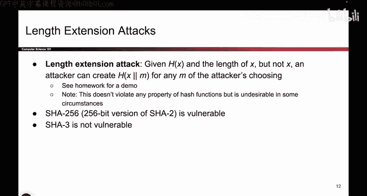
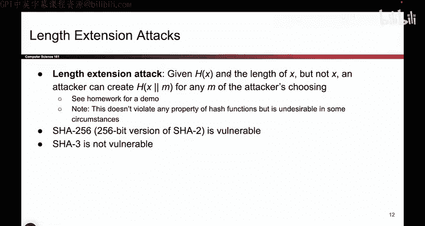
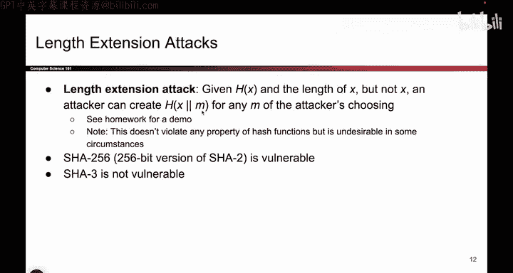
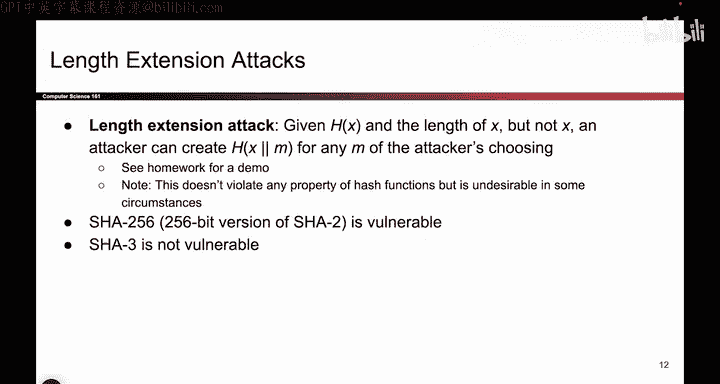
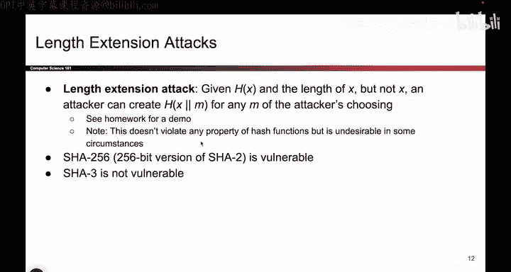
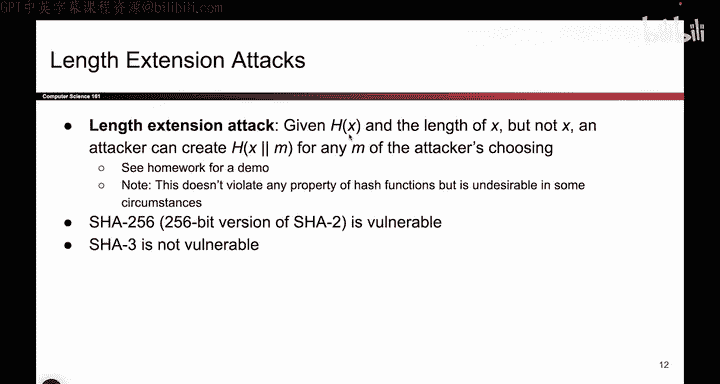

# 118：-Cryptography4, Video 5- Length Extension Attacks.zh_en - GPT中英字幕课程资源 - BV1VhEhzMEPL

Okay I guess I will talk about the length extension attack since I have a slight for it。

 so the length extension attack， it doesn't necessarily break any of the things that we talked about earlier。

 but it is still something we want to avoid so let's say that again I turn around I come up with the secret value and I hash it and I tell you the output hash so I tell you what H of x is and I also tell you the length of my input so the word that I just hashed was 10 characters so now you know the hash and you know the length of the message but I don't tell you what word I chose what 10 letter word I chose will be a mystery to you forever and the length extension attack says if I give you this hash you can actually continue running the hash algorithm from wherever I left off to compute the hash of my message concatennate it with some other message so even though you don't know what x is you can compute the hash of whatever my secret word was plus your favorite word。

And you can compute that hash。 Well that's pretty bad。

 It doesn't break onewayness or collision resistance because you couldn't figure out the X that I used or something that hashees to H of x。

 you also didn't find a collision but you were able to keep running my hash algorithm based on my output to get the hash of my secret plus some other secret so this is a little bit dangerous depending on your threat model if you check out the homework assignment there is a demo of what this looks like and depending on your threat model。

 maybe this is something you don't want。 So shot2 is vulnerable to this shot3 patched this issue but that's what a length extension attack is I think trying it out will be helpful to understanding what it does but just remember that it's like I'm giving you the output and you somehow continue running the hash algorithm from where I left off to get the hash of my secret plus your secret even though you had no idea what my secret word was。

