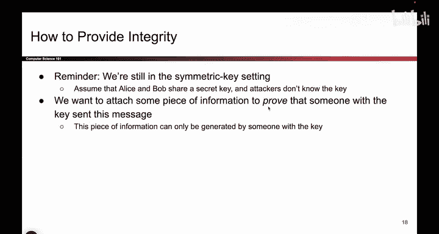
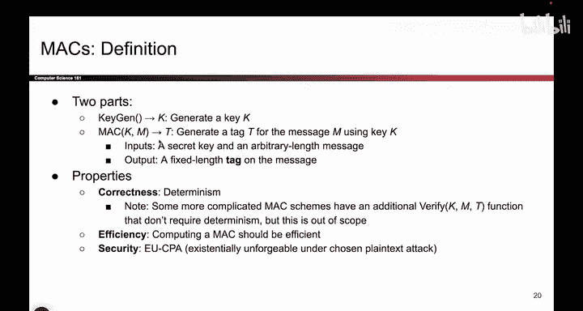
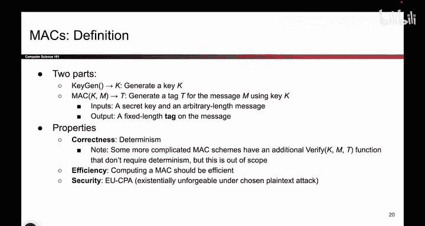

# 120：-Cryptography4, Video 7- MACs Definition.zh_en - GPT中英字幕课程资源 - BV1VhEhzMEPL

Okay， so with hashes as our building block， we cannot move to message authentication codes。

 which will finally achieve our goal of providing integrity and authenticity on our messages so we are now in the bottom left square。

 We want schemes that provide integrity and authentication and we want to do so in the symmetric key case so we will continue to assume that Alice and Bobb have been blessed with the secret key that no one else knows and how they do that is not our problem for today。

 they know a secret key， no one else knows it It's like magic for today。😊。

So remember from a couple of lectures ago we said that the way you provide integrity is that you add a tag on a message。

 it's like a seal， so what we're going to do is in addition to sending the original message。

 we're also going to send a tag on the message and the tag is going to help us prove that the message has not been tampered with。

So as an example， this is the scheme that you saw from last time。First。

 Alice is going to take the message and the key。We're going to pass them into some Mac algorithm message authentication code and designing what's in this box is our goal for today Some code lives in this box it takes in two arguments。

 we don't know what they are or how this box works yet but we'll figure it out and the output as a tag T you can also think of it like a signature if that makes it feel any better but this is a tag or a seal or a signature on the message it's a unique value associated with the message and the key and it's sitting there and when you send the message you send not just the original message from before but also the tag so you send both values across the insecure channel。

And then when Bob receives the message and the tag， he's going to pass the message。

 the tag and the key， so three inputs into this verify function。

 and again we have to design what goes in this box。

 and if this tag matches the message based on this key。

 then we know that the message has not been tampered with and Bob can receive the original message safely。

But if the message has been tampered with or the tag has been tampered with。

 if Mallory tries to change even a single bit in this message。

 we need this verify function to say false and then Bob will say nope this message is not correct so I won't receive the message。

 that's what integrity means we have to know whether or not this message was tampered with and adding the tag is what's going to help us。

One minor note by the way， before we move on， you might be suspicious that we're sending the message totally in plain text and Mallory can read this message and you're right。

 but remember right now we're just thinking about integrity。

 we're just trying to protect against tampering messages so we don't really care for now if Mallory can read the message if you want both integrity and confidentiality。

 we'll have to combine schemes and we'll do so later but for now it's okay that Maory can read the message we just have to make sure she can't modify it and the tag is going to help us achieve that。

Okay here is the formal definition of a Mac， so for any scheme that you design that fits in the Mac box it has to match this definition。

 so the first thing you have to do is tell us how the key is generated for now。

 you can assume Alice and Bob have a random bit string that no one else knows and that's how you generate a key。

 but if you went out to publish the Mac scheme， you might have to define how the keys are generated。

And then we have to come up with that scheme that generates a tag， and formally it looks like this。

 it takes in two arguments like you just saw， the key and the message。

 and it outputs a secure tag on the message。And to formalize these a little bit more。

 the key is the secret key from the key generation， the message is arbitrary length。

 you can compute Max on short messages， long messages。

 there should not be a limit on the length of M and the tag is fixed length。

 so no matter how long your messages， the tag is always 128 bits， for example。

Maybe that sounds familiar from hashhes， maybe you see where this is going， but if not it's okay。

 just know that the message is arbitrary length， the tag is fixed length。

And so if you divide Max in this way， then there are some properties that we care about。

One is correctness。 And again we're going to say Macs are correct if they're deterministic so that means that if you run the Mac algorithm with the same key in the same message。

 you'd better get the same tag and if you define it that way。

 you can actually come back here and simplify this key a little bit instead of writing a verify function here it's different。

 you could actually just use the same Mac algorithm in both of these boxes why。

 because if the message and the key are the same， you generate a tag and when Bob receives the tag he just takes the same key and the same message and we generate the same tag or attempt to and if the tag that we generate matches T。

 we know that the message is good So in the case that we're talking about where the Mac is deterministic instead of this verified box being its own custom algorithm。

 you could just run the Mac a second time if the message is the same the key is the same you're going get the same tag if the message is different then you're going to get a different tag and you know it doesn't check out。

That's not the only type of Mac you can use， you could use more complicated ones and do the thing we talked about where you pass in a key。

 a message and a tag and it outputs true or false， but for this class we're not going to worry about those。

 we will just think about Macs that are deterministic。In terms of efficiency， again。

 not a formal definition， but hopefully you're doing things like shuffling bits around that computers are good at and don't do something really complicated that will consume a lot of computer time because then no one's going to want to use your Mac and finally we're going to define a different security game one that you haven't seen before called existential ungeibility and it's kind of like INDCPA but it's the Mac equivalent and once we define that that don't give us a definition to check whether or not our Macs are secure against attackers so those are the things you want out of a Mac when you design one。

