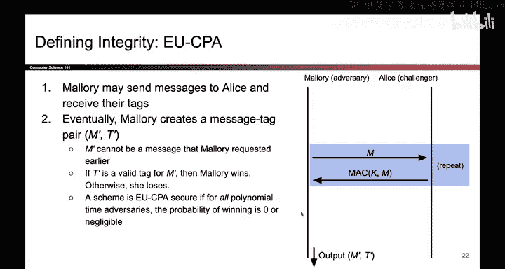
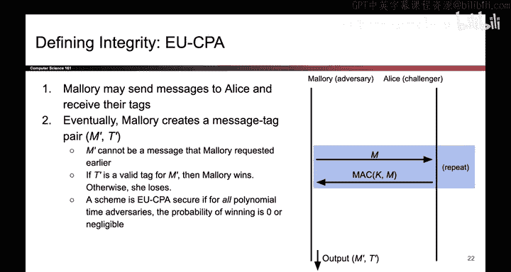
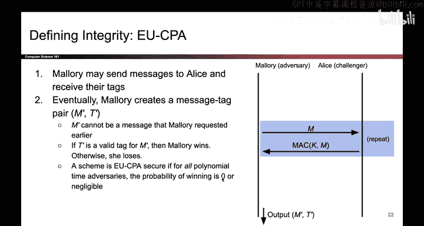
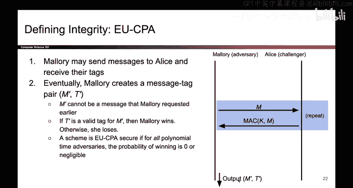

# 122：-Cryptography4, Video 9- Why EU-CPA Uses 0.0, Not 0.5.zh_en - GPT中英字幕课程资源 - BV1VhEhzMEPL

One final little note here is that the probability of winning in IN DCCPA was 0。

5 because remember Maory was choosing between message0 and message1。

 but in this case there isn't really a choice of messages you just have to output a message and a tag。

 so in this case， how good can a random attack or do who's just making random bits？

0ero negligible if you're just taking random bits， you're probably going to lose all the time。

 So if Maller is able to win with even 10% probability。

 that's better than random already so we say she wins so the reason this is 0 and not 0。

5 is because random attackers win with probability 0 doing better than 0 means you win and this is different from INB CPPA where random was 0。

5 probability of success so you had to do better than 0。

5 to win so that's the EUuc CPPA game that is how you define if a scheme is secure or not for max。

