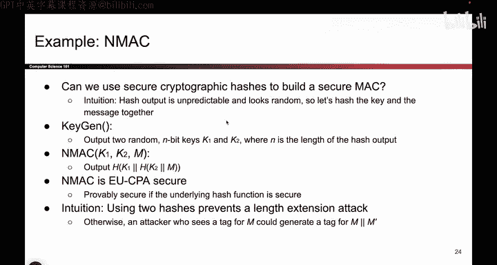

# 123：-Cryptography4, Video 10- HMAC Definition.zh_en - GPT中英字幕课程资源 - BV1VhEhzMEPL

Okay， so now that we know what Macs are， let's think about some example implementations of Max。

So we already said that cryptographic hashes are a potentially useful building block。

 They take in an input and the output looks unpredictably random。

 The problem with cryptographic hashes is that they don't have a key。

 So what if we took the idea of a cryptographic hash。

 which makes the output look unpredictable and random and gives us this fingerprint on the input。

 And what if instead of just passing in the message。

 we pass in both the key and the message and we hash both of them。

 That could be something we could do to create a secure Mac。 So that's what we'll try。

 We'll take the key and the message and we'll hash them together more formally。

 the scheme that we'll design is something called N Mac and it looks like this。

 So the first thing you have to do is generate a secret key。

 Remember we said that if you define a Mac scheme you have to fill in certain functions and one of them is how the keys are generated。

 So this is going to feel a little bit weird at first， but we're going to generate。Two keys。

 K1 and K2 for reasons that will become more clear soon。

And then the Mac operation is going to take in your key， which is this couple of two values。

 so anytime we ask for a key it's actually K1 comma， K2。

 and it takes in a message and we do what we said earlier。

 which is that we hash the key and the message together。Now。

 the question you probably have now is what was the point of using two keys and also when I compute to Mac。

 why am I using two hashes instead of one？😡，If you just use one hash and do the naive thing where you just take hash and you input one key and the message。

 you're leaving yourself vulnerable to a length extension attack。 Remember。

 the length extension attack from earlier said， if I just show you the hash of K concatenated with M。

If an attacker is able to execute this attack， they can compute the hash of K2 concatenated with M concatenated with their own message M prime。

 and that would allow an attacker to forge the Mac for something even though they don't have a key。

 So if we didn't have this outer hash and we only use this inner one。

 and attacker could forge a message they could say my message is actually your message concatenated with some other word that I chose。

 And then they are able to use length extension to compute the hash of the key and the original message and the extra word that they append it。

 So just using one hash isn't enough。 and to fix that， we wrap a second hash around it。

 And now the length extension attack no longer works。 you can try it。

 But if you tried to append something here， it's not going to give you the same output you would need to forge a message。

 So that's the rough intuition， there's a lot more subtle points that you need to show to make N Macac actually unforgeable。

And EUuc CPPA secure。 we're not going to go there， but at a very high level。

 the two hashes help us prevent length extension attacks。

 And there's other things you might think about like what if I swap the order。

 maybe I put M first and then K2 there are other constructions that are possible。

 but this is one that someone satAT down and wrote a proof for and said is EU CPPA secure assuming that the underlying hash function is a secure cryptographic hash。

 So as long as this H is collision resistant and one way， then this output should be unforgeible。

 It's very hard for an attacker who doesn't know the key to compute a valid tag on a message。

So that's a construction called Nmac。 you could go out and use this and it works just fine。

 but there are a couple things that I don't like about it。

 One thing I don't like about it is that you need two keys。 That's kind of annoying。

 and the second thing I don't really like about it which I didn't explicitly call out is that there's actually a restriction on the length of the keys and both keys have to be n bits So if this hash outputs 128 bit values then these keys are also required to be 128 bits。

 So that's a little annoying。 I can only use Nmac if I have two keys and they are the proper length if Aliceice and Bobb only share one key they can't use Nmac and if Aliceice and Bobb have the wrong key length they also can't use Nmac So what we'll do is we'll take Nmac and will slightly evolve it so that it has the same security properties but it doesn't require all the specific constraints on the keys and if you do that you end up with something called H。

MacAnd this is what we'll end up using all the time。

 because here we only need to pass in a single key as opposed to two very specific length keys。

 which was more annoying。So H Macac is really just a wrapper around Nmac that makes Nmac easier to use。

 It's the same security properties， the same security proof。

 We're just adding some dressing around it to make it nicer。

 So how do you take one key and generate two keys。 Well first we take K。

 that's the key that the user input it。 And this can be any length， it can be short。

 it can be long and we'll use k to generate two different keys。

 So the first thing you'll do is you'll take K and make it the proper length n bits。

 The length of the output hash。 If it's too short， throw in some zeros。

 Now you've extended it to become M bits。 And if it's too long。

 use the hash function and that makes any arbitrary length input into n bits。

 So all you've done is you've taken K and you've adjusted it to be the correct length。😊。

And one tiny note don't use a k that's like 3 bit or 4 bits。 that's way too small。

 Some can brute force。 So you do have to use a reasonable size K here。 But if it's not exactly 128。

 we can use these tricks to pad it or to hash it so that the proper length is correct。

 Once you have k prime， which is the proper length Now you have to derive two keys。

 K1 and K2 because Nmac expects you to output two keys。 or it expects two keys to run the algorithm。

 So the way we'll do that is we'll take k prime and we'll xor with some constant value。

 which I've called Opa o for outer and that's my first key K1。

 and then I'll take k prime xor with some other hard coded value iPadad I for inner and that's the second key。

 So all I've done is I've taken k prime and I've computed two different keys and now I have two different keys。

 they're the proper length so I can shove them into Nmac and I get all the same security guarantees as Nmac。

 but I didn't have to worry。About the key being the wrong length or only having one key instead of two。

So it's a little bit tedious。 Most of it is just making things work and making it fit into the N Macac construction。

 But that's Hmac。 It's a more practical version of Nmac where we fixed some of the issues with the keys and the constraints on them。

So to finish up the construction of Hmac， we said you output this and this is really just Mmac。

 but we derive the keys from a single key in case you're wondering what Oad is。

 it's just the hardcoded byte0 x5 c and you just repeat that over and over again for as many bytes as you need。

 So if K prime is 128 bytes， then Oad is just 5 C repeated 128 times。 And likewise。

 iPad is just this hardcoded value。 So these are values that are hardcoded into the code for Hmac。😊。

Now， technically， you didn't really have to pick these values。

 you could have chosen different values for security reasons， the paper that describes HMac。

 they argue why these are good values， but it doesn't really matter you just need some different values to get this value in blue and this value in red to be different and both are secret because if the attacker doesn't know K prime。

 they can't derive this blue key or this red one。So it's a lot of fine print。

 but the important thing is we're using hashes to build the Mac。

 That's what I think is the most important。 And everything else is just implementation details。

