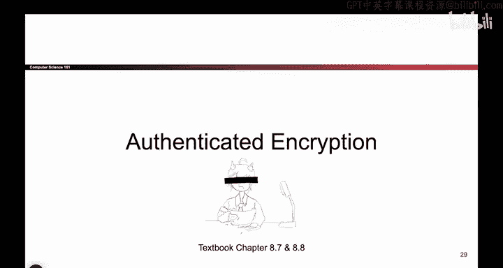
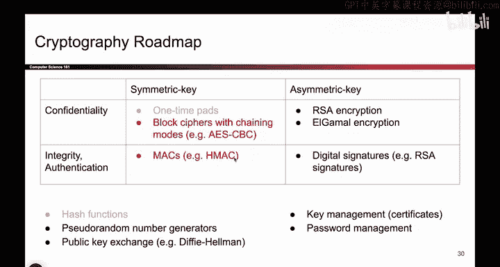
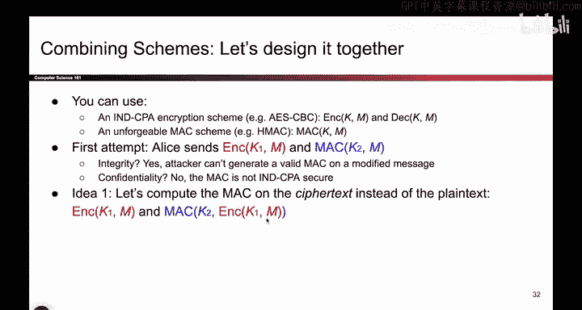

# 126：-Cryptography4, Video 13- Combining Encryption and MAC Schemes.zh_en - GPT中英字幕课程资源 - BV1VhEhzMEPL

Okay， so to wrap up our discussion on symmetric key schemes。

 we are going to talk about something called authenticated encryption。

So far， we've talked about some symmetric key schemes that provide confidentiality。 That's great。

 And some schemes provide integrity and authentication。 That's also great。 But what if I want both。

 what if I want to somehow get confidentiality and integrity on my message。

 So the last piece of the puzzle before we're done with symmetric key cryptography is to figure out how to combine these schemes to get the benefits of both of them。

 And it turns out it's a little bit trickier than it first seemss。

 So all of the schemes that we'll see here fall under the term authenticated encryption and the idea is that you want confidentiality and integrity on a message you want both。

 And there's actually two ways to do this。 One strategy that we'll see is to combine the schemes that we've already built。

 So go back to that diagram and pull some schemes from the confidentiality box and pull some schemes from the integrity box and combine them in clever ways to achieve authenticated encryptions。

😊。

One strategy we could use。 and a different strategy is to actually throw out the schemes we've built and to build something from scratch that aims to achieve both at the same time。

 And we'll see something like that as well。 So there's two strategies。

 One of them uses existing schemes， and the other one tries to build something from scratch。😊。

So the first strategy we'll see is to combine the schemes that we've already seen。

 So here are the schemes we've already seen。 These are the building blocks you can use when you're combining a scheme。

 So we'll give you any encryption scheme of your choice。 You can assume it's I ND CPPA secure。 So。

 for example， we give you AE S，CBC， or we could also give you C TR mode or one of those other modes that's secure。

 So you get an encryption function and a decryption function that you can use。😊。

Something else you can use is an unforgeable Mac scheme。 So for example， we give you HMac。

 And remember， H Macac gives you this function that takes in the key and the message and outputs a tag。

 Both of those are things you can use。😊，So maybe our first attempt is just to send both of these messages。

 so anytime you want to encrypt a message or when you want to send a message。

 the first thing you do is encrypt it， and the second thing you do is compute a Mac on it。

 And when you send the message， you send the cipher text。

 it's encrypted and you send the Mac so that you have some integrity。So we can check through this。

 Does this have integrity Well， it should have integrity because if the attacker messes with the tag。

 the Mac will no longer be valid and if the attacker messes with the encryption。

 that's going to cause Bob to decrypt a different value and it's not going to match this Mac。

 So it seems to me like we do have integrity in this case。

 An attacker can't tamper with either the red or the blue value without causing the Mac to become invalid and they also can't generate valid max because they don't know the keys。

What about confidentiality？That one， we have to stare at this a bit more carefully。And in fact。

 it doesn't provide confidentiality。 Why， because remember。

 we said that Mac don't provide confidentiality。 If you compute a tag on a message。

 it's possible that this tag itself leaks information about the message。

 So we have to be really careful。 This value doesn't guarantee confidentiality。

 So this scheme is not confidential。 One way to see that is that this value is deterministic。

 So if Alice sends two messages twice across the channel。

 it will have the same Mac and an attacker can notice that Alice is sending the same message twice。

 This value in red might be different both of the times。 but the value in blue is the same。

 So this is not confidential。 if you want another proof you could write a very silly Mac that says to compute a Mac first compute the H Macac。

 then append the message and output that that does provide integrity， because you have the H Mac。

 but it also outputs the entire message。 So it's still no good in terms of confidentiality。😊。

If you didn't totally follow those， it's okay， basically the punchline is that our first attempt gave us integrity。

 but it didn't give us confidentiality， so we actually have to be more careful in the way that we combine the two schemes that we are given。

So another idea that we could use to combine these schemes is instead of computing the Mac on the plain text M。

 because this leaks information about M， what if we plug in the cipher text here。

 so now when you send a message you encrypt it， and instead of computing the Mac on the plain text you compute the Mac on that value in red。

 the cipher text。

Well now you still get integrity because you have this Mac， some more proving is needed there。

 but at a high level you can think of it like there's a Mac。

 and if someone tamamppers with the value in red or this value in blue。

 the Mac will not check out and you can play with it a bit to see why that's true。 So that's good。

And what about confidentiality， Well， again， the Mac can leak information about the data that you're passing into the Mac。

 So an attacker who reads this value could learn the value in red。 But that's fine。

 The value in red is the cipher text。 So even if this Mac leaks the cipher text。😊。

The attacker still doesn't know the original plain text。 So we are good。 So this idea will work。

 And it's one of the two ideas that we'll see。Another idea we could do。

 And maybe this is the one you thought of when you first saw the first attempt and why it didn't work。

 What if we just take this Mac and we move it into the encryption。

 So instead of sending this Mac in plain text， What if we also encrypt the Mac that also works。

 So instead of sending this Mac in plain text because it's leaky。

 we could take this Mac and put it inside the encryption。 So you first take the message。

 Comp the Mac and then encrypt everything， Well， now do you have integrity again。

 you have to play with this a little bit to convince yourself， But I think this provides integrity。

 because if you change this message in red， the inside Mac will not check out。

 and is it confidential， I think it is because everything is wrapped in the encryption。

 So everything that you're sending is encrypted with this K1 key。

 So the attacker can't learn the message or the Mac。

 everything is encrypted So these are two different ideas for combining the two schemes and something to notice is that our first attempt where we just took a message and encrypted。

😊，and separately maced it was not sufficient。 We had to be a little bit more clever。

 when designing these schemes。