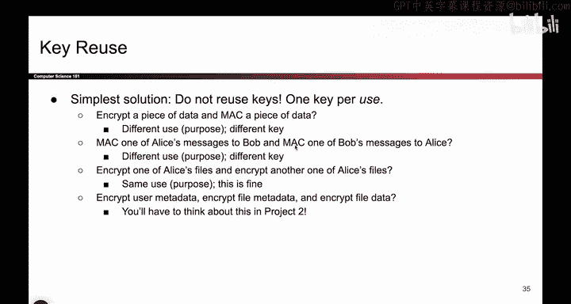
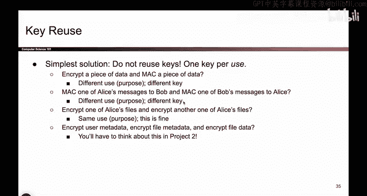
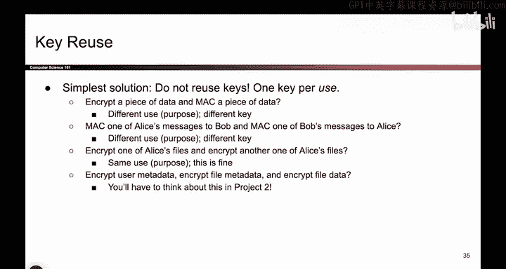
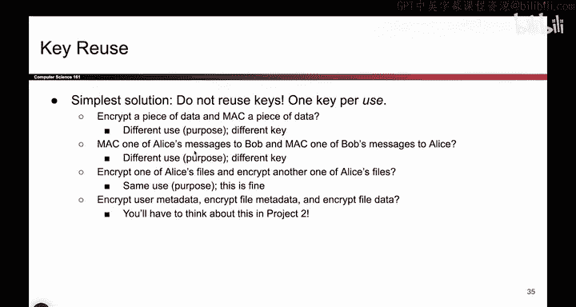
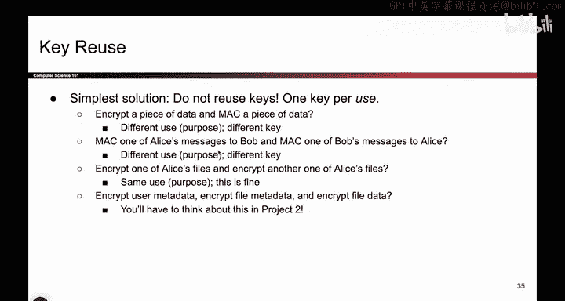
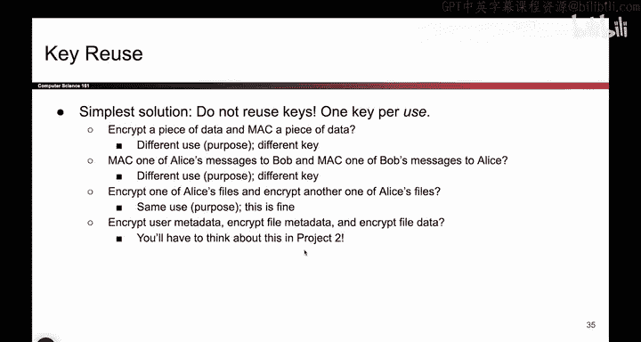

# 128：-Cryptography4, Video 15- Key Reuse.zh_en - GPT中英字幕课程资源 - BV1VhEhzMEPL

Okay， something we've used already， but we haven't explicitly called out is two separate keys。

 so for example， in the encrypt and Mac scheme， notice that we used K1 for encryption and this totally different key K2 for Mac。

Did we have to do that， What if we did something where we just used the same key。

 So we have one key and we encrypt with it。 And when we compute the Mac， we use the same key K。

You can do that but you have reused a key and when you reused a key。

 you open yourself up to very subtle issues and you have to think really hard about them。

 So for example， if the encryption scheme is based on a block cipher， for example。

 one of those block cipher chaining modes and your Mac scheme is using this another block cipherbased algorithm so there are some Mac schemes that use block ciphers out there well then now you have a scheme that's using a block cipher and another scheme that's using a block cipher and it's possible that those schemes interfere with themselves in very subtle ways maybe somehow because you're using this K and this M you pass the message forward through a block cipher。

 but then because you use this Mac with the same key。

 maybe somehow the Mac is passing the message backwards through a block cipher and suddenly you get the original plain text back so there's all these really subtle attacks where the fact that these two keys are the same can cause things like block ciphers to。

Inferre with each other。 And that might affect the security of your overall scheme。

 We're not going to show one of these specific attacks。 Some of them are quite subtle。

 But the key point is， you have to think about them。 And thinking is really hard。

 I don't want to have to。Think really hard about what attacks are possible here。

 It's going to give me a huge headache。 And the way to avoid all of those headaches。

 is just use two separate keys。 Now， even if the schemes somehow interfere with each other。

 you're encrypting with K1。 And if the max somehow decrypts with K2。 That's fine。

 That's a different key， you will not get the original plain text back。

 So even if there is interference here。 using two keys prevents you from。😊。

Those interferences messing with your scheme。 So this is better。

 We should always use two keys because it means we don't have to think is hard。

 You can use one key if you want。 but then you're gonna have to think really hard about attacks and prove to yourself that these schemes don't interfere with each other。

 Sometimes they don't and you're okay。 Sometimes they do。 I don't want to have to think about that。

 So I'll be safe and use two keys anytime I have two different schemes。

 So this attack that we just talked about。 We call it key reuse。 This is kind of an annoying term。

 because people use the words key reuse in all sorts of different ways。 So， for example。

 when we talked about one time pads。 we said we were reusing keys there。

 And now we're talking about key reuse again。For better or worse。

 people use this term in all sorts of different ways when you start working on Project2。

 you will probably call 10 different things key reuse and that's okay。

 but just know that at least for this lecture the way that we're defining key reuse here is using the same key in two different algorithms So for example。

 encryption is one algorithm it's one piece of code Mac is a different algorithm it's a different piece of code and because I'm using the same key for both algorithms。

 I call that key reuse now you can use key reuse to refer to other scenarios where you use the same key twice。

 but this is my specific case for key reuse and the lecture definition of it and in real life。

 there might be other contexts in which a same key is used twice So for example。

 if you encrypt a message twice with the same key。At least for our definition， that's not key reuse。

 you can call it key reuse， but that's not our specific definition。Sorry。

 it's a little bit confusing。 terminology is hard and people like to use this term in different ways。

 but for our purposes， key reuse means same key， different algorithm in real life。

 you can use it to mean same key， different message or whatever else。 but for us， it's same key。

 different algorithm and our conclusion is don't do it。 it makes your life harder。

 it makes you have to think and I don't want to have to think hard if I don't have to。

So the solution to key reuse is to not do it one key per algorithm， so for example。

 if you want to encrypt something and you also want to Mac it。

 those are two different algorithms so please use different keys for different algorithms or maybe you have a Mac for a message to Bob and a Mac for a message to someone else。

 that could also be a case where you want to use different keys。

If you want to use the same key， maybe it's okay， but you'd have to think a little bit harder about whether it's okay for your purpose or what about if Alice has two files。

 should you use the same key to encrypt or different keys and again。

 that kind of depends on your threat model at least from our definition。

 encrypting two messages with the same key is okay because encryption is the same algorithm so you don't get that interference。

 but maybe for your purposes in a project or something maybe you want to use different keys and thinking about these tradeoffs is something you'll do in the project So sometimes using the same key is okay sometimes using different keys is better。

 but one case where using different keys is definitely the right thing to do is when you have two different algorithms。

 always use two keys in those cases， we don't want unnecessary interference。

Okay， so one concrete attack that people have actually built and I won't talk about it in all the detail is one where they use the insecure Mac then encrypt scheme。

 And remember the problem here was that we give someone a decryption oracle。

 We allow the attacker to send any data that they want and Bob is forced to faithfully decry it before he can check it for integrity and there actually was an attack that happened on the early internet because Mac than encrypt was used So way back when people didn't really know that Mac and encrypt was strictly worse than encrypt than Mac So they used Mac than encrypt it cost an issue and the result was encrypt than Mac becoming the better standard。

 So if you're interested， you can look up this attack We've given you the name。

