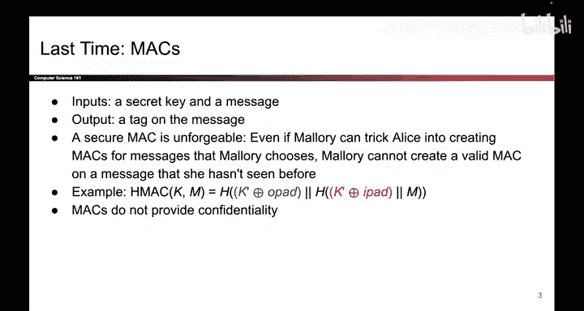

# 130：-Cryptography5, Video 1- Recap.zh_en - GPT中英字幕课程资源 - BV1VhEhzMEPL

Hi everyone， I am coming to you from a soundproof booth where I am prerecoring these lecture videos。

 so let me know what you think。Anyway， today's all about PRNGs and Diffy Heman Key Exchange。

So as a quick reminder of what we talked about last time。

 hashes map arbitrary length inputs to fixed length outputs， the output is deterministic。

 but it's unpredictable， which means that if you change even one bit of the input。

 the output should look unpredictably different and we talked about two security properties that make a cryptographic hash secure。

 However， hashes don't have any secret key as input so they don't provide integrity under our threat model。

So to fix that， we developed Mac， which do provide integrity under our threat model and here the input is a secret key and a message and the output is a tag on the message。

 and we describe that secure Macs are unfordgeible and we showed you an example construction of Mac based on hashes and finally we noted that Macs provide integrity。

 they do not provide confidentiality。

And finally we talked about the ways to combine confidentiality schemes and integrity schemes using authenticated encryption。

 there were two approaches that we discussed one of them was to use encrypt then Mac。

 which remembers better than Mac than encrypt and the other approach was something called AEAD encryption mode。

 which is risky because if you use it wrong， you lose both confidentiality and In。

 so that's what we talked about last time。

Today we're going to answer two questions that we've been putting off for some time。

 but today we're finally going to answer them。 So one question is where the randomness comes from in our symmetric key schemes and the second question is how did Alice and Bob get that shared symmetric key in the first place。

 So these are two questions we've been spending a lot of time not answering but today we're finally going to answer them。

