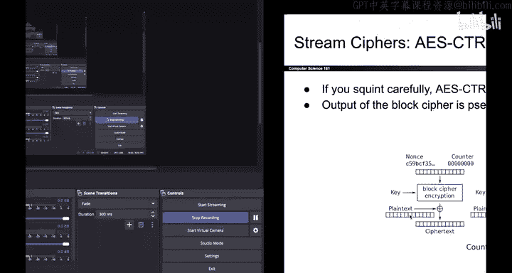

# 138：-Cryptography5, Video 9- Stream Cipher Properties.zh_en - GPT中英字幕课程资源 - BV1VhEhzMEPL

There's many different ways to build stream ciphers and if you squint carefully。

 you could argue that AES CTR is a stream cipher， the top half of this encryption diagram is using block ciphers to generate lots of pseudoran output and then using that as a pad in the onetime pad scheme。

 so arguably this is also a stream cipher。Stream cphers can be shown to be IND CPPA secure as long as you assume that the pseudoran output is secure。

 and the proof is pretty similar to the proof that we did to show that one-time pads are secure。

 a very minor footnote is that you have to be careful not to encrypt too much data at once so don't encrypt a message that is obscenely long for example if you do so in AES CTR you might cause the counter to wrap back around and that would cause you to start reusing the pad and break some security so it doesn't really happen often in practice but do be careful not to encrypt something that's so big that it causes the AES CTR counter to wrap back around to zero that would be bad。

One benefit of stream ciphers as the name implies is that they support streaming and what that means is that you can encrypt and decrypt additional data as it is coming in。

 So for example， let's say you've downloaded half of a really big file what you can do is you can generate enough PRNG output to decrypt the half of the file that you currently have。

 And if later the other half of the file is downloaded。

 you can just take the PRNG and continue generating bytes wherever you left off and the PRNG will generate more bytes and you can use those to decrypt the second half of the file and likewise。

 if you're encrypting data but you don't have all of it right now you can run the PRNG to encrypt what you have now and if additional data comes in later you just have to keep running the PRG it will continue generating output wherever it left off and that allows you to encrypt the rest of the data that is streaming in So that's a useful benefit of。

Stream ciphers。Another benefit of some stream ciphers is that they let you encryptpt or decrypt an arbitrary chunk of the message without having to process the rest of the message。

 So， for example， maybe you have a 1 gig cipher text。 that's really big。

 but you only care about the last 128 B。 Some stream ciphers will let you skip to the end and only decrypt the chunk that you care about without having to process the rest of the cipher text。

 So， for example， AE Etr does support this。 If you only want to decrypt the if block。

 All you have to do is take the nos concatennate it with the number I for the Ithe block。

 pass that into block cipher encryption。 That's the corresponding pad for the Ithe block。

 you can exhort the cipher text with that pad and get the original plain text back without having to process any other part of the cipher text。

 which is kind of nice。Some stream ciphers though， don't support this。 So， for example。

 if you're using the Hmacbased stream cipher and you want to decrypt the last block。

 you would have to generate the PRNG output all the way to the last block because the way that the PRNG works is it called Hmac over and over again。

 So if you want the last block you have to call Hmac a lot of times to generate the PRNG output all the way up to the last block so you can't arbitrarily skip to the end。

 unfortunately， but some stream ciphers， they do have this benefit。

And so that's it for stream cipherers， and now we can finally move on to Diffy Heman Key Exchange。

