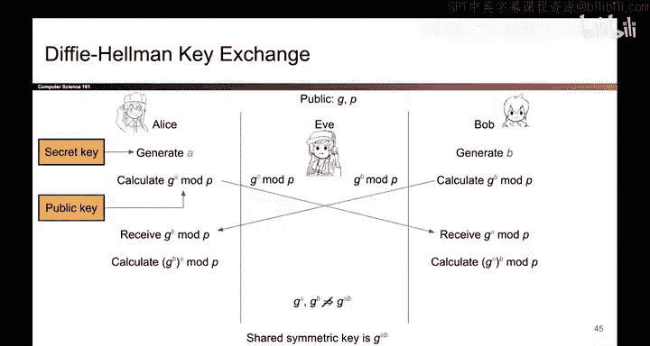
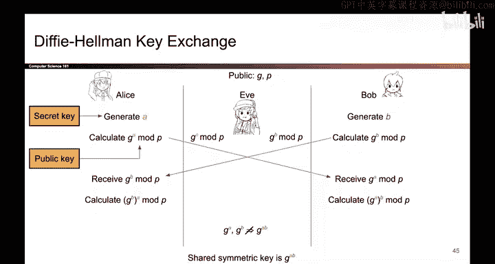

# 141：-Cryptography5, Video 12- Diffie-Hellman Exchange.zh_en - GPT中英字幕课程资源 - BV1VhEhzMEPL

So now that we know what the discrete logarithm problem is。

 the Dffyhelman key exchange is basically just the secure color sharing scheme from earlier。

 but it uses the discrete log problem to disguise the secrets in the key exchange。

 everyone knows some public values G and P， Alice， Bob Eve， they all know these values。

Now， Alice and Bob generate their halves of the secret。 So Alice generates a。

 That's her half of the secret。 Bob generates B。 That is his half of the secret。 Now。

 to disguise the secret， Alice computes G to the A mod P and sends that across the public channel。

 And likewise， Bob disguises his secret to compute G to the B mod P and sends that disguise secret across the channel to Alice。

 At this point， Alice has received G to the B mod P， disguised version of Bobs secret。

 So Alice can compute G to the B。 That's the values she received raised to the A power that's her own secret。

 and the result is G to the A， B mod P。

And Bob can do the same thing。 He has received G to the A mod P。

 That's a disguised version of Alice's secret。 He takes that number， raises it to the B power。

 and the result is G to the A B mod P， the exact same value that Alice got。

 so they have successfully gotten a shared secret。 and if we take a look at Eve。

 Eve has only observed the values G to the A mod P and G to the B mod P。

 and the diffyhelman assumption says if I give you G to the A mod P and G to the B mod P。

 it is computationally impossible to derive G to the A B mod P， the shared secret。

So the diyhelman assumption makes it very hard for Eve。

 given these two values to derive the shared secret that Alice and Bob derived。

 The intuition here is that if Eve wanted to do this。

 she would first have to learn A or B and then compute G to the A raise to the B power or vice versa and she can't do that because the discrete log problem is hard。

 And even if Evetri something clever like multiplying these two numbers together。

 if you multiply G to the A and G to the B mod P， you would get G to the A plus B mod P。

 and that's not the same as G to the A B mod P exponents don't work that way。 So in summary。

 the diffyhelman key exchange uses the discrete logarithm problem to allow Alice and Bob to derive a shared secret and it does not let Eve someone spying on the insecure channel to derive that same shared secret and that's the whole story。

