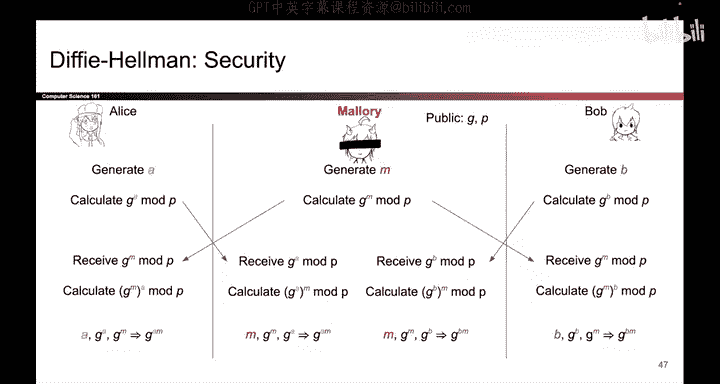

# 143：-Cryptography5, Video 14- Diffie-Hellman Man-in-the-Middle Attack.zh_en - GPT中英字幕课程资源 - BV1VhEhzMEPL

The Diffy Heman key Exchange is secure against Eve， but someone we haven't considered is Mallory。

 the attacker who can tamper with our messages。 it turns out there is an attack that Mallory can do on the Diffy Heman key exchange。

 so let's see that pop up。Alice generates her secret A as usual。

 computeutes G to the a mod P and sends that across the channel。 Now， normally。

 that would get received by Bob。 But since we have Mallory here。

 she can choose to intercept that message and replace it with a different value and specifically the value that Mallory will replace it with is G to the M mod P。

 So Mallory chose her own secret M， computed G to the M mod P and sent that message to Bob。

 So Bob expect to receive G to the A mod P， he instead has received G to the M mod P thanks to Mallory's tampering。

 And Mallory will do the same tampering in the other direction。

 Bob generates B computes G to the B mod P and wants to send this to Alice。However， Mallory is here。

 She receives G to the B mod P， and she intercepts it， replaces it with G to the M mod P。

 and sends that value to Alice。 So Alice was expecting to receive G to the B mod P。

 she has instead received G to the M mod P。 And Alice and Bob。

 they don't know that the value has been tampered with。

 How would they know the difference between G to the B and G to the M。

 They don't know which one they were supposed to receive。

 So they're both going to perceive like nothing has happened。 So what will Alice do。

 She will take whatever she received， She thought it was G to the B。

 but it's actually G to the M mod P。 She'll take that value raise it to the A power。

 and she has computed G to the A M mod P。That's not correct。 But that's what Alice derived。

 And likewise， Bob is going to take the value he received。 He thought he received G to the A mod P。

 but he actually received G to the M mod P， but he'll take that value。 He'll raise it to the B power。

 and he will derive G to the BM mod P。 That's also not the right value。

 So Mallory has caused Alice and Bob to derive different secrets。 Alice derived G to the A M mod P。

 and Bob derived G to the BM mod P。But it's even worse than that。 if you look at these two secrets。

 Mallory herself can actually derive these two secrets。

 Take a look at all the values that Mallory knows。 She knows M because she chose M herself。

 she knows G to the A modp that was sent by Alice， and she knows G to the B modp that was sent by Bob using these three values。

 she can derive the secrets that Alice and Bob derived， so she can take G to the A modp。

 She knows that raise it to her own M power and she can derive G to the A。

 which is the secret that Alice derived。 And likewise， she received G to the B modp from Bob。

 she knows her own secret M， so she can derive G to the B M Mop， which is Bobs secret。

 So not only has Mallory caused Alice and Bob to derive different secrets。

 but she has actually caused them to derive different secrets that Mallory knows。

Now things are really bad。 For example， if Alice encrypts some message with the shared key and sends it to Bob。

 Mallory can intercept it， decrypt it with G to the A modP。

 which she knows she can tamper with the message however she wants reenrypt it with G to the B and modp and then send it over to Bob。

 who will be none the wiser， and then when Bob sends a message。

 he will encrypt it with G to the BM modP， Maory can intercept it， decrypt it。

 read it all she wants change it all she wants and then when she's done。

 she can encrypt it with G to the A modp， send that taampered message to Alice who will be none the wiser So Mallory is now a full man in the middle。

 she has the power to read and modify the communications between Alice and Bob and Alice and Bob are none the wiser So we've shown that there is an attack that causes Maory someone who can tamper with。

Messages to break the security of Diffy Heman and break the integrity and the confidentiality of any schemes that use Diffy Heman to generate a secret key。

So this is an attack that can be done on the Dfffi Alman Key Exchange。

So one big issue with the Dffy Heman key exchange is that it is not secure against a man in the middle adversary using the attack that you just saw Another way of restating that same point is that Dffy Heman doesn't provide authentication。

 In other words， you have successfully done an exchange with someone。

 but you don't really know who you did an exchange with。

 So another equivalent way of looking at this picture that we saw from earlier is that two successful diffy Heman Key exchange happen here。

 Alice did a key exchange。 She thought she was doing it with Bob， but， in fact。

 Mallory stepped in front。 And Alice and Mallory did a successful exchange。

 Alice and Mallory exchange secrets。 and Alice and Mallory both know the secret G to the A and Maud P。

 So Alice did successfully do a key exchange。 She just thought she was doing it with Bob and did it with Mallory instead。

 And likewise， Bob thought he。Successfully did a key exchange with Alice， but he， in fact。

 did a successful key exchange with Mallory because Bob and Mallory both now share the key G to the BM。

 So another way of looking at this picture is that two successful key exchanges happened。

 but instead of happening between Alice and Bob， they happen between Alice and Mallory and Mallory and Bob。

 because Mallory stepped in between them。 So that's what it means when we say diiffy Heman doesn't provide authentication you don't know of your're exchanging keys with Bob or if Mallory has stepped in front and that you are actually exchanging keys with Mallory instead。

One more problem with Dffy Heman is that it is an active protocol。

 Alice and Bob both need to be online at the same time。

 They need to actively exchange G to the A mod P and G to the B modP in order to derive the shared secret It's not possible to derive a shared secret if only one of them is active。

 So in a scenario where Alice is not online right now。 she's on vacation。

 she's taking a nap and Bob wants to encrypt something and send it to Alice for her to read later。

 Diffy Heman would not support something like that。

 and we'd have to design some different schemes to support communication where both parties are not online。

 So those are some issues with Dffy Heman， the first and third bullet points are kind of the same in some sense they're both describing the man in the middle attack that we just saw and the second bullet point is a usability issue that we will solve later。

