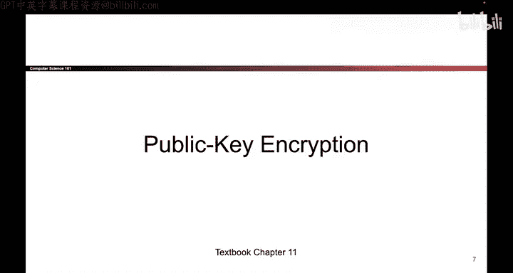

# 146：-Cryptography6, Video 2- Public-Key Encryption.zh_en - GPT中英字幕课程资源 - BV1VhEhzMEPL

In the first half of today we will look at public key encryption schemes public key encryption schemes provide confidentiality。

 but they don't provide integrity or authenticity， and the way these schemes work is anybody can encrypt a message but only the recipient can decrypt it with their private key。

 so as an example， if anyone wants to send a message to me。

 any of you can use my public key to encrypt the message that you want to send to me， however。

 the only person who can decrypt those messages is me。

 the recipient of the message because you need to use the private key to decrypt the message and when the messages are encrypted。

 hopefully an eavesdropper like Eve is not able to figure out what the messages say。

More formally， we can define public key encryption as three different functions that you have to implement。

 First， you have to describe how the key pairs are generated if somebody wants a public private key pair。

 what algorithm do you use to generate those keys and here we're using SK to represent the secret key because public and private start with the same letter。

 we had to use a different acronym so we used SK for secret key。Not a very important detail。

 just something we did。Once you have the keys， anybody can encrypt a message。

 so the encryption algorithm takes in a public key and a message and it outputs a cipher text。

 and because the input is the public key， anybody is able to encrypt a message。The decryption method。

 on the other hand， takes in a secret key and thecipher text。

 and it outputs the original message because the decryption function takes in a secret key。

 that means that only the recipient of the message。

 the person with the private key is able to decrypt the message。

What makes a public key encryption scheme good Well it should be correct and by correctness we mean that if somebody encrypts a message with the public key and we decrypt it with the corresponding secret key and remember keys come in pairs when you generate one you get a pair of keys so if you encrypt with the public key and you decrypt with the corresponding secret key。

 you should always get the original message back。Public key encryption should be relatively efficient again we're not going to formally define what that means。

 but it should take a reasonable amount of time and the security definition is IND CPA。

 the same as the symmetric key encryption schemes。

