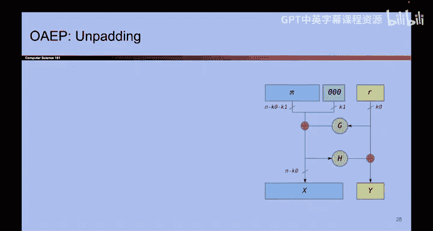

# 151：-Cryptography6, Video 7- RSA Security, OAEP Padding.zh_en - GPT中英字幕课程资源 - BV1VhEhzMEPL

The security of RSA encryption is based on something called the RSA problem and the RSA problem states that if someone tells you N and they also tell you the ciphertex M to the E mod N。

 it is very hard for you to reverse this operation and find the original N。

 Now do be a little bit careful。 it looks kind of like the discrete log problem or the diffy Heman problem。

 but this is not based on the difficulty of discrete log。 remember that in discrete log。

 it was difficult to find the exponent A in G to the a mod P。

 And here it's difficult to find the base N in M to the E mod N。 And also in the diffyhelman problem。

 we were using a prime number P as our modulus。 And here we're using N。

 which is a product of two primes。 So even though they look kind of similar。

 they are quite subtly different。But anyway， that's the RSA problem。 It basically says what we need。

 it says that if someone gives you the cipher text， it is hard to find the original plain text。

 and we're not going to prove why this is hard， but intuitively speaking。

 the underlying problem that makes RSA hard is actually not the discrete log problem but instead it is the factoring problem。

 the best known way to solve this problem and recover the original M is to factor N into P and Q。

 but unfortunately， there are no good algorithms to actually take a number N and factor it into its two primes P and Q and therefore because factoring is hard we also assume that this RSA problem is hard So not a proof but kind of a rough sketch for why RSA encryption is hard。

 It is all based on the fact that factoring is thought to be a hard problem。Now。

 before you go out and start using RSA encryption in the real world。

 one warning is that the RSA encryption we have presented is not quite secure。

One clear reason for why it's not secure is it's deterministic。

 at no point did we use any randomness。 So if you encrypt something twice using the scheme that we have presented。

 you will get the same output。 And that breaks I D CPPA security。

 There are also some other very subtle issues that we will not touch on and to fix all of these issues。

 You have to go a little bit further than where we have gone。

 And this is another case of not trying to write your own cryptography at home。

 We've shown you the basics of RSA。 but we have not shown you enough to build an industrial grade ID CPPA secure encryption scheme。

To fully make RSA encryption secure， you need to add some randomness and one scheme for adding randomness is something called optimal asymmetric encryption padding or OAEP。

Something I find a little bit confusing here is that they used the word padding in two different ways in symmetric key encryption。

 we said padding was adding dummy bytes， so the message was the proper length in public key encryption for some reason the word padding is used to refer to randomness kind of like IVs or nonsenses in symmetric key encryption scheme。

 it's honestly kind of confusing and I don't know why they say this。

 but when you see padding in the context of asymmetric key encryption think of it like the asymmetric encryption equivalent of IVs or nonsenses where we added randomness sorry。

 it's kind of confusing names are hard but anyway， if you use RSa and you add this additional padding scheme which is used to introduce randomness you should eventually get inDCPA security。

 there are some subtleties that we will not talk about but that's what you're missing。

 So if you want to feel free to look this up。 We've also included a couple。Of extra slides。

 if you want to know what the padding actually looks like and you can see that it includes some randomness that helps us achieve INDCPA security。

 remember randomness doesn't give you security for free。

 but it is a necessary prerequisite for INDCPA security。

So there's a bunch of equations you can check out on your own time and the structure is called the Fal network so look that up if you're curious。

 but the important takeaway is just that RSA is not secure as presented。

 there are some subtle issues， there is no randomness。

 OAEP add randomness and fixes some of our subtle issues to achieve IND CPPA security。

