# P1：Lecture 1 What is an Operating System - RubatoTheEmber - BV1L541117gr

 Okay， well， welcome everybody to 162。

 I'm one of the lecturers this term and Anthony Joseph。 We'll hear from a little bit later is also one。 And it's unfortunate that we have to start off the term virtually。 But I guess that's the way it is。 So we will become a in person as soon as we can。 So， anyway。 let's go ahead。 For those of you that want to ask questions throughout the lecture。

 please put them in， the chat and I'll keep my eye on chat。 That way we make things work out properly。 But anyway， so welcome to CS162。 Let's talk a little bit about what we're going to do today。 We're going to talk about what an operating system is and what it's not。

 And we're going to hopefully convince you why operating systems are so exciting to study。 And of course， we'll say something about how the class operates as well。 And interaction here is important。 It is something that we try to encourage。 It's a little harder on Zoom and maybe it's a little harder on the first day where we're。

 kind of popping through what materials we're covering。 But especially when we get back in person。 I'm going to be encouraging and Anthony will， be encouraging as well。 You'd all ask questions。 Okay。 So let's start by this particular image here， which is already 20 years old。 A newer version would be even more crazy。 But does anybody have any idea what this is？ Yeah。

 if you look carefully， you see that it says the internet， right？

 And so what's interesting is one could very easily argue that the internet is one of the。 greatest artifacts ever put together of human civilization。 And the reason for that is it basically ties together computer components throughout the。 world into one huge system。 And as a result， the level of complexity there starts to lead to all sorts of interesting。

 emergent behaviors， which we'll talk about a little bit as we go on， but also obviously。 security concerns as well。 So the internet is really astonishing when you think about it。 It's basically all of these cars and phones and cloud computing and so on all tied together。 in one huge system and all of the people of course come with it。

 And if you were to actually plot the number of people and number of IP addresses over time。 it's been growing essentially in this exponential form forever since the beginning， right？

 1995 or whatever， beginning of the web。 And it seems that it is going to only saturate when everybody has at least one internet address。 but probably many others。 And of course， you're all probably well aware of IPv4。 which is the 32-bit address space， has been essentially saturated for a long time and IPv6 may finally be coming around。 But that may be a topic for another day。 So the other thing is that we have this huge system across the whole globe。

 lots of components， in it， but we also have an incredible diversity of different things， right？

 We've got everything from mainframes to workstations to PCs and so on。 And this general trend has been very interesting。 It's been that we started out with kind of computers per person here。 like one computer， to a million people。 And we're now in the number of computers per person being。 you know， hundreds or thousands， for each person。 So that's sometimes called the internet of things where you have sensors in your cars。

 and in your walls and so on。 And this has really been an incredible change over the last couple of decades to the point。 now where， you know， we're not even aware of all of the things that are out there that。 are on the internet and monitoring us， which kind of leads to all sorts of privacy concerns。 But this astonishing curve on the sort of a log-linear scale moving downward in size is。

 something that often isn't pointed out to people when they're talking about how rapidly。 things are growing。 And there's a time scale range that's also astonishing as well， right？

 Everything from CAF references in the half nanoseconds or picosecond range all the way。 up into times in milliseconds to send things across the globe and even seconds in some， instances。 And that wide range is something that， you know， the operating system ultimately， which。 is the top of this class， is going to have to deal with。 And so that's also very interesting。 Okay。

 so we're in a very exciting time frame now and you guys obviously pick the right。 class to study this。 The operating system itself are really at the heart of all of this。 So they basically take all of these incredible advances。 I was showing you lots of little things。 many things， even also some very big things， all， tied together into one big system。

 And it's really the operating system that makes us all manageable。 Because if it wasn't here。 you wouldn't actually be able to use these things。 Okay， and the operating system。 as we're going to learn over the term， pretty much provides。 consistent abstractions to applications and programmers， even though the hardware is varying。

 widely。 It allows you to manage resources that are shared among multiple applications and also。 deal with security concerns。 And some of the key building blocks。 which we're going to talk a lot about over the term， are things like processes， threads。 concurrency， scheduling， coordination， all of these things， address spaces， protection， security。

 things that you've heard probably as words but haven't。 really had an in-depth understanding of what they really meant and how they were implemented。 And what's kind of exciting about this class for me is， since we're going to be working。 with a real operating system， we'll get into this later in modifying a real operating system。

 you get an up close and personal view of how all of these building blocks actually get。 implemented and then， of course， how they all tie together。 Okay。 So， for instance。 here's something you do every day。 You take your cell phone and you search for something。 Okay。 that's pretty common。 And however， what's happening under the covers。 Well， what's happening is。

 for instance， the cell phone reaches out to DNS services that， are hierarchical。 so there may be many servers that are connected to get a response。 And what that does is it turns your human readable name of the service into an IP address。 which then can be used to route hop hop hop over the internet to somewhere which might。

 be a data center and you're going to hit a load balancer at the entry point。 And under the covers。 totally unaware to you that load balancer is then going to pick。 the next hop in which to forward this information。 And then maybe there's some customized servers that are busy performing your search or finding。

 out that information you're interested in。 And there's probably some ads that are being generated and other compositing that's happening。 on the final web page to create a result that includes your results， maybe some ads， which。 then get forwarded back along that same path， typically along the internet back to the cell， phone。 And so that very simple thing that you take advantage of every day actually has a lot of。

 really interesting pieces。 And sometimes when I think too much in depth about what's going on。 I'm astonished that， it all works。 And I think getting a sense of wonder as we get through this term that all of the things。 that have to work together to actually get your queries to work properly or other more。 interesting things as we talk out through the net， I hope you'll get a little bit of。

 wonder out of this as well。 I love systems and I think that the fact that a big system like this can actually function。 is amazing。 And I'll be hoping that Anthony and I can give you a bit of a flavor as to how that actually。 even happens。 So what is an operating system？ Well。 it's not entirely clear to everybody exactly what it is。 And what do I mean by that？ I mean。

 different people have different ideas。 If you were to look at all of the ideas or all of the responses from a poll about what。 an operating system might be， you'll probably hear some pieces of it。 It does memory management。 It manages I/O， handles scheduling of the CPU。 Maybe it communicates。 Maybe it handles multitasking or multi-programming。 So there's a lot of pieces。

 but that's not so much what the operating system is。 It's what it does。 What about pieces like the file system or multimedia support for videos or video processing？

 What about the user interface？ What about the internet browser？

 Is that part of the operating system？ I have a little smiley face there because there was a time when Microsoft was claiming。 that the browser was a fundamental part of their operating system and there was all sorts。 of discussions about whether that was true or not。 And those kind of arguments come up all the time。 It's kind of interesting。 You might ask is this only interesting to academics？

 Well it's certainly interesting to academics， but sometimes antitrust comes into play and。 if Microsoft was claiming the internet browser was part of their operating system and as a。 result everybody was using their browser exclusively， there might be some antitrust issues there。 So be that as it may， I'm hoping to give you at least the right signpost as we go through。

 to figure out over time if somebody gives you a definition for an operating system， you。 at least will have a way to evaluate what they're saying here。 So really there's no universally accepted definition of what an operating system is。 Sometimes people say well everything a vendor ships when you order an operating system。

 One thing that people maybe will agree on is that there is something called a kernel which。 is typically the one program running at all times on the computer that's like the core。 of the operating system and maybe everything else is either a systems program that ships。 with the operating system or it's an application。 This is not so bad of a definition but we'll get further on that as we go。

 So a definition of operating systems could also include things like what's the layering。 So for instance they might say in operating systems that special layer of software that。 provides access to hardware resources through convenient abstractions so it takes complex。 hardware and makes it much easier to use。 Perhaps it protects access to the resources。

 Perhaps it gives security and authentication of those resources so that only authorized。 people can use them。 Perhaps it gives communication so there are communication protocols like TCP/IP which you've。 doubtless heard about and we'll talk more about that as the term goes on but perhaps。 those kind of abstractions also are part of the operating system。

 So you could look at it this way that really there's the hardware underneath and this OS。 is a layer between applications which are what you want to get done and the complex messy。 hardware underneath。

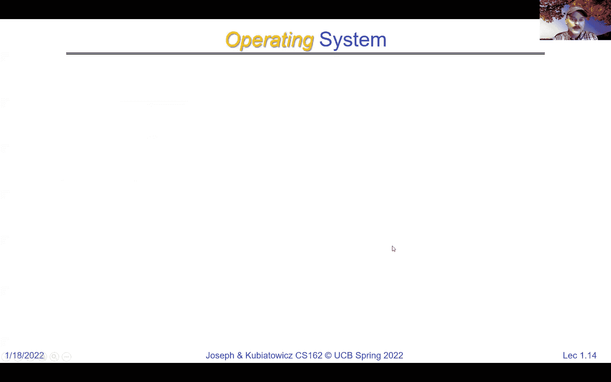

 So what does the word operating mean？ Well back in the really old days this is how people made phone calls。 There was a switchboard operator that you talked to and she or he actually plugged into。 the plug board the right pieces。

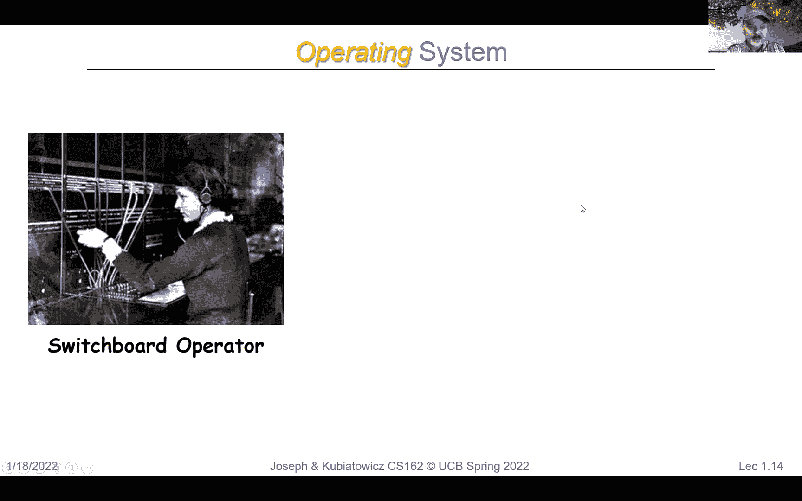

 There were computer operators once upon a time and perhaps that was what the word operator。 means but today probably people when they're talking about operating systems they are as。 we said talking about that piece of coordinating software that ties everything together and。

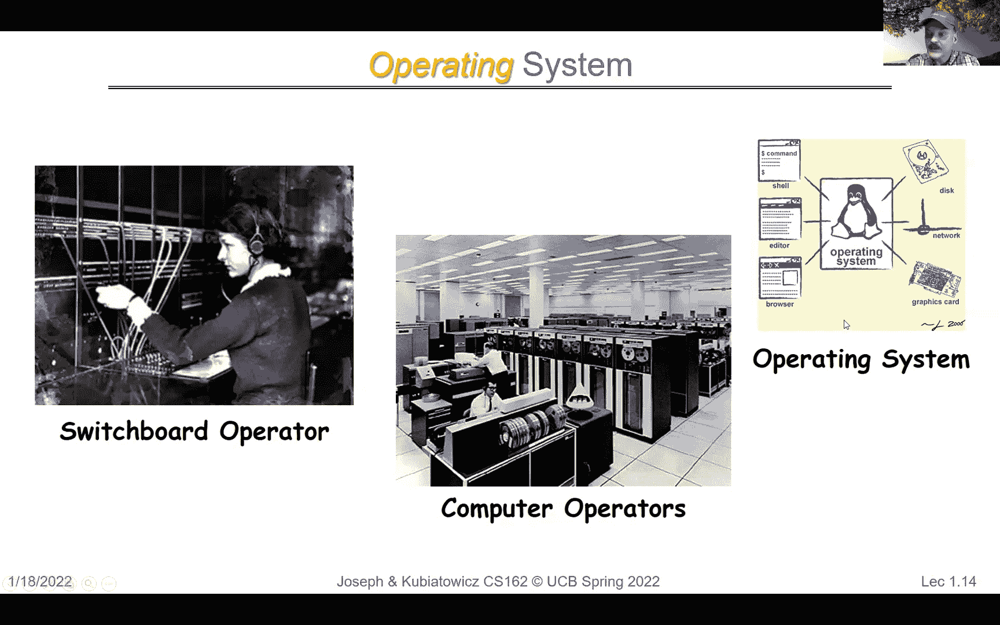

 that's going to pretty much be where we're going here。 Now what's the system portion？

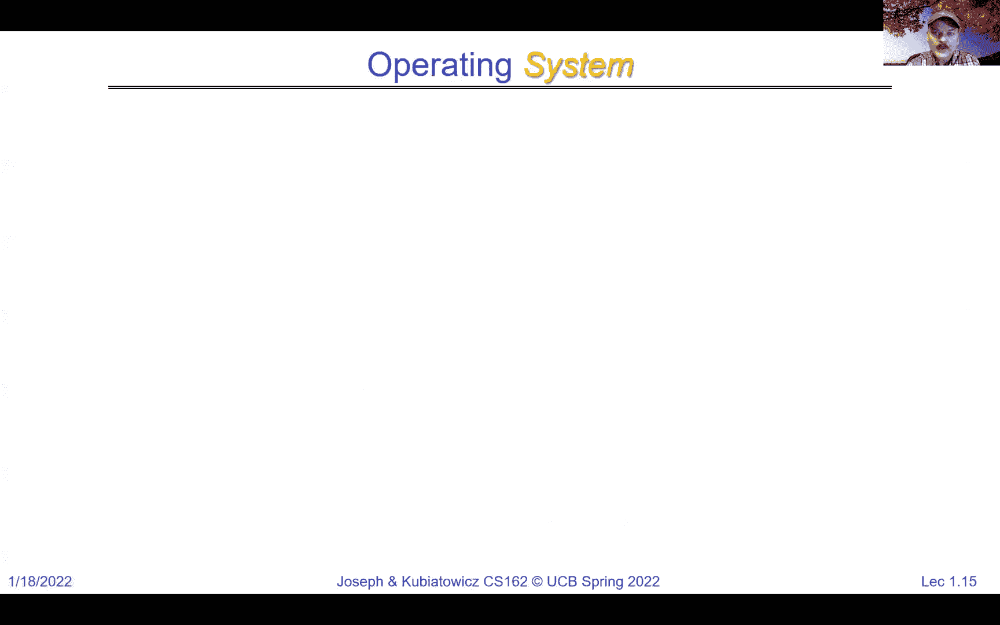

 So operating here it's the thing that's operating the hardware。

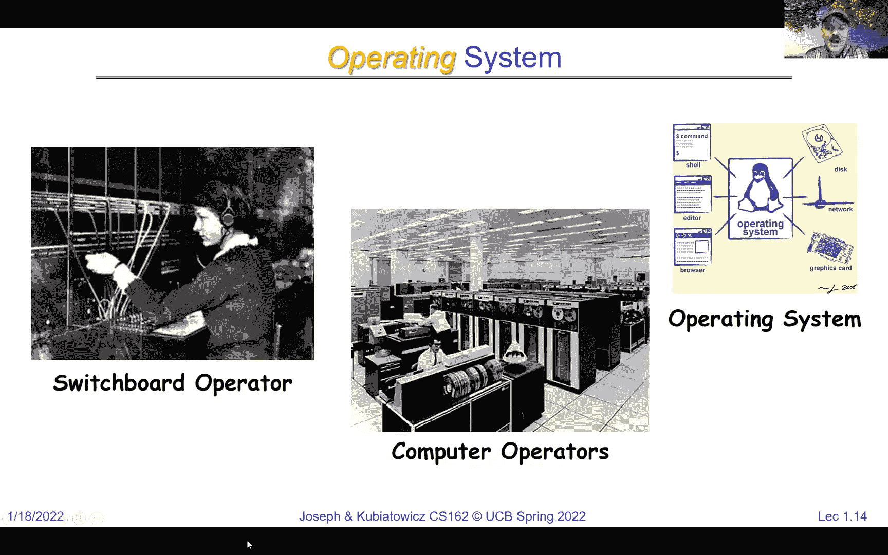

 The system portion is also an interesting question so what makes a system？

 So many interrelated parts typically make a system。 Each potentially interacts with the others and when you get a big enough system sometimes。 the actual interactions that you end with are not what you expected。 And that's kind of one of the funny aspects of having a system is when it starts to get。

 emergent behavior and some of the things we're going to talk about in this class is really。 about taming that emergent behavior and really robustness requires an engineering mindset。 which I'm hoping that Anthony and I can give you a good taste of having an engineering， mindset。 So you've got to handle errors meticulously。 You have to be careful about malicious or careless users and you have to be very careful。

 when you start getting into locking which we will to design for correctness rather than。 designing something and testing it a bunch of times and hope that you got it correct。 So we're going to be designing for a correct system。 So system programming is going to be a very important part of this class and we're going。

 to start you out actually at the very beginning getting a flavor for instance how do you talk。 to something like Linux or a Unix style operating system from the user's standpoint just to。 give you a flavor of what it looks like coming from above and then we're going to dive in。 pretty deeply and pretty quickly into what is underneath。

 So for instance we can talk about the hardware software interface which is really one would。 say a question of virtualization。 So we have this program up on top that's running and we have this complicated hardware underneath。 that we want to give access to the software so that something controlled happens right。 and so you know you've all been through 61C I'm assuming so what's in the hardware while。

 there's a processor there's some memory which can store lots of different flavors of things。 maybe some of the memory is devoted to the operating system each of these different colors。 here potentially represents a different process and that processor has a set of registers and。 those registers can be used to access memory so that it might be addresses stored in there。

 Those registers can also be stored out into memory so that we can suspend one process。 and run another thing and that's going to be part of the multiplexing multitasking that。 we're going to be talking about。 And of course there's a cache in the middle here that makes things fast and we'll talk。 a little bit about that。 Page tables that let us do translation to get virtual memory and then you know once you。

 get sort of below the processor memory level all sorts of interesting hardware come into。 place you know storage devices networks displays all sorts of things there are buses okay with。 controllers that let you control all this stuff and so if you really just looked inside the。 computer you're going to see a lot of stuff and then when you extend it out into the internet。

 there's even more stuff and the interesting question is how do you even program this the。 level of complexity is so high and so you know that's the instructions that architecture。 really helps there okay that's going to be basically taking what's inside the processor。 and giving enough standardization that a program can hope to run on top of it but it's also。

 going to be the operating system which is going to give us nice clean boundaries and。 virtualized views of that underlying hardware in order to make things work okay so what you。 learned in 61c was machine structures the C language the OS is going to take all the。 things you learned in 61c and abstracted away to help the application be easier to write okay so。

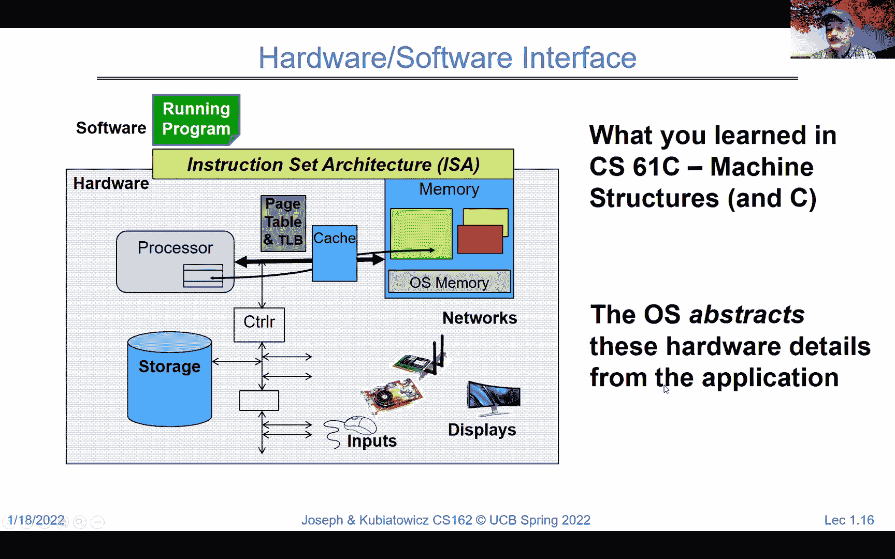

 really kind of if we were to talk more about what is in an operating system we might start with。 the notion that there's an illusionist aspect to it which is providing clean easy to use abstractions。

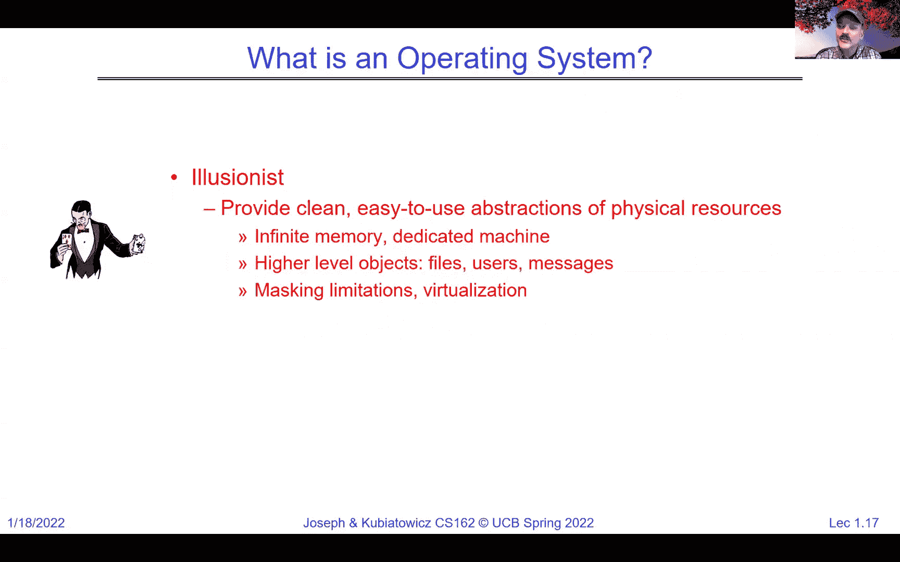

 of physical resources so if we look back at this previous slide all of these things okay many。 different devices different processors different capabilities some processors have GPU some don't。 all of that complexity needs to be virtualized in a nice clean way to make it possible to write。

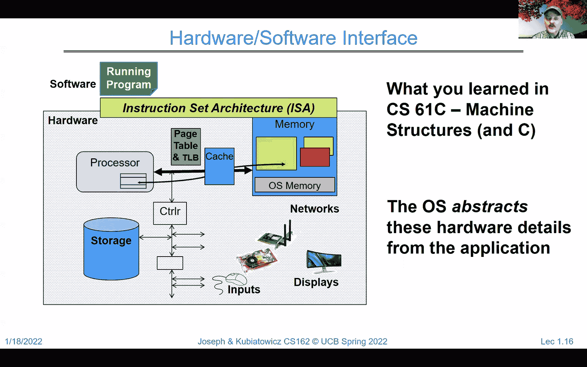

 programs and that's really the solution is thing so you're providing a clean easy to use abstraction。 of those resources and those abstractions are ones that you may use without thinking too much about。 them when you those of you that have written and compiled programs you might think of things like。 infinite memory because you're not worried about running out of memory right away you might think。

 of files and users and messages these are all things that don't actually exist in the underlying。 hardware they're they're put together by the operating system as abstractions that are easy to use okay。 so so how do we virtualize the machine well i've taken this machine here and squashed it out。 and the operating system is going to be that key piece of software running on top of the hardware。

 and making it easy for applications to work and so for instance what do we get out of the operating。 system well instead of an individual processor that is a CPU we get threads and instead of。 memory which is a bunch of bytes that aren't really tied together well we get address spaces。 which are have protection domains associated with them instead of random blocks in storage we get。

 files and there's going to be some interesting lectures that we have about storage devices and。 how we get a nice file system out of them so instead of random messages being sent over ethernet that。 can be dropped at any time we can get nice clean abstractions of sockets which are cues that you。 put messages in on one side and they show up on the other side guaranteed right and so on top of this。

 virtualized view of the hardware we can have a process which is an execution environment with。 restricted rights provided by the operating system and that process is a nice clean container okay。 it's got an address space that's a nice clean chunk of storage it's got multiple threads which。 will multiplex well on top of even a single CPU it's got those files it's got those sockets and。

 when you write programs you're writing to a process abstraction not to these individual。 complicated hardware pieces so you take your compiled program you put it on top of a process。 okay it's it's got some system libraries linked in and once you compile it and link it and start。 running it it actually becomes the process okay and so um just to state that a little bit what。

 as we go on you're going to get a better mental distinction between for instance the program。 and a process the program is a potential thing once it's instantiated and starts running it becomes。 a process okay so the application machine is the process abstraction provided by the OS。

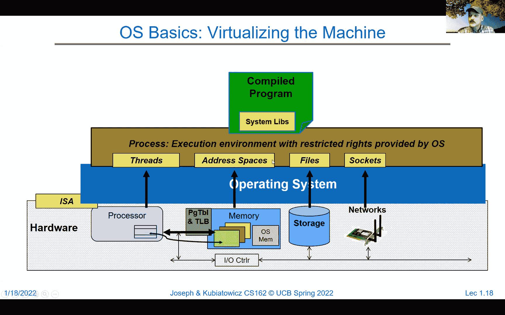

 each running programs in its own process and processes provide this nice interface。 it's nicer than raw hardware so that's the takeaway from these last couple of slides here。 and what's kind of neat about this class i think is not only are we going to talk about。 these abstractions but we're going to show you how they're implemented and you get to see。

 how we go from you know the underlying bits and blocks and complexity of the hardware。 into some programming environment that's actually usable across a variety of different machines。 and you know the programmer's view is that things are going to run into process and so they write。 some programs they compile them they link in some libraries and now as a result you've got。

 something that's going to run cleanly on top of the process abstraction for a variety of different。 hardware instances or even across different operating systems in some cases we'll talk about how that。 can work so and then of course the compiler is going to help us turn this kind of program this。 is see into a binary which is really kind of what the underlying machine really needs okay。

 i'm hoping that many of you remember the C language and the notion of compiling and linking from 61 C。 you're going to need to get on board with that really rapidly we're going to start off at a fair。 clip here in this class we will have i'll mention this later we're going to have a review session。 on the C language it's still tba but coming up late this week or next week we're going to very。

 quickly pop you in to start running basic programs and compiling things and building the operating。 system really early so that all of those easy things you're ready with so that when we start。 teaching you things you'll be able to move forward now there's good question in the chat about you。 know can i do well if i haven't taken 61 C you can it's a little challenging under some circumstances。

 you know if you're going to try to go at this without having taken 61 C i would do my best to。 to find a set of slides and review quickly okay because you're going to you're going to have to。 know some of the things about the way CPUs work and and the C language and so on right at the。 beginning it's not impossible it can be done and we also know in this class from years of teaching it。

 that 61 C is not really enough of an introduction to the C language to really have a working knowledge。 and so that's why we give you lots of resources in the first couple of weeks and hope to get you up。 to speed quickly on the C language okay so i hope i answered that question。 so what's in a process so remember the process is kind of our virtualized environment so the process。

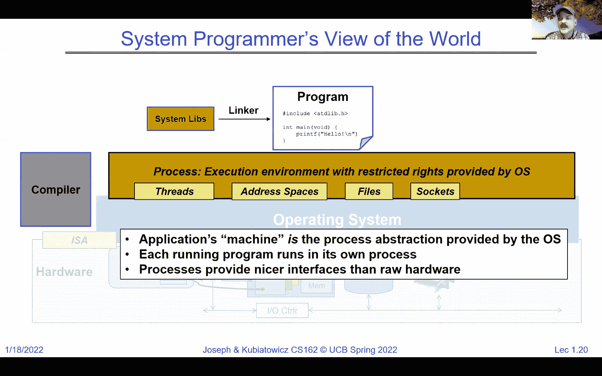

 consists of address spaces one or more threads of control executing in the address space。 and all sorts of additional system state like open files and sockets and so on and Anthony also。 mentioned you can find great ebooks on the course resources page that's true so one of the things。 thank you for bringing that up Anthony you you should all look at the resources page。

 Berkeley library digital library has a license to all of the O'Reilly books those are the cool ones。 with the animals on them and we posted a couple of good starter books on the C language and get。 off of the resources page that as long as you're coming in from a Berkeley IP address or you have a。 virtual VPN excuse me tied in to Berkeley to get to the library you should be able to access those。

 so for example so process is as we say an address space one or more threads of control and。 addition just additional system state and for example if you're on a Mac you might see this if。 you look at the set of all processes and or you can do the task manager if you're on windows or on。 Linux you can do ps uh a ux for instance we'll give you all the processes and what's interesting to note。

 here is uh even when idle there are a lot of things running on your machine and this is kind of fun。 you should take a look and see how many things are running on your machine okay many and most of。 those processes aren't running all the time they're mostly sleeping but then they wake up on some。 event and they run for a while and they go back to sleep and uh you'll get a much better idea of how。

 that all works as we uh go forward in this class so the operating systems view of the world is really。

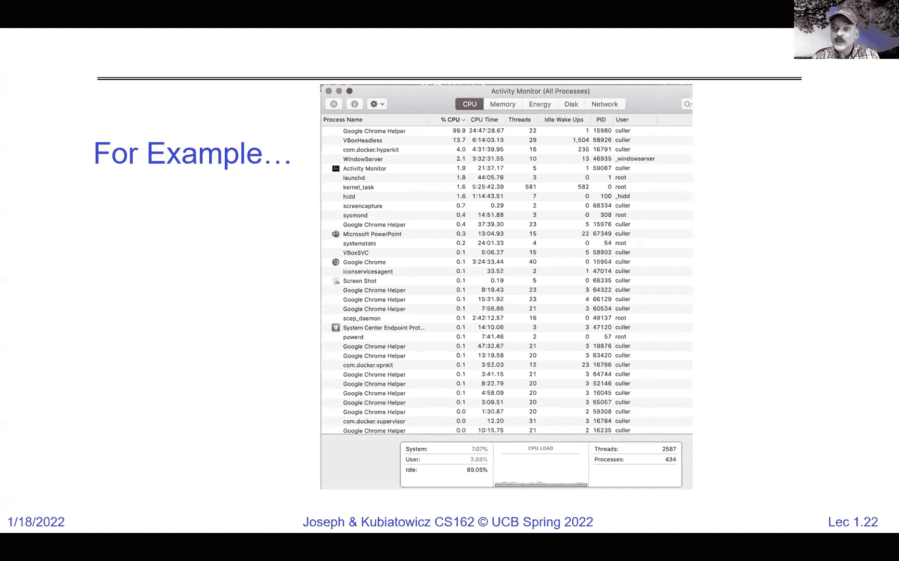

 that the operating system is uh got the hardware underneath that it controls and it's providing。 a series of processes each of which has um its own address space threads files sockets etc that are。 distinct from uh from other processes and so this is a virtualized environment um and uh we're。 going to tell you how that works as we go on okay are there any questions so far。

 okay so so the OS um so yeah good question our threads unique to processes so um each process。 has a set of threads running within them okay and the address space uh is referring to uh a。 the set of all addresses that uh can be accessed from within a process we'll make this a little。 more formal as we go on um and it's protected from the address space of uh other processes and uh so。

 by default unless you go to the trouble of of uh opening up channels the the addresses and the。 underlying memory that process one can access is actually different from the underlying memory。 process two can access and so the address spaces are going to be one of our uh key ideas for protecting。 processes from one another okay and um so uh so there are each process has a set of threads。

 and address space uh that's unique from the other ones um there's another question can a single core。 machine run multiple processes absolutely okay so we will tell you we'll teach you how that happens。 so even if you had a single core processor you could have many processes that are all appearing。 to run simultaneously that's concurrency and we'll show you how that works adding multiple cores。

 just allows more of them to be running truly at the same time rather than apparently at the same time。 okay um and so the what we're seeing here there's a question about are the process files different。 from the files that live on the disk the answer is uh what you're getting in a process is the set。 of open files that um the process has managed to talk to open those files are ultimately stored on。

 disk and so you know any file that a process has is backed by the disk we'll talk more about that。 when we get into file systems so um so the OS translates from hardware interface to application。 interface provides running program uh within each of its own processes okay so another so we've。

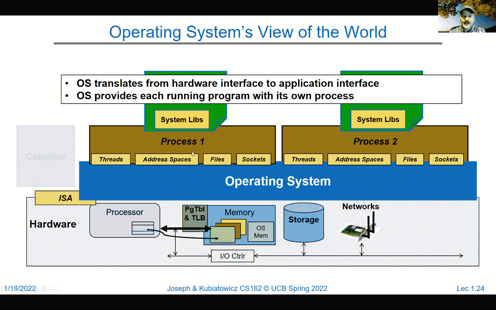

 sort of that's the illusionist idea we're virtualizing the underlying operating or the underlying hardware。

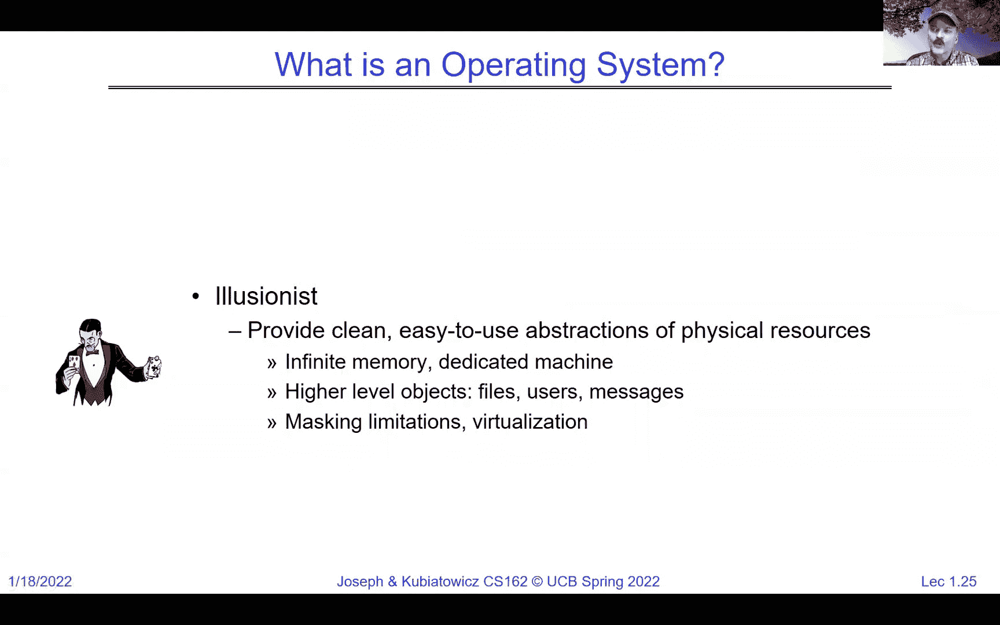

 so that when um the program is running it's got a much cleaner uh container in which to run。

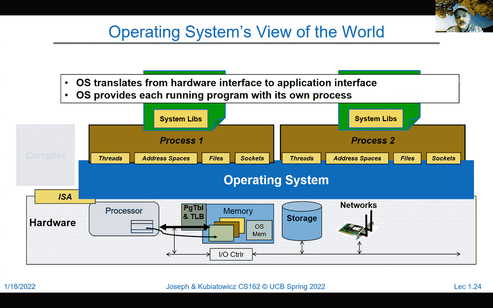

 so um another thing that operating systems do in addition to providing that illusion of nice clean。 infinite memory etc is its acts as a referee and it manages the protection isolation sharing of。 resources um handles things like resource allocation and communication between processes okay and so。 this referee aspect is really uh one of the important aspects of what it is an operating system does。

 as i've said uh for instance it protects processes from from uh overriding each other's memory or。 interfering with each other okay and if certain files are only accessible to some user then the。

 operating system is going to protect those files from other users etc okay so um what i'm showing。

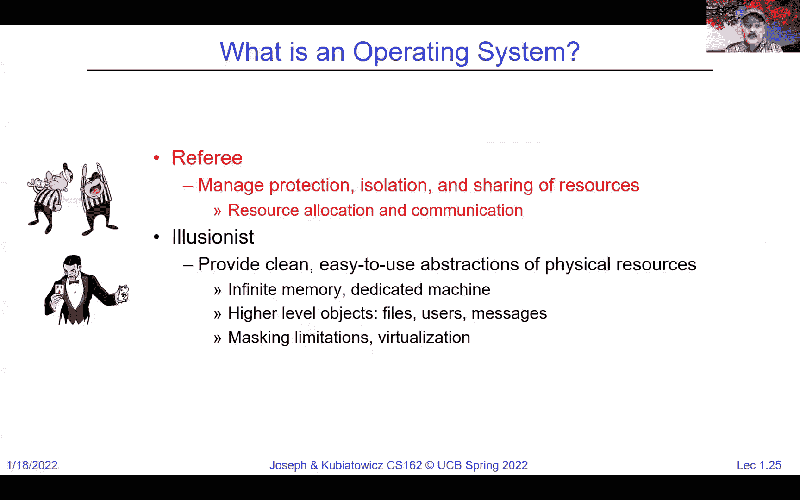

 here just to make it a little more clear is i sort of now have a brown process and a green process。 and just the the highlight and the color is really kind of showing that these are different。 protection domains and for instance right now back to that question of could a single core machine。 run uh multiple processes and then my answer was yes let's take a look at that idea so we have a。

 single core for instance processor and it's currently running the brown uh in the brown uh domain here。 or process and so there's a particular thread that's currently executing and um that current thread。 is uh got some registers and it's got some memory and that's uh this protection domain and um。 that process right now since the brown process is the one that's active if it actually tries to reach。

 out the part of memory that's owned exclusively by process two it's not going to be allowed okay and。 that's part of the protection so if we wanted then to switch so we're busy running the brown。 uh brown thread in the brown process and we want to give the green a little time to run then what do。 we have to do well we have to basically package up all the state and was there from the brown and。

 load the state from the green okay and so here i'm showing memory um remember the memory is the。 hardware piece down here and in addition there being brown exclusively owned blocks of memory。 there are some green ones that are owned exclusively by process two and so um if this brown。 thread tries to access those it's going to get what's called a segmentation fault or a page fault。

 we'll show you what the difference is and um they'll fail okay and so um really part of what the。 operating system is doing is keeping track of who owns what and if we're about to switch to let。 the green one run for a little while what do we have to do well we have to take the current versions。 of the registers and store them into memory in the o。s。

 memory probably in a in a thread uh basically， in a thread structure and then we have to load the green state in and we have to change the address。 space to be accessible to the green and then as we do all that in the operating system and then we。 let things run again and now after that's happened now the green process is uh running okay and so。 back to that question about could one single core on a on a processor do this yes that switching from。

 that core running the brown process to the core running the green process is part of what the。 operating system does okay we're gonna talk much more about that and so now let's talk about protection。 just to make this other thing clear so here's an example of the green process is running because。 it's loaded into the processor um and it's now trying to access a bunch of things including the brown。

 memory some of the o。s。 memory um maybe some storage notice that all of those things are probably or。 might be disallowed so the green thing shouldn't access brown memory the green thing shouldn't be。 able to go to o。s。 memory and modify it except for some exceptions we'll talk about later it shouldn't。 be able to go to disk uh unless it's really supposed to be owning that data and so in those。

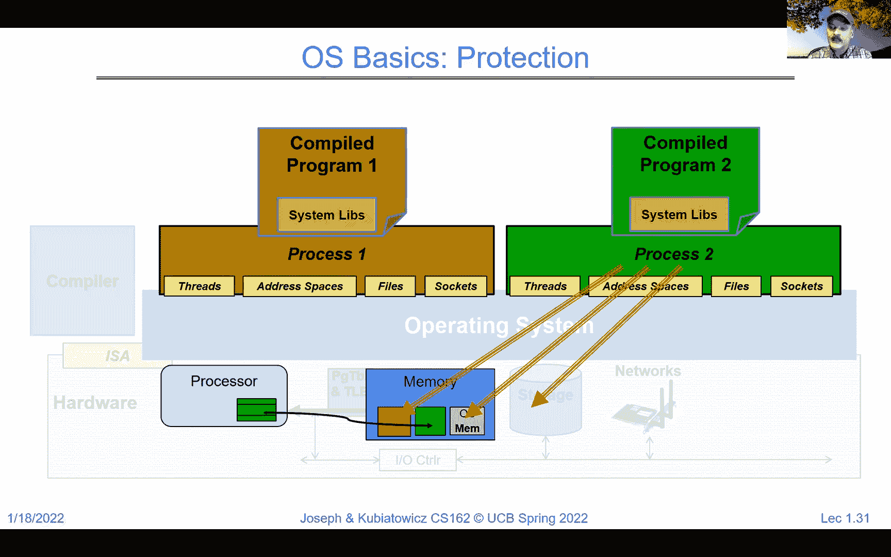

 instances what happens is the operating system kicks in and it will kill the process so that it。 doesn't get to do those uh misallowed accesses okay disallowed accesses and you'll get something。 called the segmentation fault and that process will also will actually be uh stopped and um。 typically some debugging state might be dumped out okay were there any questions on this。

 I see that Anthony's running a some answers to questions on the chat too that's great。 okay so um I guess the question is about virtual box we'll let Anthony keep going on those so um。

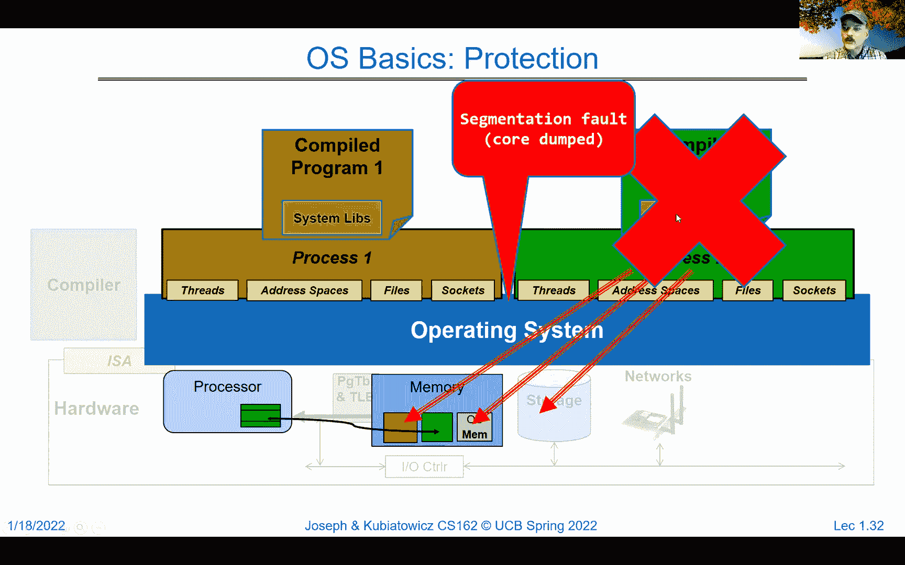

 so back to to our protection idea here so now i'm showing a bunch of processes um and uh one。 processor or one core let's say and now there's going to be a protection boundary uh and all of。 those things underneath the covers the disks the displays the networks the buses all of that stuff。 is going to have a protection boundary um put in put together by the operating system to make sure。

 that these processes only access the things that they're supposed to okay so the o。s。 isolates。 processes from each other it isolates itself from other processes okay so um that means that a。 process can't trash operating system memory and even though everything is running on one。 processor in this instance that i've shown you we can do all of this protection okay。

 so um now moving right along。

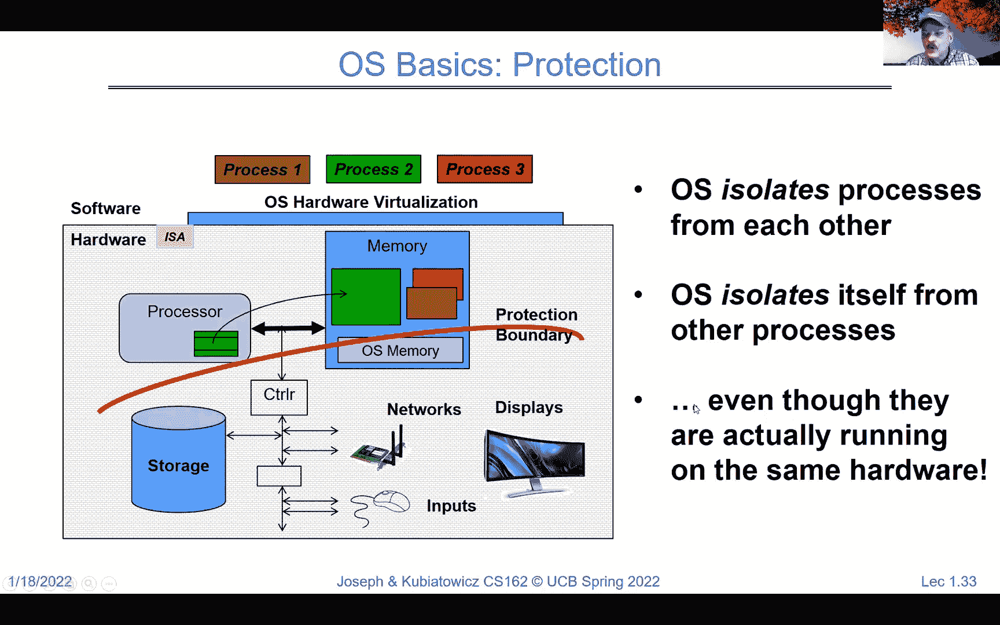

 that's the idea of a referee um finally an operating system uh yes is that's a good question there。

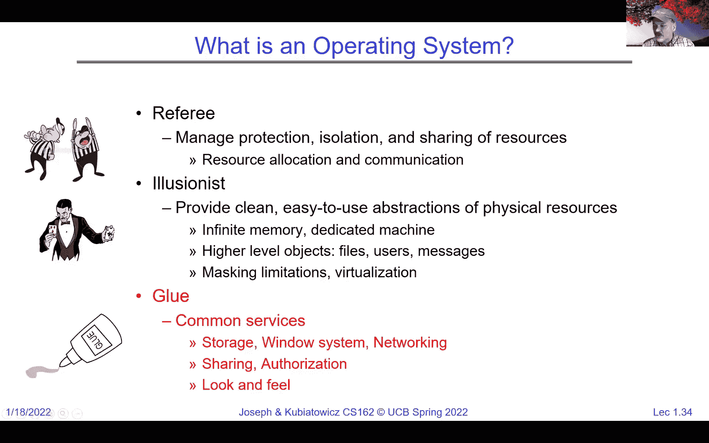

 is the o。s。 a process in and of itself so um yes and no and that's one of those things where。 different people might disagree what it's meant by there being a process i will tell you that the o。s， has multiple threads that are running and they're at higher privilege than all of the process threads。 and so there there's a lot of different things going on in parallel in the o。s。

 and they have control， of a lot more things um typically we don't call that a process that's part of the operating system。 but there certainly are o。s。 threads that are running um and you could ask me that question again。 in a week or two and maybe we could have more of an argument about that but just to close this out。 rather than saying that the o。s。 is a process um in this instance in way i'm talking about the o。s。

 has a bunch of threads that are all working at really high privilege inside um and helping to。 produce this virtual view to all of the processes above so finally this idea of o。s。 is glue so the。

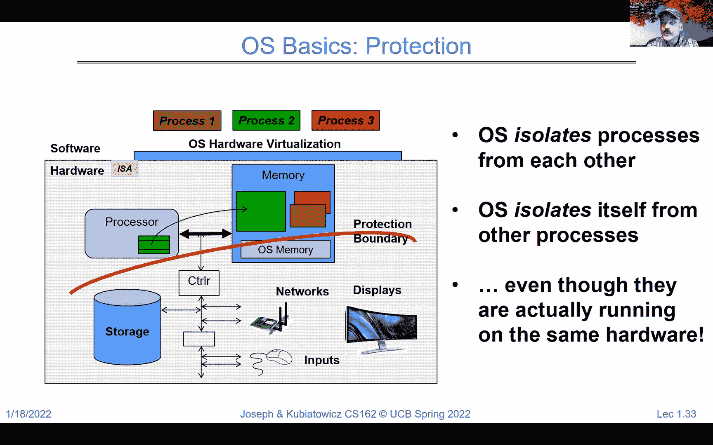

 operating system uh being an illusionist and a referee uh these things are often nobody would。 disagree with those being part of the operating system what's interesting is once we start talking。 about glue um that's when some of the disagreements come up glue is really things that help uh make it。 easy for programmers to use the underlying hardware okay and those glue glue is really about common。

 services such as taking storage and turning it into files providing a windowing system providing。 networking uh where you can actually transmit bits from you know Berkeley to Beijing and back and。 they actually make it there these are services that programmers find useful um and uh different。 operating systems and even different versions of the same operating system might differ in what。

 services they'll provide okay but um in general o。s。 is provide libraries and running services that。 help to make things easier for programmers uh to use the system okay and um the question here about。 do cores have dedicated hardware to run o。s。 threads so typically not okay typically what happens is。 the same cores that we're running the user level processes will start running the o。s。 ones when a。

 timer goes off and things start running or when the o。s。 when the process uh that's running user code， or application code makes a system call into the kernel then things will start running uh the o。s。 threads will start running on the cores etc。 so um we will uh get into a lot more of these details。 okay so you'll you'll have a much better idea how this happens once we start diving into it um so。

 good question though one that i do want to answer right now which is how does the o。s。 trust a process， to return control to it and the answer is it doesn't okay and in fact what happens is the o。s。 has control， over timers that will go off and automatically transfer control back to the operating system。 regardless of what the user is doing and so the user program could be uh busy computing the last。

 digit of pi which is one of my favorite things to do and um the operating system will still get uh。 to go again when the when the timer goes off okay and um we'll get into what syscalls and so on our。 later um but just as a quick answer here syscalls are not what timers are syscalls are when the uh。 user program actually accesses services so when it makes a file system read or write call that's a。

 system call and we'll show you how that works so i。o as we've been alluding to is an important part。

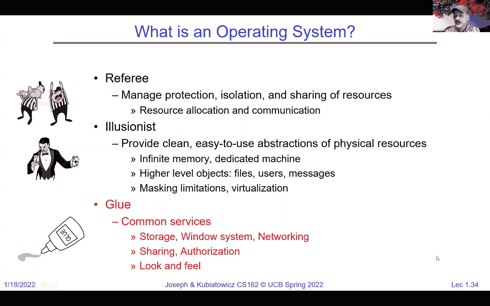

 of what an operating system handles and so really it's again turning the complexity of the hardware。 underneath into a nice clean abstraction layer okay and so for instance um when we start a program。 running uh we might pull parts of that program off of storage and bring it into memory so。 that it can start executing um or when we're um you know communicating remotely to Beijing say from。

 Berkeley uh again the OS is going to help uh coordinate that i。o so that um the what we think we're doing， is sending a byte stream actually gets transmitted as a set of packets over wireless or wired networks。 many hops in the middle of the internet to the destination uh over in Beijing for instance that's。 all handled uh by the OS as well okay and so that's another one of those common services that is。

 typical okay and uh there are many i。o services so um you know finally we've got the the look and feel。

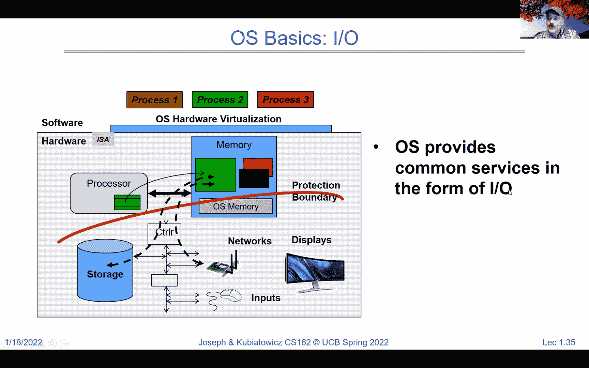

 uh of a typical machine you're all aware of you know you've got your cell phone you've got your。 laptop it provides a set of windows the ways to do cut and paste and so on that's typically the。 look and feel and in um many instances there are at least libraries that provide this windowing。 sometimes that windowing is in the operating system and um we will talk more about this as we go。

 forward as well um just as an interesting little bit on that um windows NT back in the early 2000s。 was a micro kernel operating system that actually had windowing and everything outside the kernel。 and that ended up being too expensive and uh from a time standpoint and so as a result Microsoft。 moved its windowing back inside the kernel of the operating system and that actually uh for time。

 made it less stable and so sort of questions about whether something's in or outside the OS。 is an interesting question which we'll touch on as the term goes on as well。 there was a good question uh there about an alternative to time-based multiplexing。 um you should all look at the chat there Anthony's talking about the fact that OS is actually。

 multiplex in time and space and the way to think about that is really that memory some notice this。 memory has some uh memory devoted to different processes and if we have more than one core。 then we can actually have different cores running on things that are in different parts of the。 memory or different parts of the storage simultaneously and the OS is going to manage that as well。

 okay um and by the way for those of you that are worried that this is getting too complex too quickly。 I will tell you that we're going to um sort of throw out multiple cores at the beginning and just。 think about one process running or excuse me one core with multiple processes running on top of it。 to get that really settled in your mind and then we'll bring in uh multi-core after that because。

 it's really an easy addition once you understand how to make one core work um and then also uh the。 OS often handles battery management power managing so on okay so lots of management management。

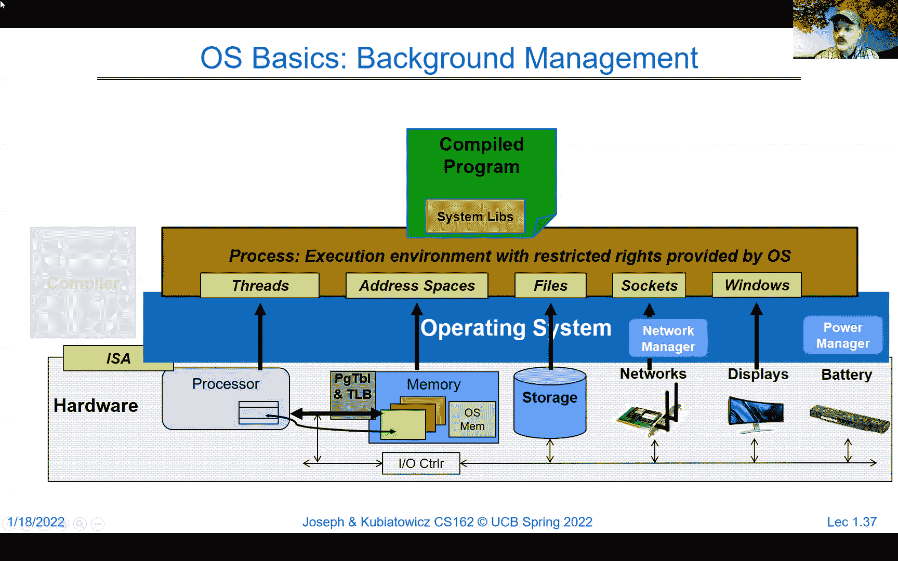

 so if we were to put all these together you know what's an operating system it's a referee。 an illusionist and glue okay so those three things um will come up many times this term um as we talk。 about different aspects of operating systems and in many cases you're actually uh let's see here yeah。 you're actually going to implement parts of all three of these things uh in the operating system in。

 your groups as the term goes on and so you're going to get a really nice internal view of how。 these things are provided by operating systems all right so why take 61c other than the fact that。 it's cool and the faculty who teach it are cool there might be other reasons right so one of them is。 some of you might actually design and build operating systems uh in your career okay and。

 and it's possible more than ever now because we're getting these embedded uh internet of things。 style devices where in some cases people design their own little pieces of operating systems from。 the ground up uh just because these devices are limited um or you may end up uh working deep。 inside of Linux uh at a startup who knows so it's good to really have a good idea what's going on。

 certainly many if not all of you are going to be creating big systems that utilize some of。 the core concepts here okay and so when you're designing the next big thing uh cloud system whatever。 um you're going to uh basically want to know what's happening under the cover so you can do a better。 job of it okay doesn't matter whether you build hardware or software kind of the concepts you get。

 in 162 are really going to help out um there was a good question why not use rust uh rust has a very。 steep learning curve and is an awesome language but we're going to stick to see for now because it's。 more common so far in the operating system domain but i have to be happy to talk to you about rust。 in office hours if you want to come by and chat so all of you are certainly going to build。

 applications that utilize operating systems okay and the better you understand them the better you。 will be able to use them okay so let me say now we'll say a little bit about who we are so whom i i'm。 john kubital it's most people call me uh kuby maybe because they can't pronounce my last name um。 it's uh i have a background in hardware design i was uh working on the alwatt project at mit um as a。

 graduate student here's my chip this was the communication and memory management unit that i。 designed and this was one of the first parallel systems that had both shared memory and message。 passing in one uh in one system i have a strong background in operating systems as well so i worked。 uh at project athena uh as an o。s developer at mit i did device drivers and network file systems。

 i worked on clustered high availability systems as well back in the day um。 tessellation here is an operating system that um i helped develop uh for um the par lab here at。 berkeley um i did a lot of work on peer-to-peer systems um and uh one of the first things i did。 here at berkeley was the ocean store project uh where among other things we talked about storing。

 our data for thousands of years um and uh develop some uh different interesting peer-to-peer systems。 like tapestry and bamboo and it was one of the first cloud storage projects uh back before the。 cloud and athenaic has just uh popped on here he also was part of ocean store which was uh fun at。 the time um and um i'm also do quantum computing which is going to be less relevant to this particular。

 uh class but um we're exploring architectures for quantum computers and CAD tools for designing them。 um most recently i've been part of the swarm lab or berkeley lab for the intelligent edge uh and i。 have a project called global data plane um and uh storage uh containers called data capsules we'll。 talk a lot more about that uh anthony also works with me on that project um and we have some things。

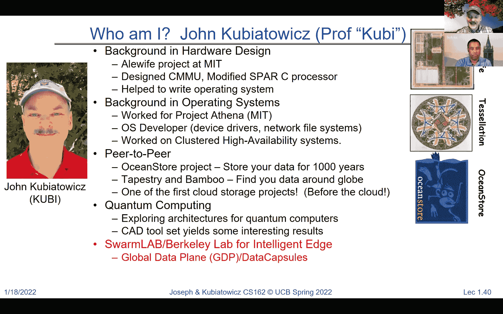

 that we look at uh robotics on the edge with a project we call fog robotics okay and um part of。 this data capsules uh the intuition here is really these storage containers that you see。 uh down at the port of oakland in which i've been sitting in ships uh for uh the last uh six months。 basically that's our inspiration behind these uh data capsules which are cryptographically。

 hardened containers of data and um we'll definitely talk about that later in the term so uh go ahead。 anthony here's uh who is he there he is well who am i i'm anthony joseph i'm a chance。 was professor in ekes i sit in the rise lab i'm part of uh the rise lab and i recently took on the role。 of faculty director for the college of engineering's fung institute for engineering leadership。

 so i work on a number of different research areas as kuby mentioned i'm part of fog robotics。 and gdp i also work on machine learning and in particular secure machine learning so that's。 where you have machine learning in the presence of adversaries so you're trying to make decisions。 like for example of something uh malware or not and an adversary knows that you're using machine。

 learning and they're trying to manipulate that answer so that for example their malware is classified。 as non-malicious i also cooperate the detour security cybersecurity test bed that's the world's。 largest public cybersecurity test bed and it's used by industry by government researchers and。 it's used to teach a lot of students at a lot of different universities and colleges。

 previously i've worked on a bunch of different projects in the system space so for example。 moden which is a drop-in replacement for the pandas python library it delivers up to 100x。 performance and allows you to take advantage of the fact that modern CPUs are multi-core and we have。 tens to hundreds of gigabytes of memory available on machines i also work on cloud computing uh so。

 patchy mesos was one of the projects we developed here at berkeley and it's a a project that lets you。 basically manage applications running on very large clusters of machines also i work in。 computational biology so we developed pipelines for being able to process whole human genome。 sequences at 250 gigabytes a pop that's a lot of data when you look at population scale numbers of。

 say 10，000 genomes you're talking about anywhere from terabytes to petabytes of data that you want。 to work with so we made it very efficient to be able to work with those large data sets also as。 could be mentioned we had a project together tapestry and peer-to-peer networking i've also worked on。 mobile computing and wireless and cellular networking some of the outside activities i've done so this。

 hybrid format is something i'm very familiar with so back in 2015 and 2016 we created a set of five。 different courses on working with big data and Apache spark we enrolled over 240，000 students and。 had completion rates of 11 to 15 percent which is pretty surprising because typical completion rates。 are around 3 percent i'm also co-founder of a startup in the life sciences space called。

 in iGenomics and it's basically taking the work that we did in amp lab and rise around computational。 biology and commercializing that technology and so we work on treatments for rare diseases so with。 that i'll turn it back over to kuby and before we lose Anthony just so you know we're gonna we're。 gonna we haven't come up with the exact alternating plan here yet but you'll get to have some lectures。

 from Anthony as well so he'll be a great addition here a lot from me yes indeed。

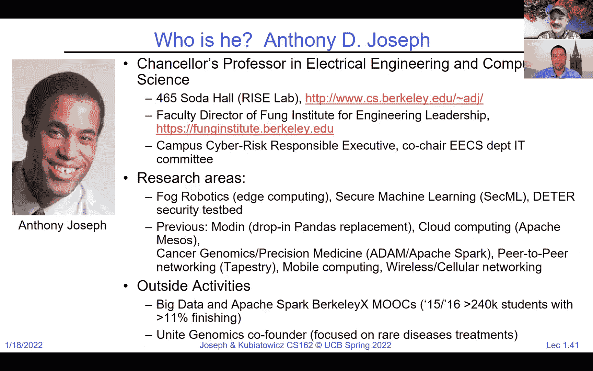

 all right so we also have some tas that you're going to get to know very well。 and rather than having them come today since everything's virtual i figure in our first in-person。 class they will come to there and we'll introduce them but you'll be interacting with them in these。

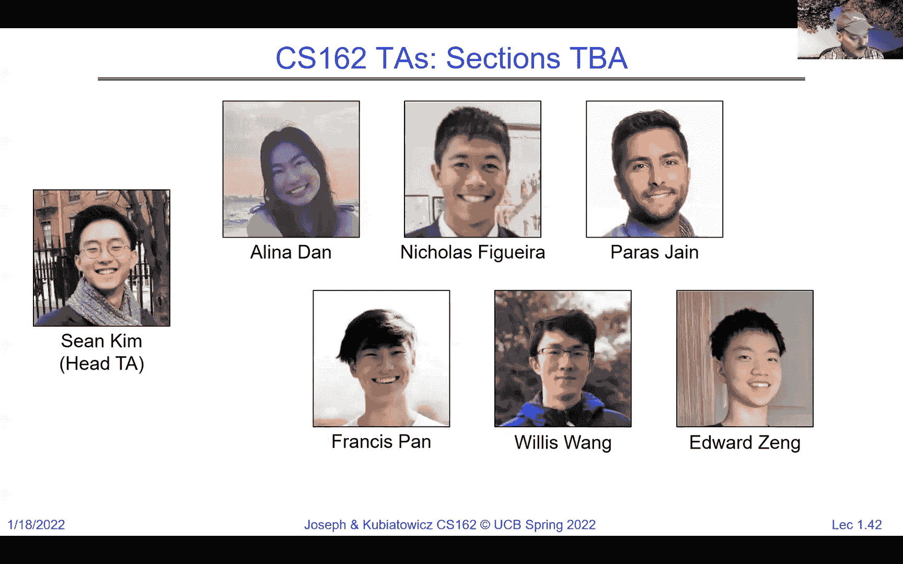

 first couple of weeks even already so about enrollment you know i figured i should say something about。 this we've gotten lots of email unfortunately this class is very limited this term more so than it has。 been in the past for various reasons right now the class is still paying at 327 students。 however we're working on securing another section which might let a few more students in。

 so be watching that but please don't email us for special reordering on the waitlist or whatever。 because Anthony and i don't really have any control over what order people get in。 but it's it's extremely limited and like i said there may be another section we're putting together。 it's very important to note that this is an early drop deadline class which means that。

 the drop day is the Friday of the second week okay so that's coming up on the 28th。 if you know we have a lot of people trying to get in this class if you're not serious about taking。 the class please drop early because the department's going to continue to admit students as other。 students drop and so you'll let people that are trying to get in the class get in and we will close。

 off the waitlist sometime in the next couple weeks and you know we want to make sure that everybody who。 can get in can get in and in theory if you stick around for the first two weeks it's going to be。 heart much harder to drop and the reason we do that is because you're going to be part of project。 teams we're going to ask you at the beginning of the third week to put together your team and。

 we want to make sure that teams stay functional without losing members so think carefully about this。 and really only come to stick around the next two weeks and join up with project groups if you're。 really intending to be here for the long haul okay and you know with that being said we're going to。 keep trying to bring people in so if you're on the waitlist or your concurrent enrollment or whatever。

 you got to be doing the work because if you don't you know you might have us let you in the class。 and you'll be we'll be lost at that point every year that I teach this every term I teach this。 there is somebody who forgot that they were on the waitlist and weren't doing any work and kind。 of figured they weren't in the class and they discover sometimes not until you know weeks or。

 months into the term that they're still in the class and that gets tricky to drop at that point。 so just you know if you're on the waitlist do the work if you're not intending to keep the class。 make sure you get off the waitlist okay are there any questions on that。 and as far as the question about piazza so everybody who has the potential to get in the class。

 should potentially have been added to the class unless you're concurrent enrollment and we may be。 fixing that soon as well so just because you're able to access piazza and our autograder by the。 way doesn't mean you're in the class only the enrollment that's officially there you have to go to。 to the the university sites there to figure out whether you're in the class or not that tells you。

 whether you're actually in the class but if there's a potential for you to be in there please do the。 work okay are we good on that all right so infrastructure the website is cs162。ecs。berkeley。edu。 we also have cs162。org as well and the piazza is linked is linked off the home page we're going to。 be putting the lecture recordings tentatively up on the home page we hope to be able to maybe。

 continue with this throughout the term but you know we're all hoping that this everything becomes。 back in person shortly okay i see somebody asking about the course calendar so if you're。 are on the home page and you can't view the course calendar that's likely because you are in incognito。 mode you're going to need to be logged in as as a student okay so our textbook is uh。

 Anderson and Dallin operating systems principles and practice the home page has our schedule on and。 also has suggested readings this is one of the better textbooks that we found and so。 i would say people learn in different ways reading the suggested chapters out of this book。 might be your thing and i would actually recommend it because it's a pretty good book。

 we also have some additional ones supplementary material that you could get at。 operating systems three easy pieces there's Linux development third edition by Robert Love。 we also have some other things that are linked off of the resources page some more Riley books。 to help you along as well okay and there's also the latter teaching of C which is available off。

 the resources page as well okay and i even put up some research papers occasionally on resources。 and i'll reference them throughout the term to get a little bit of a flavor for where some of。 these ideas came from okay so our syllabus is the following we're going to talk a lot about。

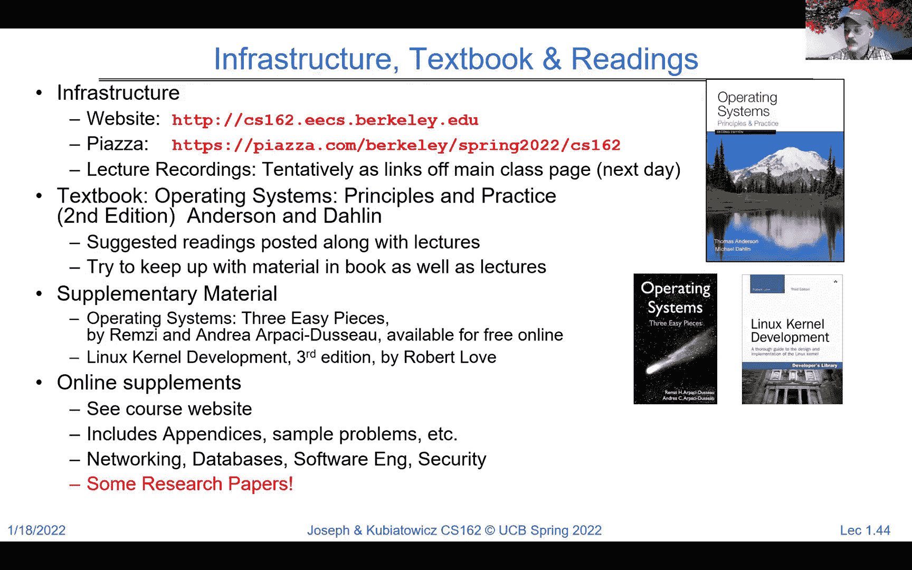

 OS concepts how to navigate as a system programmer so we're going to start off with things like what's。 process IO networks virtual machines and then we're going to learn about concurrency so we had a。 lot of questions from people today about can one CPU can one CPU have multiple processes etc and the。 answer which we said many times was yes and we're going to show you basically how you can get。

 threads scheduling locks deadlock scalability fairness etc so from the one end of the spectrum。 is how to get one end of the spectrum is how to get concurrency out of a single processor the。 other end is how to program with locking and so on and so there's going to be a number of weeks where。 we where we work you through some of these ideas part of that's going to be what's the address space。

 is really and we're going to talk about virtual memory and address translation。 protection sharing these are all 61 C concepts which we're going to remind you of we're going to。 talk about file systems and fascinatingly you know how do you go from individual blocks on a disc to。 something you can think of as a file that contains a video or something and is in a you know a。

 directory that has a long path name we're going to talk all through all those details and different。 file systems as well so we'll start with IO devices and then we'll work our way all the way up to files。 transactions databases etc okay and we're going to then toward the end of the class we'll start talking。 about big distributed systems so I started today talking about the wonders of the internet and。

 tying you know sort of every device in the world into the internet and once you've got that that's a。 huge distributed system and while this class starts in the small we look at sort of small。 systems on single nodes we're going to expand our way way up to all sorts of distributed systems。 protocols RPC NFS distributed hash tables we'll talk about consistency scalability multicast。

 and you know cloud computing and sprinkled in through all of this but especially as we get。 toward the end it's going to be things about reliability and security we'll talk about fault。 tolerance protection talk about logging and how that can help and so on for reliability okay and clouds。 all right this is a learn by doing class so be prepared to not only do your academic studies。

 but you're going to be programming and working in team so we have both individual homeworks。 which are done by yourself which help teach you kind of tools of the trade and individual ideas。 sockets thread programming and so on and group projects okay and notice that there's a homework。 zero and a project zero these are very important because they you do these in the first couple of。

 weeks so you should look at the schedule we're going to start you off by with homework zero right away。 and project zero which doesn't need a group yet it's going to be you done in your own and these。 in homework zero project zero are all about you learning our infrastructure so that you can hit。 the ground running and really get moving with this class okay and so the group projects are。

 going to be the other ones one two and three are actually going to be in groups of four and you're。 going to start off on the beginning of the third week by telling us what groups you know who's in。 your group and what your preferences are for sections and so on and then you're going to be。 working with your group the rest of the term to develop some things inside the operating system。

 okay and so these group projects have four members you know I like to think it's。 thou shalt only do four you should not do three and you should not do five right you're going to do。 four members and you're basically learning about how things work in the real world and we need to。 make sure that you're all in the same section or at least have the same TA so we have some。

 some cases in which we have to spread people out a little bit but really this is going to be about。 you making sure you should have one TA that was able to know how you guys are doing okay。 and communication and cooperation is going to be essential so you know I'm going to reiterate。 this and Anthony will reiterate this throughout the term but you need to set up regular meetings。

 with your group and what's hopefully awesome about this term we will have to keep our fingers crossed。 as we'll be in person for the first time in almost two years and really sitting down at a cafe。 okay we've got that cool little cafe and ancivari these days or you know whatever and talking with。 your group members is going to be essential to having a smooth to have a smooth group interaction。

 okay and together you'll work on your design documents and really I really talk a lot about。 face-to-face because however good our social media apps are Slack， Messenger， Facebook。 whatever your， favorite thing is it really doesn't replace face-to-face and I've had many dysfunctional groups over the。 years and they were all people that somehow all groups that didn't meet regularly and you know。

 only used email and then got upset when things weren't understood by other partners and whatever so。 plan on really meeting your team regularly okay there's a question about discussion sessions。 are they only on Thursday and Friday well right now there's actually sections on Wednesday。 Thursday and Friday we are trying to fix that because we'd like everything to be on Friday。

 if we could because then it makes what you learn in section a little easier with respect to the。 lectures but certainly drop us a note on piazza if you have a strong preference for something other。 than Friday but right now we do have a few sections on Wednesday and Thursday everyone in these groups。 should have clear responsibilities you'll evaluate your teammates at the end of each project to kind。

 of say what your view was about how they do we'll talk more about that at the end of project one。 and you're going to learn basically about how to work as a team and typically people who try to。 divide things up by task oh yeah you do you know bullets one two and three and i'll do bullets four。 five and six really doesn't work well and you'll see why that is as we get a little further in。

 because you know you go off your separate ways and you come back and they don't integrate properly。 and you know then you got a panic and figure out what to do so there is a question about will。 things still be recorded if we're in person so we are set up for screencast so yes i think。 the other thing is we might do this zoom kind of thing even in person we're not quite sure yet that's。

 going to depend on how resources go you should try even when things are recorded though to come to。 to lecture because then you can actually ask questions and see how things are going。 you know group projects are also about communicating with a supervisor like you wouldn't。 the real world and that's going to be your TA and so we'll talk more about how to make this work but。

 the group projects are essential to this class and they are a little slice of reality okay。 so getting started everyone doesn't matter whether you're on the waitlist or in concurrent。 enrollment if you have the chance of getting into this class start homework zero right away。 okay if it's not up yet it's going to be up today i think um project zero will be early next week。

 get going on that as well okay oh and uh hear from the TAs that homework zero is already out good。 it'll help you do things like get your github account set up the virtual machine environment。 get familiar with all the tools how to submit to the autograder etc okay um first two weeks you can。 attend any section you want i think we'll give more details on piazza about this but once we form。

 groups then the section attendance is going to be mandatory um and because we want to make sure that。 again that your TA knows how you're doing and also it's important to go to section so you can get。 your questions answered because we don't want anybody lost this is the uh no student left behind。 kind of mode here okay um so projects are going to be choir uh programming in C and so you're going。

 to need to be comfortable with pointers you're going to be need to be comfortable with memory。 management and debugging with gdb um and so this is going to be a larger and more sophisticated。 code base than you ever ran into in 61c um so one of the things that we haven't posted exactly when。 yet but it's coming up in the next two weeks is a review session on the C language to kind of。

 give you a bunch of things to think about but we also have uh resources on the course website。 we have ebooks on git and C there's a programming reference still in beta that was written by folks。 at Berkeley uh which is basically in the uh ladder uh slash ladder and uh first two uh sections are。 also going to have some dedication to programming and debugging review okay so the tentative breakdown。

 for grading is 36% uh over three midterms 12% each um the tentative days are thurs our thurs days。 two seventeen three seventeen four twenty eight um time is uh not quite yet set it's going to depend。 on when we can get rooms and uh the midterms are um mostly going to be focused on the piece that was。 in that midterm chunk so thinking this is dividing the term into three pieces but we're going to。

 assume that you remember everything from the previous midterm because uh there may be questions。 that have a context based on previous things so the midterms are certainly going to be focused on。 the new material but you uh maybe ask things having to do with previous material um all right and uh。 36% on projects 18% on homework etc okay um participation is going to matter so that's another。

 reason for going to section okay etc so the other thing we always have to talk about is there is。 the personal integrity uh student honor code which is you know as a member of the UC Berkeley community。 I act with honesty integrity and respect for others okay so explaining it you got to be careful all。 right do not just give people your answers don't copy answers from other people because we're running。

 software tools to catch that sort of thing and it's also very dishonest okay so explaining a concept。 somebody in another group uh might be okay conceptually discussing maybe algorithms or testing strategies。 might be okay discussing debugging approaches with other groups okay searching online for generic。 algorithms uh these things are probably okay okay what's not okay is sharing code or test cases with。

 other groups uh copying or reading other groups okay copying or reading online code or test cases。 from prior years okay helping somebody in another group to debug their code okay we had we've had。 situations in the past where somebody from one group sat down with another group and helped them。 debug okay and the net effect was both groups got kind of tied into a into a cheating scandal okay。

 so you do not want to do that um and it's it's not honest either okay。 so if you're not sure certainly ask your TA whether something's okay but we're going to be。 running comparisons of project submissions and homework submissions against prior years and so。 just do your own work thanks everything easier for everybody okay。

 you know and don't put a friend in a bad position by asking for help that they shouldn't give okay。 we've we've had you know students get tied up because they were gilted into giving somebody their。 answers we're just just don't do that to your friend okay so goals from lecture interactive okay。 ask questions in the chat for now but as we go forward um you'll get to actually hopefully ask。

 them in person all right um you know let's finish up here we have a few more minutes but。 just uh unless they're actually i'm going to pause for a moment and see are there any more。 questions about adminest trivia there is somebody who asked should they start looking for a group。 even though they're on the waitlist you know i would watch where you are on the waitlist and maybe。

 start thinking about who you might want to work with um you know we don't form our groups until after。 we close out the waitlist but um you know it wouldn't hurt to know somebody uh that you're thinking you。 might want to work with so if you're on the waitlist you're not in the class it's possible still that。 you could get in it's also possible you might not so um and the question is is the participation grade。

 just from section attendance um it's section attendance it's uh office hours it's um potentially。 class attendance uh maybe we might do that um we'll let you know but just participate and we'll be。 watching okay so to close out today uh you know what makes an operating system is exciting and。

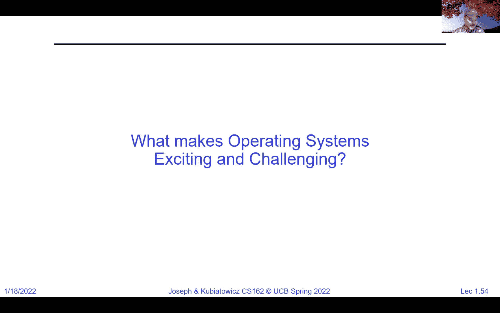

 challenging um one of the things i like this picture okay because this is really talking about the world。 as a single huge system okay from little mem sensors this is a um a micro uh i don't know insect。 that can walk that was actually fabricated out of silicon um cars you know you start talking about。 Teslas these days that are constantly tied in all the time and getting updates continuously。

 you've got big cloud systems you've got huge clusters really the world is one big system and。 that's exciting because uh there are first of all how do you make this work but secondly there are。 all these interesting emergent effects when lots of things are talking to other things and the。 complexity of the system starts giving an interesting behavior that you weren't expecting now sometimes。

 that behavior is good sometimes that behavior is not good um and so you know most of what we do in。 this class we'll be talking about how to um to uh rein in the complexity to try to get a predictive。 response out of things but um it's still quite interesting okay um you know the other thing is。

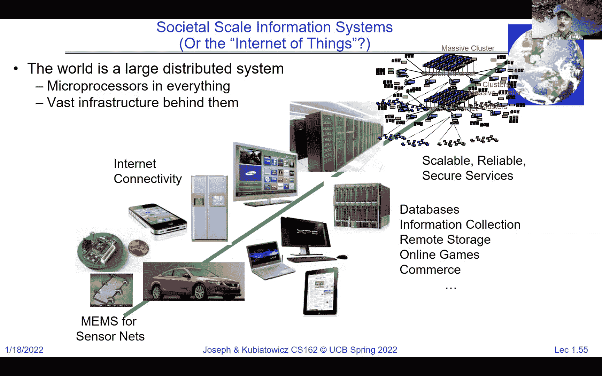

 really technology trends with Moore's law um here's a you've heard Moore's law probably from the day。 you got here to Berkeley and if you kind of look really what was interesting was if you look at。 this graph over in the left um Gordon Moore was asked at a conference back when the 4004 was the。 most sophisticated thing uh out there you know what's going to happen in the future and he drew a couple。

 of points on a log linear scale and he drew a line he said this is going to happen now that's。 on the one hand patently ridiculous because it's a couple of points on a log linear scale means。 that drawing a straight line was predicting exponential growth uh but it was true okay and for many many。 many years Moore's law was it okay which is pretty exciting uh that we've had this uh doubling in the。

 number of transistors that went on for years okay it's been slowing down of late but that means。 the complexity of the individual components growing at a rapid pace uh leading to the complexity of。 the world system growing at a at a rapid pace leading to a need for good operating systems design and。 you guys to be able to help with that okay um one of the big challenges that happened along。

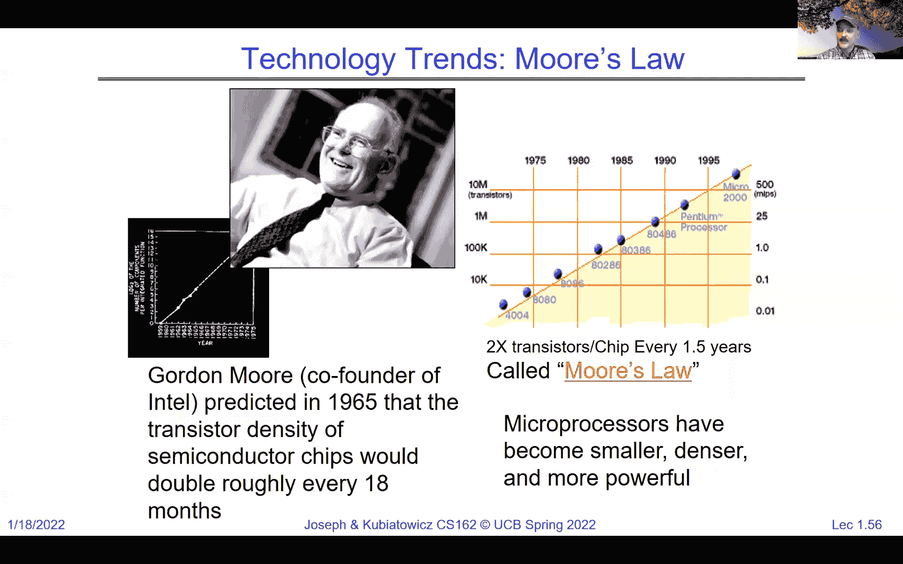

 the years is you've probably seen this somewhere around 2002 we were taking Moore's law and turning。 it into constantly growing CPU performance and so you could be lazy and say well this the computers。 of this era are not fast enough for what I need uh but it's okay because I'll just wait a couple of。 years and um since performance was doubling every 18 months that was fine the interesting thing。

 however is that uh around 2002 that stopped working for lots of reasons and we got multi-core now all。 of a sudden we had to figure out how to build big parallel systems okay and that uh that led to。 all sorts of interesting needs for new ways to program okay so， another problem was power density。 um if you look yeah so we don't have to worry about um Anthony just put you don't have to worry。

 about participation while we're virtual so another challenge here was power density and really if you。 didn't um slow down the way that uh things were getting faster you're gonna have to have uh the。 power of a rocket nozzle in laptops on your lap which is probably a bad idea so part of what。 happened with multi-core was really about uh coming up with another way of using all those transistors。

 okay and then in about 2007 people started talking about big chips with or many cores okay like this。 is the Intel 80 core chip that was in 2007 um 2010 had 24 tiles of two cores each and now uh 56。 cores times two is certainly there in the high server end and so you know the question about how。 do you program these things standard joke for a long time was well i've got all these cores i'll use。

 two of them for video and audio one for word processing one for my browser and you know uh。 the rest of them for virus checking that's it yeah um you know so that really started bringing on。 the need for parallelism in this class we fully embrace parallelism um and um that's part of you。

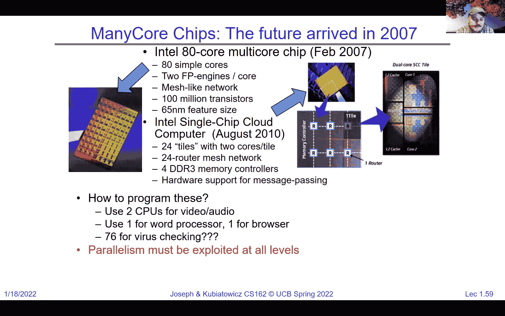

 know the interesting parts here right okay so um Moore's law has been ending um we're no longer。 getting two times transistors every 18 months or even every 24 months um and so that's actually。 changing things a little bit again uh in different ways and we'll have to see we'll talk more about。

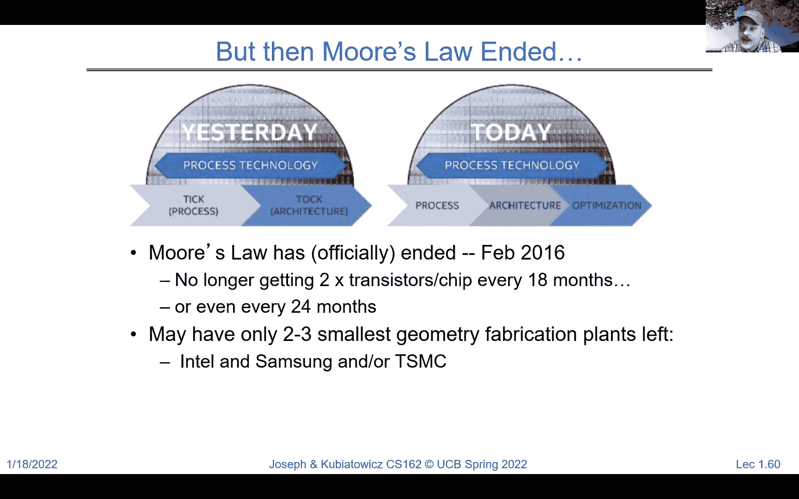

 that as we go storage capacity still growing drastically okay and this is sort of showing capacity。 on a log linear scale and so we're you know um one of my favorite SSD uh items that fits into a。 three and a half inch form factor is uh has a terror excuse me has um terabytes uh multi terabytes。 ssp okay hundred terabytes on one little uh three and a half inch drive okay and we'll talk about that。

 but a hundred terabytes is not a small amount of memory and a three and a half inch drive is not。 very big so it's kind of we have a future of a ridiculous amount of storage and uh we'll talk。 a lot about how to protect that storage so it doesn't get lost um society is increasingly。

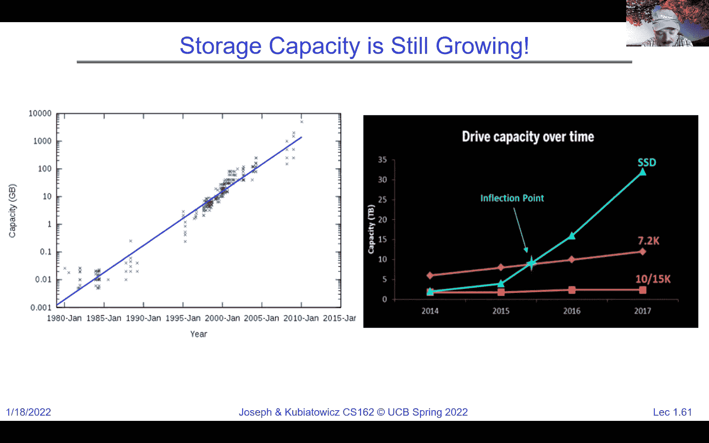

 protected connected which means we have all of these security breaches going on we're gonna talk。

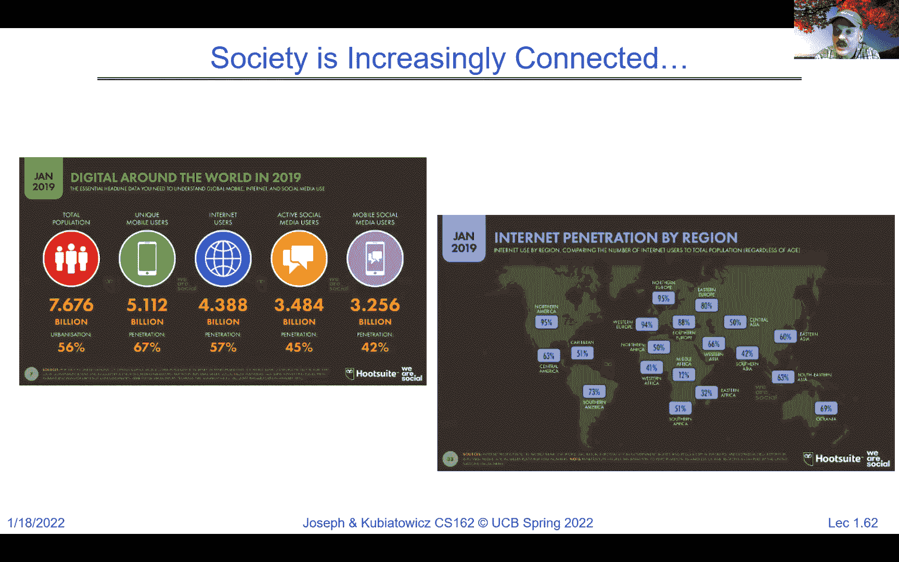

 a lot about security as we go on okay um capacity the network keeps increasing okay um you know that's。 another interesting thing it means that we can communicate with the far reaches of the world。 ever faster which means that our system that we're tying together is doing ever more things ever。 quicker and uh that could either be really fast way of uh failing or uh very fast way of getting。

 additional functionality depending on how you design things now the question here is do you need。 161 to take this class you do not um but uh 161 is a great class so i highly recommended either before。 or after this one okay um and uh we can talk more about that if you like so not only pcs are connected。

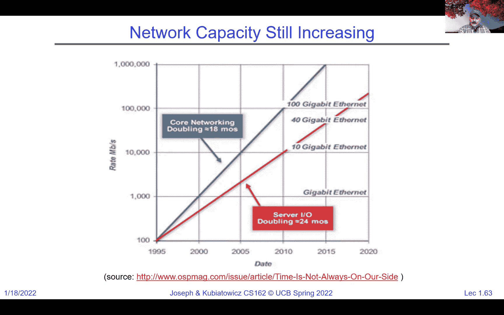

 the internet of course um lots of uh phones but even phones aren't the big thing these days little。 devices um you know we all have a fit bit uh you know or an apple watch we all have little sensors。 everywhere okay so that's really this slide again okay we're down to the internet of things where。

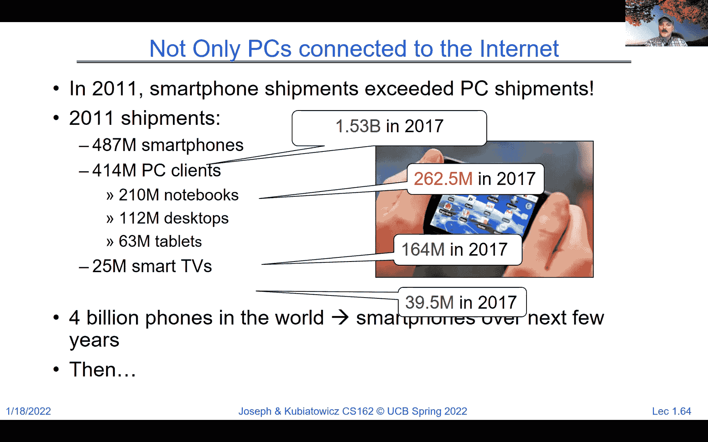

 every person has hundreds of CPUs working for them every day okay so what's an operating system。

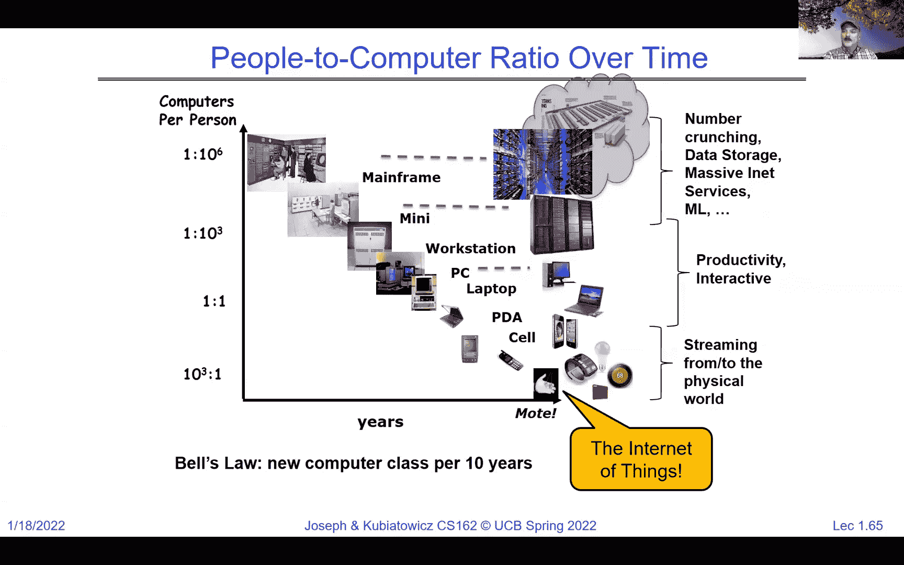

 again well it's a referee managing resources protection isolation it's an illusionist providing。 clean easy to use abstractions it's glue with common services and throughout the term we're going to be。 thinking a lot about that okay and we're going to teach you a lot about that so i'm going to end。 there and um the thing to keep in mind uh is as we go forward when i say in conclusion okay typically。

 people tune out but really what i'd like you to do at that point is bring your attention back。 so that i can give you a quick summary of what we talked about so in conclusion we want to talk。 about providing convenient abstractions to handle diverse hardware we're going to coordinate resources。 and protect users from each other using a few critical hardware mechanisms simplify application。

 development providing standard services we're going to provide fault container fault containment。 fault tolerance fault recovery and cs 162 is going to combine things from many different fields together。 and i'm looking forward to going through this with you and uh let's have a great term。 thank you thanks for posting thank you。

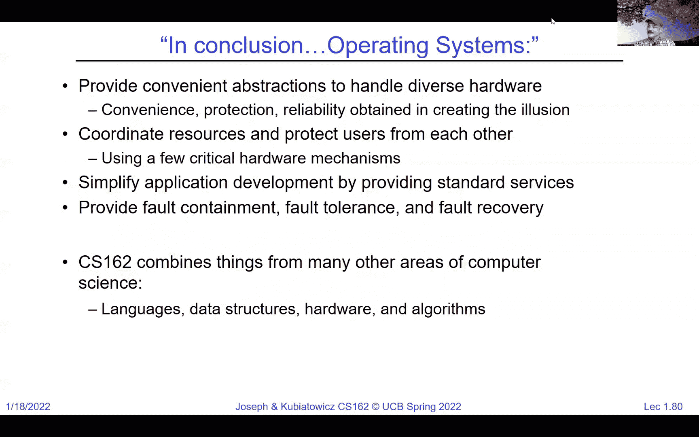

 [silence]。