# 🖥️ 课程 P1：第 1 讲 - 操作系统是什么

在本节课中，我们将要学习操作系统的核心概念。我们将探讨操作系统的定义、它在计算机系统中的角色，以及为什么学习操作系统对于理解现代计算至关重要。课程内容将从宏观的互联网视角开始，逐步深入到操作系统的具体功能和抽象。

---

## 概述：什么是操作系统？

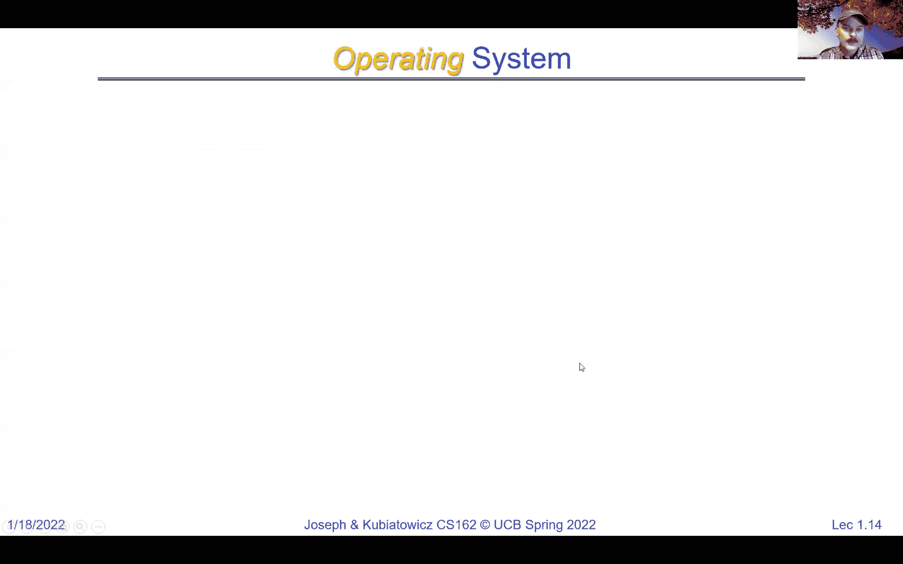

操作系统是计算机系统中最为核心的软件。它管理着计算机的硬件和软件资源，并为计算机程序提供公共服务。我们可以将操作系统视为硬件与应用程序之间的桥梁。

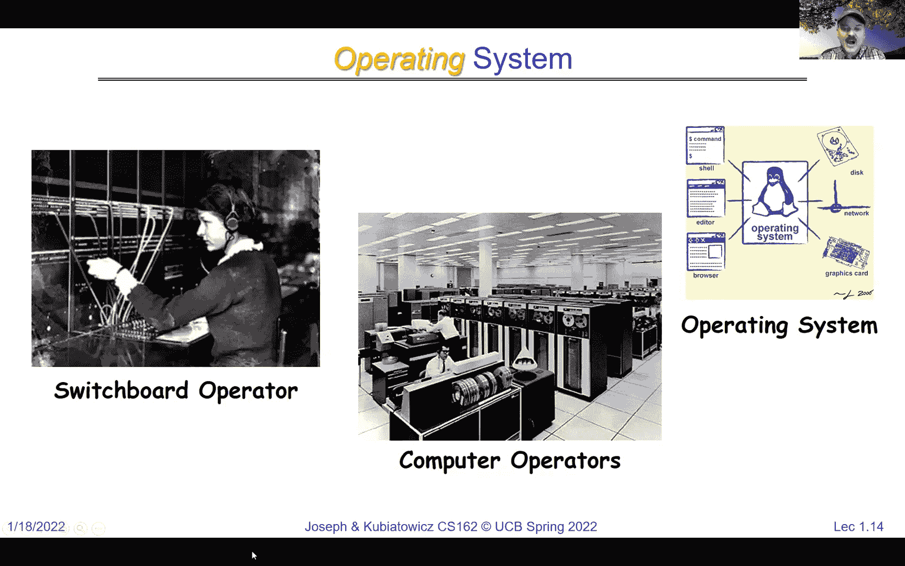

上一节我们介绍了计算机系统的宏观图景，本节中我们来看看操作系统的具体定义和角色。

---

## 操作系统的多重角色

操作系统并非单一实体，不同的人对其有不同的理解。它集多种角色于一身。

### 1. 魔术师：提供虚拟化抽象

操作系统将复杂、多样的物理硬件（如CPU、内存、磁盘、网络设备）转化为一系列简洁、统一且易于使用的逻辑抽象。

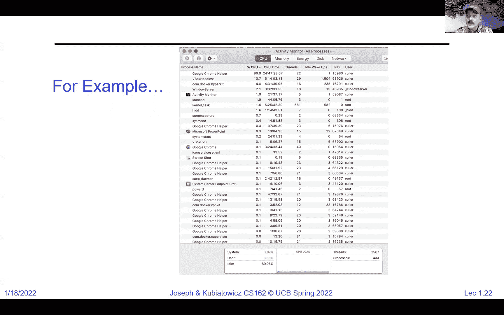

以下是操作系统提供的关键抽象：
*   **进程与线程**：取代单一的物理CPU，为每个运行中的程序提供独立的执行环境（进程）和并发执行流（线程）。
*   **地址空间**：取代杂乱的物理内存字节，为每个进程提供受保护的、看似连续且私有的内存空间。
*   **文件**：取代磁盘上无结构的存储块，提供具有层次结构和命名机制的持久化数据存储单元。
*   **套接字**：取代可能丢失、无序的网络数据包，提供可靠的、面向流的网络通信端点。

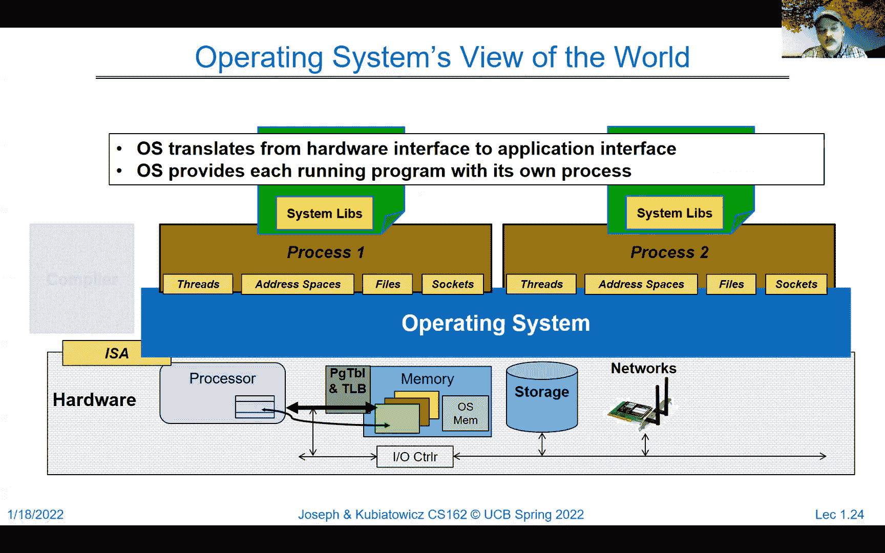

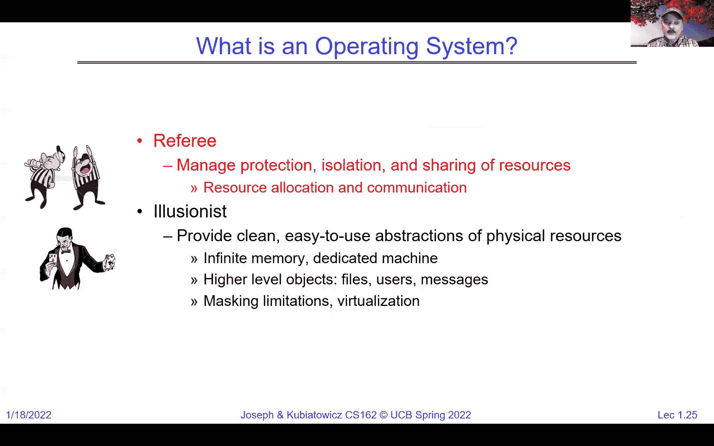

这些抽象使得程序员无需关心底层硬件的具体细节，从而能够更高效地开发应用程序。应用程序运行在由操作系统创建的**进程**这个“容器”中。

**进程**可以形式化地定义为：
`进程 = 地址空间 + 一个或多个执行线程 + 系统状态（如打开的文件、网络连接等）`

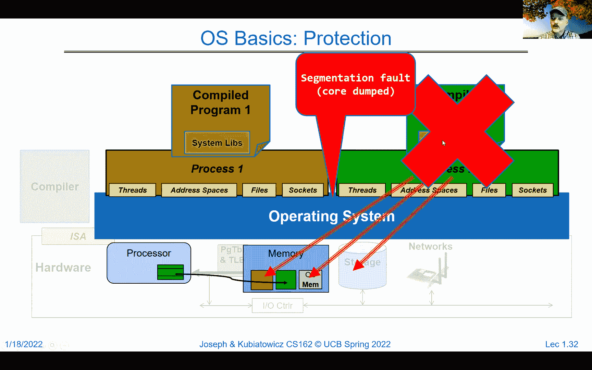

### 2. 裁判：管理与保护资源

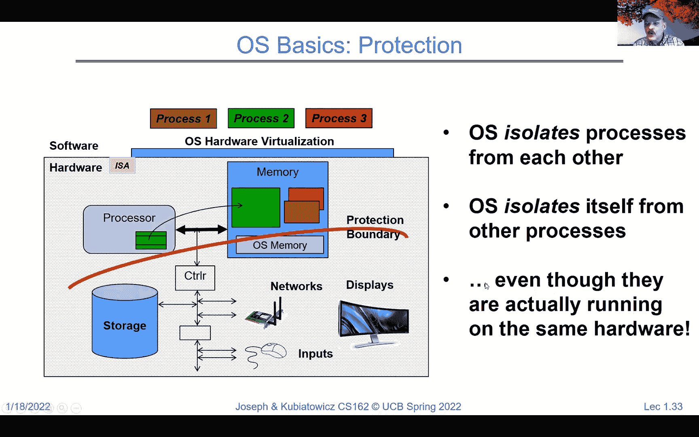

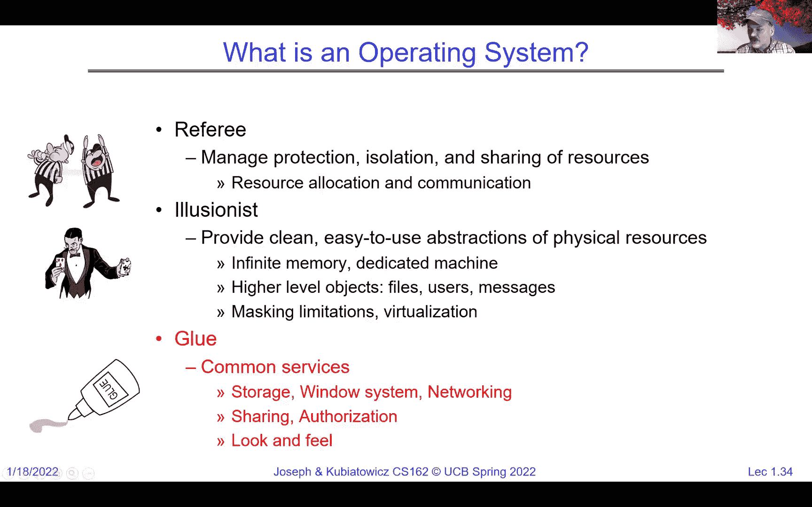

操作系统负责在多个竞争资源的程序（进程）之间进行协调、分配和保护，确保系统的公平性、安全性和稳定性。

以下是操作系统作为裁判的核心职责：
*   **资源分配**：决定哪个进程在何时使用CPU（调度）、获得多少内存等。
*   **隔离与保护**：确保一个进程不能随意访问或破坏另一个进程的内存、文件等资源。这是通过硬件和软件机制共同实现的。
*   **权限控制**：基于用户身份，控制其对系统资源（如文件、设备）的访问权限。

例如，在一个单核CPU上，操作系统通过**时间片轮转**等技术，快速地在多个进程间切换，制造出它们“同时”运行的假象。当需要从一个进程（如进程A）切换到另一个进程（进程B）时，操作系统会执行以下操作：
1.  保存进程A的CPU寄存器状态到内核数据结构中。
2.  恢复进程B之前保存的寄存器状态。
3.  切换内存映射，使CPU能访问进程B的地址空间。
4.  将CPU控制权交给进程B的代码。

如果进程B试图非法访问属于进程A或操作系统内核的内存，硬件会触发异常（如**分段错误**），操作系统便会介入并终止该进程，从而保护系统的完整性。

### 3. 粘合剂：提供通用服务

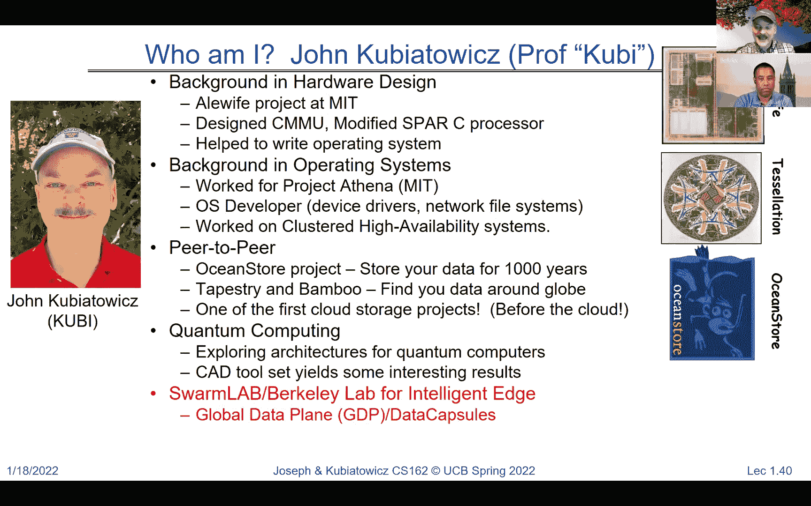

操作系统提供一系列通用的服务和库，简化了应用程序的开发。这些服务增强了系统的功能性和易用性。

以下是操作系统提供的一些常见服务：
*   **设备驱动**：统一管理各种硬件设备的操作细节。
*   **网络协议栈**：实现TCP/IP等协议，使应用程序能进行可靠的网络通信。
*   **用户界面**：提供图形窗口系统、命令行外壳等与用户交互的环境。
*   **系统工具**：提供编译器、调试器、文件管理器等实用程序。

关于哪些服务应属于操作系统“内核”，哪些可以作为外部服务存在，存在不同的设计哲学（如宏内核与微内核），这也是操作系统设计中有趣的争论点。

---

## 为什么学习操作系统？

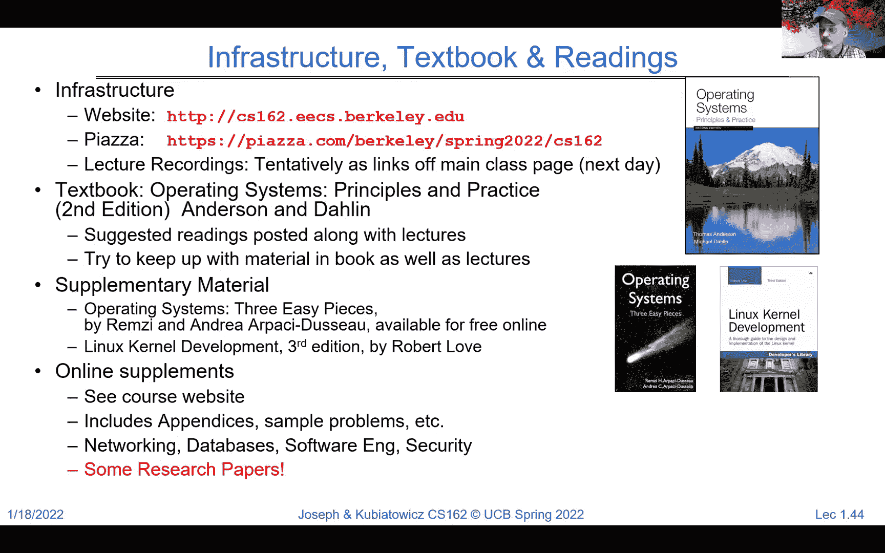

学习操作系统不仅因为它本身是一个精妙复杂的系统，更因为它所蕴含的理念和技术是现代软件开发的基石。

以下是学习操作系统的重要意义：
*   **理解系统底层**：无论是开发高性能应用、进行系统调试，还是从事安全研究，深入理解操作系统工作原理都是关键。
*   **掌握核心概念**：进程、线程、并发、同步、内存管理、文件系统等概念，在分布式系统、数据库、云计算等领域无处不在。
*   **应对技术趋势**：面对多核/众核处理器、海量存储、物联网设备激增以及严峻的安全挑战，良好的操作系统知识有助于设计出更高效、更可靠的系统。
*   **实践工程思维**：操作系统课程强调如何设计正确、健壮的系统，而不仅仅是能运行的系统。这培养了严谨的工程思维和解决复杂问题的能力。

---

## 课程结构与学习建议

CS162 课程将通过理论讲解和动手实践相结合的方式，带你深入操作系统内部。

课程内容将分为几个主要部分：
1.  **操作系统概念与实用技能**：从用户视角熟悉系统，并快速切入底层。
2.  **并发**：深入讲解进程、线程、锁、死锁以及如何在单核和多核上实现并发。
3.  **内存管理**：探讨虚拟内存、地址转换、共享与保护。
4.  **存储与文件系统**：从I/O设备开始，讲解如何构建文件系统，并涉及事务等内容。
5.  **分布式系统**：将概念扩展到网络，讨论RPC、分布式文件系统、一致性等。
6.  **可靠性与安全**：研究容错、日志、安全机制及云计算相关主题。

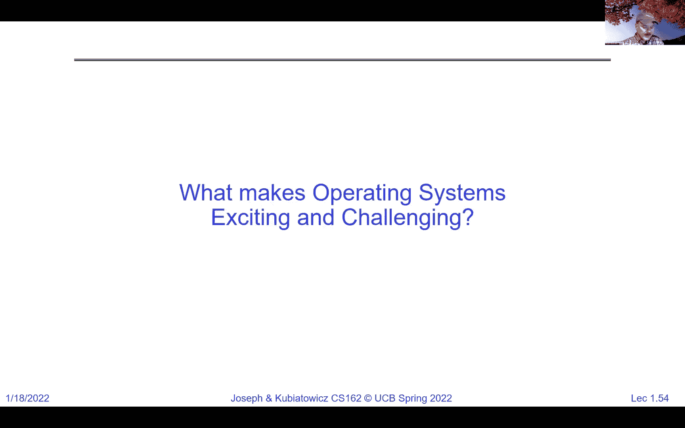

**学习建议**：本课程包含具有挑战性的小组项目，需要熟练使用C语言和调试工具。请务必尽早开始课程提供的预备任务（作业0和项目0），熟悉开发环境，并积极组建团队、参与讨论。

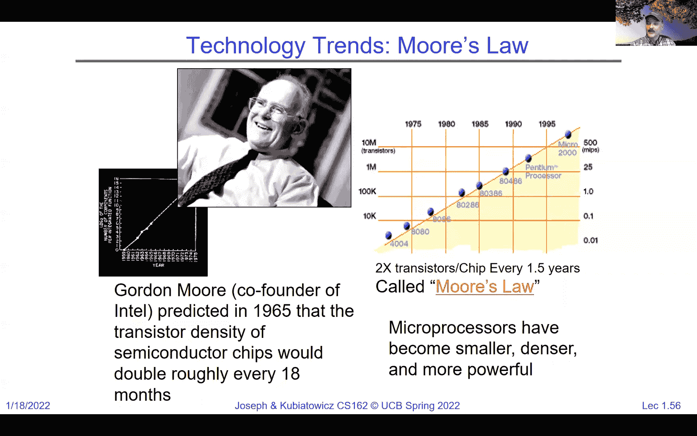

---

## 总结

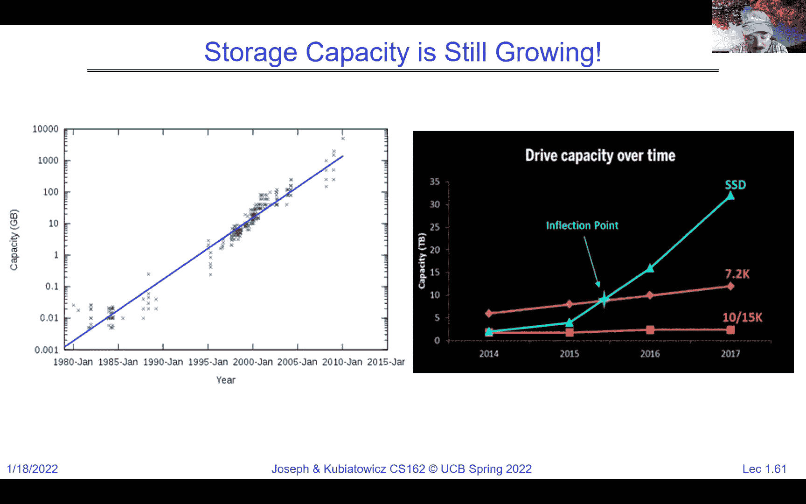

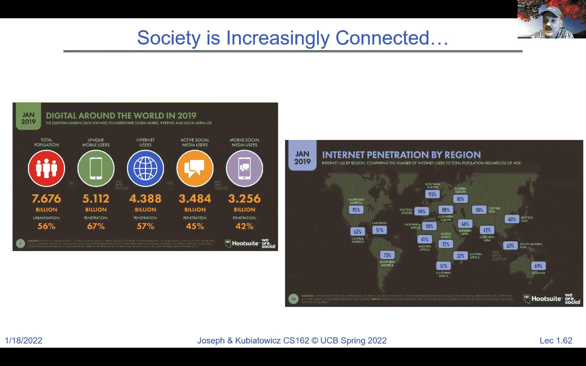

本节课我们一起学习了操作系统的核心定义与多重角色。我们了解到，操作系统是：
1.  **魔术师**：通过虚拟化技术，将复杂的硬件抽象为进程、地址空间、文件等易于使用的概念。
2.  **裁判**：负责资源的分配、调度与保护，确保多个应用程序能安全、公平、高效地共享计算机系统。
3.  **粘合剂**：提供设备驱动、网络协议、用户界面等一系列通用服务，简化应用程序开发。

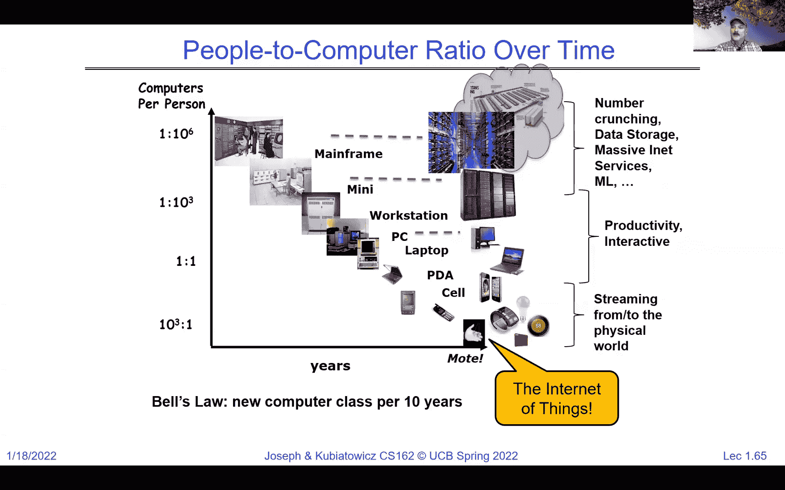

操作系统是计算世界的基石，它让从微型传感器到全球数据中心的庞大生态系统得以协同工作。在接下来的课程中，我们将揭开这些抽象和机制的神秘面纱，亲手探索它们是如何实现的。