# P10：第10讲：调度概念与经典策略 - RubatoTheEmber - BV1L541117gr

好的，欢迎大家来到第一次期中后的讲座。

是的，你们成功了。所以我们实际上将稍微改变一下话题。让我确认一下，大家能看到我的幻灯片吗？虚拟空间里的朋友们也能看到吗？好的，如果你记得，我想回顾一下我们在最后做的一些事情，确保同步部分可以结束。所以，首先，如果你记得的话。

上次我们更详细地讨论了信号量。信号量有两个使用方式。信号量有一个初始值，这是在分配时设置的。如果你将这个值设置为 1，实际上你得到了一个互斥锁，或者称为二进制信号量，你可以用它来进行锁定。所以你会像这样使用它，做 P 操作时把它减到 1，做 V 操作时把它加到 1。

如果两个人同时尝试做信号量 P 操作，其中一个会被挂起。这是一个纯粹的原子操作。所以两个线程不可能意外地同时通过这个操作。好的，它会原子性地递减这个值。如果你想递减到零以下，它会让你进入休眠状态。我们还看到了通过将初始值设置为零，我们可以实现调度约束。

这可能让你进行一个联合操作。所以你把它设为零，然后尝试做一个 P 操作来让自己进入休眠状态。其他任何人都可以用一个 V 操作把你唤醒。好的，最后，这就是线程连接的例子，假设原始的“鹦鹉线程”进入休眠，然后结束的子线程执行 V 操作把它唤醒。好的。

然后最后我们给出了可乐机的有界缓冲区解决方案。这是一个很好的三信号量的例子。如果你记得，我们之所以有三个信号量，是因为我们有两个条件和一个锁。这两个条件是关于限制可乐机中最大可乐罐数量的，同时也在说明不能让可乐罐数量变成负数，所以我们在两个方面都做了限制。好的，如果你记得，代码大概是这样的，用于生产者和消费者。

这里的关键模式是，我们总是像队列一样保护一些东西，因为这些操作如果多个线程同时进入可能会出现问题，这就是为什么我们在它们周围加上新的 Texas。然后我们在空槽上执行一个信号量的 P 操作，以确保生产者进入之前有东西，消费者则是相反的操作。

所以，如果你看这里的红色部分，是用来保护队列的临界区。然后我们有这个信号，当生产者终于生产了东西，它会唤醒某些可能正在休眠的线程。

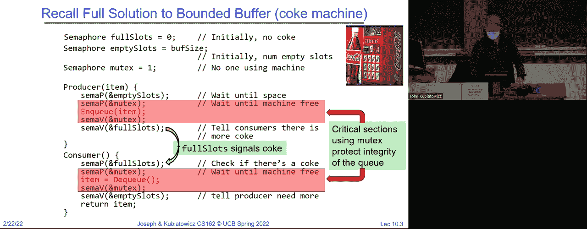

当消费者最终把罐子倒空时，他们可能会唤醒生产者。好吧，在我们离开之前，我想看看有没有最后的问题。信号量在操作系统中非常常见。好，好的。那么，然而，我们说过有更好的东西。好吧，一个监视器，它是一个锁和零个或多个条件变量。

其实，如果你只有零个条件变量，那就不太有趣了。条件变量专门是一个等待队列，你可以在持有锁的情况下去休眠，这就是关键的概念。好的，和其他任何等待队列不同的是，在条件变量的等待队列中，你先抓住锁，检查条件，然后如果不满足就去休眠。正是这种奇特的差异或者API的不同，使得它们变得非常强大且易于使用。

通常有三种操作，它们根据不同的包有不同的名字，但大致是等待、信号和广播。规则是，进行这三种操作时，始终要持有锁。现在，我知道很多人会问，为什么我在做信号或广播时也必须持有锁。这个问题有很多原因，具体取决于调度包是否允许这样做，但现在我们只说。

始终在所有操作中持有锁。好吧，尤其是在这门课中。接口上有什么问题吗？所以我们给了你这个典型的结构，如果你在考虑一个监视器程序，这是一个思考的方式。你抓住锁。你检查条件是否满足。如果不满足，你就去休眠。注意，这个等待操作总是会发生。

就像一个信号量P，它可能不会让你休眠，而一个等待操作总是会让你休眠。这是关键的接口方面。然后，当你醒来时，使用典型的Mesa调度，你总是必须重新检查你的条件。然后你可能以某种方式保留你找到的资源，然后你可以解锁，结束时你再锁一次，并发送信号表示你完成了。这是一个模式。好吧，我们在读者-写者示例中做到了这一点。好的。

这是读者-写者示例，它可以有一个写者或多个读者，但读者和写者永远不会同时存在。好的，实际上与考试题目无关，不管是什么，三C题中也许你不能有两个写者。好的，所以每次只有一个写者。那就是我们这里代码的动机。

这是一个读者代码，你抓住锁。看到了模式吗？你检查并确保没有写者在活动或者休眠。如果有，你就变成一个等待的写者，然后去休眠。当你醒来时，你不再是一个等待的写者。

你会一直循环，直到系统中没有任何写者，在这种情况下，你就会执行`++`操作，表示你是一个活跃的读者，释放锁并访问数据库。然后在签出时，你再次获取锁，减少计数，表示你不再是一个等待中的读者。接着如果没有剩余的读者，就会触发某些条件。

那些是活跃的，但如果有等待的写者，你就会通过信号唤醒它们，然后最终释放锁。好的。那么，为什么我们在这个时候释放锁？有人记得吗？是什么原因？没错。记住，这个进入条件并不是阻止访问数据库。它的作用是保护数据库的进入条件。

我们需要释放锁，这样其他线程才能进入并自行分类。写者的情况类似，但稍有不同。好的。那么在这里，我们对写者的进入条件是：不能有任何活跃的写者或活跃的读者。如果有任何一种情况，我们就会进入睡眠状态。否则，我们会醒来并进行访问。

这是一种修改样式的访问。然后，当我们再次获取锁时，如果没有其他等待中的写者，我们就不再是一个活跃的写者。如果有等待中的写者，我们会唤醒其中一个。如果有等待中的读者，我们则会唤醒所有读者。然后我们退出。好的。

所以，再次说明，为什么我们在这里使用广播而不是信号。可能有多个读者，唤醒他们所有人，对吧？好的，有没有问题？是的。没错，你在这里说的对，绝对是这样。所以在这里，向上，唤醒。然后我们会有多个等待中的写者。啊，嗯。

你刚刚预测了我接下来几张幻灯片的内容。那么问题是，难道我们不能直接去掉检查，并且无论如何就唤醒一个写者吗？我们会探讨这个问题。是的，因为在那种情况下，发生的事情是它们会在那个循环中检查。

现在注意到，通过执行这组`if`和`else`语句，我们确保了优先给写者而不是读者。这时我们会广泛地发出信号给写者，然后再广播给读者。尚不清楚是否某个读者会在写者之前醒来，若发生这种情况，我们实际上会违反我们政策中的优先级规则。

这总是先让写者去执行。就正确性而言，这是没问题的。好的，它不会违反“一个写者或多个读者”的正确性条件，但它会违反政策。似乎这个特定的代码符合的政策是写者优先于读者。好的，很好。那么这实际上导致了，为什么要给写者优先权。

事实上，这里有几个原因。其一是，如果你查看典型的跟踪，读取操作通常比写入操作多，所以优先考虑写者并不是坏事。另一个原因是，你可以想象，写者使数据更加更新，因此给读者提供了获取更新数据的机会。

好的。这不是强制要求。你可以使用任何其他策略，事实上，我们过去也曾在其他考试中这样做过。这里的问题是为什么要再次释放锁，我假设问这个问题的人在虚拟空间中是在谈论在这里释放锁的事。

答案是我们必须释放上面的锁，以便其他线程可以进入并进行分类。好的，因为如果我们持有锁，那么进入的其他线程就无法被分类为读者或写者。好的。现在，问题是这里有几个问题，一个是读者是否会饿死。你怎么看？这会导致饥饿现象吗？

它与不正确的条件不同。谁认为它可能不对？为什么？为什么它会开始？继续。没错。所以，如果写者持续不断，读者可能永远无法得到机会。是的。好的，如果这是你使用的条件，你可能需要稍微调整代码的设计，但监视器足够强大来处理这种情况。如果我们取消了条件检查，刚才我们问过这个问题，假如我们重绘出这个呢？

好的。那这样做还会正确吗？是的，依然正确，因为有了 `while` 循环。好的，入口处就是这样，这也是为什么Mesa比“马语义”（horse semantics）更受欢迎的原因之一，因为你可以稍微松懈一些。好的，只要你唤醒的线程比需要的多，你仍然会是正确的。这种情况的危险是你可能唤醒的线程不够，接着系统就会死锁。

好的，所以我们不想这样做。实际上，我想这算是一个活锁，稍后我们会更具体地讲解。在接下来的几节课中，然后我们可以将这个信号转变为广播，唤醒所有的写者。为什么这样做还是正确的呢？是的。没错，只有一个写者会得到它，其他的写者不会。理解这一点的方式是因为代码开始时的那个锁。所有进入系统的线程都会被锁串行化，所以你每次只能查看一个条件。

好的，所以下来一个一个地处理，即使有一千个写者，也是一个一个地处理，第一个将获得作为活跃写者的能力，其他的会在稍后等待。好的，然后最后，如果我们只使用一个条件变量，会怎么样呢？

所以不要将读取和写入操作分开，仅仅说“好吧，继续进行就可以了”。好的。现在事实证明，我说的关于循环的内容是正确的，所以我们不会得到不正确的行为，但是如果我们不使用广播而使用信号，可能会发生什么呢？

是的。没错，因为如果读者和写者都在同一个队列中，我们只唤醒一个，那么我们可能无法得到我们想要的服务员类型。

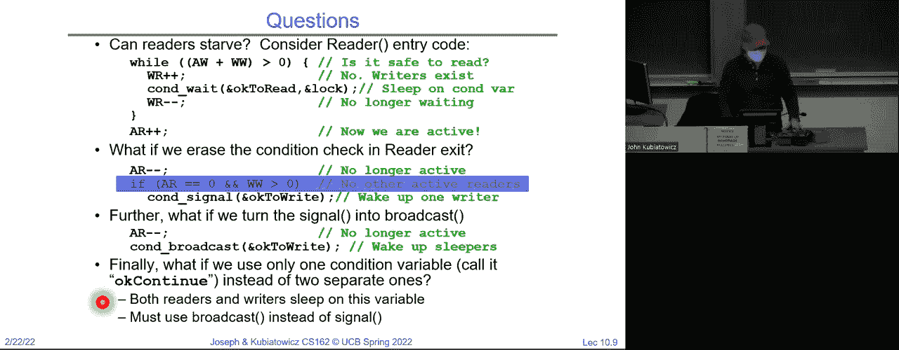

好的，那么例如如果我们将“okay to write”变成“okay to read”，再变成“okay to continue”，这样就变成了不同的代码，现在看到红色了。然后我们有这样的场景，假设我们的一个到达了，接着w一个要到达。嗯，我们的一个仍在工作。然后当那个读者去检查时，如果我们只发送信号给一个。服务员，那么会发生什么呢？我们实际上会发送信号给错误的人，对吧？我们会给w一个发送信号。

但是w一个醒来后会说：“哦，看，系统中有读者，可能这样不起作用。”所以我们必须确保正确发送信号。

好的。所以我们在这里进行广播，只是为了确保有足够的人能唤醒所有的东西。好了，这对于写者来说尤其具有挑战性。嗯，它在双方都有挑战性，所以基本上你只想广播。好了，现在我们的监视器与信号量根本不同。嗯，你可能会怀疑答案是否定的。

因为我们设法以某种方式做出了一个非常复杂的提示。你知道的，对于可乐机来说，信号量是非常强大的。所以如果它们真的是等价的，似乎如果我们有了信号量，我们应该能够实现监视器。不是吗？从同步的角度来看，这不是某种完整性吗？

但是技巧是我们得小心。首先，锁是简单的，对吧，监视器有锁，信号量你初始化为1，锁很简单。好了，保证从那里开始会变得更难，对吧？那么如果我们尝试像这样实现条件变量，等待会获取一个信号量，并执行一个信号量P，信号则执行一个信号量V呢？

这能工作吗？有多少人认为我们可以通过这种方式实现监视器条件变量？有多少人认为我们做不到？如果你举手了，你得告诉我为什么。来吧，为什么？对，但让我们假设我们可以在这里放入任何一个信号量的值。是的。嗯。问题在于我们获取了信号量锁并执行了等待。

在一个条件变量信号量上，你将带着锁去睡觉。哦，一切都坏了。好的，所以这一实现一开始就不行，因为你不能在这个特定的信号量上睡觉。所以这样不行。好吧，这样行吗？所以等待释放锁，然后在条件变量上执行信号量P。

然后在退出等待之前重新获取锁。信号只是执行信号量V。好了，这看起来稍微好一点，因为它不会因为持有锁而进入死锁状态，因为你看，当你执行等待时，你先释放了锁。

好的，但这有效吗？是的。太好了。那么，这仍然是错误的。因为记住，信号与某些操作不相同，因为如果你先发出信号然后再等待，使用这个实现，它们永远不会等待。而条件变量是，你去说等待时，你总是会等待。好吧。所以这是错误的。大家明白了吗？信号量是对称的，而条件变量信号则不是。

好的。那么我们能做什么呢？嗯，你知道，你可以在这里说，假设一个线程发出信号，而没有人等待，知道吗？对吧。那么，如果一个线程稍后等待，线程就会等待。好吧。那么如果一个线程在一个森林中发出信号，而没有人听，没人听，知道吗？而如果你做一个V操作，而没有人在等待，你会增加信号量，如果线程稍后执行P操作，你就会减少信号量并继续。

所以，这将没有这样的特性：每次你调用等待时，你都会休眠。好吧。大家看到这个问题了吗？这看起来是错误的。也许我们做不到。好吧。之前尝试的一个问题是，P和V是可交换的，不管它们按什么顺序执行，结果是一样的，而条件变量则不是。所以，如果你看看，你可以说，嗯，这个修复解决了问题，等待时释放了锁。

是否一个信号量P并获取锁，而信号量说如果信号量队列不为空，那么执行一个信号量V。这样行吗？它有效，但它是非法的。你不允许读取信号量的值。好吧。所以，这里有一个竞争条件，信号量操作可能会在错误的时机执行。但实际上，事实证明这是可能的。我会给你们一个提示。

如果我们保持一个条件变量整数，所有我们用来在释放锁之前增加的那个变量，那么我们可以跟踪有多少个线程在休眠。信号量操作可以查看它，因为这是合法的。因为他们有锁。好吧。所以这里是一个有趣的例子，拥有锁在信号量操作周围实际上对于这个特定实现的工作至关重要。

好的，因为如果你没有锁，试图检查条件变量或检查那个整数变量，而你没有锁，那么有人可能会在你不知情的情况下改变它，这就是问题所在。好吧。我们不再详细讲这个问题了。那么，重点是，你可以用信号量做出监视器，而你可以想象，用监视器做出信号量更容易。这是一个你们可以做的练习。嗯。

你就坐在那里。那么，好吧，我将关闭这个话题。但是，随着我们前进，假设你们会越来越擅长于查看同步问题并解决它们。你知道，这就是其中之一，我可以给你们举例，但最终还是要靠你们自己去重新训练思维，去思考这些问题。好吧。

但你知道，我认为，如果最糟糕的情况发生，使用监视器应该是最容易想到的事情。我在我做的一个研究项目中曾建议过某人使用条件变量，因为他们需要让线程休眠。

然后稍后唤醒它，结果证明这绝对是最正确的做法。非常简单。顺便说一下，这些在很多情况下都可以使用，包括像 P 线程这样的线程包。但在我们完全关闭同步之前，我想说一点关于语言同步支持的内容。

所以如果你去查看线程，你会看到我应该在这里加入一张关于这个的幻灯片。这里有 P 线程新的 Texas，还有 P 线程条件变量。它们已经被实现了。所以如果你只需要做一下 man 查阅 P 线程包，你会看到它们。只要你在使用 P 线程，你肯定能够与监视器和信号量同步。

这些是可以使用的。好吧，C 是一种有点疯狂的语言。好吧，有多少人认为 C 是一种疯狂的语言？好的。C 最糟糕的地方就是它允许你做各种坏事。你永远不应该做的事情。最糟糕的是你可能会有悬空的内存指针，或者忘记了释放某个东西，或者释放了两次，这里有很多坏事。

但这不是我们今天要讨论的内容。如果你的代码获取了锁，并且在代码内部发生了异常，你需要检查每一个异常路径，并在从该过程返回之前释放锁。因为如果你不这么做，我们会把它留在那里。如果你不这么做。

然后你可以很容易地通过抛出异常返回调用函数，锁依然保持着，没有人会释放它。看到了吗？因为正常的代码是你获取锁，做一些操作，然后释放锁。但是如果发生了异常，你需要确保释放锁。好的。这使得 C 在锁定方面真的很复杂。你必须做这些事。

更加复杂的是 set jump 和 long jump 的概念。你们中有多少人遇到过 set jump 和 long jump？没有遇到过的真幸运。让我告诉你们，set jump 和 long jump 是异常的一种简陋版本。它们是这样的：有一个堆栈，你从程序 A 开始，然后到程序 B，接着调用一个叫做 set jump 的东西。

这会给你一个句柄，让你可以丢弃一大堆堆栈并返回到你调用 set jump 的地方。所以它就像一个异常。这里，我们进入 C，获取锁，进入 D。在 E 中出现错误或某些情况时调用 long jump。它会丢弃所有的堆栈并返回上面，而不需要重新获取锁。

或者没有释放锁。好了，坏消息。好的。现在，幸运的是，set jump 和 long jump 是你今天经常使用的东西。但我只是警告你，在 C 语言中，这只是乱七八糟。好的。然后也许你可以使用 goto。多少人曾被告诫永远不要使用 goto？好的。

以失去你的大儿子或某些东西被海怪带走为代价。我是说，这就是，你知道的。所以这并不好。当你接触到比 C 语言更强大的东西时，结果发现它是好的。例如，在 C 语言中，你仍然需要确保如果食物有异常，它会被抛出。而且你可以捕获它，这意味着你至少需要做类似这样的事情：你说我要尝试做，如果有异常，我会释放很多。

注意看，这看起来像是 C 代码，但它要干净得多，因为所有异常都会通过那一条路径。好的。现在，如果你是 C++ 背景的观众，你可能会说，但等等。这不是做这件事的好方法。还有更好的方法。好的，我鼓励你们谷歌一下锁守卫。好的，这意味着这里我们有一个过程。

无论有多少人尝试执行，它都会干净地增加这个全局变量。这里发生的事情是，当你分配锁时。其实这是一个局部变量。在这里，你分配了一个锁守卫，它锁定了全局互斥量。关键在于，无论安全增量退出的条件如何，这个锁都会在任何情况下释放。

好的，所以如果你在做锁定操作时，C++ 或它的一些变种是最干净的。好的，因为这种特定类型的锁守卫。基本上，每当它最终超出作用域时，它就会自动释放锁。好的。Python。嗯。你可以分配一个锁，然后你可以说用锁来停止，这意味着无论那个 with 语句如何退出。

锁会被释放。这几乎与我刚才展示的 C++ 完全相同。Java。你最喜欢的，对吧？他们，我不知道，他们现在还在用 Java 和 61 好吗？我已经有一段时间没教这个了。实际上，我从没教过它。我不确定你是不是不了解它，但如果你看看这里。

你可以说 public synchronized。意思是每个对象都有一个内建的隐式监视器，包括一个锁和一个条件变量。因此，结果是，你可以说这个特定的方法 get balanced。你还记得我们讨论过银行账户是同步的吗？而这个 get balance 只有在获取对象的锁之后才能被线程运行，然后它会进入并让你继续。

好的，仅仅通过说出“同步”这个词。我们就可以自动使用这个法则。比起我们几节课前介绍的方式，这样是不是简化了很多？好的。此外，正如我之前所说，Java 只有一个条件变量。你可以为每个对象编写代码，所以你可以进行等待操作。

你也可以进行带有超时的等待操作。而且你可以通知并通知所有等待的线程，或者进行广播、信号和广播。这就是你在 Java 中如何做的。所以 Java 实际上将监视器内建到了语言中。

这真的挺酷的。好吧。好了，我想我们暂时可以放下同步这个话题，除非有人有问题。继续吧。让我看看。确保没有人遗漏。好的，还有其他问题吗？哦。

后面那位？不，那只是个伸展动作。好的。所以，今天的琐事比较轻松。不像上周那样，你们既有考试，又有设计审查，还得在喝咖啡时站着解决停机问题。这一周相对轻松一些。所以我觉得没有什么重大期限。

当然，你们得继续推进各项工作。我瞥了一眼时间表。关于期中考试的部分。我被告知说，大约完成了 80% 到 85%。当然，我还要提醒你们，75%的统计数据都是随便编出来的，你们可以自行决定如何看待这一点。

我不确定今天大家是否有任何管理类的琐事。既然如此，如果大家没问题，我想我们可以开始一个新话题。我们可以把期中考试的事情放一放，答案已经发布了。关于答案的提问也有讨论区，虽然我还没能及时回答所有问题。

不过我会确保问题得到解答。我们继续往下走吧。往前走。好了，接下来我想说的是，这里有一张图。我记得这张图第一次课上就展示过，它是关于操作系统的一种循环。图中提到，如果有就绪线程，系统就会从中选择一个执行。

否则，你就会运行一个空闲线程，并定期执行循环。好吧，我想我说得对，这就是整个操作系统的工作。我们可以结束今天的内容，准备做我们的最终总结。今天我们想要做的，是开始讨论调度，实际上就是“选择什么”的问题。我曾经给你们展示过另一个关于调度的图。

这个图显示了一个就绪队列，它是所有准备好由 CPU 执行的线程集合。真正的问题是，操作系统如何决定就绪队列中的哪个线程将会是下一个执行的线程？好的，所以调度其实就是决定哪些线程在每一时刻可以访问资源。顺便提一下，在接下来的几节课中，我们将讨论如何分配 CPU 时间。

但是调度远不止这些。好吧，我们可以讨论带宽调度。你可以谈论I/O资源调度，可以谈论内存调度。你可以调度很多东西，但目前我们将只调度CPU。因为我们实际上是在试图弄清楚发生了什么，介于就绪队列和CPU之间。

好的，这是接下来几节课的目标。顺便说一下，我很高兴地承认，Anthony实际上回来了，所以他也许会参与几节课的讲解，我们也可以看到其他人的风格，但今天除了我之外，只有我一个人。

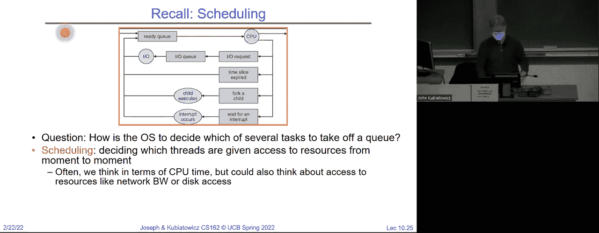

调度完全是关于提示信号的。好吧，我敢肯定，提示信号是你最喜欢的东西。好吧。这显然是从之前的时代，因为他们并没有戴口罩，而且他们之间也没有保持六英尺的距离。是的，可能很快会有这样的规定。关于调度的一些假设，首先，一些假设实际上来自70年代，调度在70年代成为了一个重要的议题。

这是一个重要的研究领域。请注意，我们只有三节课讲它，但它确实是一个重要的研究领域。很多关于CPU调度的隐性假设实际上都来源于那个时期。而这些假设类似于：每个用户只有一个程序，每个程序只有一个线程，程序是独立的。好吧，这些是一些基本假设。

你知道，这是一个非常老派的思维方式，也算是一种当多个用户共享同一台机器时的情况，所以它是一种大型机的视角。好吧，但70年代做的许多工作至今仍然被愉快地使用。

显然，这些具体的想法是不现实的，但它们确实简化了问题，以一种可以解决的方式来处理。所以在第一次讲座中，我们将从这种背景开始：每个用户一个程序，每个程序线程独立。

然后，我们将逐步为我们的过程增加更多的复杂性，以便使调度变得更加有趣。好吧。高层次的目标，提醒一下，这就是我们最喜欢的图表，再次来自第一天的打印机逆色：品红色、青色和黄色。这些代表着不同的线程，我们将决定如何在一个CPU上调度它们。

请注意，现在它们的CPU时间各不相同，因为程序执行的时间长短不同。调度程序如何决定呢？好吧，到目前为止，问题还很简单。是的，嗯，什么是用户？用户是一个实体或一个拥有资源分配的人，最简单的想法就是登录，你登录了，就成了用户。

CPU通过用户ID来处理你。但随着学期的推进，实际上可以更一般化。比如说，如果你有一个公私钥对，在安全的意义上，它也可以是一个“主体”，但是现在就当作登录ID来理解吧。

好的，这里还有一个问题，进程调度是不是更多的是调度器的隐式操作呢？比如调度器切换线程，而这些线程可能属于不同的进程。所以暂时我们不会讨论，或者限制自己去担心哪个线程属于哪个进程。好的，我们有很多线程，它们都需要CPU时间。那么对于这个问题的回答是……

比如你可以想象，可能会处理完一个进程中的所有线程后，再切换到另一个进程。你可以想象，几乎可以想象任何场景，对吧？例如，大规模的拉丁语程序之类的，你几乎可以想象任何事情。但有趣的是，既然已经提到这个问题，如果有一个进程有100个线程，另一个进程有一个线程。

什么是公平呢？将相同的时间分配给进程A中的100个线程和进程B中的一个线程，是否公平？也就是说，它们总共有101个线程，每个线程得到1/101的时间。或者，是否更合理地将一半的时间分配给进程A，另一半分配给进程B，然后进程A将其所有的时间分配给它的100个线程呢？

好的，那么什么是公平呢？这将是我们必须解决的问题。好的。那么，很多早期调度论文中的一个假设是非常好的，基本上就是这个“CPU突发”概念。如果我们看一个线程运行的时间。哦，是的，请继续。程序和进程是一样的吗？嗯，我现在先说是吧。想象一下，你知道程序是可以有多个进程的，在这种情况下，程序和进程不完全是同一回事，但我们今天只能处理这么多复杂性，所以暂时就按每个程序对应一个进程来理解吧。

但如果你注意到，当一个线程在CPU和各种等待队列之间循环时，你可以问它在CPU上运行多久才会被休眠。所以，如果你有一个定时器，而线程永远计算下去，那么你会看到线程可能会在CPU和等待队列之间循环。

它们都有相同的计算时间，直到进入休眠状态。所以，如果我们把I/O加到画面中，你可以想象一些线程是等待的，只有在键盘上按下一个键时才会被唤醒，它们运行一段短暂的时间后，然后再次进入休眠，等待与键盘相关的事件。

好吧，有很多原因导致线程进入休眠。所以，如果我们测量这个叫做CPU突发时间，就是线程运行多久后再回去休眠。所以，类似这样一个峰值，在低端有很多非常短的突发，且尾部有一个非常长的尾巴。

好吧。于是程序或者不管它们是什么，线程我们暂时不会深入探讨。然后，线程会运行一段时间，称为一个突发，然后它们回去休息。如果我们测量这个，可以把它看作是线程突发时间的概率分布，你会看到低端有一个峰值。有人能给我一个想法，低端的那个峰值可能来自哪里吗？好吧。

定时器中断的持续时间。嗯，让我解释一下为什么我认为这不是你所寻找的东西。所以，如果每个人都被定时器中断所限制。那么会有一个类似于脉冲函数的时刻，因为你知道你会运行10毫秒，然后定时器响起，下一个人会运行10毫秒。但我们有这种分布，不是那样的，它在低端有一些峰值，且有一个非常长的尾巴。

由于有长尾的东西，你必须怀疑，如果定时器介入了，它是在打断那些很长时间运行的人。对吧？因为他们运行了很长时间，然后才被中断。那么，为什么我们认为这里有一个突发？是的，启动进程。好吧，可能是。是的，继续。好吧，我欠你一些解释。嗯，是的，差不多了。接近了。那我欠你什么呢？

是的。好吧，也许是磁盘访问时间，虽然实际上那会在这里屏幕上看不见的地方，因为记住是百万次周期。那么，什么类型的I/O呢？好吧。所以，是的，你必须加载程序。所以我给你一个猜测，有人说是主动计算然后等待I/O，是的。

第一点。为什么是短暂的交互式处理？因为你在等待并且接收到一个按键输入，然后你处理字母a。接着你又回去休息，然后他们输入字母B，你处理字母B，然后又回去休息。所以这里低端的事情通常是交互式的。明白吗？

有一些情况，程序线程是代表用户运行的，通过快速处理来自用户的某些事件，让用户感到满意，然后再回去休息。好吧，现在如果我们开始考虑其他类型的I/O。

我们看一下这个更长的范围，但我认为这里重要的部分是，如果你看一下外面的一组线程。会发现有很多非常短的突发，这是因为即使在那时，这些机器也是在处理用户的交互。

我明白了。好的。所以每一个调度决策，其实都是关于在你有一堆线程的情况下，如何选择下一个要执行的线程。这就展示了如果你有很多线程并且运行它们，它们会怎样表现，然而调度决策是在我们执行之前做出的。我们如何决定哪些线程应该被执行呢？好的，怎么做呢？

在时间片轮转和定时器的配合下，你可能会被迫放弃CPU资源，假设你在计算圆周率之类的东西。但为什么有人能告诉我，仅仅按先入先出（FIFO）顺序处理线程，可能不是最符合用户需求的方式呢？对，用户有他们希望得到交互的需求。

如果你正忙着计算圆周率的下一个百万位数字，或许你并不在意。对吧？所以可能优先处理短时间的任务比长时间的任务更合理，这对于交互性来说非常重要。所以调度在这里开始发挥作用，如何确保调度程序能让用户满意，这对我们来说非常重要。那么，我们可能会对调度策略有什么样的目标呢？

其中一个目标可能是我们希望最小化响应时间。也就是说，最小化执行某个操作的经过时间。比如，在编辑器中回显按键的时间，或编译程序的时间，或者是实时任务，这将是下次讲座的更多话题。

我们可能想要满足外部世界的目标。对，挺有趣的。我注意到，最近特斯拉的Model Y车好像随处可见，几乎每条路上都有。你们看到过吗？这是一种由计算机驱动的汽车。你可以想象，在某些情况下，确实必须快速做出反应，比如刹车。好的。

所以如果我们回到这个问题，谈论的是，知道优先级应该放在哪里，在实时任务的场景下，我们可能会更倾向于优先停止任务，而不是错过你不应该观看的视频。对吧？所以实时任务调度开始变得非常有趣。好的，我们可能会有专门的讲座来讨论实时任务调度。

另外一个目标是最大化吞吐量。这些年，硬件变得越来越便宜，但仍然重要的是最大化CPU的使用效率。因此，最大化吞吐量可能很重要，而最大化吞吐量和最小化响应时间并不一定是相互兼容的。好的，因为最小化响应时间可能意味着一旦用户的响应线程需要运行，就会立刻执行。

继续执行并中断当前任务然后运行。这可以减少响应时间，最小化响应时间。但最大化吞吐量可能意味着永不中断计算线程，以保证它的缓存状态以及其他所有东西不被干扰，从而使得任务能够以最大速度运行。

对，所以最小化响应时间和最大化吞吐量并不完全是同一回事。好的，然后当然还有公平性的问题，你应该在不同用户之间，或者系统的不同部分之间共享 CPU。所以在这种情况下，比如在特斯拉中，用户可能会影响视频播放的优先级，或者其他任何事情，你可以把这些都进行分配。

这些都是不同的用户，我们需要在它们之间设定不同的优先级。好的。所以，之前我给你提到的那个关于在一个拥有 100 个线程的进程中，如何公平地分配线程的问题其实有些棘手，因为你可以按线程公平、按进程公平，或者按其他一些标准来分配公平。

好的，明白了。我不想过多强调这一点，但到目前为止有其他问题吗？所以现在你可以开始理解为什么调度不仅仅是“对，几个幻灯片就完成了”，对吧？因为你知道，你必须决定你想要的策略是什么，然后你还要决定如何构建一个好的调度器以匹配你的策略。所以。

第一种调度方式很简单，让我们先谈谈先到先服务（FIFO）。基本的思路是一个线程进入队列，直到执行完毕，然后再取下一个，依此类推。对吧？所以，这就是 FCFS 或 FIFO 队列。在早期的系统中。

这基本上意味着一个程序运行直到完成，包括 I/O 操作。所以你会有这些庞大的机器，它们占满了一个房间。你会提交你的任务，让它运行一整晚。然后它们会一个一个地执行这些任务。先运行第一个任务，然后运行第二个任务，再运行第三个任务。它们这样做是为了最大化硬件的使用率，尽可能高效地运作。

好的，现在，我们可以考虑一种现代化的更新方式，就是先到先服务，直到你第一个运行的任务结束。然后你排到队伍的末尾。好的。所以这里没有定时器中断，这只是一直运行，直到你做一些需要 I/O 或者你真的完成的事情。好的，我们可以用一个甘特图来表示，假设进程按顺序到达，进程 1。

假设进程一的执行时间为 24，进程二的执行时间为 3，进程三的执行时间为 3。如果我按先到先服务的顺序处理这些进程，这意味着我会先处理进程一，然后是进程二，再然后是进程三。

所以，如果你看看这个情况，这意味着如果我有一个 CPU，进程一会运行 24 个时间单位，然后进程二会运行接下来的 3 个时间单位，接着进程三会运行接下来的 3 个时间单位。我们可以开始计算一些指标，比如进程一的等待时间是零，因为它不需要等待。

进程 2 的等待时间是多少？是 24，因为它必须等进程 1 完成。好的，大家跟得上吗？然后我们可以算出平均等待时间。所以 0 加 24 加 27 除以 3，平均等待时间是 17。然后是平均完成时间，即等待时间直到开始，完成时间是直到完成。

所以我们可以计算这两个指标。好的，现在这并不是特别深奥，或者希望也不太难，除非你不会加法和除法，当然了，那总是个问题。你可以想象，平均等待时间和平均完成时间反映了调度器的优劣。

特别是如果你有一堆交互线程在等待运行，你可能希望尽量降低等待时间，以保持用户的满意度。对吧？所以这是一个可能需要优化的指标。事实上，如果你看这个图，会发现不幸的是，这只是因为进程 1 先到，而进程 2 和 3 在后面等待了这么久。

所以这个特定的调度器对任务到达的顺序非常敏感，你知道吗？而且，这，可能并不是一个好事。对吧？因此，我们实际上这里有一个叫做“车队效应”的问题。也就是说，短小的进程被长时间的进程卡住了。对吧？

这也被称为“少于五项”问题。安全检查，你觉得你在走“少于五项”的队伍，但那个只有一项的人的购物车里却有 12000 项东西，对吧？所以它永远都不会像应该那样工作。好的，如果你看这个车队效应，我们可以将其绘制成图。所以，我们有一个调度任务。

在这里，绿色到达，深绿色到达，蓝色已经准备好并在运行。现在绿色开始运行，你看到了吗？这就是实际调度的任务，这些是队列。然后，基本上我们先让蓝色运行，绿色和深绿色接着到达并运行直至完成，然后红色到达，依此类推。我们可以开始追踪这个过程，但是假设那个到达的红色进程需要一些时间。

很长时间。注意，我们把红色从队列中取出并开始运行，所以浅蓝色是队列的头，绿色到达，紫色到达，还有其他绿色，森林绿色到达，然后是蓝色。注意到这些线程都进入了我们的队列，而红色正在运行。

好的，这就是车队效应，因为它们都被卡在了红色进程后面。再说一遍，希望这只是一个图示，展示为什么可能“先来先服务”并不适合我们。好的。所以这里有一个，另一件需要注意的事情是，如果它们恰好以不同的顺序到达，比如 P2、P3 然后是 P1。那么我们可以计算一下，注意到我们的平均等待时间现在是 3，而不是 17，平均完成时间是 13，而不是 27。

所以通过重新排序，我们现在有了非常高兴的用户，他们变得更加满意了。好的，那么，这种“先到先得”的利弊是什么呢？优点是简单。缺点是短任务可能被长任务卡住。这是安全示例。我猜优点是你在排队时能了解一些关于外星人的知识。

当你在等待结账时，我猜应该有其他的东西吧。好的。那么，问题在于，“Burst”定义为一段时间内有大量计算活动的时间，不是“Burst”的时间是从你开始运行到停止运行的时间，然后我们之前做过那个图。好的。那么，现在我们做些不一样的事情。好的，继续提问吧。啊。

所以现在我们假设调度器是无限快的。它不需要运行很长时间，发生的事情就是当P2完成时，在那一小段时间里我们问调度器“谁在接下来？”调度器说“P3”。如果你想一想FIFO队列，在FIFO队列里不会涉及太多的计算周期。对吧？

现在，我的意思是你只是把任务从队列的头部取出来。现在，随着我们深入，结构会变得更加有趣，你们得记住你们的61 B（课程）。所以我们可以有堆结构或者类似的东西，在那里我们试图把预测的最短执行时间的任务从队列中取出来，但我们还没有到达那个阶段。

所以现在我们假设调度器在我们请求它取回任务的那个无限小的时间段内运行。好的，是的，问题。现在，记住所有关于将线程放入休眠和唤醒它们的机制，所有这些都在内核中。

而当你让一个线程进入休眠时，你会请求调度器（仍然在内核中）给我下一个线程，所以所有的队列操作这些东西现在都在内核中。好的，其他时候会更有趣，但现在一切都还在内核里。好的。

所以这个，这个看起来不太好。好的，首先“先到先得”这种方式在交互式系统中基本上是不可行的。好的，那我们还能做什么呢？我们可以采用一种叫做“轮询法”（Round Robin）的方法。那么，先到先得方案的问题在于，它可能对短任务不友好。它严重依赖于提交顺序。好的，如果你是排队拿牛奶的超市里第一个，你不在乎你后面是谁，但另一方面，如果你在某人后面，你会关心你在谁前面，对吧？

或者你在乎谁在你前面，所以轮询法方案就是我们所说的“抢占”（Preemption）。抱歉，我刚刚提到的“Robin”是因为当时我玩得太开心，做了这个插图，所以这个 Robin 我……我并没有让你们被这个 Robin 转来转去，我们没事了。好了，轮询法方案，通常称为抢占，非常简单。

我们从第一天开始就一直在讨论这个，但你们没有意识到。这是因为你运行一个线程，一个定时器响了，你将线程从CPU上取下，然后把它放到队列末尾，再取出下一个线程并运行。好了，这叫做轮转调度，相信与否，这是因为所有线程都在就绪队列和CPU之间轮流执行。好吧，当时间片到期时，不管它是多长，我这里说的是10到100毫秒，这是现代Linux内核的标准时间，通常是10毫秒或100毫秒。

当时间片到期时，进程会被抢占，我们将当前进程放到队列末尾，并取出队列头部的进程。例如，如果它们在进程中并且时间片为Q，那么每个进程都会占用一次CPU时间，因为它获得了一个时间片，并且以队列时间单位的块形式分配。所以，如果你仔细想想，没有任何进程需要等待超过n-1次队列时间。

为什么呢？因为你必须等前面的进程完成，然后才能运行。所以，如果我们想的话，可以将Q调小一些，以提高响应性，确保如果某个线程是交互式的，它可以更快地运行。

好的，如果你注意到，我把时间片量设定为10到100毫秒之间的范围，这个范围很标准。我想我在之前的讲座中提到过，看看你是否还记得，100毫秒对人类来说有什么特别的意义。希望你的反应时间通常比这个更快。还有什么？你在正确的轨道上。那就是当你开始感到烦躁时，当事情感觉有延迟时。

好的，延迟感在100毫秒时肯定比较明显，已经有很多研究做过这个。你可以想象，如果你是一个高度交互式的用户，可能希望将时间片缩短到10毫秒左右。好的。但你可以想象在性能方面，这里有很多调优的空间。如果Q非常长，那么定时器几乎永远不会响，你基本上就是让第一个进程被优先服务。

对，因为你几乎从不中断任何进程。如果时间片真的很短，你就会进行交替调度，因为你运行几毫秒后，接着是下一个进程运行，再接着是下一个进程。实际上，如果时间片非常小，比如1毫秒，可能就像超线程技术一样，但你永远不会这么做，因为软件会进行调度，这样会完全变成开销而不是计算。

好的，Q必须相对于上下文切换时间较大。否则，开销太高，但你也希望它足够小，以便交互式任务不会让用户感到烦躁。所以你可以看到这里有一个权衡。好了，有问题吗？事实上，你不可能让这个时间显示得太长，有什么问题吗？现在，如果你看一下……

这是一个时间量子等于 20 的轮转法示例。假设进程 P 一的首次执行时间为 53，进程 P 二的首次执行时间为 8，进程 P 三的首次执行时间为 8，进程 P 四的首次执行时间为 24。所以，假设量子是 20，这意味着我们等待 20 个时间单位，直到计时器响起。注意，如果 P 一开始，它将运行 20 个单位时间，然后会被中断，重新放回队列末尾，因为首次执行时间超过了 20，对吧，所以我们至少会运行 20 个单位时间。

而且现在，P 二只运行了 8 个单位时间。为什么？因为首次执行时间只有 8。它将在 8 时结束，然后 P 三会运行 20 个单位时间，因为它的首次执行时间至少是 8。接下来，随着我们继续执行，注意到 P 二已经退出了系统，等等。我们可以逐个线程地分析，但这可能会变得非常繁琐痛苦，所以我们就不继续了。

但是我们可以计算不同线程的等待时间。P 一的等待时间，注意，它一开始没有等待时间。但随后它需要等待 68 减去 20 个单位时间。然后它还需要等待 112 减去 88 个单位时间。所以，我们可以看到，P 一的总等待时间是 72。同样地，我们可以计算其他线程的等待时间。

然后，平均等待时间是 66 又四分之一，平均完成时间是 104 又二分之一。所以，这些，嗯，这些只是数字，但你可以看到，我们可以利用这些指标开始进行一些实验。例如，当我们改变量子时，是否能获得更好的平均等待时间？好的。所以轮转法的优点是，它对于短作业比先到先得好得多，但对于长作业来说，上下文切换的时间会累计。

好的，在这里，我们假设由于课堂演示的关系，没有上下文切换时间，但我们都知道其实并非如此。对吧？如果进行大量上下文切换，显然会增加许多时间，用来保存和恢复寄存器等操作。

好的。例如，在这里，如果我们有一个量子为 10，并且有 T 一和 T 二，我们可以看到，如果我们有更短的量子，平均响应时间就会变长。注意到我们的平均响应时间下降了。为什么？嗯，因为我们先处理了 T 一，这样 T 二就可以运行了。明白了吗？

这里有两个线程，量子为 10。嗯，量子为 10 对这两个线程没有影响，因为它们的首次执行时间都是 1。所以平均响应时间是 1.5。量子为 1 时也是一样，因此量子的改变对这里的结果没有影响。好的，现在你开始意识到，这很大程度上取决于线程。没错。

不幸的是，确实是这样。对吧？如果我们的时间片从1秒降到0.5秒，那么平均响应时间会增加。为什么呢？因为我们已经到了一个切换过多的地步，这反而使得平均响应时间变得更糟。好的，现在，你们显然可以从这里看到期中考试的相关问题，但希望你们不要因此困扰。

尝试从这里获取一些洞见。那么，如何在内核中实现轮询调度呢？我马上会在另一张幻灯片中向你们展示这种权衡。但5.0版本的队列，与先到先得是一样的，不过你会在计时器一响时就抢占任务，将其从CPU中移除，放到队列的末尾，然后继续下一个任务。好的。

时间片或中断。自从我们开始上课以来，我就一直在讲轮询调度。好的，第一课讲的是轮询调度。在这个就绪队列中，就是我们现在讲的这个队列。希望这不太神秘。项目二，还没有到。你们得做调度的作业。这是一个轻松的一周，专注于项目一。但当我们进入项目二时……

你将要开始做调度的作业了。好的，现在，如何选择时间片呢？希望你能明白，如果时间片太大，响应时间会变差。如果时间片是无限大的，你就会变成先到先得。如果时间片太小，你的吞吐量就会下降，并且交换太频繁。所以实际的选择，我再说一遍。

我们的时间在10毫秒到100毫秒之间。你知道，在最初的Unix系统中，他们实际上设置了1秒的时间片。我必须说，我曾经写过多篇论文并使用多个电子邮件账户，与同一个主机交互。当用户太多时，打一个长句子，"To be or not to be, that is the question"（生存还是毁灭，这是个问题），然后过了一秒钟才会响应。

你会通过思考“to be or not to be”（生存还是毁灭）来进行选择。即使是稍微不互动的情况也会如此。好的，试着想象一下像那样编辑一篇论文。那可真是不有趣。所以，你需要在短任务性能和长任务吞吐量之间找到平衡。典型的时间片是10毫秒到100毫秒之间。

通常情况下，切换开销在0.1毫秒到1毫秒之间。所以大致上可以说，切换的开销大约是1%。这并不算太糟，我们不会浪费超过大约1%的周期来进行切换。好，问题。好，嗯，时间片总是固定的吗，还是会变化？是的，确实会。

大多数情况下，时间片是固定的，不会变。但在某些情况下，你可以调整它。所以，这取决于你的调度程序和系统。你知道，关于时间片的一个问题，我接下来会给你们展示另外一张幻灯片。它是一个比较粗略的设定，调优它是一个挺好的选择。

它不一定会按你想要的方式提供快速响应等。它还是挺好的，算是一种大多数情况下有效的启发式方法。所以，尝试微调队列可能并不值得麻烦。但这是一个有趣的思考问题。从原则上讲，你可以。我打算展示一下这个。

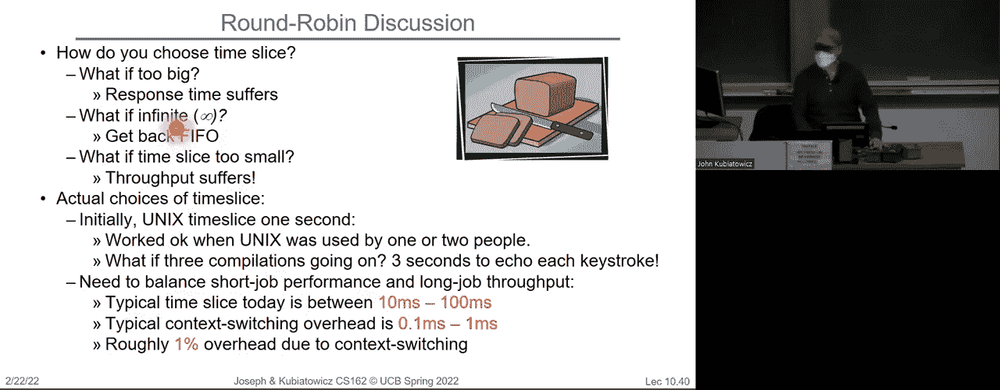

我之所以要展示这个，是因为。让我们再放几张幻灯片。举个简单的例子，你有 10 个任务，每个任务需要 100 秒的 CPU 时间。轮转法调度器的量子时间是 1 秒。所有任务同时开始。所以你可以看看 FIFO 的完成时间。在这种情况下，你将在 1000 个周期内完成，假设没有切换的开销，在轮转法中，每 1 秒就进行一次切换。

你知道。任务一、任务二、任务三、任务四，你逐一执行它们。那也会在一千个周期后结束，因为它们两个都需要，嗯。你知道，100 乘以 10，总共需要的 CPU 周期。所以它们同时结束。但在轮转法下，平均响应时间要差得多。

简单的直觉是，在 FIFO 策略下，有些任务会非常早结束，而在轮转法中，它们都会非常晚结束。所以，平均响应时间和最终完成时间非常差。而在这个轮转法的例子中，你的缓存状态会不断被交换出去，所以……

如果你的 CPU 做得很好，尽量把任务加载到缓存中，这反而会影响吞吐量。好的。

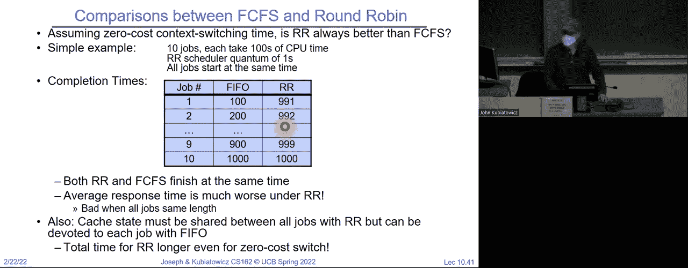

所以这是另一张幻灯片。你知道，青色和紫红色是很棒的颜色，对吧？那么最好的是假设我们这里有线程，P 一是 53，P 二是 8，P 三是 68，P 四是 24。我们之前给你展示过这个。最好的先来先服务方式是最短的先执行，然后依次执行下一个最长、下一个最长、下一个最长。所以你可以看到，从等待时间的角度来看，最好的先来先服务。

然后，对于 31 和四分之一的平均值，最差的情况给你带来 83 和三分之一的平均等待时间。而从完成时间来看，我们得到 69 和三分之一，以及 121 和三分之四的完成时间。如果量子值为 8，我们可以看到平均等待时间降至 57 和四分之一，平均完成时间为 95 和三分之一。所以请注意，这个值介于最好和最差之间。

当然，我们也可以把这些其他情况放在中间。你可以看到，只要你处于中间，大部分情况下，它都能很好地工作。微调上下波动实际上并不会给你带来什么一致性的结果。好的。

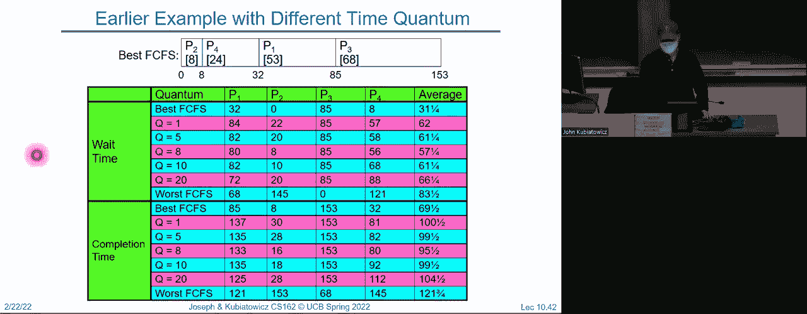

另外请注意，P2。P2是什么？P2是8，它是最短的一个。请注意，P2在调度时的可能变动最差。所以注意。如果P2是短任务，因为它是一个用户的交互任务，注意它的等待时间可以是零，也可能会有非常长的等待时间，达到145。好的。

所以这个用户要么非常开心，要么非常生气。幸运的是，如果你能合理地选择一个时间片，那么两者的情况都会还行。所以最短的任务通过调整调度会受到最大影响。另一个需要注意的是，最长的任务，比如我们计算圆周率的任务，变化最小，因为注意。

除非你选择最差的先来先服务方式，让它最先运行，否则不管你的时间片是多少，它基本上是相同的。那么，这是什么？这个幻灯片的重点是什么？幻灯片的重点是，你不必过于担心长任务，因为短任务会受到调度的巨大影响。

好的，短任务是你的用户任务。所以，这意味着恼怒的用户比计算派的长时间任务要容易得多，对吧？好。

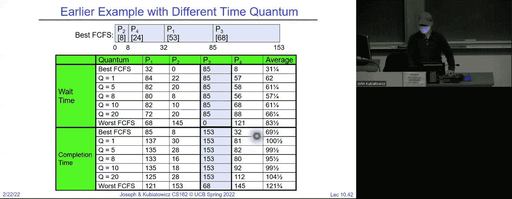

现在，一切看起来都很好，除了问题在于几乎所有的任务都被当作相同的来处理，对吧？因为我们基本上说我们设置了一个计时器。

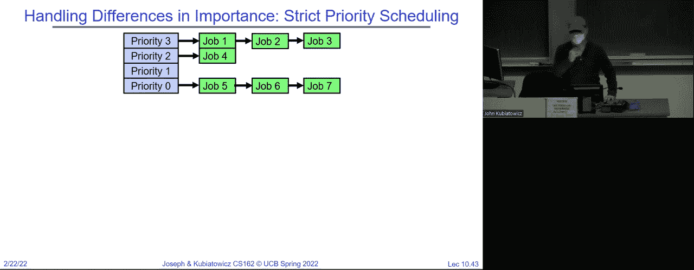

如果计时器响了，而你还在运行，我们就把你放到队列的末尾，然后稍后再运行你，这就是这里发生的唯一事情，所有任务都是平等的。但是我们可以想象，实际上我们想要优先处理某些任务，这时我们就有了一个优先级调度器。

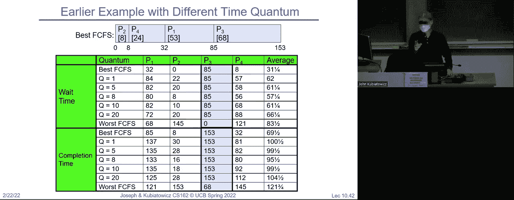

当你开始做项目的第二部分时，你会学到更多关于这一点的内容。所以，如果你看这里，我们可以有优先级三、优先级二、优先级一的任务队列。现在我们有一个执行计划：始终执行最高优先级的可运行任务直到完成，可能还会采用轮询算法，然后再执行下一个优先级的任务，依此类推。

所以请注意，现在不仅我们有了轮询机制，确保在给定的优先级层级中，所有任务都能有进展。而且我们现在还给它们设置了优先级。这样我们就可以决定哪些任务比其他任务更重要。好的，你们都读过《动物农场》，多少人记得《动物农场》对吧？一些动物比其他动物更重要，好吧，优先级调度就是我们从中得到的东西。

好的。当然，问题在于选择谁的优先级，正确地设置优先级，以便获得你想要的效果，这将是很棘手的。但是，像饿死现象这样的明显问题，也许会变得非常可能。

如果你有一个任务被卡在最低优先级，并且只有更高优先级的任务不断进入，而低优先级的任务永远无法运行，好的。然后，你甚至可能会遇到更糟糕的情况——优先级倒置。这实际上曾经导致了火星车的故障。也许下次我会确保我们讨论这个问题，但当时发生的事情是，如果一个低优先级的任务获取了锁，然后一个高优先级的任务在等待这个锁。那么，发生了什么呢？

一个中等优先级的任务正在运行计算饼图。现在你现在死锁了。为什么会这样呢？因为高优先级的任务正在尝试进入休眠状态。它们试图获取锁，但正在休眠，而中等优先级的任务正在运行，低优先级的任务则永远无法运行并释放锁。好了，这就是一个永远无法自行解决的情况。好的。

结果证明，火星车的确出现了一个类似的问题。高优先级任务是总线，低优先级任务是一个特定的测量方案，而中等优先级任务则在进行设备的维护。唯一让他们最终能够让火星车执行正确操作的原因是，他们能够从地球远程重启和调试它。

这真的很巧合。那么，如何解决优先级调度的问题呢？这将是一个有趣的话题。因为我们必须开始动态地调整优先级。所以我们从一组给定的优先级开始，但随后根据动态启发式算法将任务的优先级向上或向下调整。好的，这就是我们将要处理的方式。好的。

所以希望你们开始看到调度在这一刻变得更有趣了，或者可能更复杂了。我不知道。我们得讨论一下这个问题。所以我们可以问自己，公平性怎么样呢？严格的固定优先级调度在队列之间是非常不公平的。

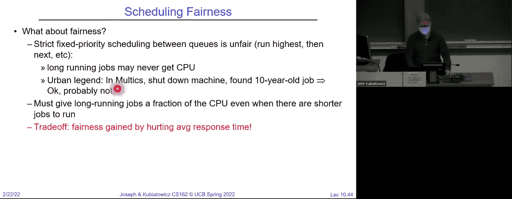

好的，这不公平，因为只要有优先级三的任务，低优先级的任务就永远无法运行。但是如果优先级三的任务正在尝试实施制动措施，也许这样就可以了。现在，我刚刚在聊天中收到的问题是，我所说的优先级重排是否意味着，最低优先级的任务可能会突然变成最高优先级的任务？嗯。

事实上，是的，存在一个叫做优先级捐赠的机制。如果一个高优先级的线程试图获取一个锁，而一个低优先级的线程已经持有该锁。那么，高优先级的线程将能够将它的优先级捐赠给低优先级的线程，以便它能够运行足够长的时间来释放这个锁。好了，这只是我们将要提出的众多动态优先级机制中的一个。

所以，队列之间的严格优先级调度是不公平的。曾经有一个完全不真实的都市传说，但我还是要重复它，因为它是都市传说。那就是在多任务操作系统中，他们关掉机器，发现一个10年的作业一直在队列中等着，从未运行过。

好的，这唯一的作用是指出都市传说是荒谬的。并且很明确地指出低优先级的任务可能无法运行。好的。所以你必须为长时间运行的作业分配一定比例的 CPU。你使用严格的优先级调度。也许这样你就不会让一个作业卡在队列里待10年。

但是你可能会有一个作业，它想要取得进展，但始终没有进展。

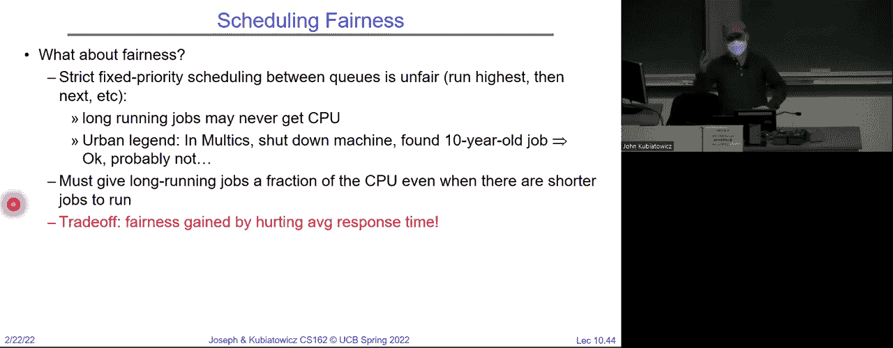

好的，这在最纯粹的形式下可能不是一个好计划。好的，但它开始给我们提供了一些可以调整的思路，以便尝试将 CPU 分配给当前重要的任务。

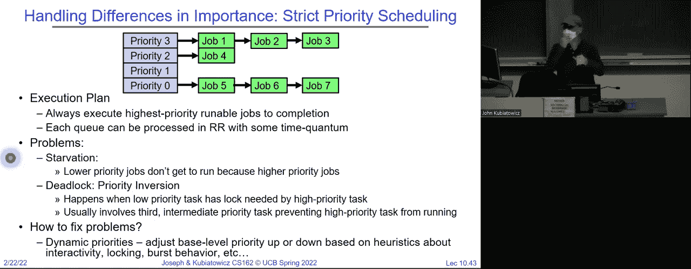

好的。所以权衡是通过牺牲平均响应时间来换取公平性。我们做的就是为长时间运行的作业分配一些 CPU，然后让非常短的作业得到更少的 CPU，这可能是可以接受的。那么，如何实现公平性呢？你可以给每个队列分配一定比例的 CPU。

如果你有一个长时间运行的作业和100个短时间运行的作业，你该怎么办？你可以增加那些没有得到服务的作业的优先级。是的，继续吧。啊，所以，是否有办法来决定优先级？这个问题的难点在于，你以为自己想出了一个很好的方案，但往往它并不是一个好方案。所以。

人们有很多方法来选择优先级。好的，因为我喜欢回答问题。我给你这个问题。

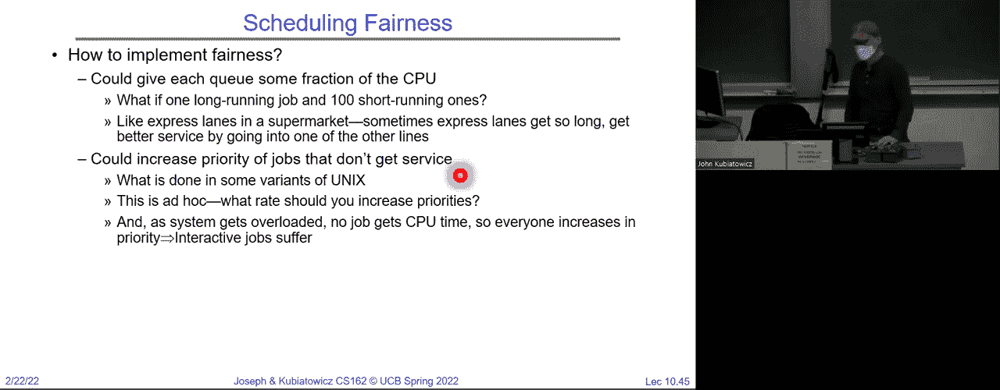

假设一下有140个优先级。底部的或者最重要的前100个优先级，基于事件发生的频率来选择，底部40个则基于我们正在讨论的内容来选择。这正是 Linux 调度器所采用的方式，它有100个实时优先级。选择优先级的方式是，频率较高的事件会得到更高的优先级。

因此，可以根据周期来分配，你可以从100个优先级中选择一个，这个是一个数学选择。然后剩下的40个优先级，再结合我们刚才讨论的问题，你必须做出选择。但至少这是分配优先级的一种方式，这些优先级是重要的。

我将在谈论实时时提到这个问题。所以，你们可以分别为每个队列分配一部分 CPU。然后，我们可以增加那些没有得到服务的作业的优先级。所以，如果一个作业运行了很长时间却没有得到任何服务。

然后你可以逐渐提高它的优先级，以便为它提供更多的服务。好吧，这算是动态的。但是我想以这个问题来结束：如果我们知道未来会怎样呢？我们能不能想出最佳的先来先服务策略，因为请记住，先来先服务只是某些时候不好，尤其是当它真的很糟糕的时候。

但有时候它真的很好。对吧，一个非常好的先来先服务策略就是我们能确保最短的任务优先完成。太棒了。对吧。但是有谁能告诉我为什么这么做很难吗？没有对吧？你必须做出很好的预测。所以相反，在课堂的最后几分钟，我想探讨一下，如果你知道未来会怎么样。

所以我现在不会告诉你们怎么知道未来。我们下次会讲，大家可以准备好股票交易账户什么的。不过，假设我们真的知道。好吧，那么我们就可以得到一个算法，叫做最短剩余时间优先，这就是……

当你有一个队列，必须选择下一个任务时，你只需要选择剩余部分最短的那个。你选择剩余时间最短的任务来运行。最短剩余时间优先，实际上还有一个非抢占式的最短任务优先。但我们先讨论最短剩余时间优先。

我们可以将它应用到整个程序，或者应用到出生等地方，但如果我们知道未来。那么我们就可以做最短剩余时间优先，事实证明，最短剩余时间优先是，嗯，我们查看队列，选择剩余运行时间最短的任务运行，它有着绝对最佳的最小平均响应时间。所以如果我们能以某种方式预测未来，我们就可以做到。好吧，这个是可以证明最优的。

好吧，在可以证明最优策略涉及预测未来的情况下。如果你将最短剩余时间优先与先来先服务进行比较，例如，假设所有任务的时长相同。那么最短剩余时间优先就变成了和先来先服务一样，为什么呢？如果10个任务时长相同，大家都是一样的，你挑一个，它就开始运行。

它就永远不会被抢占，因为它现在是剩余时间最短的任务，所以它接下来就运行。好吧，另一方面，如果任务有不同的时长，最短剩余时间优先就能确保短任务总是优先执行。好吧。这里有一个好处。如果你有三个任务，假设a和b非常长，它们需要一周才能完成。

看，任务必须运行非常短的时间，因为它正在做一些像从磁盘上复制数据的事情。它计算出下一个要从磁盘获取的数据，然后执行磁盘操作，然后计算下一个任务。所以，为了获得最大效益，我想做的是将这个任务以极高的优先级运行在短时间内，然后把东西发送到磁盘，接着可以运行其他任务。因此，这个任务只有在我们始终以最高优先级运行短小的计算任务时，才能最大化磁盘带宽的使用。

好的，这些后台的任务无论如何都要计算一周，所以它们不在乎我们是否中断它们。好的，按照先到先得的原则，如果a或b可以运行，c就完蛋了。对吧？它根本行不通，因为你得等一周。好的，另外，你不能从磁盘上复制东西。那么轮转调度呢？如果使用轮转调度。

你这样理解就对了，先运行c很短的时间，然后它进行磁盘访问。然后它可以运行100毫秒，b也运行100毫秒，然后c再运行很短的一段时间。好的，如果你看一下之前的幻灯片，我们希望c实际上运行一毫秒和九毫秒的时间片。

所以只有在一毫秒和九毫秒的时间片内，我们才能实现100%的I/O利用率。所以在这里，我们的磁盘利用率现在是201个单位中的9个，仅为4.5%。好的，这样很糟糕。如果我们用轮转调度，那就浪费大量的时间。我们可以通过SRTF调度将磁盘利用率恢复到接近90%。

我们可以将其调整到90%，这是我们能做的最好的情况。所以我就先停在这里，我们下次再继续。不过，我们会用预测未来的方式来解决这个问题。但是轮转调度是给每个线程一个小的CPU时间片，执行时在所有线程之间循环，采用最短作业优先的策略。

它将运行计算量最少的任务，并通过预测未来以某种方式执行。我们将把这一切转化为一个多级反馈调度器，从而在某种程度上预测未来。好的，祝你们周二剩下的时间愉快，我们可能周四再见。再见。

[BLANK_AUDIO]。
