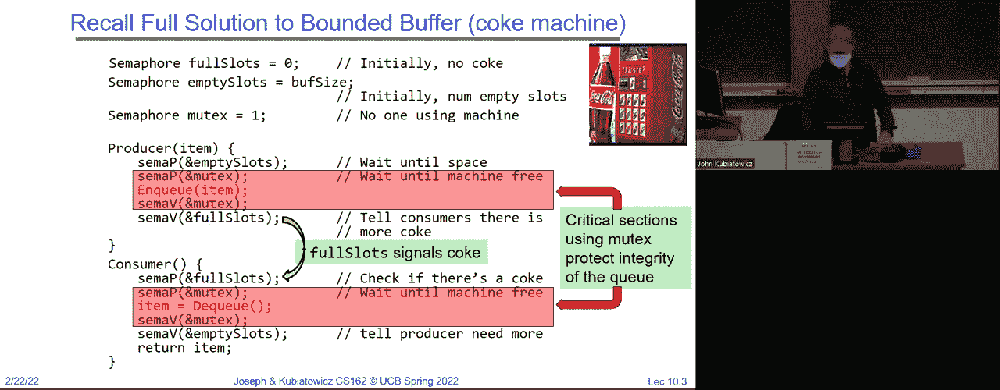
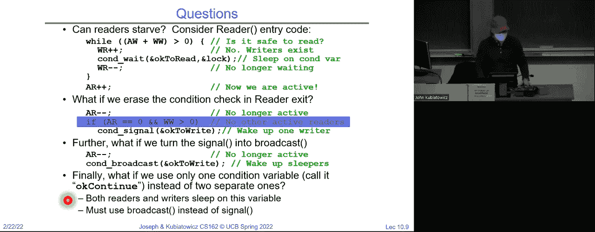
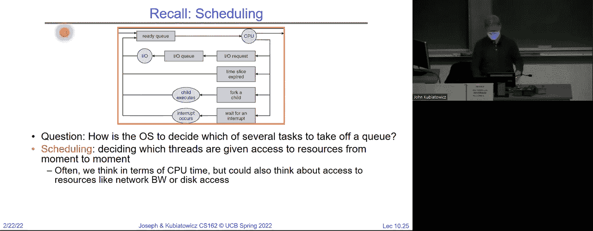
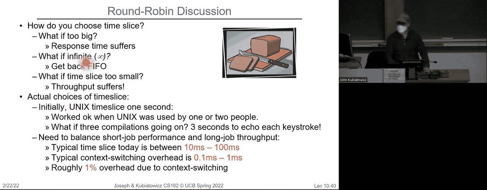
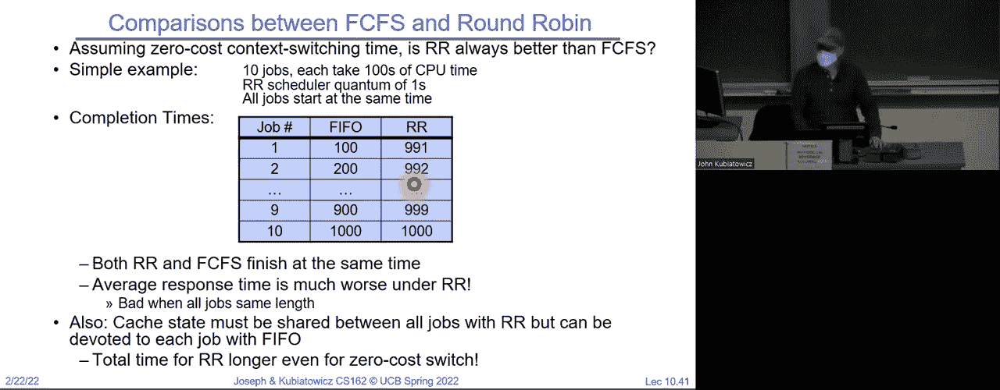
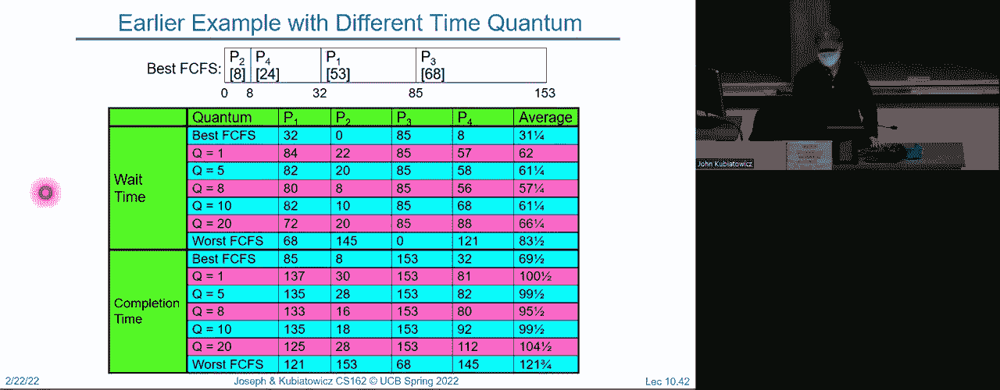
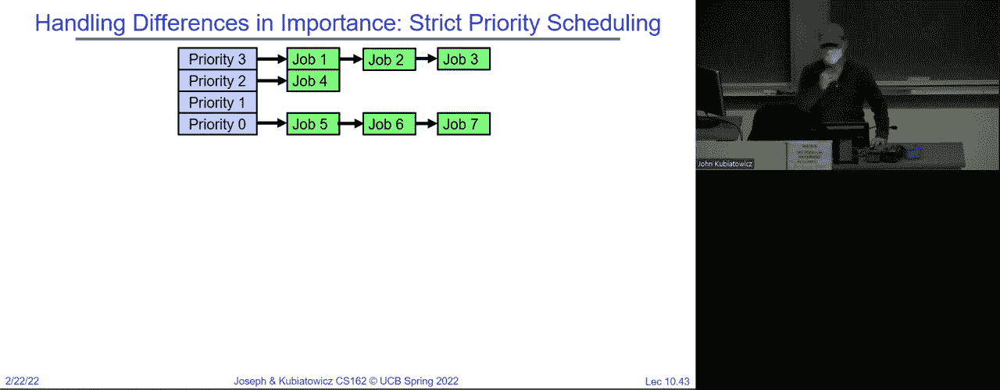
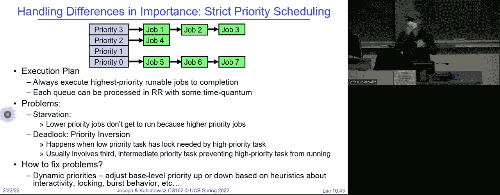
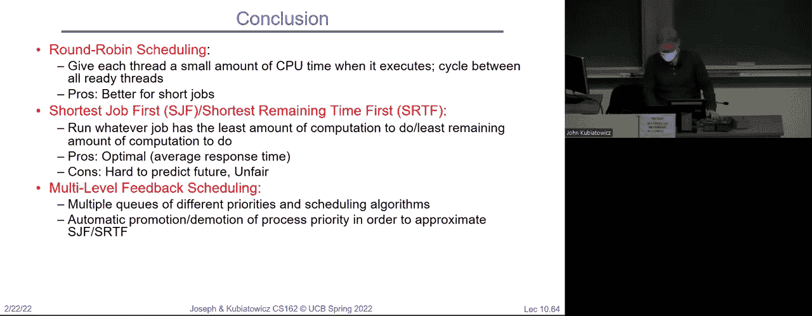

# 🧠 操作系统课程 P10：调度概念与经典策略



在本节课中，我们将要学习操作系统中一个核心概念：调度。我们将探讨为什么需要调度，介绍几种经典的调度策略，并分析它们的优缺点。理解调度是理解操作系统如何高效管理多个任务的关键。

---

## 🔄 回顾同步机制

上一节我们详细讨论了信号量和监视器等同步机制。本节中，我们来看看操作系统如何决定哪个线程可以访问CPU资源。

信号量有两种使用方式。信号量有一个初始值，这是在分配时设置的。如果你将这个值设置为 1，实际上你得到了一个互斥锁，或者称为二进制信号量，你可以用它来进行锁定。所以你会像这样使用它，做 P 操作时把它减到 1，做 V 操作时把它加到 1。




如果两个人同时尝试做信号量 P 操作，其中一个会被挂起。这是一个纯粹的原子操作。所以两个线程不可能意外地同时通过这个操作。它会原子性地递减这个值。如果你想递减到零以下，它会让你进入休眠状态。我们还看到了通过将初始值设置为零，我们可以实现调度约束。

这可能让你进行一个联合操作。所以你把它设为零，然后尝试做一个 P 操作来让自己进入休眠状态。其他任何人都可以用一个 V 操作把你唤醒。最后，这就是线程连接的例子，假设原始的“鹦鹉线程”进入休眠，然后结束的子线程执行 V 操作把它唤醒。

然后最后我们给出了可乐机的有界缓冲区解决方案。这是一个很好的三信号量的例子。我们之所以有三个信号量，是因为我们有两个条件和一个锁。这两个条件是关于限制可乐机中最大可乐罐数量的，同时也在说明不能让可乐罐数量变成负数，所以我们在两个方面都做了限制。

以下是生产者和消费者的代码模式：
```c
// 生产者
P(empty_slots);
P(mutex);
// 将物品放入缓冲区
V(mutex);
V(full_slots);

// 消费者
P(full_slots);
P(mutex);
// 从缓冲区取出物品
V(mutex);
V(empty_slots);
```
这里的关键模式是，我们总是像队列一样保护一些东西，因为这些操作如果多个线程同时进入可能会出现问题，这就是为什么我们在它们周围加上互斥锁。然后我们在空槽上执行一个信号量的 P 操作，以确保生产者进入之前有东西，消费者则是相反的操作。

红色部分是用来保护队列的临界区。然后我们有这个信号，当生产者终于生产了东西，它会唤醒某些可能正在休眠的线程。当消费者最终把罐子倒空时，他们可能会唤醒生产者。

然而，我们说过有更好的东西。一个监视器，它是一个锁和零个或多个条件变量。其实，如果你只有零个条件变量，那就不太有趣了。条件变量专门是一个等待队列，你可以在持有锁的情况下去休眠，这就是关键的概念。和其他任何等待队列不同的是，在条件变量的等待队列中，你先抓住锁，检查条件，然后如果不满足就去休眠。正是这种奇特的差异或者API的不同，使得它们变得非常强大且易于使用。

通常有三种操作，它们根据不同的包有不同的名字，但大致是等待、信号和广播。规则是，进行这三种操作时，始终要持有锁。进行等待、信号或广播操作时，始终要持有锁。



所以我们给了你这个典型的结构，如果你在考虑一个监视器程序，这是一个思考的方式。你抓住锁。你检查条件是否满足。如果不满足，你就去休眠。注意，这个等待操作总是会发生。就像一个信号量P，它可能不会让你休眠，而一个等待操作总是会让你休眠。这是关键的接口方面。然后，当你醒来时，使用典型的Mesa调度，你总是必须重新检查你的条件。然后你可能以某种方式保留你找到的资源，然后你可以解锁，结束时你再锁一次，并发送信号表示你完成了。这是一个模式。我们在读者-写者示例中做到了这一点。

这是读者-写者示例，它可以有一个写者或多个读者，但读者和写者永远不会同时存在。每次只有一个写者。那就是我们这里代码的动机。

这是一个读者代码，你抓住锁。看到了模式吗？你检查并确保没有写者在活动或者休眠。如果有，你就变成一个等待的写者，然后去休眠。当你醒来时，你不再是一个等待的写者。你会一直循环，直到系统中没有任何写者，在这种情况下，你就会执行`++`操作，表示你是一个活跃的读者，释放锁并访问数据库。然后在签出时，你再次获取锁，减少计数，表示你不再是一个等待中的读者。接着如果没有剩余的读者，就会触发某些条件。那些是活跃的，但如果有等待的写者，你就会通过信号唤醒它们，然后最终释放锁。

那么，为什么我们在这个时候释放锁？记住，这个进入条件并不是阻止访问数据库。它的作用是保护数据库的进入条件。我们需要释放锁，这样其他线程才能进入并自行分类。写者的情况类似，但稍有不同。

那么在这里，我们对写者的进入条件是：不能有任何活跃的写者或活跃的读者。如果有任何一种情况，我们就会进入睡眠状态。否则，我们会醒来并进行访问。这是一种修改样式的访问。然后，当我们再次获取锁时，如果没有其他等待中的写者，我们就不再是一个活跃的写者。如果有等待中的写者，我们会唤醒其中一个。如果有等待中的读者，我们则会唤醒所有读者。然后我们退出。

所以，再次说明，为什么我们在这里使用广播而不是信号。可能有多个读者，唤醒他们所有人。通过执行这组`if`和`else`语句，我们确保了优先给写者而不是读者。这时我们会广泛地发出信号给写者，然后再广播给读者。尚不清楚是否某个读者会在写者之前醒来，若发生这种情况，我们实际上会违反我们政策中的优先级规则。这总是先让写者去执行。就正确性而言，这是没问题的。它不会违反“一个写者或多个读者”的正确性条件，但它会违反政策。似乎这个特定的代码符合的政策是写者优先于读者。

这实际上导致了，为什么要给写者优先权。事实上，这里有几个原因。其一是，如果你查看典型的跟踪，读取操作通常比写入操作多，所以优先考虑写者并不是坏事。另一个原因是，你可以想象，写者使数据更加更新，因此给读者提供了获取更新数据的机会。这不是强制要求。你可以使用任何其他策略。

这里的问题是为什么要再次释放锁，答案是我们必须释放上面的锁，以便其他线程可以进入并进行分类。因为如果我们持有锁，那么进入的其他线程就无法被分类为读者或写者。

现在，问题是这里有几个问题，一个是读者是否会饿死。如果写者持续不断，读者可能永远无法得到机会。如果这是你使用的条件，你可能需要稍微调整代码的设计，但监视器足够强大来处理这种情况。假如我们取消了条件检查，重绘出这个呢？那这样做还会正确吗？依然正确，因为有了 `while` 循环。入口处就是这样，这也是为什么Mesa比“马语义”更受欢迎的原因之一，因为你可以稍微松懈一些。只要你唤醒的线程比需要的多，你仍然会是正确的。这种情况的危险是你可能唤醒的线程不够，接着系统就会死锁。实际上，我想这算是一个活锁。

在接下来的几节课中，然后我们可以将这个信号转变为广播，唤醒所有的写者。为什么这样做还是正确的呢？只有一个写者会得到它，其他的写者不会。理解这一点的方式是因为代码开始时的那个锁。所有进入系统的线程都会被锁串行化，所以你每次只能查看一个条件。所以下来一个一个地处理，即使有一千个写者，也是一个一个地处理，第一个将获得作为活跃写者的能力，其他的会在稍后等待。

然后最后，如果我们只使用一个条件变量，会怎么样呢？所以不要将读取和写入操作分开，仅仅说“好吧，继续进行就可以了”。现在事实证明，我说的关于循环的内容是正确的，所以我们不会得到不正确的行为，但是如果我们不使用广播而使用信号，可能会发生什么呢？因为如果读者和写者都在同一个队列中，我们只唤醒一个，那么我们可能无法得到我们想要的服务员类型。

例如如果我们将“okay to write”变成“okay to read”，再变成“okay to continue”，这样就变成了不同的代码。然后我们有这样的场景，假设我们的一个到达了，接着w一个要到达。嗯，我们的一个仍在工作。然后当那个读者去检查时，如果我们只发送信号给一个服务员，那么会发生什么呢？我们实际上会发送信号给错误的人，我们会给w一个发送信号。但是w一个醒来后会说：“哦，看，系统中有读者，可能这样不起作用。”所以我们必须确保正确发送信号。所以我们在这里进行广播，只是为了确保有足够的人能唤醒所有的东西。这对于写者来说尤其具有挑战性。它在双方都有挑战性，所以基本上你只想广播。

现在我们的监视器与信号量根本不同。你可能会怀疑答案是否定的。因为我们设法以某种方式做出了一个非常复杂的提示。对于可乐机来说，信号量是非常强大的。所以如果它们真的是等价的，似乎如果我们有了信号量，我们应该能够实现监视器。从同步的角度来看，这不是某种完整性吗？但是技巧是我们得小心。首先，锁是简单的，监视器有锁，信号量你初始化为1，锁很简单。保证从那里开始会变得更难。那么如果我们尝试像这样实现条件变量，等待会获取一个信号量，并执行一个信号量P，信号则执行一个信号量V呢？这能工作吗？问题在于我们获取了信号量锁并执行了等待。在一个条件变量信号量上，你将带着锁去睡觉。一切都坏了。所以这一实现一开始就不行，因为你不能在这个特定的信号量上睡觉。

好吧，这样行吗？所以等待释放锁，然后在条件变量上执行信号量P。然后在退出等待之前重新获取锁。信号只是执行信号量V。这看起来稍微好一点，因为它不会因为持有锁而进入死锁状态，因为你看，当你执行等待时，你先释放了锁。但这有效吗？这仍然是错误的。因为记住，信号与某些操作不相同，因为如果你先发出信号然后再等待，使用这个实现，它们永远不会等待。而条件变量是，你去说等待时，你总是会等待。信号量是对称的，而条件变量信号则不是。

那么我们能做什么呢？假设一个线程发出信号，而没有人等待。那么，如果一个线程稍后等待，线程就会等待。而如果你做一个V操作，而没有人在等待，你会增加信号量，如果线程稍后执行P操作，你就会减少信号量并继续。所以，这将没有这样的特性：每次你调用等待时，你都会休眠。这看起来是错误的。也许我们做不到。之前尝试的一个问题是，P和V是可交换的，不管它们按什么顺序执行，结果是一样的，而条件变量则不是。所以，如果你看看，这个修复解决了问题，等待时释放了锁。是否一个信号量P并获取锁，而信号量说如果信号量队列不为空，那么执行一个信号量V。这样行吗？它有效，但它是非法的。你不允许读取信号量的值。所以，这里有一个竞争条件，信号量操作可能会在错误的时机执行。但实际上，事实证明这是可能的。我会给你们一个提示。如果我们保持一个条件变量整数，所有我们用来在释放锁之前增加的那个变量，那么我们可以跟踪有多少个线程在休眠。信号量操作可以查看它，因为这是合法的。因为他们有锁。所以这里是一个有趣的例子，拥有锁在信号量操作周围实际上对于这个特定实现的工作至关重要。因为如果你没有锁，试图检查条件变量或检查那个整数变量，而你没有锁，那么有人可能会在你不知情的情况下改变它，这就是问题所在。我们不再详细讲这个问题了。那么，重点是，你可以用信号量做出监视器，而你可以想象，用监视器做出信号量更容易。这是一个你们可以做的练习。

但是，随着我们前进，假设你们会越来越擅长于查看同步问题并解决它们。这就是其中之一，我可以给你们举例，但最终还是要靠你们自己去重新训练思维，去思考这些问题。但你知道，我认为，如果最糟糕的情况发生，使用监视器应该是最容易想到的事情。我在我做的一个研究项目中曾建议过某人使用条件变量，因为他们需要让线程休眠。然后稍后唤醒它，结果证明这绝对是最正确的做法。非常简单。顺便说一下，这些在很多情况下都可以使用，包括像 P 线程这样的线程包。



但在我们完全关闭同步之前，我想说一点关于语言同步支持的内容。所以如果你去查看线程，你会看到 P 线程新的 Texas，还有 P 线程条件变量。它们已经被实现了。所以如果你只需要做一下 man 查阅 P 线程包，你会看到它们。只要你在使用 P 线程，你肯定能够与监视器和信号量同步。这些是可以使用的。C 是一种有点疯狂的语言。C 最糟糕的地方就是它允许你做各种坏事。你永远不应该做的事情。最糟糕的是你可能会有悬空的内存指针，或者忘记了释放某个东西，或者释放了两次，这里有很多坏事。但这不是我们今天要讨论的内容。如果你的代码获取了锁，并且在代码内部发生了异常，你需要检查每一个异常路径，并在从该过程返回之前释放锁。因为如果你不这么做，我们会把它留在那里。然后你可以很容易地通过抛出异常返回调用函数，锁依然保持着，没有人会释放它。看到了吗？因为正常的代码是你获取锁，做一些操作，然后释放锁。但是如果发生了异常，你需要确保释放锁。这使得 C 在锁定方面真的很复杂。你必须做这些事。





更加复杂的是 set jump 和 long jump 的概念。set jump 和 long jump 是异常的一种简陋版本。它们是这样的：有一个堆栈，你从程序 A 开始，然后到程序 B，接着调用一个叫做 set jump 的东西。这会给你一个句柄，让你可以丢弃一大堆堆栈并返回到你调用 set jump 的地方。所以它就像一个异常。这里，我们进入 C，获取锁，进入 D。在 E 中出现错误或某些情况时调用 long jump。它会丢弃所有的堆栈并返回上面，而不需要重新获取锁。或者没有释放锁。坏消息。现在，幸运的是，set jump 和 long jump 是你今天经常使用的东西。但我只是警告你，在 C 语言中，这只是乱七八糟。然后也许你可以使用 goto。当你接触到比 C 语言更强大的东西时，结果发现它是好的。例如，在 C 语言中，你仍然需要确保如果食物有异常，它会被抛出。而且你可以捕获它，这意味着你至少需要做类似这样的事情：你说我要尝试做，如果有异常，我会释放很多。注意看，这看起来像是 C 代码，但它要干净得多，因为所有异常都会通过那一条路径。




现在，如果你是 C++ 背景的观众，你可能会说，但等等。这不是做这件事的好方法。还有更好的方法。我鼓励你们谷歌一下锁守卫。这意味着这里我们有一个过程。无论有多少人尝试执行，它都会干净地增加这个全局变量。这里发生的事情是，当你分配锁时。其实这是一个局部变量。在这里，你分配了一个锁守卫，它锁定了全局互斥量。关键在于，无论安全增量退出的条件如何，这个锁都会在任何情况下释放。所以如果你在做锁定操作时，C++ 或它的一些变种是最干净的。因为这种特定类型的锁守卫。基本上，每当它最终超出作用域时，它就会自动释放锁。Python。你可以分配一个锁，然后你可以说用锁来停止，这意味着无论那个 with 语句如何退出。锁会被释放。这几乎与我刚才展示的 C++ 完全相同。Java。你可以说 public synchronized。意思是每个对象都有一个内建的隐式监视器，包括一个锁和一个条件变量。因此，结果是，你可以说这个特定的方法 get balanced。你还记得我们讨论过银行账户是同步的吗？而这个 get balance 只有在获取对象的锁之后才能被线程运行，然后它会进入并让你继续。仅仅通过说出“同步”这个词。我们就可以自动使用这个法则。比起我们几节课前介绍的方式，这样是不是简化了很多？此外，正如我之前所说，Java 只有一个条件变量。你可以为每个对象编写代码，所以你可以进行等待操作。你也可以进行带有超时的等待操作。而且你可以通知并通知所有等待的线程，或者进行广播、信号和广播。这就是你在 Java 中如何做的。所以 Java 实际上将监视器内建到了语言中。这真的挺酷的。


---


## ⏱️ 引入调度概念


现在，我们暂时可以放下同步这个话题。接下来我想说的是，操作系统是一种循环。如果有就绪线程，系统就会从中选择一个执行。否则，你就会运行一个空闲线程，并定期执行循环。这就是整个操作系统的工作。




今天我们想要做的，是开始讨论调度，实际上就是“选择什么”的问题。这个图显示了一个就绪队列，它是所有准备好由 CPU 执行的线程集合。真正的问题是，操作系统如何决定就绪队列中的哪个线程将会是下一个执行的线程？调度其实就是决定哪些线程在每一时刻可以访问资源。在接下来的几节课中，我们将讨论如何分配 CPU 时间。但是调度远不止这些。我们可以讨论带宽调度。你可以谈论I/O资源调度，可以谈论内存调度。你可以调度很多东西，但目前我们将只调度CPU。因为我们实际上是在试图弄清楚发生了什么，介于就绪队列和CPU之间。这是接下来几节课的目标。

调度完全是关于提示信号的。关于调度的一些假设，首先，一些假设实际上来自70年代，调度在70年代成为了一个重要的议题。这是一个重要的研究领域。请注意，我们只有三节课讲它，但它确实是一个重要的研究领域。很多关于CPU调度的隐性假设实际上都来源于那个时期。而这些假设类似于：每个用户只有一个程序，每个程序只有一个线程，程序是独立的。这是一个非常老派的思维方式，也算是一种当多个用户共享同一台机器时的情况，所以它是一种大型机的视角。但70年代做的许多工作至今仍然被愉快地使用。显然，这些具体的想法是不现实的，但它们确实简化了问题，以一种可以解决的方式来处理。所以在第一次讲座中，我们将从这种背景开始：每个用户一个程序，每个程序线程独立。然后，我们将逐步为我们的过程增加更多的复杂性，以便使调度变得更加有趣。

高层次的目标，提醒一下，这就是我们最喜欢的图表，再次来自第一天的打印机逆色：品红色、青色和黄色。这些代表着不同的线程，我们将决定如何在一个CPU上调度它们。请注意，现在它们的CPU时间各不相同，因为程序执行的时间长短不同。调度程序如何决定呢？到目前为止，问题还很简单。什么是用户？用户是一个实体或一个拥有资源分配的人，最简单的想法就是登录，你登录了，就成了用户。CPU通过用户ID来处理你。但随着学期的推进，实际上可以更一般化。比如说，如果你有一个公私钥对，在安全的意义上，它也可以是一个“主体”，但是现在就当作登录ID来理解吧。



这里还有一个问题，进程调度是不是更多的是调度器的隐式操作呢？比如调度器切换线程，而这些线程可能属于不同的进程。所以暂时我们不会讨论，或者限制自己去担心哪个线程属于哪个进程。我们有很多线程，它们都需要CPU时间。比如你可以想象，可能会处理完一个进程中的所有线程后，再切换到另一个进程。你可以想象，几乎可以想象任何场景。例如，大规模的拉丁语程序之类的，你几乎可以想象任何事情。但有趣的是，既然已经提到这个问题，如果有一个进程有100个线程，另一个进程有一个线程。什么是公平呢？将相同的时间分配给进程A中的100个线程和进程B中的一个线程，是否公平？也就是说，它们总共有101个线程，每个线程得到1/101的时间。或者，是否更合理地将一半的时间分配给进程A，另一半分配给进程