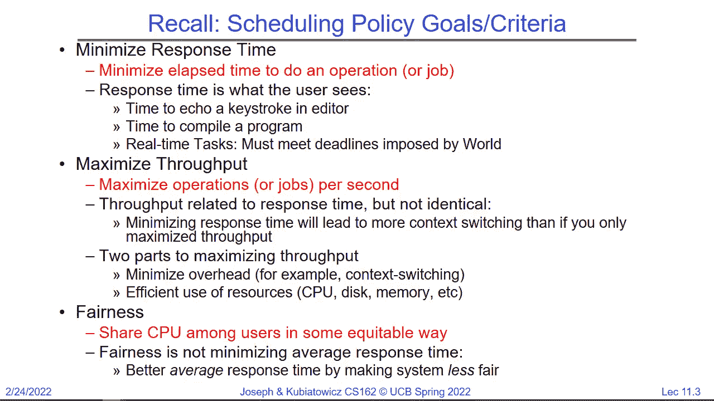
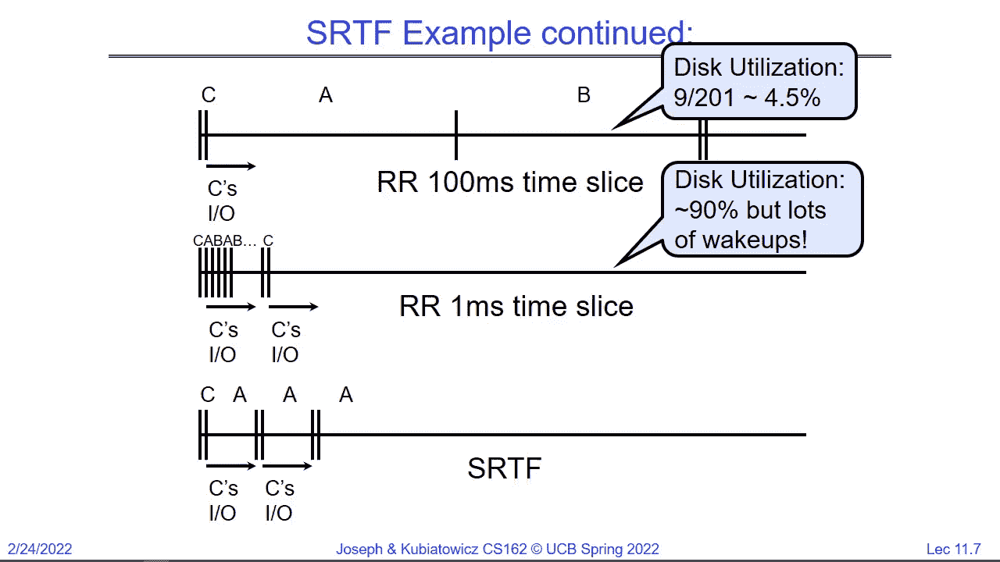
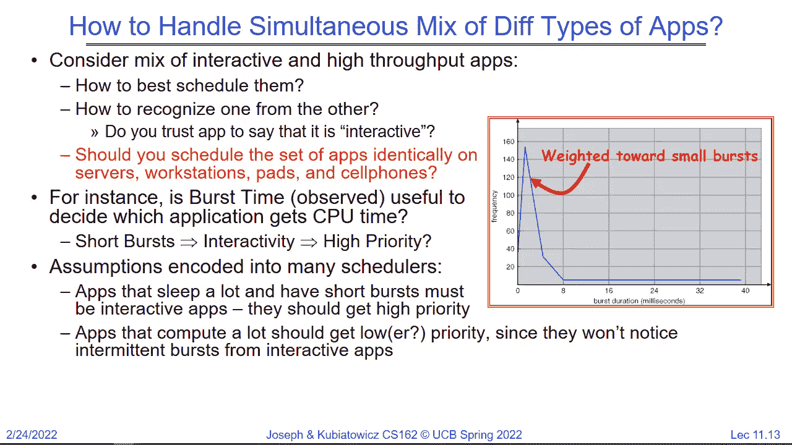
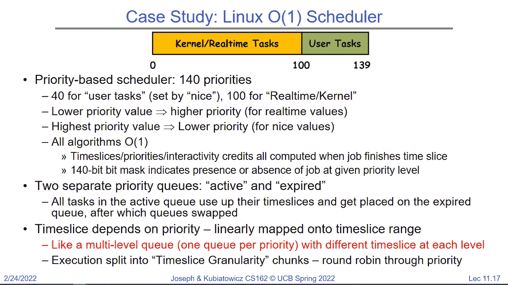
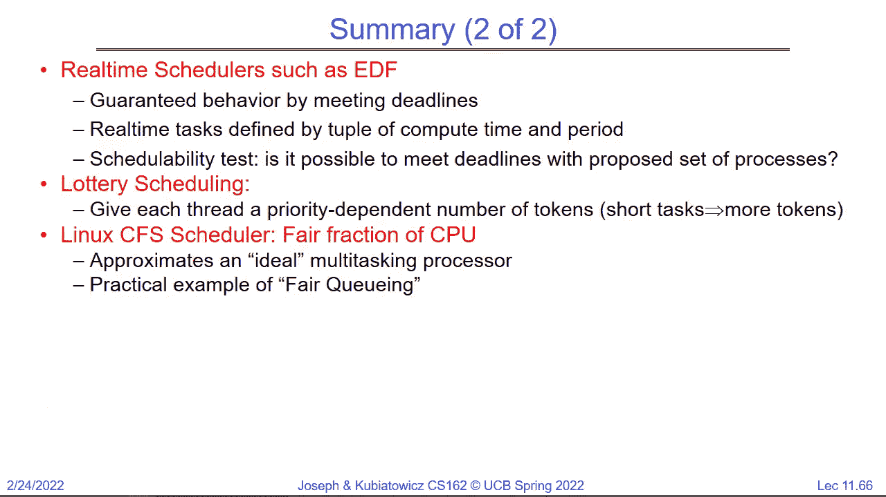

# P11：第11讲：调度2 案例研究、实时和前进进度 - RubatoTheEmber - BV1L541117gr

好的，我不确定我们是否能接入演讲者。所以只要你们还能听到我，能听到吗？有人回答一下吗？好的，欢迎回来，大家，我们遇到了一点技术问题。所以。那些看到我在这里的同学可以看到我。哇哦。也许我们会从课程录制中获取视频。

让我放大一下。更紧凑的镜头角度，我想从上次我们讨论调度的地方继续。如果你还记得上次，我们差不多在讨论调度时，决定从一组排队的任务中选择哪个。

下一步。好的，特别是，就像我们经常讨论的那样，就绪队列是我们经常讨论的一个问题。所以在那个实例中，嗯，哎，这里是哪里呢？这个队列就是。就是这个队列。好的，它是喂给CPU的队列。所以现在，调度基本上是做出决策。今天和下次我们会更多地讨论可能的调度策略。

好的，如果你还记得上次我们谈到的一些简单的策略，比如最小化响应时间。通过最小化完成某件事所需的时间。或者。响应时间通常是用户看到的内容，对吧？所以当你打字时。如果需要调度一个线程来处理你的按键并将其显示在屏幕上。

这可以是一个调度问题。我们讨论的另一个问题是最大化吞吐量。好的。这是一个。也许是最大化每秒的操作次数，比如你在做云计算。如果你还记得我们上次讨论的其中一件事是，响应时间和吞吐量有时是相互冲突的，对吧？因为响应时间意味着。快速抢占并继续执行。

线程就是这里，我们不能这样做，咱们继续吧。因为我需要这个。这个正在把麦克风传送给正在Zoom上的人。所以。如果你想想看，最小化时间消耗，就是要抢占那个线程来完成这项任务。最大化吞吐量其实就是。不抢占，允许它继续运行，这样你就能得到良好的缓存行为。

好的，然后公平性是另一个我们讨论的稍微有点。

这里有点复杂，我们稍后再解释。抱歉，大家稍等。你还记得我们讨论过的轮转法（Round Robin）吗？时间片是我们讨论过的一个问题。你知道，FIFO（先进先出）是最早的策略，但那不太有趣。

所以，圆形罗宾算法的思路是，你有一组进程。每个进程都有一个执行时间，也就是它运行直到完成并开始做 I/O 或类似操作的时间。举个例子，在这里我们有 P1、P2、P3、P4 及其执行时间，量子时间为 20。所以实际上，你知道，这不是火箭科学，你可以通过 P1 来处理这个问题。

运行 20 个单位时间后，它会被切换出去，因为量子时间超过了。P2 接管。它最终只会运行 8 个单位时间。为什么？因为 P2 只有 8 的执行时间。接着 P3 运行 20，P4 运行 20，然后我们重新开始。这里涉及到一个文件队列。当我们从 CPU 中取出一个进程时，我们将它放到队列的末尾，并继续这么做。

好的。所以我们接着讨论了像平均等待时间和平均完成时间这样的指标，这些是非常重要的，特别是对于交互式用户。好的，平均等待时间基本上就是将所有进程在队列中等待的时间加起来，然后除以进程数。而平均完成时间其实就是看结束的时间。

然后我们将这些时间加起来并进行除法计算。好了，我想在这里暂停，因为这是最基本的调度方法，除了 FIFO（先进先出）之外，没人真正使用它。我们讨论的就是这个。所以，大家对这个有问题吗？因为我假设大家应该是明白的，没问题吧？

很好的问题，那么我们的首次执行时间是预先计算的吗？不，首次执行时间是我们事后才知道的。所以，当我们尝试基于执行时间做一个最优策略时，这会有一点挑战，因为我们必须做一些预测。

好的，所以我在这张幻灯片上做的事情就是假设我们提前知道了这些执行时间。好的，很好的问题。还有其他问题吗？好的，那么，如果我们知道未来，是否可以始终模拟最好的先到先服务策略呢？如果你还记得关于先到先服务的内容，那就是如果你按照最短作业优先，接着是次短作业，依此类推，你将得到最佳的平均等待时间和响应时间。

然后我们提出了最短作业优先或最短剩余时间优先的思想。好的，这两者非常接近。最短剩余时间优先的真正含义就是：队列中的所有可能任务，如果我们知道了首次执行时间，因为我们拥有水晶球。

我们会选择执行时间最短的那个进程，先执行它，然后选择下一个，再选择下一个。好的，这大概是我们在讲座结束时的状态，我们稍微有些匆忙，所以我想确保大家都理解了这一点。

SJF（最短作业优先）和SRTF（最短剩余时间优先）之间的区别实际上就是抢占性。如果你使用SRTF，当一个新的短任务到来时，它会抢占当前正在运行的任务，或者如果当前在处理器上的任务需要更长的执行时间。好的。你知道，你可以将这个应用到整个程序或者当前的CPU任务上。

等等。但这里的关键是尽可能快速地将最短的任务从系统中清除出去，从而加快平均响应时间。好的，思考这个问题的方法，我再说一遍。如果我们知道未来并且一堆任务进来了，我们会重新排列这些任务并执行FIFO策略，但我们会以一种总是让最短的任务先运行的方式进行。

有什么问题吗？所以我想回到之前的问题。这里的问题显然取决于我们是否有水晶球。好的，我们必须知道每个任务的执行时间，这样才能选出剩余时间最短的任务。所以下次我们做的最后一件事是，我们正在查看。

然后我们展示了SRTF的例子，并解释了如果我们有它，为什么它会有用。这个例子是两个长任务和一个交互任务或者实时任务的情况。假设长任务A和B会运行一周。好的，线程C有一些非常特殊的属性，它需要运行一毫秒。

然后执行一毫秒的磁盘操作。然后再运行。好的，所以如果我们处在这样的情境下，你可以看到，能够确保每次线程准备好时就启动它变得非常重要。这里的想法是每一毫秒。

然后它开始一个磁盘操作，持续九毫秒。然后在这九毫秒完成后，它会再次运行。这将是我们能从磁盘获得的最大吞吐量，磁盘的忙碌度会达到90%。但前提是我们能在合适的时间安排这个小线程。只要在合适的时机启动，红色线程就能运行。好的。那么使用先来先服务的策略就不好了，对吧，如果A或B先进入，可能会运行一周。

如果磁盘空闲，那么磁盘的利用率将为零。那么使用轮询（round robin）或者最短剩余时间优先（shortest remaining time first）呢？好的，大家能猜到轮询会发生什么吗？好的，会有很多上下文切换，那么这是什么意思呢？是的，轮询是一种相对粗暴的调度方式。

我们必须选择合适的时机，以便每一毫秒进行一次切换，这样我们就能确保线程C总是能被调度。但即便如此，也不一定能成功，因为你必须在磁盘操作完成的瞬间准备好进行调度。

所以如果你看这里，这是基础。例如，那是我告诉过你们的标准时间。你运行一毫秒，磁盘运行九毫秒。但到那时，A已经开始，它运行了100毫秒，B运行了100毫秒。然后C开始运行。那么我们得到的是什么？我们的磁盘利用率是201个时间单位中的9个时间单位，它得到了运行，因此我们的磁盘使用率降到了4。

5%的带宽。所以这非常糟糕。对吧，但我们所做的就是每100毫秒切换一次。现在，如果我们加快速度，比如每毫秒切换一次。也许我们能达到大约90%的效果，就像我们想要的那样，只是我们会有大量的唤醒，因为我们不断地切换。对吧。所以，在我们讨论其他方案之前，问问你们的问题。

所以我们讨论的这些有意义吗？嗯。嗯。就是说这个磁盘会忙碌九毫秒。然后它会忙碌九毫秒，然后这是在201个周期中的一部分。好的。实际上我刚刚想到，我可能可以利用我笔记本电脑上的摄像头，至少给你们提供一些我自己的画面。

哦，等一下，那样会拔掉麦克风。所以，不，我做不到。好的，没关系。哦。让我们看看另一个选项。好的，SRTF是一个更好的场景。为什么？因为C的突发时间很短，毫秒级。所以每当C准备好调度时，它就立即启动，并且说，哦，运行C。

但除此之外，A或B得以运行。这个有趣的地方在于，当……

A开始运行时，A和B都是一周长，但一旦它们开始运行，A现在比B短，所以A总是会优先于B运行。好的。好问题。那么如果我们可以……是的，继续。你怎么知道是什么？

你怎么知道任务完成的时间，你有水晶球吗？好的。所以，如果你能预测未来，SRTF是很棒的。好的，显然你不能真正预测未来。所以，至少现在还不能。我们需要把它看作是一种保证不会超过的好策略，如果我们能逼近它的话。

所以这就是我们接下来要讨论的内容。好的。我只是想确保大家都理解了。好的。那么在我们继续之前，大家还有什么问题吗？是的，确实，我们得预测未来。这就是为什么我告诉你们今天带上你们的股票投资组合的原因。现在似乎欧洲有些激进的情况，可能正在搞乱股票期货，不过无论如何。

好的，我可以继续吗？好的，顺便说一下，磁盘的利用率是90%。好的，所以。希望我们能看到的显而易见的一点是，饿死现象是一个问题。所以，如果你有大量的小任务，它们会完全压倒任何大任务。因此，实际上在这种情况下，我们看到最下面B根本没有机会运行。

至少不是一周。好吧，所以这是一个问题。现在我们必须预测未来，这也是一个问题，所以一些系统可能会询问用户：“你认为你的任务大概需要多长时间？”现在在磁盘问题的情况下，也许他们可以说他们知道。因为他们单独运行了很多次，可能测量过，且它们的规律性足够强，能够做出一定的预测。

然而，大多数此类预测都很难做到准确。而且基本上是错误的。好吧。所以你可以保证，最有好意的程序员也不知道运行某个任务需要多长时间。而恶意程序员当然会告诉你它只运行了一个微秒。为什么他们会这么说呢？因为这样他们就能让它一直运行。好吧。

所以也许询问用户并不是一个好主意。那么这里的结论是，你实际上无法知道一个任务需要多长时间。但是我们将使用SRTF作为衡量其他策略的标准，并且它是最优的。所以你无法做得更好。那么它为什么是最优的呢？再次强调，它通过给出最小的平均等待时间和平均完成时间来实现最优。好吧，从这个意义上讲它是最优的。好吧。

所以它的优缺点是：最优是优点。需要预测未来是缺点。好吧，不公平。嗯，也许这个世界本来就不公平，所以我们不去深究，但我们还是把它当作一个缺点。好吧。所以，无论你对公平的理解是什么，SRTF显然都不是公平的。那么，我们怎么做预测呢？嗯，我们可以做的一件事是，看给定线程的历史运行情况，并基于此来做预测。

所以，提出一种使用过去行为的自适应策略。这在计算机系统中效果不错，原因是大多数计算机系统的行为具有很高的可预测性。好吧，所以让用户告诉你确切的任务执行时间并不是一个太好的选择，但通过测量并构建模型可能是一个不错的选择。好吧。

而且这是伯克利大学的，就像你知道的，机器学习中心。所以你可以想象，某种形式的机器学习可能会是一个好选择。但我们不会这么深入，因此我们可以使用一个估算函数，它简单得多，比如一个科尔曼滤波器，你可能在16系列课程中遇到过。

所以，想法是，如果你知道一系列过去的历史记录，你可以将它们输入到一个函数中，从而估算出下一个任务的时间。好吧。而一个简单的方法是使用指数加权平均，其中有一个α参数，用来调节最近过去的影响。

和过去的总体数据。好吧，因此基本上，你做的是α乘以上次时间，再加上1减去α乘以总体平均时间。这样可以得到新的平均时间。我意识到这里有些下标在转移过程中丢失了。

但这其实很简单。这是一个平均窗口。好的，这个方法你应该已经遇到过很多次。如果我们做了这个平均窗口，它基本上就是在说，这个任务的行为有点像它过去行为的平均值。你可以通过两种方式来做到这一点，要么保留一个无限版本的历史数据，要么只使用几个过去的值并将其平均在一起，这两种方式都可以。

在我们继续讨论彩票调度之前，先来看看这个问题。所以，我想法是，我会使用这个过滤器的预测作为每个线程的爆发时间。我会收集历史数据，然后随着精度越来越高，我会用它来安排线程调度。所以，线程准备好时，就可以运行了。

我会将其与模型关联起来，并用它来决定哪个线程剩余时间最短，并将其提前运行。是的，有问题吗？所以，最初可能会从一个很短的时间开始，10毫秒左右，这些过滤器。

尤其是当它们只有一个或两个参数时，它们适应得非常快。对于平均值来说，问题是，如果你有一个非常多参数的模型，适应起来就需要更长时间。所以，它会有一个不错的中等时间，并且会被实际值迅速覆盖。好问题。还有其他问题吗？好的，这就是预测未来的一种方式。

我再给你们看点别的。所以，这是一个问题。抢先来先服务和最短作业优先有什么区别？所以，最短作业优先就像是优化版的先来先服务，它会重新排序队列，把最短的任务放到前面，然后是下一个，接下来是下一个。好的，希望这回答了这个问题。

好的，那么我们现在来讨论一些更有趣的调度机制。彩票调度是一个非常有趣的概念，我们的目标是分配CPU时间给进程。好的，所以我们会给每个作业分配一定数量的彩票，然后我们会进行一个连续的抽奖，按照彩票的数量来分配时间片。

好的，如果总共有100张票，一个人有5张，那么他将平均占用5%的CPU。好的，因为每当定时器触发时，你就会进行一次新的抽奖，看看是谁的票，你就往前走。好的，那我们如何分配这些票呢？其实是通过模型来近似SRTF。我们有一些方法可以利用这些模型，将短任务排到前面。

首先通过给他们更多的票，而长时间运行的任务则分配较少的票。好的。关于彩票调度，和我们接下来讲的其他几种调度方式，比较有趣的是，我们可以通过确保系统中的任何任务至少获得一张票，避免整个任务被饿死。

好的，在有100个未处理票据的情况下，确保每个作业至少能获得一张票，这意味着无论发生什么，每个作业至少能占用1%的CPU。好的，我将这一点与我们在讨论优先级调度时所谈论的做个对比，我们稍后会再回来讨论。在优先级调度中，如果有足够多的高优先级作业，低优先级作业就永远无法运行。

而使用彩票调度，你可以安排低优先级的作业至少能运行一点。因此，相较于严格优先级调度，在这个实例中，它的优势在于它能随着负载变化优雅地调整行为。并且当添加或删除作业时，它会相应地让所有的进度变慢。所以你可以说，当我添加一个新作业时，我实际上是在系统中添加了额外的某些彩票票据，这会优雅地减慢所有作业的进程。

好的，所以这就是我们可以通过添加或删除作业来做的事情，基本上它影响了每个人的比例。因此，玩转彩票调度有很多方法。这里有一个例子，我们将短作业分配10个票，长作业分配1个票。然后在一个有一个短作业和一个长作业的实例中。

短作业占用91%的CPU，长作业占用9%的CPU。在没有短作业，只有两个长作业的情况下，那么两个长作业就会获得相同的CPU份额。如此类推，你也可以查看其他的情况，比如如果有10个短作业和1个长作业。

然后每个短作业会得到9.9%的CPU，而长作业得到0.99%的CPU。所以你可以在这些参数上做很多调整。但有谁能提醒我，在这个特定的例子中，我为什么要给短作业更多的票数？我的目标是什么？对，没错，为什么我要尽可能快地将短作业从系统中移除？是什么引导我们走上这条路径的？是的，最低的平均等待时间，是的，这会导致更好的响应性，是的。

所以，如果我们对交互式和计算型作业的混合感兴趣，我们想要找出一种方法，给短作业一些优先权。假设你已经以某种方式对它们进行了建模，那么彩票调度为你提供了一种简洁的方式来实现这一点，而不必完全给短作业100%的优先权。

长作业仍然可以继续执行。所以不会出现永久饥饿的情况。当然，如果短作业过多，导致响应时间不合理，那就真的很难取得进展了，对吧。所以我之前给出的这个例子，实际上，我不认为，等等，我在哪里给出了这个例子，举个例子来说。

如果我们有10个短作业和1个长作业，你知道，短作业占用的CPU开始减少。如果我有100个短作业，它会越来越少，最终这些作业都无法向前推进。好吧，所以这些调度机制中没有一个能够解决这个问题。

固定极端的过度消耗，极度过度承诺资源。你知道，你应该记住这一点。某个时刻，可能你只是需要一台更快的计算机。好的，调度是你用来处理的事情。你会逐渐变得更加熟练，做得更好，来处理那些多个进程争夺的资源。但它无法解决极端缺乏足够资源的情况。好的，所以记住这一点。

这是很重要的要知道。是的，问题。好，重复一遍。是的。所以，如果你有很多短作业，让我确保我理解你的问题。但你有一个非常快的CPU或有很多核心。那应该会很有趣。是的。因为在这种情况下，你有足够的资源，调度程序可以帮助分配它们。

所以调度程序无法弥补资源完全不足的情况。但是它可以很好地分配现有的资源。是的。所以，所有这些都有一个关联的时间片，这是你的问题。那么，彩票调度的工作原理是，你有一大堆票。好的。

你们都看过宾果游戏吧，你知道的，他们会摇动球。你知道，然后他们会说哪个标记赢了，但在这个情况下他们只是把球扔回去，所以你会不断地随机选择。是的。是的。所以现在记住。在这个例子中，问题是：长作业是否会一直运行直到完成？说到长作业。

我说的是有大爆发时间的东西。好的。这实际上意味着它必须运行完所有指令，然后它会进入I/O队列休眠，之后它会再次醒来并变得又是一个长作业。所以，我们现在讨论的其实是长作业和短作业代表它们在CPU上需要保持的时间长度，而时间片在这里较短。所以当你抽取一张票时。

可能它让你运行五毫秒。然后你醒来，另一个人运行五毫秒。长作业可能会运行很多这样的五毫秒时间片，而短作业则可能只运行其中的一部分。好问题。还有其他问题吗？是的。是的。所以在这种情况下，我们只讨论那些已经在就绪队列中并且可以运行的作业。

所以我们现在讨论的唯一资源是那些正在争夺一个CPU的东西。那些在I/O队列中处于睡眠状态的东西，但是当I/O事件发生时，它们会被从I/O等待队列中取出，重新放回就绪队列，然后它们就变成了一个新的作业。它们也在争夺资源。好问题。还有其他问题吗？现在。

彩票调度已经存在一段时间了。有趣的是，假设你知道如何区分长作业和短作业，这其实是有挑战的。这是一种很好的方式，可以平滑地将CPU时间分配给不同的作业，并且不会导致饥饿现象。

好吧，会有其他的内容，我们一会儿会提到。好吧。那么，你如何评估一个调度算法是否更好呢？好吧。你可以做的一件事是构建一个数学模型，并为它提出一个确定性的建模方法。这个问题是，你不仅需要数学地定义调度工作负载或调度器。

你可能会想象，彩票调度有一个数学描述。但是你还需要描述所有的工作负载，所有将要运行的应用程序的数学模型，这样你才能以某种方式将它们数学地结合起来。好吧，这是一个伟大的目标，但很少能顺利实现，因为它实在是太难了。好吧。

另一种方法是，有时你可以通过排队模型做得比完全确定性的建模更好。我们将在本学期稍后讨论一些排队理论，但现在我们不会讨论它。人们通常会做的是构建一个包含调度器的模拟器。某种你尝试测试的调度器的近似模型。

你已经收集了一堆应用程序，并测量了它们的行为轨迹。所有的启动时间是什么。好吧，你将这些留下，然后将这些轨迹输入到调度模拟器中，看看调度器的表现。之所以这样做，而不是直接运行它，是因为构建一个完整的模拟器并将其放入Linux系统中需要大量工作，因为你必须调试它，确保它做正确的事情。而如果你有一个新的调度算法，实际上你应该开始考虑有很多算法，如果我给你这样的印象。

还会有更多内容。但是你可以构建一个特定调度算法的模型，你可以向其中输入跟踪数据，而不必在一个真实的操作系统中完全实现它。也不需要花时间真正运行所有应用程序。好吧，这就是。

你会看到过去的调度论文，他们做了模拟。好吧。因为这通常是系统人员可以做得相当好的事情。好吧。而且它通常能像其他一些更数学化的模型一样准确，因为数学模型需要近似很多东西，所以它们并不总是那么准确。好吧。问题来了。那么，如何在不构建实际系统的情况下进行模拟呢？问题出现在聊天中，答案是：想象一下。

由于我们是基于突发时间进行调度的，所以你需要有输入文件，表示应用程序1、应用程序2和应用程序3的所有突发时间。读取它们，将其存储到就绪队列的模拟中，你有一个调度器的模拟。

它会把下一个任务取出，但你会说，嗯，这是一个12秒的突发时间，我就假装它运行了12秒，我将时间提前到12秒。你一直这样做，然后实际上你不需要运行真正的任务。好的，我们可以下次再详细讨论这个问题。那么现在让我们回到这些讲座的目标，如何处理同时混合运行的不同类型的应用。即使是暗示，如果你有交互式和计算性任务同时存在。

你希望为每个人做出最好的选择。然后你想通过启发式方法来说，嗯，如果你只是确保短时间的任务总是运行，而长时间的任务持续进展，你可能就没问题。但实际上，难点在于，你可能有计算型应用，它会经历一些阶段，做大量的短IO操作；你也可能有交互式应用，它会经历一些阶段，进行大量计算。

仅仅通过突发大小来判断任务是否具有交互性，实际上并不总是容易的。好的。然后，另一个有趣的事情是，如果你想想你所使用的所有计算机。即便是现在，在你从这里回到家的路上，你有你的笔记本电脑，你有你的手机，还有云中的数据，存在很多不同类型的计算机。

一个很好的问题是，它们都应该使用相同的调度器吗？你怎么看？是的，可能不行。为什么不行？因为它们在计算能力上构造得非常不同。是的，应用程序的构造也非常不同。是的，请继续。你想说什么？抱歉，我抢了你的话。好的，你知道的。

比如，我们曾经说过，可能第一次的时间是我们可以观察并建立模型的，短时间的突发意味着高交互性，高优先级。这些都是问题。而且有趣的是，如果你回顾所有过去在不同操作系统中运行过的调度器。

它们在底层确实有一些假设，这些假设是调度器设计者为尝试判断某个任务是否具有交互性而加入的。以便给它更多的优先级或不给它更多优先级。接下来，我会给你展示一个，叫做Linux从原版到2.0版本的01调度器，据说它非常棒，因为它是O(1)，所以计算开销不大。

但是它有很多启发式方法来尝试识别应用类型。好的。所以，你知道，再说一次，关于那些长时间处于休眠状态但随后长时间进行计算的应用，或者是那些在任何情况下都周期性运行的应用，等等，可能会是个问题。所以，想想，识别应用是很难的。那么，关于这个问题呢？这就是在几个操作系统中实现的所谓多级反馈调度器。

所以你应该看到这里有一堆队列，顶部的队列会输入到第二个队列，第二个队列输入到第三个队列，依此类推。而且每个队列可能都有不同的调度器。好的，我这里的设置是，比如说，顶部的队列是轮转调度，时间片为 8，接下来的队列是轮转调度，时间片为 16，而这个队列是先到先得。

这是一种利用过去行为的方式，这在 CTS 系统中非常早就出现了。基本上每个队列都有不同的优先级和不同的调度机制。所以，你做的是从顶部开始放置一个线程，如果它的突发时间很短，结果是它没有超过顶部的时间片。

然后你会一直把它放到顶部。但是，如果它超过了时间片 8，那么你就把它放到时间片为 16 的队列中，它会以较低的优先级运行。如果它超过了那个时间片，那么你就把它放到最底部的队列，它会以最低的优先级运行。所以，每个队列都可以有自己的调度算法，我这里展示的是两个轮转调度和一个先到先得调度。

这有很多版本。我们可以调整每个任务的优先级，正如我所说，你从顶部开始，然后慢慢往下走。为什么我们要做这么复杂的事情？我们到底想要达到什么目的呢？好吧，接下来。

你走在正确的道路上，你说可以有一个交互式队列和一个非交互式队列，现在只有这个结构。这个怎么帮助我们区分交互式和非交互式任务呢？是的。交互式任务会保持在顶部，因为它们的首次运行时间非常短。而计算密集型任务则会待在底部。

如果你有一些任务，它们有短时间的高峰，然后是一些较长时间的任务。它们会慢慢下降，但永远不会到达底部，因为它们很快会回到顶部。好吧。当你运行的时间没有超过时间片时，你就会回到顶部。所以，你可以把这个看作是近似我们的 TF 的一种方式。

所以这就像是通过查看历史来尝试预测未来。这里的历史指的是你进入了哪个队列。顺便说一下，这在许多操作系统中非常常见，采用多优先级、多队列的方式，并通过不同的机制将队列互相传递。好的，长时间运行的计算任务会不断被降到底部。

所以结果有点像我们的 TF，因为 CPU 绑定的任务像石头一样掉到底部，短时间运行的待处理任务则保持在上面。现在我们需要弄清楚如何在队列之间进行调度，因为我刚刚引入了优先级。高优先级、低优先级和中间优先级。那么，我该如何处理这个问题呢？一种想法是固定优先级调度，你总是先做顶部的任务，然后是下一个队列，再然后是下一个队列。

或者我们可以进行时间片分配。这样每个队列都会得到一定的 CPU 时间，第一个队列得到 70%，下一个得到 20%，下一个得到 10%。那么，能有人告诉我，这些方法中，哪一种可能更偏向哪种情况？为什么？请说。哪一个？你想要修复优先级还是时间片？好的。好的。如果你注意到，这里固定优先级的方案是直接优先级，所以短任务总是先运行。

所以你应该思考的问题是，为什么我可能会选择时间片而不是固定优先级，或许这就是我该问的问题。是的，请说。是的，时间片的版本避免了那些不幸被排到队列底部的任务饿死。

因为我们持续地给它们至少 10%。所以这有点像优先级。但带有一个保障，确保这些任务总是能够运行一点。好的，现在注意，我们正在讨论的启发式方法基本上是将任务启动时设置为高优先级，然后逐渐降级。如果它们运行得太久。你可以想象有很多有趣且复杂的启发式方法来试图分配任务。

然后根据它的行为来调整它的位置，这不就是我们所做的吗？如果它表现出一连串的短时间爆发，它会接近顶部；如果它表现出很多长时间的爆发，它会接近底部。然后我们基于这个进行调度。好的，你几乎可以想象这是一个非常简单的想法，但你也可以有一个更复杂的想法。每一个进入的任务都通过一些启发式方法进行分类，放到一个队列里，然后根据该队列进行调度。

现在，哎呀，我们的好摄像头没了，接下来问题是，如何构建这些启发式方法。为什么不直接说，嗯，doom？好吧，我喜欢 doom，我们就叫它交互式的，我也喜欢另外一个东西。好的，我们就一直通过一个庞大的表格来分类应用程序。好的。

你可以想象像这样的启发式方法。而且你知道，调度和操作系统的历史上，曾经有很多人尝试做 exactly 那样的事情。好的，所以，这里有一件有趣的事情要告诉你，一旦你开始使用启发式方法，不论它是否复杂。

你可以开始把这当作是用户的行为。如果他们知道调度策略，现在就可以通过规避策略来避免。于是他们可以提出反制措施，比如，如果一个用户想要大量的 CPU，他们就做一堆打印操作，因为这些操作也会产生短时间的爆发，它们会一直排在队列的最前面，并且会获得大量的 CPU 时间。好的，事实上。

在早期的计算机游戏中，程序之间必须互相配合。所以，实际上有一个例子，有人想明白了这个问题，其中一个程序通过计算出足够的 I/O 操作来确保自己保持在调度队列的顶部，从而获得了更多的 CPU 时间。

好的，启发式方法是可以获得的。我们来谈谈 Linux 01 调度器。好的，这个调度器是 Linux 2.0 版本中的。它有 140 个优先级。好的，在这个版本中，优先级是越低，优先级越高。底部的 100 个优先级，从 0 到 99。所以，我们把它称为实时优先级。好的，最上面的 40 个优先级是用于普通用户程序的。

好的。所以有 40 个优先级用于用户任务，这个优先级由 nice 值设置，大家有多少人了解 nice？好的，nice 是一个你在 shell 中运行的程序，它可以让你调整程序的优先级，要么提高优先级，要么降低优先级。不幸的是，对于许多人来说，在共享机器上运行时，只有超级用户才能改变整个优先级。好的，你总是可以降低你的优先级。所以 01 调度器的优点是它提供了很多选择。

然后，实时任务将运行，我们稍后会讨论这一点，而低优先级的任务则会运行。高优先级的任务中有很多启发式方法，用来判断某个任务是否为交互任务，并且在这 40 个优先级中进行任务的调度。好的，并且有两个独立的优先级队列，一个是活跃队列，一个是过期队列。

所以，它避免饿死的方式是，它会接收所有的任务，然后先执行最高优先级的任务，再执行下一个，依此类推。与此同时，新的任务会进入到另一个不活跃的队列中。当你清空了所有活跃队列中的任务后，就会交换它们。

然后你执行下一个任务，交换它们，再执行下一个。结果就是，你确保了每个优先级都能运行一点。好的，它根据优先级调整时间片大小。因此，随着优先级的下降，CPU 的分配也越来越少。好的，所以，时间片的分配是线性地映射到时间片的范围内的。

然后你会有一个多级队列，每个优先级对应一个队列，你可以把它想象成有 140 个队列。好的，执行被分割成时间片粒度的块。它按优先级轮转执行。所以，这就像是，我们把上节课和这一节课之间所有的内容都学了。

然后它把所有的内容整合成 140 个优先级，你可以决定同时运行实时任务和交互任务。你可能会得出这个结果。好的，我能想象，这可能是你在喝咖啡时可能会想到的事情。

好的。

好的，这只是展示了两个用户如何交换任务。而关于 01 调度器的一个特点是，它有大量的临时启发式方法。所以，如果你看看那 40 个优先级，它的做法是，通常会取一个中间的 nice 值，因为那是默认值。然后，基于它的假设进行调整。

它是基于观察和一些启发式规则，甚至会根据是否认为某些任务是交互式的来调整优先级，上调或下调五个优先级单位。完全是基于它是否认为某任务是交互式的，且完全依赖启发式规则。好的，启发式规则会在优先级上加减五个单位，它们会计算任务休眠的频率，并利用这一点来决定是上调还是下调。这样，你就得到了所谓的交互式积分。任务在休眠时会赚取积分。

你在运行很长时间时会花费这些时间。你会得到一些滞后效应，这样你就不会在优先级之间频繁波动。无论你怎么做，交互式任务都会有更多的执行机会。不是很好吗？因为它解决了所有的调度问题。好吧，接下来，实时任务不会进行优先级调整，它们执行严格的优先级调度。

因为如果你已经决定让它们以某个特定的优先级运行，那么你就得这么做。多少人觉得这听起来不错？我看看举手的几位。是的，有个问题，来吧。滞后效应基本上是指，当你有某个值在来回波动时，滞后效应是一种时间平均的概念，用来防止值变化太快。所以，当……

你必须等待压力一段时间才能将其提高，然后再提高它。而滞后效应则是防止优先级频繁波动。好吧，在未来你会遇到很多不同类型的滞后效应。所以，这听起来很灵活。我要告诉你，Linus讨厌旧版调度器，它变得非常复杂，接下来让我告诉你为什么，你加入了一些启发式规则。

你想在调度器上做得更好，但又不想惹恼现有的应用程序持有者，因为他们已经知道调度器应该如何运行。所以，如果你做任何改变，必须保留旧的启发式规则，可能还要加入一些新的，结果这些启发式规则变得越来越复杂。

还有一个隐含的假设是，你的用户总是会得到他们之前使用的相同启发式规则。是的，很乱。好了，顺便提一下，这个问题被暂时搁置了，稍后我们会在讲座中讨论。好吧，现在谈谈考试。这个……哦，我猜这是这里的类型，所以我们的平均分大约在53分左右。

如果你有任何重新评定请求，必须在周日之前提交。好吧，解决方案已经发布。我已经看到Piazza上有一个讨论串，大家在问关于解决方案的问题。所以，请尽管提问。我想为答题卡框的大小道个歉，那个设计真不太好。这是一个实验，看看是否能让大家的生活更轻松，但我觉得它肯定让你们的生活更难了。

所以，下次我们会做得更好。这就是我刚刚意识到这些数字现在其实不对。不知怎么的，我输入了正确的答案。对，我输入了正确的答案。然后在我展示给你们的版本中，它似乎消失了，所以这个是不对的。

但我记得的数字大概是，均值和中位数差不多，都在53左右。这个数字差不多是对的，而且通常相当于B左右。好了，这是一个很好的问题。项目一的最终报告下周提交。另外，下周我们还会进行同行评价。所以我想简单说一下为什么我们这么做，因为我们非常关心你们小组的表现。

好的，所以同行评价的核心思想是给我们提供一个关于每个人贡献多少的整体印象。原则上，如果有人完全没有做出任何贡献，我们会采取零和策略，把那些没有贡献的人的部分分数转移给那些有贡献的人。

好的，但这是基于很多因素，特别是你的助教理解实际情况的能力。我们想了解情况的部分数据就是通过同行评价来进行的，这也是每个人都需要做的。这个过程的思路很简单。如果你有四个伙伴，或者你在一个四人小组中，你的其他伙伴有多少？三个，对吧？他们是其他的，不是你。好的。

四个人。其他的三个人是那几个在外面的人。你们小组中的每个人都会得到20分。你把这些加起来总共是60分，你可以随意将这些分数分配给你们其他的成员。好的，你不能给自己打分。你们通常是很难客观评价自己的能力的。我们不想知道你认为自己有多好，我们想知道你认为其他成员是怎么做的，并且希望你能根据实际情况给出一些理由。

你知道，对吧？好。如果你们是一个三人小组，其他的成员有多少？两个人。其他成员不是你吧，所以三减一等于二。你们总共能得到多少分？120分。你可以把60分分配到任何你想给的成员身上。好的，明白了吗？不对，是40分。你可以把40分随意分配。好的，明白了。

如果你们在一个二人小组中，没关系。好了，我们不再讨论这个了。好，任何问题吗？顺便提一下，这门课的第一次期中考试通常会很难，因为它涉及到同步问题，而同步是这门课中最难的主题之一。

好，继续。是的。嗯，它们会被保密的。我们知道这些。现在我们不会告诉你们，也不会告诉你们小组的其他成员，除非你们愿意让我们告诉他们你在评价中写了什么。这只是我们用来了解你们表现的许多工具之一。好的。

你的助教是你需要知道你进展如何的主要人物。好的，所以确保他们知道你的进展，并且在设计评审时能看到你，能看到你在课堂上的表现。好的，有问题吗？好吧，我们继续。那么，操作系统调度的是进程还是线程呢？嗯。

许多教科书使用的是传统的每个进程一个线程的模型。所以在很多情况下，如果他们没有明确说明，他们指的是“每个进程一个线程”，并且可能会说“调度进程”，但他们的意思是“调度线程”。线程和进程的切换有不同的开销。我们已经讨论过了。所以，切换进程有更大的开销，因为你需要切换翻译表，刷新TLB等。

好的。如果你记得的话，然而，同时多线程是一个很好的例子，其中硬件为你进行切换，而且非常快。现在，多核是我们在这门课上还没有讨论过的内容。不过，从算法的角度来看，它和单核调度的差异并不大，唯一的区别是可以使用更多的核心。好的，但它非常有趣的一点是，你可以为每个核心创建一个调度数据结构，以确保缓存一致性。

等等。但你可以使用所谓的亲和力调度。亲和力调度的意思是，如果我有一堆线程，且线程A曾经在核心1上运行过，那么调度器可能会尝试保持线程A和核心1的亲和力，并让该线程在同一个核心上重新运行。为什么呢？

嗯，因为那样会有更好的缓存状态，更好的TLB状态，等等。好的。所以，在多核中，你可以利用的一个与单核不同的特性是亲和力调度。让我给你展示另一个例子。好的，我们谈到了这样的自旋锁，其中要求的是测试和设置，等待，然后释放时将值设置为零。

现在，这样做是好事吗？嗯，我们说不是。为什么呢？因为是忙等待，对吧？我们在浪费周期。是的。然而，什么时候这样做可能更合适呢？嗯，当你有多核并且能确保同步的线程在不同的核心上并行运行时，实际上在一个核心上使用自旋锁可能会更好，因为它会持续运行，释放你并继续执行。

好的。所以，唯一的方法，顺便说一下，这就是我提到的那个测试和设置真正发挥作用的时候。好的，因为那样你就不会浪费大量的内存带宽。基本上，情况是这样的，你基本上是说，当锁被占用时，只需保持一个非常紧凑的循环，然后一旦锁释放，立即跳出循环。

然后你进行测试和设置。这个测试和设置实际上避免了值的来回切换问题。但你只有在确定可能释放锁的线程也在另一个核心上运行时，才想要使用自旋锁。

明白了吗？好的。要做到这一点，唯一的方法是使用全群调度。我们在几张幻灯片之前谈过亲和调度，全群调度是一个简单的概念：如果你知道某些线程是一起工作的，就将它们一起调度，使得它们总是同时在一组核心上运行。所以你可以使用许多多处理器全群调度器。

我们不会再多谈论它们了。所以有一些替代方法，其中操作系统会告诉并行程序到底有多少处理器在实际运行。我们现在不打算讨论这个话题。但我确实想谈谈其他的东西。

那就是实时调度。我们之前提到的特斯拉车在你踩刹车时应该能停下来，或者当它决定你需要刹车时。因此，实时调度的目标与我们之前讨论的调度目标是非常不同的。

对的，我们上次和这次讲座开始时提到的目标：最小化响应时间、最大化吞吐量或公平性。在实时调度的情况下，可预测性比这些目标更为重要。知道在你踩刹车时系统会如何响应，远比其他任何事情都重要。

刹车会在不到某个数字（比如9毫秒，具体是多少）内启动，所以你可以设计硬件来实现这一点。好的，这就是一个实时要求的截止日期。我们不在乎它是在两毫秒、七毫秒还是九毫秒时发生。只要在九毫秒内发生就可以。好的，如果我们能利用调度来保证这些截止日期，而不需要关注最快的速度，而是最可预测的速度，这就是我们进入实时调度的领域。

好的，大家看到区别了吗？你可以把之前的目标看作是优化某些性能指标，而实时调度则是在优化可预测性指标。好的，是完全不同的问题。因此，硬实时通常用于时间关键型的安全导向系统。基本上，你必须满足所有的截止日期。因为如果不满足某个截止日期，可能就会有严重后果。

所以这是一个典型的情况，比如你在处理汽车的刹车，或者在医院中有一个心脏监护仪，里面有一些截止日期，或者是其他类似的情况。这些都是必须要满足的硬性截止日期。我将给你们展示一些标准的调度算法，比如最早截止日期优先调度、最小松弛度优先调度和速率单调调度等。软件实时调度就像硬实时调度，但更加灵活。不要想太久。

它基本上是说错过几个截止日期是可以的，因为没有人会因此死亡。一个很好的例子就是视频，对吧？你偶尔错过一个帧也不会太严重，对吧？事实上，你通常可以很快恢复。所以，好的视频编码器会通过丢帧和其他方法来适应网络问题。为什么它还是实时的呢？因为你需要在每个明确的时间段内有一帧画面。

但我们称之为软实时（soft real time），因为我们可以允许有一点松动。好吧，稍微有些松动，虽然不能太多的松动，但一点点松动可能使得实现更容易。好的，这里有一些例子，如果你跟我一起上 262 课程，我们会讨论，比如常量带宽服务器，它通过使用最早截止时间优先（earliest deadline first）的一种巧妙方法来实现软实时。

好的，问题来了。所以，实时任务最重要的思考点是，它与我们之前讨论的有所不同。例如，我们将讨论实时任务的典型特征是什么。所以，与任务具有突发时间不同，在这种情况下，它们有截止日期和已知的计算时间。例如，这里有三条线程的集合，请注意，线程 4 的到达时间，我们从左到右看时间。

所以线程 4 在这个大矩形中到达的位置表示该线程需要执行的计算。而在这里，我很抱歉没有展示给你。好吧，所以，这里有一个指针。所以，线程 4 到达这个点时，最大的计算量已经到了，但最后期限也在这里。所以从这个图中你可以看出，如果我们在到达和截止日期之间的任何时间安排这个计算，都是可以的。

好的，所以 C，也就是那个灰色矩形，必须代表最坏情况下的计算时间。因此，许多实时编译器等需要在所有情况下非常小心地分析代码，以便你知道最坏情况下的计算时间是多少。

好的，现在看这三个，这四个线程，告诉我如果只有一个 CPU，这四个线程的调度是否有效。为什么会有冲突？为什么会这样？嗯，简单的答案比你想象的要简单。请注意，我们有计算重叠，这在只有一个 CPU 的情况下是不可能的。

所以，我们这里要在时间上切片，你看我们有两个任务同时计算。然后在聊天室里，有人说，"不合法，应该优先考虑截止时间较早的任务"。好主意。所以这就是为什么最早截止时间优先（earliest deadline first）可能对我们来说是一个好的策略。接下来是为什么轮询（round robin）策略不好。假设我做的是，我拿出我之前展示给你的一组任务。

如果我尝试用轮转调度来安排它们，你会看到轮转调度实际上与截止时间无关。 所以我们只是根据时间片来切换对吧？ 所以如果你看，系统中只有线程四，它获得了一个时间片。 然后当线程三和线程二出现时。

现在我们在四、三和二之间交替运行，然后线程一出现，现在我们就在它们之间交替运行。 然后，出乎意料的是，我们错过了一个截止时间。 为什么这不奇怪？ 因为轮转调度与截止时间没有任何关系。 好的，为什么它应该有效？ 问题是，最早截止时间优先假设了几个条件，首先任务是周期性到达的。 所以我们看的是周期，而不是截止时间。 这只是意味着每当任务到达时。

一个周期后的截止时间。 一个周期后的截止时间。 所以我们通常看周期性任务。 它是一个抢占式优先级动态调度，所以每个任务最终都会获得当前的优先级。 它会根据任务到达的时间、计算其截止时间来确定优先级。 截止时间最接近当前时间的任务就是优先运行的任务。

我们将进行抢占并执行它。 这是一个例子，其中线程一的周期为四，需要一个计算。 线程二的周期为五，需要计算。 线程三的周期为七，需要计算。 它们都在零时到达。 好的，哪个线程的截止时间最早？ 线程一，为什么？ 因为它的周期最短，这意味着它的截止时间最早。 好的。

所以在这里，我只是计算截止时间。 请注意，线程一的截止时间在这里，线程二的截止时间在这里，线程三的截止时间在这里。 哪个线程的截止时间最早？ 哦，线程一。所以它将首先运行。但现在在这个时候，我们必须开始运行线程二，因为它有下一个最早的截止时间，依此类推。如果你按照这个顺序进行，你会发现它有效，但有一些限制。

这是否适用于任何一组线程？ 好的，有人摇头，为什么不行？ 是的，为什么截止时间可能不可达？ 是的。如果我把所有蓝色的部分加起来，结果占用了超过100%的时间，那么就不可能调度 CPU。 好的。我们解决这个问题的方法是看这里，线程一实际上需要 25% 的 CPU 时间。

为什么我说它每四个单位需要一个 CPU 单元？ 好的。所以你可以想象，在最理想的情况下，或许如果我将所有的利用率加起来，并且它小于某个值，假设小于100%或1，它可能会有效。 事实上，即使是EDF调度，也无法在任务太多的情况下工作。 就像我们之前说的那样。

尽管 P 在这里表示截止日期，实际上，如果所有的利用率都小于 1，那么你就有一个可行的方案。好的。因此，EDF 的优点就是你可以进行一个非常简单的可行性测试，这已经足够了。好的，这是必须的，才能确保它是可以调度的，你可以运行这个简单的方程式，看看你是否能够调度它。好的，有问题吗？是的。啊，是的，非常好。我很高兴你提到了这个问题。你说，嗯。

调度器必须相信用户所说的。库比教授，难道你不是在一开始就说过用户永远不知道吗？那么这不是不可能吗，对吧？

我没有说过那句话，但我是这么说的，对吧？所以答案是：在实时调度的情况下，唯一能调度的方式是，如果你有非常精确的工具来评估最大计算时间是多少，然后你把这些信息传递给内核。所以，实时调度是一个很好的例子，你必须信任线程传入的数据。

好的，但你知道，在这一切背后其实有一些相当复杂的编译器分析等等，以确保你知道这些。好的，好的问题。还有其他问题吗？是的。它是怎么做到的？嗯，实际上很难做到完全正确。好的。事实上，你需要做的是，情况比你刚才提到的计算代码行数更复杂。

你必须把它转化成汇编代码，然后你需要计算缓存缺失，并找出最坏情况下的缓存缺失，然后把所有这些加起来。在所有可能的情况下，最糟糕的会是多久。好的。这不是一个简单的事情。有很多论文我们可以推荐给你，研究这些的人员。一个有趣的替代方案是 Corey 那边的一些人。

甚至我们还没谈到没有缓存的处理器，是否有其他不可预测的因素，正因为如此，所以计算更容易一些。好的，你可以想象，当你做大量实时调度时，你可能会真的去设计一个定制处理器来实现这一目标。

好的。现在，当然，目标是使用常规处理器，这样你就可以同时做一些实时的工作和常规工作，比如看视频。然后，你知道，接下来必须发生的事情就是，你必须大大高估计算能力。好问题。那么，接下来我们再聊一个话题。我要和你们讲一讲实时性。那么你想从实时性中得到什么？

你需要对计算进行非常准确的估算，尤其是当截止日期非常关键时，特别是对于硬实时系统，因为你知道，某些情况下可能会导致人员死亡。所以这是非常重要的。像 EDF 这样的调度器可以让你在前期计算出是否可行。让我告诉你为什么 EDF 并不总是被使用。问题在于，为了运行，你。

你会注意到我们实际上在进行分割。如果你跟踪下去，你会发现我们进行了预处理。一些线程会运行一段时间，然后被抢占，再回来继续运行。好的。我注意到在这个例子中没有出现这个情况，但它出现在EDF（Earliest Deadline First）中。所以，你知道，你可能不希望进行抢占。因此，也有一些更简单的方式，不需要抢占，就不会让你实现100%的利用率。

所以有很多不同的调度器我们会讨论，如果你来参加262课程，我们将详细讲解其中的几个。所以，让我们回到这个问题。那么，下一个问题是，饥饿是什么？饥饿是指线程在不确定的时间内无法取得进展。在本讲中，饥饿不是死锁。死锁是下一讲的内容。

因为饥饿原则上是可以解决的。饥饿是一个你无法取得进展的情况。但如果出现合适的条件，你最终会取得进展。那么，饥饿的原因是什么呢？调度策略。例如，如果你有一个优先级调度器，并且有一系列高优先级任务，那么低优先级的任务可能永远不会执行。

这就是饥饿，它不是死锁，因为高优先级队列可以完成任务，然后低优先级任务会运行。好的。那么，死锁将通过下次讲解来区分，事实上，死锁是指存在一个实际的循环依赖关系，即使从原则上讲，也无法解决。

所以，有一个“稻草人”理论所谓的非工作保护调度器。工作保护调度器是指当有工作需要处理时，绝不会让CPU处于空闲状态；而非工作保护调度器则可能简单地决定不运行任务。这样，你就会遇到饥饿现象。好的。所以我们假设不会使用非工作保护调度器，因为这是一个糟糕的想法。那么，最后到达服务呢？这就是一个栈。

所以，如果你使用这样的调度结构，后来到达的任务会得到非常快速的服务。而那些早期到达的任务可能会被堆积在栈的深处，永远不会运行。因此，这应该是一个非常简单的线索，说明为什么会出现饥饿现象。好的。当然，生活的另一面，哦，它是bifo。

这里的问题是，如果到达的任务太多，而计算时间不够，那么新的任务就永远不会执行。因此，先到先服务（First Come First Serve）容易导致饥饿现象。那么，如果是一个任务呢？上次我们展示了一个关于车队的例子，其中红色任务运行了很长时间，所有这些任务都堆积起来了。然而，这种情况。

不是饥饿的原因是它最终会让任务运行。什么才算饥饿呢？就是当它陷入无限循环时。好的。这就是为什么先到先服务不是一种特别好的通用操作系统策略。也是为什么我们希望在系统中加入抢占机制和定时器。好的。

但我告诉你，一些早期的个人操作系统其实会受到这种情况的影响。轮询调度是否容易导致饿死？嗯，每个进程都会被分配一个固定的CPU时间片。总是如此。如果有量子队列，那么你就知道你总会有机会运行。并且在N-1个时间片的毫秒数内，或者任何其他时间单位内，都不会有饿死的情况。对吧。

因为你总是可以运行。现在，当然，轮询调度方式在等待时间上是公平的，但在吞吐量方面未必公平，因为你可以自愿放弃你的时间片，之后就无法再得到这段时间。

那么优先级调度呢？容易导致饿死吗？我的意思是，有些人认为优先级调度容易导致饿死。好的，不是很多人这么认为。是的。我们在整场讲座中一直在说它容易导致饿死。对吧？所以是的，为什么呢？因为你可能会有一堆高优先级的任务，而永远不给低优先级的任务运行机会。好的。

但还有一个更严重的问题，我今天想结束时提到。比如优先级反转。好的，这种情况甚至高优先级的线程也可能会被饿死。让我给你展示一个例子。这是一个优先级调度器，作业一以优先级一运行。没有获取锁。好的，到这里。

调度程序在作业一运行时选择了哪个作业？但现在队列中有三个作业，接下来哪个会运行？嗯，假设此时优先级最高的是优先级三。这并不总是很清晰，你必须自己判断，但在这种情况下，作业三会运行。

那么如果作业三运行并尝试获取锁，获取锁是否会成功呢？因为低优先级的作业一已经占用了锁，对吧？所以在这种情况下，作业三会在获取锁时被阻塞，作业一持有锁。因此，作业三直到作业一完成之前都无法运行，除非作业二被卡在中间运行。好的。这种情况叫做优先级反转，因为低优先级的任务阻止了高优先级任务的执行。

所以无论你以为通过设置优先级来做什么，结果都是失败的。好的，因为你尝试对优先级进行分类没有成功。大家都明白为什么这是优先级反转吗？是的。那么为什么我不让作业二运行呢？但是作业二可能会一直运行很久。看，只要作业二还有时间去运行。

它不会让作业一运行。那么重点是，如果我们让它运行一段时间，而作业二有很多事情要做，我们就卡住了。好的，作业三也因为一个低优先级的任务而停滞不前，这就是优先级反转。因此，我们必须说它无法解决，但现在我们被困在优先级反转中。是的。对。

太棒了。他问，任务三是否应该以某种方式改变任务一的优先级来让这种情况发生。是的。我们马上就会讨论这个。好的，好的问题。我付钱让他说这个问题的。所以，高优先级任务被阻塞，等待低优先级任务。而低优先级任务必须先执行，高优先级任务才能继续。

而且，一个中等优先级的任务可能会饿死高优先级任务。你可能觉得这太复杂了。但其实并不复杂。我马上就会展示给你看。还有其他可能导致这种饿死现象的情况吗？好吧，这里还有一种情况，高优先级线程尝试获取自旋锁，但低优先级线程已经持有了锁。好的，现在高优先级线程将一直在循环中自旋，而低优先级线程将永远不会执行，我们永远也无法解决这个问题。

好的。那么，这是捐赠的想法。非常好。对了，任务三尝试获取。它进入睡眠状态，但将优先级分配给任务一。任务一运行一段时间直到释放。然后优先级被恢复，任务三获得了获取权限，没有优先级反转。好的。太棒了。大家都明白了吗？你们想看一下吗？来吧。任务三被阻塞了。好的，稍等。

让我们回到这里。好的，任务三尝试获取任务三被阻塞。但它把优先级给了任务一，任务一运行并释放了锁。任务三开始执行，每个人都很高兴，没有优先级反转。欢迎来到项目二。但让我们暂时放下更有趣的项目二，换个话题吧。

1977年7月4日，"先驱者"成功着陆火星。着陆过程非常惊人，使用气球将其从轨道上弹出并带到地面，气球爆裂，真是太棒了。它完美地运行了。自1967年"维京号"以来，美国的第一次火星着陆。我们使用了气球作为交付机制，它们将探测车从轨道上弹到地面，然后气球泄气，探测车就开始活动了。太美妙了。这是技术完美应用的最佳例子。

然后几天后，任务开始执行。发生了多次系统重启，重启，重启，重启。那是老式的情形，你做了所有这些伟大的工作，交付了探测车，但它不起作用。好的，系统在随机重启。抱歉，有多少人遇到过手机重启这种情况？我实际上曾遇到过一次。问题是什么？优先级反转。

不管你信不信，一个低优先级任务，负责收集数据，锁定了总线上的一个锁。然后，高优先级任务需要获取这个锁来实际传输数据。与此同时，一个中等优先级的任务正在运行。这实际上发生了。好的，那么为什么会发生重启？幸运的是，他们有一个看门狗，注意到系统进展没有发生，并决定重启一切。

这样它就能继续运行了。为什么这么幸运呢？嗯，这意味着他们可以从地球上调试并弄清楚发生了什么。好吧，他们最终搞明白了，信不信由你。解决方案是：出于让一切都高效运行的目的，有人决定关闭操作系统中的自动优先级或捐赠机制，因为那样会浪费时间去追踪锁定，所以我们不想要它。

结果证明，如果他们没有这么做，这件事根本不会发生。但通过调试模式，通过地球上的远程调试，他们能够进入系统，重新打开优先级和捐赠机制，瞧，问题解决了。好了，如果你认为优先级捐赠不是必要的，你会感到惊讶。好了，我们来结束这个话题。

所以我们讨论了一些基于传统性能的调度目标，比如最小化响应时间、最大化吞吐量和公平性。但随后我们引入了可预测性。我要确保你们知道，实时调度器可能会有一组非常不同的目标。

我们稍微讨论了一下轮询调度（round robin scheduling）。它的优点是更适合短作业。我们讨论了它在保证不超过最优最短作业优先（shortest job first）或最短剩余时间优先（shortest remaining time first）方面的优势。我们还讨论了多级反馈调度器作为最短作业的近似方法，最短剩余时间优先调度。我们还讨论了实时调度器，例如我们提到的彩票调度（lottery scheduling）。

我们没有完全讨论完的内容，下次我们会讨论的是Linux CFS调度器，这正是Linus在对现有调度器感到非常恼火后决定做的事情。好了，下次Anthony会来讲课，他回来了。所以我下次见，Mignana，但祝你今天剩下的时间愉快，周末愉快。谢谢。 [静默]

