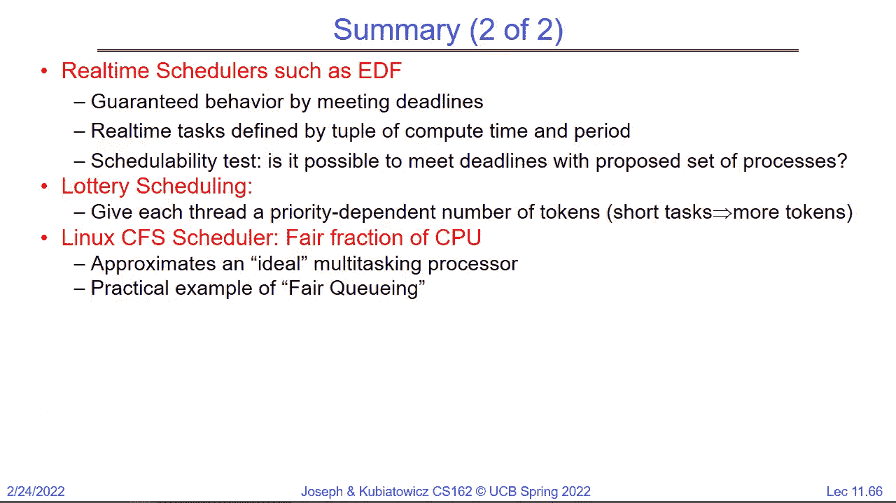

# 操作系统调度（二）：案例研究、实时与前进进度 🧠

在本节课中，我们将深入学习操作系统的调度策略。我们将从回顾基础调度目标开始，探讨几种经典的调度算法，并深入研究如何预测任务行为以优化调度。接着，我们将分析多级反馈队列和彩票调度等高级策略，并了解Linux O(1)调度器的设计。最后，我们将转向实时调度，讨论其独特的目标和挑战，并分析优先级反转等经典问题。


---

## 回顾：调度目标与基础策略

上一节我们介绍了调度的基本概念，本节中我们来看看几种核心的调度目标及其对应的简单策略。

调度程序的核心任务是从就绪队列中选择下一个要运行的任务。我们通常关注以下几个目标：

*   **最小化响应时间**：这是指从任务提交到开始执行所需的时间。对于交互式应用（如键盘输入）至关重要。
*   **最大化吞吐量**：指单位时间内完成的任务数量。这在批处理或云计算场景中非常重要。
*   **公平性**：确保所有任务都能获得一定的CPU时间，避免某些任务被“饿死”。

需要注意的是，这些目标有时是相互冲突的。例如，为了最小化响应时间而频繁进行任务切换（抢占），可能会破坏缓存局部性，从而降低吞吐量。

我们讨论过几种简单的调度策略：


*   **先来先服务（FIFO）**：按照任务到达的顺序执行。实现简单，但可能导致平均等待时间很长。
*   **轮转法（Round Robin）**：为每个任务分配一个固定的时间片（Quantum）。当一个任务的时间片用完后，它会被放回就绪队列的末尾，下一个任务开始执行。这种方法提高了响应性，但可能增加上下文切换的开销。
*   **最短作业优先（SJF）**：假设我们知道每个任务的运行时间（突发时间），则优先调度运行时间最短的任务。这可以最小化平均等待时间。
*   **最短剩余时间优先（SRTF）**：这是SJF的抢占式版本。当有新任务到达时，调度器会比较新任务和当前运行任务的剩余运行时间，优先调度剩余时间更短的那个。

**公式：平均等待时间**
`平均等待时间 = (所有进程等待时间之和) / 进程数量`

**公式：平均完成时间**
`平均完成时间 = (所有进程完成时间之和) / 进程数量`

---

## 预测未来：如何估计任务执行时间？

上一节我们假设知道任务的执行时间，本节中我们来看看在现实中如何预测它。

SRTF是最优的，但它需要一个“水晶球”来预知每个任务的执行时间，这在实际中是不可能的。因此，我们需要通过历史数据来预测未来。

一个常见的方法是使用**指数加权移动平均**来估算一个任务的下一次突发时间。

**公式：指数加权移动平均**
`τ_{n+1} = α * t_n + (1 - α) * τ_n`
其中：
*   `τ_{n+1}` 是预测的下一次突发时间。
*   `t_n` 是最近一次观察到的实际突发时间。
*   `τ_n` 是之前的预测值。
*   `α` 是一个介于0和1之间的参数，用于调节最近观测值的影响权重（α越大，最近的历史影响越大）。

通过这种自适应预测，调度器可以近似地实现SRTF的行为，优先调度那些预测为短时间的任务，从而改善系统的响应性。

---

## 高级调度策略

在掌握了基础策略和预测方法后，我们来看看两种更精巧的调度策略：彩票调度和多级反馈队列。

### 彩票调度 🎫

彩票调度的核心思想是将CPU时间作为资源，通过“彩票”进行分配。

**工作原理**：
1.  系统拥有一定数量的彩票（例如100张）。
2.  每个任务根据其重要性或期望获得的CPU份额被分配一定数量的彩票。
3.  调度时，随机抽取一张彩票，持有该彩票的任务获得下一个时间片的运行权。


**代码概念：彩票分配**
```python
# 假设有三个任务A、B、C，分别持有5、3、2张彩票
tickets = {'A': 5, 'B': 3, 'C': 2}
total_tickets = sum(tickets.values())
# 抽奖过程：生成一个1到total_tickets之间的随机数，根据彩票区间决定运行哪个任务
```

**优点**：
*   **比例分配**：一个持有20%彩票的任务，长期来看将获得约20%的CPU时间。
*   **避免饥饿**：通过给每个任务至少一张彩票，可以保证其最终能获得CPU时间。
*   **动态调整**：通过增减任务的彩票数，可以平滑地调整其CPU份额，而不会像严格优先级调度那样导致低优先级任务完全饿死。

我们可以通过给短任务分配更多彩票来模拟SRTF的行为，同时保证长任务也能获得进展。

### 多级反馈队列 🔄

多级反馈队列是一种结合了多种策略的启发式方法，旨在自动识别并优待交互式（短突发）任务。

以下是其工作原理的简化描述：

1.  系统维护多个优先级不同的队列（例如Q1， Q2， Q3...）。
2.  新任务首先进入最高优先级的队列（如Q1）。
3.  每个队列可以采用不同的调度算法（如Q1用RR，Q2用RR但时间片更长，Q3用FIFO）。
4.  任务在某个队列中如果用完了其时间片仍未完成，它会被**降级**到下一个更低优先级的队列中。
5.  任务如果在时间片用完前主动放弃CPU（例如进行I/O操作），它可能会**保持**或**升级**到更高优先级的队列。

**设计目标**：
*   交互式任务（短CPU突发+长I/O等待）通常会很快用完时间片并进入I/O等待，因此它们倾向于停留在高优先级队列，获得快速响应。
*   计算密集型任务（长CPU突发）会逐渐被降级到低优先级队列，从而为交互式任务让路。

这种方法不需要明确知道任务类型，而是通过观察其运行时行为（是否经常用完时间片）来动态调整其优先级，是对SRTF思想的一种有效近似。


---

## 案例研究：Linux O(1) 调度器

了解了多级反馈队列的思想后，我们来看一个真实的复杂实现：Linux 2.6 内核早期的 O(1) 调度器。

**核心结构**：
*   **140个优先级队列**：优先级0-99用于实时任务，100-139用于普通任务（由`nice`值映射）。
*   **两个队列数组**：`active` 和 `expired`。调度器从`active`数组中按优先级选择任务执行。当任务用完其时间片后，它被移到`expired`数组。当`active`数组为空时，交换两个数组。
*   **O(1)操作**：通过位图快速查找最高优先级的非空队列，使得选择下一个任务的时间是常数。

**启发式策略**：
O(1)调度器包含复杂的启发式规则来识别交互式任务。例如，它会跟踪任务的睡眠（I/O等待）时间与运行时间的比例。睡眠时间长的任务会被认为更具交互性，从而获得临时的优先级提升（“交互式积分”），以避免其响应性下降。

**问题**：
这些启发式规则虽然有效，但使得调度器代码变得非常复杂、难以理解和维护。不同的工作负载可能需要不同的启发式规则，导致规则集不断膨胀。这正是Linus Torvalds对其不满，并最终推动开发全新调度器（CFS）的原因之一。

---

## 实时调度 ⏱️

到目前为止，我们讨论的调度目标都是关于优化平均性能。但对于某些关键系统，**可预测性**比平均性能更重要。这就是实时调度的领域。

**实时任务的特点**：
*   有明确的**截止时间**。
*   有已知的（或可估算的）**最坏情况执行时间**。
*   通常是**周期性**到达的。

**分类**：
*   **硬实时**：必须在截止时间前完成，否则会导致严重后果（如飞机控制系统、心脏起搏器）。
*   **软实时**：希望能在截止时间前完成，但偶尔错过是可以接受的（如视频播放、音频流）。

### 最早截止时间优先（EDF）调度

EDF是一种动态优先级调度算法。

**规则**：在任何时刻，调度器总是选择**截止时间最早**的任务来执行。

**可调度性测试**：对于一组周期性任务，如果其总CPU利用率小于等于100%，则EDF可以调度它们。
**公式：EDF可调度条件**
`U = Σ (C_i / P_i) <= 1`
其中 `C_i` 是任务i的最坏情况执行时间，`P_i` 是它的周期。

**挑战**：EDF的有效性严重依赖于对任务最坏情况执行时间（WCET）的准确估计。这通常需要复杂的静态代码分析和考虑缓存、流水线等硬件行为，在实践中非常困难。

---

## 饥饿与优先级反转 ⚠️

在结束调度话题前，我们必须讨论两个重要问题：饥饿和优先级反转。

### 饥饿
饥饿是指一个任务无限期地无法获得CPU时间从而无法取得进展。它不同于死锁（下节课内容）。饥饿通常由调度策略引起，例如：
*   在严格优先级调度中，如果持续有高优先级任务到达，低优先级任务可能会永远得不到执行。
*   在类似“后进先出”的调度策略中，早到达的任务可能被埋没。

### 优先级反转
这是一个在优先级调度中可能发生的严重问题，它甚至会导致高优先级任务被饿死。

**场景**：
1.  低优先级任务L持有一个锁。
2.  高优先级任务H开始运行，并尝试获取同一个锁，因此被阻塞。
3.  此时，一个中优先级任务M开始运行（因为H被阻塞，L优先级低）。
4.  任务M会一直运行，阻止了L运行，从而L无法释放锁，导致H永远被阻塞。

**解决方案：优先级继承**
当高优先级任务H因等待低优先级任务L持有的锁而被阻塞时，L**临时继承**H的高优先级。这样，L就能尽快执行并释放锁，之后优先级恢复原状，H得以继续执行。这个机制防止了中优先级任务M的干扰。

**著名案例**：1997年的火星探路者号探测器就曾因优先级反转导致系统不断重启。地面工程师通过远程调试启用优先级继承功能后，问题得以解决。

---

## 总结

本节课中我们一起深入探讨了操作系统调度的多个方面：

1.  我们回顾了调度的核心目标：响应时间、吞吐量和公平性，并指出了它们之间的权衡。
2.  我们探讨了如何通过历史数据（如指数加权平均）预测任务行为，以近似实现最优的**最短剩余时间优先**调度。
3.  我们学习了**彩票调度**，它通过概率分配的方式实现比例共享和避免饥饿。
4.  我们分析了**多级反馈队列**，这是一种通过观察任务行为动态调整优先级以优待交互式任务的启发式方法。
5.  我们以**Linux O(1)调度器**为案例，看到了一个复杂、充满启发式规则的真实世界调度器及其面临的挑战。
6.  我们转向了**实时调度**，了解了其追求可预测性的独特目标，并介绍了**最早截止时间优先**算法及其可调度性分析。
7.  最后，我们讨论了**饥饿**现象和**优先级反转**这一经典问题及其解决方案——优先级继承。



调度是操作系统的核心且复杂的组成部分，需要在各种相互竞争的目标和约束之间做出精巧的折衷。理解这些基本策略和挑战，是构建和优化高效计算系统的基石。