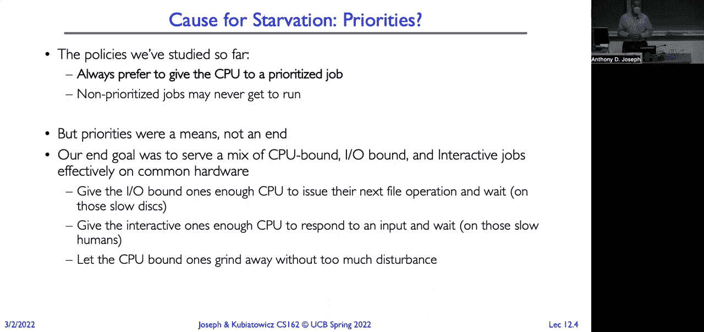
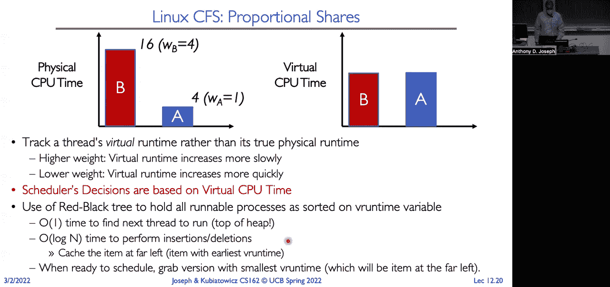
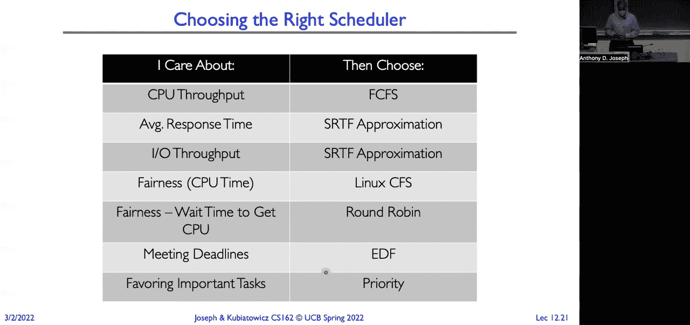
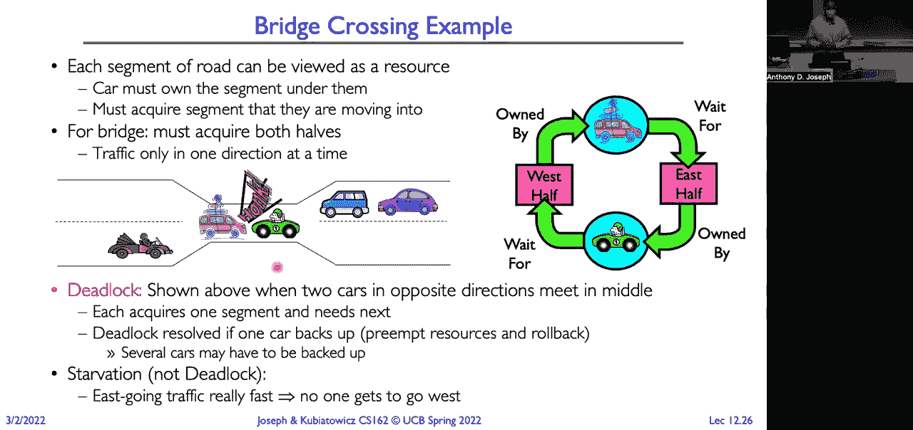
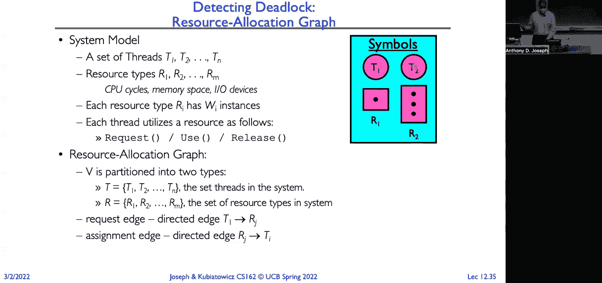
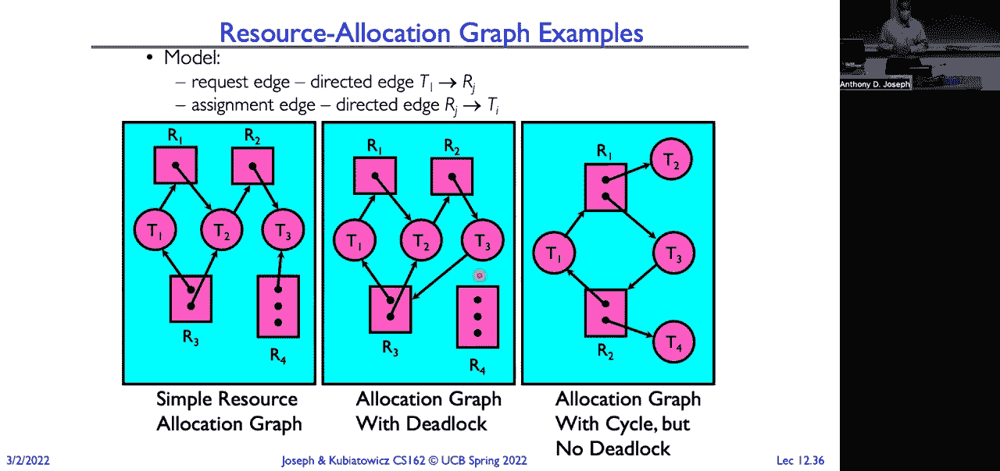
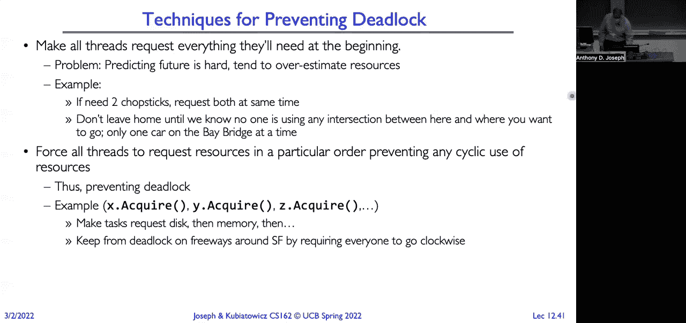

# P12：Lecture 12： Scheduling 3 Starvation (Finished), Deadlock - RubatoTheEmber - BV1L541117gr

 Okay， can everyone hear me？

 All right， let's get started。 So this is our third lecture on scheduling。 And we're going to talk about some more scheduling albums。 Then we're going to talk about starvation。 And then we're going to talk about deadlock。 how to detect it， and how to avoid it or prevent， it。 Okay。

 so remember from the previous lectures on real-time scheduling that the goal here。 is predictability of performance。 So we want to predict with high confidence what the worst case response time is going。 to be for a given system。 Now in a real-time system。 the performance guarantees are going to be either task or they， could also be class related。

 And we want to guarantee them in advance， a priori。 So we want to contrast that when we think about conventional systems where performance。 is going to be system-oriented or it might be throughput-oriented。 And we kind of look back to see。 you know， how did we do in terms of our throughput， our， performance in the last， you know。

 say minute or 10 minutes。 Now for real-time systems， it's all about enforcing predictability， right？

 And that's not necessarily going to be the same thing as fast computing。 So when we think about hard real-time systems， right， so this is like the anti-awk breaks。 in your car or something like that， right， they're time-critical safety systems many， times。 It could also be factory automation， you've got robots or something like that。

 We want to meet all of the deadlines if it's at all possible。 We want to design our system。 resource our system， to ensure that we can always meet， the deadline。 So the number of tasks we're going to put into the system versus the resources we have。 to service those tasks and determine that in advance。

 Lots of different scheduling algorithms that we looked at for being able to do that。 Now in contrast， there are soft real-time systems that we use for multimedia。 So for those of you who are at home， there's lots of systems between me and you。 All of them are using soft real-time to try and guarantee that my video， my audio gets。

 there uninterrupted。 But there's no guarantees which means occasionally you may see a frame skip or hear an audio。 skip。 Okay， now if we look at algorithms like shortest remaining time first or multi-level feedback。 cues， are they prone to starvation？ So if you think about it， right。 in something like shortest remaining time first， we might。

 starve those long running jobs in favor of the short running jobs， right， because it's。 shortest remaining time first。 We have that same fundamental problem with priority scheduling where we give all of the。 time to the high priority jobs and no time to those low priority jobs。 Now if we look at something like multi-level feedback cues， that's just an approximation。

 for us trying to implement SRTF。 We're looking back at the past to see what the performance was rather than knowing what。 the performance is going to be in the future in terms of like the CPU bursts for an application。 So it's going to have the same problem， right？ We're going to start with， right， jobs are going to。 long running jobs are going to start， up here in the high priority， the short quantum cues。

 and they're going to keep hitting the， end of the quantum and still want to run。 And so they're just going to get demoted all the way down to the lowest cue。 And if we look at how much CPU gets allocated， well if there are things in these higher priority。 cues， they're going to get run， which means those other jobs are just， the long running。

 jobs are going to get started。 Okay， now think about it， right？

 The policies that we've studied so far for scheduling are all around priorities。 We want to give the CPU to some job that has higher priority， which means that those jobs。 that have low priority or no priority， they might never get to run。 They get started。 But we didn't use priorities as， here's what we want the system to do。

 It was more to basically give classes of actions for the system。 We wanted to give intentions of the system to say， hey， this job is more important than， this job。 not to say only run this job and completely ignore that other job。 So instead。 if you think about it， our end goal here is we have systems with lots of different， jobs。

 some are CPU-bound， some are I/O-bound， some are interactive computations， some are， multimedia。 and we want the system to run all of the jobs， not just simply favor one class。 and only run one class over the others。 So we think about it， right？ Our I/O-bound jobs。 when they complete an I/O burst， they need just enough CPU so they。

 can schedule the I/O device to do the next I/O operation。 Similarly， if we have interactive jobs。 we want performance to be good。 When you type a keystroke。 we don't want it to take several seconds for that keystroke， to pop up。 And for our CPU-bound jobs。 we want to be efficient。 We want to run those through。

 grind them through the system as quickly as we can。 Things like context switching。 those are only going to make those CPU jobs run， bound jobs， run slower。 because you can be overhead of context switching。

 At the same time， think about the landscape we're operating it。 When we think back to the dawn of computing， back in the 50s and the 60s， it was all about。 the mainframe， right？ And you had a lot of people per computer。 There were only a few mainframes in the world at the very start， and they were serving millions。

 of users。 And so if you think about the cost of those mainframes。 it was anywhere from tens of millions， to hundreds of millions of dollars。 So very expensive cycles on those machines。 But now look where we're at， at the Internet of Things。 If you sit in a modern automobile， you're surrounded by dozens of computers。

 There could be potentially 40 different computers， microcontrollers， microprocessors around you。 Just look around this room。 There's computers and everything that you look at。 So the ratios have completely flipped。 Lots of computers per people。 Cycles are cheap now。 But when we first started thinking about scheduling， it was in this context where it's these ever。

 so precious cycles that we need to share between thousands of users using our mainframe。 And so schedulers really were designed around priorities for doing that， for allocating for。 the CPU intensive， the I/O intensive， and so on。 In the 80s， we saw the rise of personal computing。 So now that ratio flipped from being thousands to being one person per computer。

 Cycles are a lot less valuable at that point。 Even when we look at workstations or server on the network。 a departmental file server， serves 100 people， maybe。 So different machines now we also start to think about having different purposes。 I have a network file server。 It's a computer dedicated just to serving files。

 Not doing any compute。 Nothing interactive， just serving up content。 The shift now is sort of the fairness and avoiding the extremes。 We don't want to have starvation in these environments。 Now we think about in the 90s。 we had the emergence of cloud computing data centers。 So 50，000 machines in a warehouse。

 Now I think about running Google's Docker， Google slides to make my slides for the class。 Not running it on my laptop。 It's running in a data center that I'm sharing with millions of other users in the area。 It almost got back to the mainframe error， except instead of a single computer， it's。 tens of thousands of computers that are working together as efficiently as possible。

 to give me an interactive experience that's identical to if I was running PowerPoint locally。 on my machine。 And so now when you start to think about it。 it's now instead about predictability in terms， of things like the 95th percentile performance guarantees。 And it's pretty amazing the amount of engineering that systems engineering that you have to do。

 to make that 50，000 computer perform the same as my local application running locally。 But I get advantages around server consolidation。 Far more efficient to manage a data center filled with 50。000 computers than it is to， manage a bunch of desktop PCs。 At the same time。 you also have to deal with things like flash crowds。 Think about if you're， I don't know， CNN。

com or you're the New York Times。 Last week， you watched your network and system traffic go from whatever your baseline is。 up by a hundredfold in the matter of a few minutes to hours。 And yet for the end users。 they saw that same 95th percentile performance because of the。 tremendous amount of scaling that you can do in these data centers。

 Much harder if it's just a single machine and I've suddenly got to deal with 100x the， traffic。 Okay。 So we can ask really the question here is if we're going to prioritize some jobs， does。 that necessarily mean that we're going to starve those jobs that aren't prioritized？ Well。 with the approaches we've looked at， that's exactly what's going to happen。 Right？

 Those jobs that have lower priority， if there are enough high priority jobs， those lower。 priority jobs will never get to run。 All of our CPU will get allocated to those higher priority jobs。 So we can look at some approaches that can work to guarantee that you always get some。 share of the CPU given to those lower priority jobs。 Right？ So with priority based scheduling。

 we're always going to prefer to give the CPU to a job that， has higher priority。 If there is a job on the ready queue with higher priority， it gets to run。 Which means lower priority jobs could get starved。 So in contrast。 what we could do is think about allocating the CPU proportionally。

 Because ultimately that's what we want。 Right？ You know。 we have this mix of diverse applications that are running and we want each of those。 applications to get some fraction of the CPU。 The higher priority ones。 we want to get more of a fraction of the CPU。 The lower priority ones。

 we want to get less but some CPU。 If we didn't want them to get any CPU。 we would just simply not admit them to the system。 Right？ Okay。 So the goal is if each job is share of the CPU according to its priority， low priority。 jobs will run less often but they will run， there will be no starvation until they'll be。

 able to make progress。 Right。 So remember lottery schedule。 The basic idea here is you give。 given a set of jobs， our mix of jobs， we're going to allocate， each with a share of tickets。 Right？

 So in this case， we're going to give 50% of the CPU to job A， we're going to give 30%。 to job B and we're going to 20% the last 20% to job C。 And so we're going to give out。 tickets according to a jobs priority。 So we can see here that for example。 job A in red gets lots of tickets。 It gets 50% of the tickets。

 And job C gets 20% of the tickets and job B in blue gets 30% of the tickets。 Now in every quantum。 every tick， we have to make a scheduling decision。 We're going to draw one of those tickets at random and schedule that job or thread to， run。 So simple mechanism that we can use is to just take the sum of all of our tickets that are。

 outstanding， pick a dart， throw that dart and jobs record the allocated number of tickets。 they have， order them by their tickets and then we just select the first J tickets such。 that the sum of that is greater than where our dart landed。 All right。 The problem with this approach is it works well when we look at the long term but in the。

 short term we can have tremendous amount of unfairness。 So we have two jobs。 job A and job B that have the same priority and the same runtime。 So we give them each 50% of the tickets you would expect that the runtime of A relative。 to the runtime of B would be the same。 That ratio would be， if we took a ratio it would be 1。

 What you find is for shorter running job lengths it can be very unfair。 Now why？

 Why wouldn't it just be 50%？ It has half the tickets。 Any ideas？

 How am I picking which one gets to run？ I use a pseudo， oh， how do I pick？

 I use a pseudo random number generator which has that keyword pseudo。 It's not a truly random generator。 It's going to have some biases in the values it produces。 And as an aside， the author of a lot of rescheduling spent months trying to design a random， pseudo。 random number generator that was both fast and efficient but also was very uniform in。

 the distribution of values that it generated。 Turns out in practice even if you try to do that if you look at smaller draw sets from。 drawing only a few because my scheduling， the amount of time I'm going to make scheduling。 number of times I'm going to make scheduling decisions is small， I'm going to see those， biases。 If I generate millions of pseudo random number from my pseudo random number generator it'll。

 look very uniform。 But in a small subset it could look very， very biased。 And that's a problem when you're trying to generate random numbers。 Just same problem shows up all over the place it shows up in security contexts where I'm。 trying to generate random bits for a key。 And if I know what pseudo random number generator using and I know the biases and I know the。

 starting conditions and seeds， I can oftentimes with high probability predict what your secret。 key is going to be。 There's a lot of work that goes into designing the random number generators for cryptographic。 applications where we don't want people to be able to guess the keys simply by guessing。 what random numbers get picked。 Okay， so that's the problem here is a randomness is not truly random and that throws off the。

 scheduling decisions。 So as an alternate approach people proposed stride schedule。 So here the ideas we want to achieve this proportional share of schedule given to CPU。 given each one of our jobs but we're going to do it without having to use randomness。 So we'll avoid that sort of inverse of the law of large numbers， the law of small numbers。

 biases problem that we saw。 So the stride of a job is going to take some big number divided by the number of basically。 your share。 And so if you think about it the larger the share of tickets that you have the smaller。 the stride that you're going to end up。 So here in this example if we set w to be 10。000 and we give a hundred tickets then we're going。

 to give b 50 tickets and see 250 tickets then a ends up with a stride of 100 b ends up with。 a stride of 200 and c ends up with a stride of 40。 Now each job is going to have a pass counter and what we're going to do is a scheduler is。 going to pick the job to run that has the lowest pass。

 After that job runs we take the stride and add it to the pass counter。 After it runs for the quanta add the pass counter。 So if you think about this what this is going to mean is jobs that have lots of tickets。 have low stride are going to be moving that pass counter up more slowly than jobs that。

 have fewer tickets larger strides and so their pass counter is going to go up much faster。 And since we're picking the one that has the lowest pass counter we're going to run those。 jobs that have more tickets more often。 But eventually their pass counter is going to exceed that of the jobs that have fewer。 tickets their pass counter and so then that job that has fewer tickets will get to run。

 You can see here we're pre computing what we want that fraction to be effectively and。 we've removed randomness from the equation。 Yeah so the question is what if we have a really long running job that has like really。 small number of tickets do we have to deal with things like the counter overflowing。 And yeah so there are lots of messy issues we have to worry about because we want to。

 be able to deal with the fact that over time even if we have lots of short running jobs。 eventually our pass counter is going to roll over also you have new jobs coming into the。 system what do you set their default pass counter to be so that they don't always just。 get to run till they catch up with the rest of the system。

 So there's always like you know details like that that we have to worry about。 But the key thing is that even for that really long running job that only has a few tickets。 it still gets to run and so that solves a problem that we have with priority based systems。 Any other questions or comments？ Okay all right so let's look at another schedule the Linux completely fair scheduler。

 So the goal of this scheduler is we want to give each process an equal share of the CPU。 Oh the question is is W just an arbitrarily chosen large number。 Yeah we want to pick a W that is really large so that we have a good range for our basically。 for our strides。 Okay so the goal here is each process gets an equal share of the CPU we have n threads。

 that are simultaneously executing on so the way to think about it is you've got n threads。 simultaneously executing on one end of the CPU。 So it's sort of like that concept we looked at earlier with simultaneous multi threading。 where we could take and run multiple threads simultaneously by using the fact that we have。 extra functional units。 So giving each thread one one end of the CPU cycles。

 So if it was a perfect environment perfect world you know if we looked at it at any given。 time what we would see is an equal allocation of the CPU time that's been used right so T1。 would have 1n， T2 would have 1n and thread 3 would have 1n。 And on general we can't do that right because real hardware doesn't work that way we have。

 to give the entire CPU or you know with SMT we could potentially schedule a small number。 like 2 simultaneous threads。 So for a given quanta for now we're just going to assume one thread gets the CPU one for some。 cycles。 So we're going to need something that's going to keep us in sync so that we ultimately have。 this situation where you know when we look at it we're a little bit of time we basically。

 see that they're all getting the equal amount of CPU time。 Alright so here's the kind of basic framework for what we're going to do。 We're going to track how much CPU time has been used for thread and then schedule the。 threads to make sure that we get to that one end point right so everybody's at the one。

 end equivalent。 So same average rate of execution basically。 So how do we do this？

 Well it's all about the scheduling decisions。 Which thread do we pick to run？

 Well when we have to make that decision we look at all the threads and we try to repair。 the thread that's farthest behind on its average rate of execution。 So that's going to repair this illusion of complete fairness。 So here's an example where thread one it's ahead it's run for more than one end。

 Thread two has run for less than one end and thread three hey we actually hit one over。 end for thread three。 So which one are we going to pick if we're trying to repair the illusion？

 Yeah we'll pick the blue one thread two。 Because thread two is behind。 So it doesn't have that illusion of having gotten its fair share because its fair share。 would be one over end。 And it's very similar to a concept called fair queuing that we'll talk about later in。 the semester when we talk about networking。 Alright so we're going to do this using a heap like scheduling queue that gives us nice。

 behavior in terms of it'll be order log n where ends are number of threads to add or remove。 threads and so we get nice efficiency for making our scheduling decisions。 Okay now if you think about it thread that's asleep it's CPU time's not going to advance。 So what's going to happen when you type a keystroke and the thread that was waiting on。

 that IO event gets woken up。 Well it's going to be behind so it's going to run right away。 That's going to be really good for interactive performance and responsible。 Okay so in addition to having fairness we want to have a system that has a low response。 time that makes it good for interactive computing and we want to make sure it's free from any。

 kind of starvation。 But everyone should get to run at least a little bit。 So we have a couple constraints we have to deal with here。 One is that we want to have a target latency so we want to have a bound on how long it takes。 before a thread gets responded to the response time。

 So this will be our quanta so then we have to set our scheduling quanta and our scheduling。 quanta is going to be a function of our target latency over the number of threads that we。 have in the system。 So if our target latency is 20 milliseconds and we have four processes then our quanta。 is just simply going to be a 5 millisecond time slice。

 Okay that makes a lot of sense but what if we have a lot of threads， a lot of processes， 200？

 Well that would argue that we should have a 0。1 millisecond quanta。 That's a problem。 Remember back to round robin what was one of the big issues with round robin was picking。 the right size quantum so we didn't end up just spending all of our time saving and。 loading registers。 So that's why we're going to want to have a minimum bound on our quantum。

 Even if it means we can't hit that target latency the tradeoff is yeah we could try。 to run with a 0。1 millisecond quanta and we just spend all our time context switching。 So we wouldn't hit it anyway。 Okay another goal that we have with the Linux CFS is throughput and so that means we have。 to avoid excessive overhead which means we can't have too many context switches。

 So that's really going to set us give us a minimum granularity that we're going to want。 to have on our quantum。 So that we're not spending all of our time context switching。 So we're going to pick for given architecture what should be a reasonable lower bound on。 quanta and thus a reasonable upper bound on the overhead that we're going to have from。

 context switching。 Alright so now our target latency might be 20 millisecond with a minimum granularity of。 1 millisecond and say 200 processes so we'll give each process a 1 millisecond time slice。 Alright a little bit of an aside because we need to talk about how priorities get how。 users interact with priorities and practice and Unix systems。

 So when we look at the industrial operating systems that people use back in the 60s and。 70s priority was just like an integer you'd specify and that enforced whatever your target。 scheduling policies were。 When they were developing Unix here at Berkeley they were thinking well you know rather than。 thinking about it as just like priorities we want users to be nice to each other。

 And so in Unix there's actually a system call a nice system call that you use to set the。 priority of a process。 And priority ranges from negative 20 to positive 19。 Negative values as sort of the connotation would imply they're not nice。 Positive values are nice。 So if you want to be nice to your friends who you're sharing a system with you nice your。

 processes to higher values。 That will cause the system to give less time to you your process will spend more time on。 the ready queue。 Their processes will get more of the CPU。 That's where the opposite side is if you don't want to be nice to your friends then you just。 nice all your processes to minus 20 and they run and you know that's not a good way to。

 keep friends out。 Okay so the scheduler is going to take those higher nice processes and keep them on the。 ready queue。 They're not going to get to run as often whereas the lower nice processes they get to run more。 often。 Now with an order one scheduler this is just going to translate directly into priorities。 But we're going to look at it differently with Linux CFS。

 Okay so with Linux CFS we're going to change instead the rate of the CPU cycles that we。 give to processes as a function of their nicest or prior。 So how are we going to do that？

 Well think about it right if we want to give more CPU to some and less CPU to others so。 we want different proportional shares but guarantee everybody gets some you know our。 model is we want to effectively want different threads to get different numbers of cycles。 over a period of time。 So those that we want to give higher priority to will get more cycles over some period of。

 time。 Those we want to give less priority to go get less cycles over that period of time。 So the easiest way for us to do this is just with weight。 So we're going to assign a weight to each process W sub i and that will compute what。 our switching quanta is going to be how long we let it run for。

 So if everyone were to get an equal share we just simply set everyone's weight to one。 And then what we're going to do is apply basically so that would be one over so it would be one。 over。 With a weighted share if we set everybody to one what's it going to be it will be one。 over the sum of all of our weights times the target latency。 Well that's just n。

 It's just going to be one over n times our target latency so that's our basic equal share。 And now we have the flexibility if we want to increase or decrease somebody's priority。 we just change their weight and that's going to give them a different share。 Let's look at this in practice。 So we're going to reuse nice as our stand in for priority because that's how users and。

 Unix tell the system this is higher priority or lower priority so lower value negative not。 nice higher priority higher values are nicer than lower priority so it's a little little。 inverse if you want to think about it that way。 And so we're going to use the nice value to scale our weights we're going to do it with。 an exponential function。 So it's going to be 1024 divided by 1。

25 raised to the power of the nice value。 So if we have two CPU tasks that are separated by a nice value of five。 And that means the lower priority or lower nice value is going to end up with three times。 the weight of that higher priority。 So it's 1。25 to the fifth is roughly three。 Yes。 So the question is if it is three times the rate does it run three times as much。

 Yeah it's going to run three times longer。 It's going to get longer quanta that it gets scheduled for。 And then we also you'll see in a moment we also have to deal with like how do we deal with。 CPU time and accounting for who we select to run next。 Okay and that gets us right at our next point which is instead of using actual CPU time。

 so sort of wall clock time we're going to use this notion of virtual runtime。 I'll explain what that is in just a moment。 Alright so here's an example our target latency is 20 milliseconds and our minimum granularity。 is one millisecond we have two CPU bound threads so they could just run continuously if we。 let them。 We'll say thread A has weight one and thread B has weight four。

 What's going to be our time slice for thread A but what's our total weight five。 Alright so A has a weight of one so again if we go back to here it's going to be one over。 the sum five times our target latency so one fifth of twenty which is going to be four。 milliseconds。 That's how long A will run when it's scheduled。

 For B its time slice will be four that's its weight over the sum five times the target。 latency twenty or fifths times twenty is sixty so it'll run for sixteen milliseconds。 So we'll hit our target latencies or we're going to allocate it with one fifth twenty。 percent going to A and eighty percent going to B。 So if we were to look at what our physical CPU time or wall clock time might look like。

 we would see this kind of asymmetry right B is running in these sixteen millisecond chunks。 and A is running in these smaller four millisecond chunks but instead we're going to track a。 thread virtual time and basic way to think about it it's actually really complicated but。 the simplistic way of thinking about it is that if you have a higher weight your virtual。

 runtime is going to grow slower and if you have a lower weight your virtual runtime is。 going to grow more quickly。 And so in this sort of virtual world we can keep A and B getting equal shares but when。 they actually run B is going to run a lot longer and get scheduled more often。 Okay so all of our scheduler decisions are based on virtual time so we just keep our。

 red black tree that holds all the runnable processes and we look for the left most element。 the smallest element the smallest virtual time because again we're trying to repair that。 illusion of everyone getting one end but it's one end in virtual time not one end in CPU。 time we get order one to decide which to run and we can even cache that so it's always。

 in memory and then it's going to be order log in when we need to add or remove a thread。 from the red black tree。 So when we're ready to schedule we just grab that left most node and that's what we schedule。

 Okay so we've shown you lots of different scheduling algorithms and at the end of the。 day when you're designing a system you look at the application and then you pick one of。 these scheduling algorithms to run and it's going to depend on what is the application， use case。 Now in some cases you'll need something that works for general purpose computing in other。

 cases you might need something that like a robot operating system or something like a。 network file storage operating system and so you'll pick a scheduler that meets those。 requirements so if you care about CPU throughput then you use first come first serve。 If you care about which is like what you might use in a high performance computing environment。

 if you care about average response time then maybe you use something that's an approximation。 of shortest remaining time first。 You care about IO throughput similar SRTF works well for that。 If you care about fairness in terms of CPU time you could use something like the Linux， CFS。 If you care about fairness in terms of say the wait time to get the CPU then maybe use。

 something like round robin if you care about meeting deadlines it's a real time system。 and you use EDF or another real time scheduling algorithm or the earliest deadline first。 If you care about favoring the most important tasks maybe you just use a strict priority。 schedule but you have to be aware that there might be starvation that occurs。

 The bottom line is in many cases we're dealing with systems that are multipurpose with a。 diverse workload and so you kind of pick one of these that meets most of the workloads。 requirements but that means it's not going to meet all of the workloads requirements。

 Final word on scheduling。 When do the details of which scheduling policy and fairness and all of that really matter？

 The answer is we don't have enough resources to go around。 We don't have enough resources。 The other way to think about this is like I've got a bunch of engineers when do I buy an。 engineer a faster computer or if I'm an urban planner when do I need to add another lane。 to a highway or bridge or get a faster network link for my company。

 So one approach is buy it when it's going to pay for itself and improve response time。 If you think about it like that engineer that developer you're paying them a couple hundred。 thousand dollars a year。 If they're sitting there at their computer waiting for the computer to do something that's。 lost productivity you're paying for them to just sit there and stare at the screen or。

 maybe play wordle in a window or something。 And so buying them a faster computer will pay for itself very quickly in terms of improved。 productivity。 If you're serving a web population putting in a faster computer means they can check。 out their orders faster。 Because they're less likely to go to some competitor which has a faster check out process or more。 convenience。 And so there's lots of reasons why you want to make sure you've right sized your resources。

 Now you might think okay as I hit that you know hundred percent utilization point that's。 when I just go out and I buy the next computer。 But here's a graph of response time versus utilization。 What you can see is as utilization approaches a hundred percent response time goes to infinity。 You end up spending all your time context switching or entering and leaving queues and。

 dealing with all the overhead。 The overhead starts to dominate。 And so really the time to buy where all the scheduling algorithms matter and where they。 work is in this linear portion of the curve。 And it's right before you get to this knee that's when you buy the new computer the faster。 link that's where you make that decision to increase resources。

 Before that it doesn't you know you can pick the algorithm the algorithm will help you manage。 the available resources because you're not overloading those resources。 It's when you start to get closer to overloading them that it just doesn't matter。 Okay any questions about schedule？ Yes。 Between which two ones？ LLC。

 Yeah so the question is what is the difference between the Linux completely fair scheduler and。 say round robbing。 The round robbing is just simply giving everybody an equal shot at the CPU giving them equal。 size quanta。 With the CFS we adjust the size of that quanta dynamically as a function of priority。 Yeah so the question is if we had equal， so like for example if it equal priorities。

 between all of the threads would it then be pretty much the same between the Linux completely。 fair scheduler and round robbing。 Yeah they both basically be going through round robbing through right because you're always。 going to be picking with the CFS the thread that's furthest you know sort of behind in。 virtual time they're all going to be advancing virtual time the same rate since they all have。

 the same fairness and so you're just going to simply cycle through。 Quances are all going to be the same since they have the same priority。 Yeah so they'd be very similar。 Yeah so the question is if a thread goes to sleep and then you wake up do you compensate。 for the fact that it's like kind of behind in its content。 Yeah exactly。

 So that's the benefit is like if you're always looking at like who's furthest behind and those。 threads are going to be further behind and you're going to like sort of catch them up。 The devil's in the details of how you catch them up like and not just give them all of。 the CPU so you still are running the other jobs also。

 And also again you have new jobs that come into the system and you know you have to figure。 out where they fall in terms of their virtual time。 It's not easier thinking about these in steady state but in implementation you have to worry。 about all the edge cases。 Okay so we have some administrative stuff。

 I have office hours that will start next week， Tuesdays from one to two and Thursdays from。 twelve to one。 I'm still trying to find a room but it'll be somewhere on the fourth floor of soda。 Today you have a deadline， project one， code， report， final report and your group evaluations。 is due。 homework two is due on Thursday and we have midterm two， seems like we just had the midterm。

 but midterm two conflict requests are due Friday。 The term is moving very quickly。 Okay so with that we'll take a four minute break。 Okay so now let's switch gears and talk about sort of the deadly version of starvation。 So people get very confused when we talk about deadlock and we talk about starvation。 I'm going to try and go through it and explain it if you have any questions you know raise。

 your hand and we'll go over it again。 So with starvation。 starvation means that the thread waits indefinitely。 So a low priority thread like we talked about could end up starve because there is a continuous。 stream of high priority threads coming through the system。 Deadlock is different。

 Deadlock means that we have some circular waiting for resources。 So here we have thread A that owns resource one。 So it's using resource one while it's waiting for resource two。 resource two is being is owned being held being used by thread B。 Thread B is waiting for resource one which we just heard was being held and owned by， thread A。

 So there's this circular waiting for resources。 Now the key distinction here is thread A is waiting indefinitely。 Thread B is waiting indefinitely。 So there is starvation。 So deadlock implies that you have starvation。 There are threads that cannot make progress。 The difference between deadlock and starvation is starvation can end。

 If we stop getting high priority threads into the system， those low priority threads will。 start to run。 With deadlock it will not end unless we have some external intervention。 There's no way that we can change this situation here such that thread A is going to run or。 thread B is going to run。 There's nothing that those threads can do that will change that situation。

 Those are both stuck in on wait piece。 Let's look at an example。 Let's start with a real world example。 This is a bridge across a canyon。 It's on California Route 140 on your way to Yosemite National Park or if you're coming。 back from Yosemite National Park。 For this example we're going to assume that cars have to own segments of roads。

 We'll think of our resource here as being segments of the highway。 Car has to own the segment under them and if it wants to move forward it has to acquire。 the segment in front of it that it's going to move into。 It's holding the segment under it and trying to acquire the segment in front。

 For the bridge we're going to divide the bridge into two halves。 Why two halves？

 Because that makes it easier to think about。 Across the bridge you're going to have to acquire a segment to go onto the bridge。 You're going to have to acquire the segment for the other half of the bridge and enter。 that and then you're going to have to exit the bridge。 We can only have traffic in one direction at a time if you think about it。

 We've got these two segments and we've got the orange and red car that's owning its。 half of the bridge。 We're trying to acquire the segment held by the green car which is holding that segment。 and trying to go in the other direction。 Here we have dead land。 Orange and red is waiting for the east half and owning the west half and green is owning。

 the east half and waiting for the west half。 We have dead land。 How can we resolve this situation？

 Well， the green car could back up releasing that segment allowing the orange and red。 car to acquire it。 But it's not that simple because there's the blue car right behind the green car。 The blue car would have to back up but it can't back up because there's the purple car behind， it。 The purple car would have to back up and the blue car backs up and the green car backs。

 up and now the orange and red car can go through。 So starvation but not deadlock would be the situation where we have a convoy of cars going。 from west to east。 In that situation every car is acquiring the segment in front of it as it's being released。

 by the car going in the same direction。 And those are starving the traffic that wants to go west instead。 That's a situation that will resolve。 Once the east going cars stop then the west going cars can go。 That's different from this situation that we have right here where there's no resolution， here。 There's no way for either of those cars to make forward progress。

 They're both stuck waiting on something held by someone else。

 Okay。 So now let's look at locks。 Here's an example using two threads thread A and thread B where thread A is going to。 try and acquire the X lock and the Y lock do some work and release Y release X。 Thread B is going to acquire the Y lock then acquire the X lock do some work then release。 X then release Y。 This is the worst kind of deadlock because it's non-deterministic。

 Sometimes it doesn't happen。 Other times like two o'clock in the morning before the project is due it keeps happening。 As soon as you look at it it stops happening。 As soon as you submit it to the autograder it happens。 Non-deterministic is a really bad thing because it makes it really hard to debug。 The app debugging changes the timing and makes the bug go away。 But it also is bad for deployment。

 If you're deploying this for your company and just randomly it deadlocks that's a problem。 Okay。 So let's look at the unlucky case。 So in the unlucky case thread A acquires lock X。 Then for whatever reason a context which occurs thread B gets scheduled。 It acquires lock Y。 Now we context switch back to A and it tries to acquire Y and it gets put on the way queue。

 So Y is being held by B。 So now we pick another thread to run eventually B gets to run and it goes to acquire X and。 X is being held by thread A。 So it gets put on the way queue。 And it's also stalled。 And the rest of the code is unreachable。 And there's no way this situation is going to resolve itself because A cannot make progress。 and B can't make progress。 So we have no alternative here。

 So we have the situation where thread A is holding lock X while waiting for lock Y which。 is being held by thread B which is waiting for lock X。 So you can see again we have this circular dependency graph。 All right。 So neither thread gets to run。 It's deadlock。 Now in the lucky case and there are many examples of lucky cases but one lucky case is that。

 A runs acquires X acquires Y starts doing something。 We context switch。 B goes to acquire Y。 It stalls。 We context switch back and finish whatever we're doing in A。 Release X or release Y rather， release X and then eventually we context switch back to B。 It acquires X。 That's what it wanted to do。 Then releases X releases Y。

 And there are many other similar lucky interleaving that we can have。 There's only a couple of unlucky interleaving but there are lots of lucky interleaving。 So most of the time this will work。 And then occasionally the rocket blows up。 Okay。 Here's another example from networking。 So here we have a set of trains and all of the trains these are we have these crossings。

 here。 Trains can go east west。 They can go north south or in this case south north。 And then they're trying to turn。 So this every train is trying to turn right。 Right。 So we end up with a circular dependency where it wants to turn right but that track is。 occupied by another train and that train is trying to turn right on to track occupied。

 by another train and so on for our complete circle between the four trains。 Very similar problem that we have in multi-processor networks where we're trying to route a train。 of messages packets between one microprocessor and another microprocessor and our multi-processor。 And the messages are like a little worm。 That's why it's called wormhole routing。 The fix。

 Even that our grid extends in all four directions and we impose rules。 We say there's an ordering of channels。 The way you route something a train a message or whatever is you always go in the east west。 direction first and then you go in the north south direction。 So that forces us to disallow this north south train trying to turn right or this south。

 or north south train here also trying to turn right。 Because they have to do that east west first not second。 This is called dimension ordering where we do x dimension first and y dimension and z， and so on。 We're going to see in a little bit why ordering is also the way we could solve that problem。

 that we just saw with thread A and thread B。 Okay lots of other types of deadlock that we can have。 Pick a resource if threads have to wait on that resource we can have deadlock so that。 could be locks it could be terminals it could be printers it could be CD drives DVD drives。 memory it could be other threats threads will block waiting on pipes waiting on sockets。

 from other threads。 Any of those anything that's a resource that meets certain criteria that we block on we。 can have deadlock on。 Okay we could for example deadlock on space。 So here's a program thread A is going to allocate or wait for megabyte of memory and。 it's going to allocate or wait for another megabyte of memory do some stuff then free。

 that megabyte and then free the other megabyte。 And thread B is going to try and do the same thing。 Well we have a machine that only has two megabytes of memory we can have the same deadlock。 situation。 If we first run thread A and it grabs a megabyte and then we run thread B and it grabs a megabyte。 then now neither thread can grab another megabyte of memory and they're both just going to sit。

 there waiting。 Okay so there's a famous problem in computer science called the dining philosophers problem。 We like to call it instead the dining lawyers problem。 Here's the basic parameters of the problem。 These lawyers they go to a restaurant it's an inexpensive restaurant they're seated at。 a circular table all five of the lawyers here but the restaurants really cheap and so they。

 only give them each they only put five chopsticks around on the table。 This is a nice big bowl of rice in the middle。 Now we all know if we want to eat some rice we're going to need not one but two chopsticks。 And so we say okay dinner time time to eat what are the lawyers going to do well every。 lawyer is going to go and grab a chopstick。 What happens if every lawyer grabs a chopstick at the same time？

 Deadlock。 Right？ Everyone's going to have one chopstick and they're all going to stare at each other with this。 nice bowl of rice in the middle and they're going to starve。 Really starve。 Okay well how could we fix this deadlock？ Well we could turn to one of the lawyers and say be nice give up your chopstick to someone。 else。 Good luck with that。 I don't think that's going to happen。 Right？

 But if they did if there was an altruistic lawyer if we found a unicorn they would give。 up the chopstick and then another lawyer would have two chopsticks。 And they could eat then return the chopsticks to the pool to more lawyers could eat and。 so on and so on until all the lawyers had to eat。 Right？

 And so that might give us a flavor for how we could resolve these kinds of deadlock situations。 But the caveat here is it would require convincing one of them to give up a resource that they。 hold。 All right how could we prevent deadlock？ Well we could set table rules and say you can't take the last chopstick if it means that。 somebody at the table would not have two chopsticks。 Right？

 Because as long as there's one chopstick left and there's one lawyer at least with one chopstick。 they could take that chopstick and have two chopsticks they could eat and then return those。 chopsticks to the pool and the other lawyers could eat。 All right？

 So that's a way we could avoid a deadlock situation with a rule like that。 So you could think about like trying to formalize that right？ How would we formalize this？

 What happens if you know we had a bunch of octopuses sitting at the table right？

 How would we turn that kind of thing into a rule which would guarantee that all of the。 octopuses as they're super smart would be able to eat with you know a chopsticks and all。 that kind of stuff。 All right。 Let's first start by formalizing what we mean by deadlock。 So there are four requirements for deadlock to occur。 The first is we have to have mutual exclusion。

 So only one thread at a time gets to use a particular resource or an instance of that， resource。 Second is we have to have hold and wait。 So a thread holding at least one resource is waiting to acquire some additional resources。 that are being held by other threads。 Next no preemption。 So if a thread is holding a resource we cannot take that resource away from the thread until。

 it's done using that resource。 So in the case of the dining lawyers it means if a lawyer is holding a chopstick we can't。 go over grab the chopstick out of their hand before they finish eating。 We can't preamble。 And then finally we have to have circular waiting。 That is that there's a set of threads and threads where T1 is waiting for some resources。

 held by T2。 T2 is waiting for resources held by T3。 T3 is waiting for resources held by T4 and so on and so on all the way up to Tn is waiting。 for resources held by bread one。 Now here's the thing about deadlock。 These are the four requirements for a system to be in deadlock。

 Remove any one of those requirements。 We don't have deadlock。 We might have starvation but we do not have deadlock。 If a system is in deadlock and we can remove any one of these we can take it out of deadlock。 Alright， any questions？ Okay。 Alright， so first thing we need to do is figure out how can we tell that our system is in。

 deadlock。 So we're going to use what we call a resource allocation graph。 So here's the model。 We have threads。 So here we have threads T1 and T2。 We have a little box here and we have end of those threads and then we have resources。 There are different resource types。 So there could be CPU， it could be memory。

 CPU is not actually a really good example because we can preempt the CPU。 So we can take the CPU away from someone and give it to someone else but it's a resource。 We can have disk drives， printers， locks， anything can be a resource and then we have。 some resources that have multiple instances and we'll denote having multiple instances。

 by these extra dots。 The extra dots mean there's like in this case resource two has three instances。 That means three threads that hold an instance of resource two or one thread can hold all。 three or whatever some combination。 Okay。 Now， threads utilize a resource by requesting that resource。 Like acquire using that resource and then releasing that resource back into the pool。

 We generate a resource allocation graph as follows。 Our graph V is partitioned into two types。 We have one set of， we have threads and we have resources and then we have directed edges。 between those sets of resources， those two sets， our threads and our resources。 Now a request edge is an edge directed from a thread to a resource like so from T1 to R1。

 this instance of R1。 Assignment， so something holding a resource is a directed edge in the opposite direction。 So from the resource instance to the particular thread。 So say from this first dot here to thread two， that would mean that an instance of that resource。 is owned by or held by thread two。

 Okay。 So here's an example of a resource allocation graph。 So here resource one。 an instance of it is held by thread two。 Resource two， an instance is held by thread three。 resource four， an instance is held by， thread three and then resource three here has two instances。 One is held by thread one and one is held by thread two。 So first question。

 is this system in deadlock？ No。 It's not in deadlock。 Because for example。 thread two here is waiting for resource two， which is held by thread three。 And thread three is not waiting for anything。 It holds an instance of resource two。 it holds an instance of resource four。 So it can run the completion and exit the system。

 And that would free up this resource two。 Then thread one， two rather could run， right？

 Because it would have an instance of resource one， instance of resource two and instance of。 resource three。 It would then release resource one and then thread one could get an instance of that and。 run to completion。 So this is not a system that's in deadlock。 Here is an example of deadlock。 We have a circular graph here， right？ Thread one holds an instance of resource three is waiting for an instance of resource。

 one， which is being held by thread two， which is waiting for an instance of resource two。 which is held by thread three， which is waiting for an instance of resource three， which is。 held by thread two and by thread one。 We have circular weight here。 None of these threads can proceed。 There's nothing that's going to change it。

 There isn't a thread that can change the free up one of the resources and let the other。 threads run。 Now simply because you have a cycle does not mean you have deadlock。 Again。 you have to have all of those conditions old true because here， thread three is waiting。 on resource two while holding resource， an instance of resource one。

 Thread one is waiting on resource one while holding an instance of resource two。 So you might think。 oh， we've got a cycle here。 That's deadlock。 But we have two other threads， right？

 Here we have thread two， which is holding an instance of R one。 Doesn't need anything and so could run and exit the system。 Right？

 That would then free up an instance of R one。 So T one could then grab it。 And then T one would have everything it needs to run or thread T four has everything it， needs。 It has an instance of R two。 It could run to completion， release that instance。 And then thread three could grab it， have everything it needs to one to completion。

 So as long as there are threads that can run and yield a solution schedule， then we know。 our system is not in deadlock。 But in this middle case。 there is no way for us to make forward progress。

 Okay。 So this， if you think about it， gets us towards what we could use as a deadlock detection algorithm。 So we're going to say our vector X represents an M-ary vector of non-negative integers， which。 are quantities of a given resource。 So we have free resources for each type。 Right？

 So each element of our vector is going to be a given resource resource one， two， three， and so on。 And how many instances of that resource are available？ We have a request vector。 which is the current request from a given thread for each of those， resources。 And then we have an allocation vector， which is per thread， and represents the resources。

 that are already allocated to that thread。 So now we can see if task can eventually finish on their own。 So here's the algorithm we're going to use。 We're going to initialize available that vector to be the free resources that we have。 We're going to add all of the nodes into an unfinished set。 And then we're just going to do a while loop here， and we're going to iterate over all。

 of the nodes in the unfinished set。 And for each node。 we're going to do this check if the request vector for the node is。 less than or equal to the resources that are available。 What does that mean？

 It means that no could grab all of the resources it needs and run to completion。 So we're going to act like it did。 So it'll run to completion， then what's it going to do？

 It's going to release all of the resources that it was allocated to。 So we're going to return its allocated resources to the pool of available resources。 Now we're going to look at the next node。 Now maybe that node doesn't have the resources it needs。 Maybe its request is greater than the available resources。 So it's going to remain in unfinished。

 And we'll look at the next node。 And we'll just keep iterating over this。 going through all of the nodes in unfinished multiple。 times as long as things are changing until we get to a point where either nothing changes。 and so our done variable remains true or we just simply have no nodes left in unfinished。

 Now what does it mean if we exit this and we have nodes left in unfinished？ Or alternatively。 what does it mean？ If we finish this and exit and there's nothing left in unfinished。 Of nothing？

 Yeah。 Yeah。 So if there's nothing left in unfinished， then there's no deadlock。 If there's nodes left in unfinished and we're deadlocked。 There was nodes that could not get the resources they needed even after all the other nodes。 exited the system。 There was no path that could be found to let the nodes complete。

 Let the all of the brides complete now。 So that's our deadlock detection of it。 That's going to be how we can tell whether the system currently is deadlocked or not。 Okay。 So now the question becomes we're in deadlock。 What do we do？ Well。 there are a couple of choices or four different choices。

 One is we could just simply prevent deadlock。 We write our code in such a way that we can't deadlock。 So think about that logical ordering of channels。 You route in dimension X first， then dimension Y。 then dimension Z and so on。 You impose an ordering on the acquisition of walks。 a lexical graphical ordering。 So you have to always acquire X before Y。

 You're not allowed to acquire Y in the next。 Those types of approaches avoid deadlock from happening in the first place。 The second approach you could use to deal with deadlock is to recover。 The system， you know。 deadlock detection says， "Oh， the system is deadlock。 What do you do？

 You figure out how to recover it from it。 Maybe you kill off processes or you roll things back。"。 Another approach is to use that things like that deadlock detection algorithm to try and， predict。 could a system， if I grant it a request， end up in deadlock and then avoid granting。 that request and causing the system to potentially deadlock。

 Another approach would be just to ignore deadlock。 There's no such thing as deadlock。 Move on。 Sometimes use all of these different approaches。 This last approach is the easiest approach because you just -- deadlock doesn't exist。 so， I'm not going to bother checking for it if it happens a little。 Okay。 so modern operating systems， they try to make sure that the operating system doesn't。

 have deadlocks。 That's mostly true。 There are bugs that sometimes do cause the system to deadlock。 but pretty much， you know， well-designed code， you don't have deadlock。 Applications。 they can deadlock all they want。 The operating system is just going to ignore that。 So we'll tell you that's the ostrich approach。 Deadlocks don't exist for applications。 Okay。

 so what are some techniques we could use to try and avoid getting into a deadlock， situation？

 So one is if we have infinite resources， right？ Remember there's instances of those resources？ Well。 if we just have an infinite number of instances， then threads will never get in。 the situation where they have to wait for a particular resource。 Now it doesn't really have to be infinite。 It just has to be large enough that we're not going to run out of it。

 right？ So we can give the illusion that we have infinite amounts of memory by using virtual， memory。 Then we won't run into that problem where two threads are trying to request two megabytes。 of memory， we don't have enough。 Inside a two megabytes， we can make it two gigabytes。 Right now。 if you made it two terabytes， that might be a problem， right？

 That's why I say the illusion isn't perfect， but we can make the illusion large enough that。 it appears that we have infinite resources， right？ A beybridge with 12，000 lanes。 you're never going to have to wait。 Also not very feasible to actually implement。 Same with like infinite disk space。 If we don't have any sharing。

 but if we have completely independent threads with no shared， resources。 then we can't have deadlock。 We also don't have anything very useful。 You know。 it's very hard to do something if you never interact with the real world， you're。 never going to use a terminal， never going to use a printer， never going to do any IO。 Yeah。

 it's not really feasible。 We get disallow waiting。 This is actually how telephone networks work。 If you say， "Oh， call mom and Toledo，" right？ Your call gets routed。 the setup for that call through the phone company network。 If it ever encounters a trunk line that's full or network switch that's full， you just。

 get a fast busy。 Try again later。 It's kind of like， you know。 imagine you wanted to go to San Francisco， you get in your car。 if you ever hit a red light or traffic， you just simply get teleported back to Berkeley。 It kind of take a while to get into San Francisco。 And it's very inefficient， right？

 Because you have to just keep retrying every time you're getting that busy signal to get， through。 Okay。 So， coming back to the notion of virtually infinite resources， again， if we had something。 like virtual memory， we could avoid this being a problem where we've got two threads that。 are trying to request two megabytes of physical memory in a system that only has two megabytes。

 If we make our virtual address space be four gigabytes， we will not have a problem。 And with hundreds of threads， they can all request their two megabytes of memory and。 we won't run into a hold and wait situation。 All right。 So， last slide I want to cover。 some of the techniques for preventing deadlock。 You could make threads request everything that they need at the very beginning。

 The problem is how do I predict everything that I'm going to need at the very beginning？

 It's really hard。 So， what are you going to do as a developer？ If you get told if you're wrong。 your program gets terminated and you have to start all over， again。 you're just going to overestimate。 And so， that's going to be very inefficient。 All right。 But if you could figure out I'm only going to need two chopsticks， you could request those。

 two chopsticks at the same time。 If you don't know if you're going to need two or you're going to need five and it's kind。 of the death penalty， if you get it wrong， then you're going to request five chopsticks。 even if you only need two。 You could force all threads to request resources in a particular order。 So， this is again where like that order of routing x， y， z or lexicographic ordering。

 comes into play。 So， we say every lock you're going to acquire。 you have to acquire that in lexicographic order， like x， y。 and z or request disc first and request memory and so on， you prevent that。 circular chain of waiting。 Since everybody is going to request in that same order。 And so。

 that's another approach that we can do， but you have to enforce that then either。 with programming or other practices and tools to make sure that that happens。 Okay。 Any questions？

 All right。 I will see everybody on Thursday。 Okay。

 (breathing deeply)。